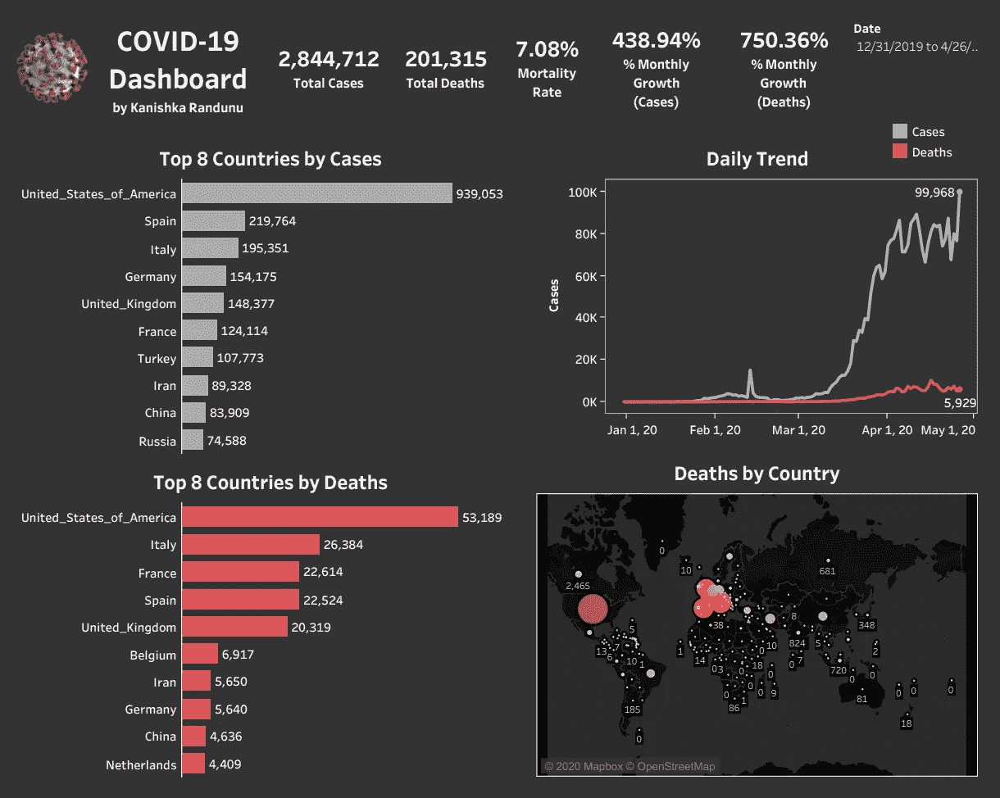
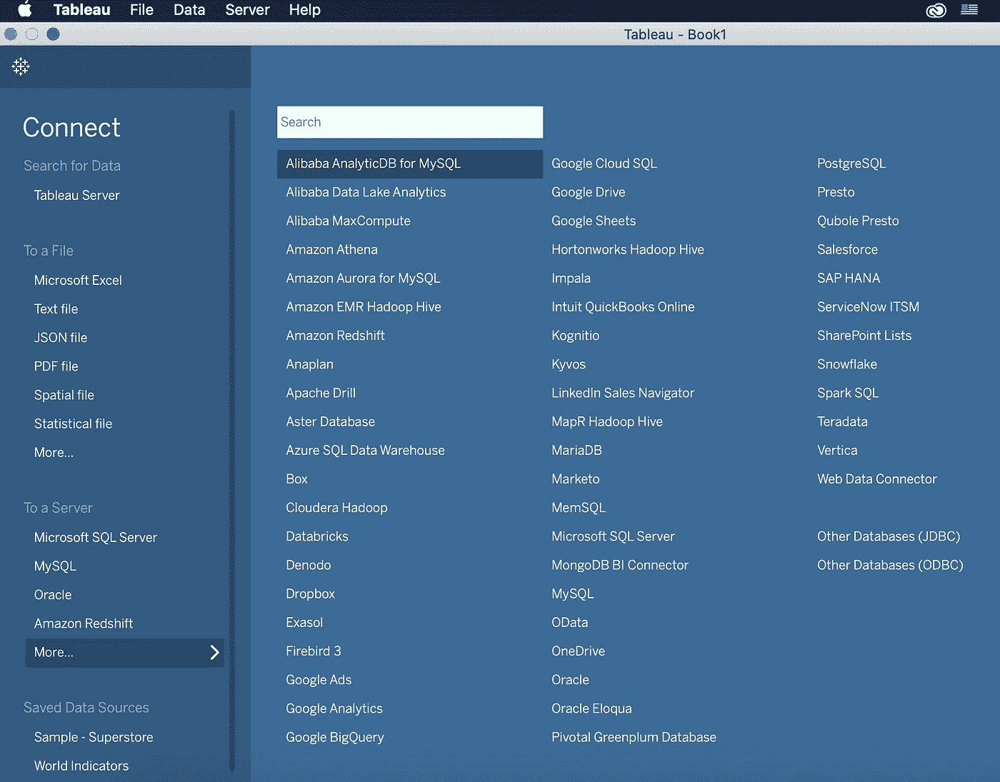
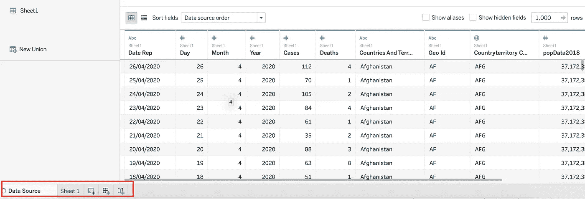
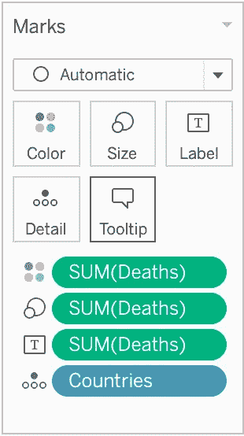
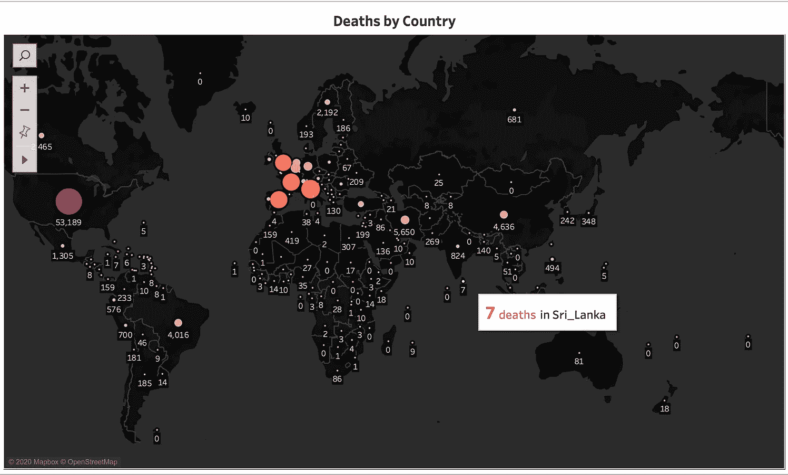
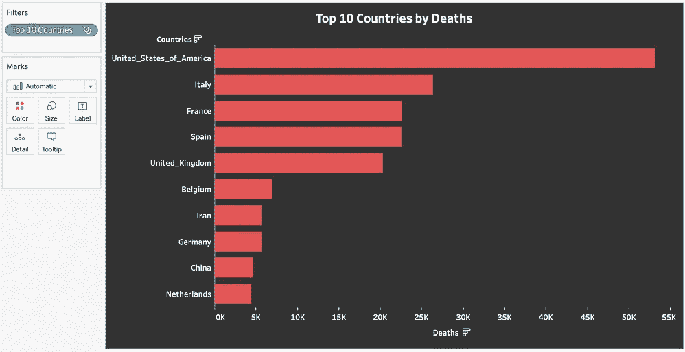
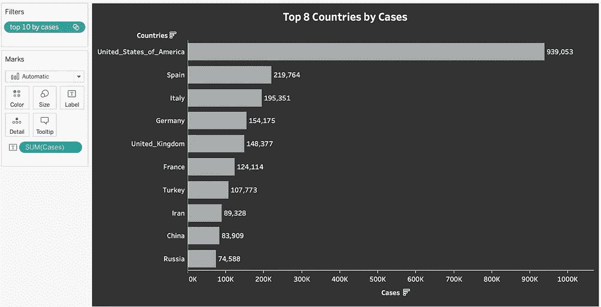

# 通往您第一个带 Tableau 的实时仪表盘的路径

> 原文：<https://medium.com/analytics-vidhya/pathway-to-your-first-live-dashboard-with-tableau-dbbe604bf6c6?source=collection_archive---------21----------------------->

什么是仪表板？什么是画面？

让我从阅读本文标题时你可能会想到的这两个小问题开始。

**数据仪表板**是一种信息管理工具，它可以直观地跟踪、分析和显示**关键绩效指标(KPI)** 、度量和关键数据点，以监控业务、部门或某些特定流程的健康状况。

**Tableau** 是一个强大、安全、灵活的端到端分析和商业智能平台，可以将数据转化为推动行动的见解。

如果你只是打算阅读这篇文章，你会感到无聊。但是如果你和我一起遵循这些步骤，在这篇文章的结尾你会有一个漂亮的仪表板。本文将主要围绕 **1** 展开。将实时数据源连接到 tableau 2。包括 Tableau 3 中的地图视图。在 tableau 表 4 上创建图表。使用表格计算 **5** 。最终确定并发布实时仪表板。在进入这些部分之前，我对成功仪表板的建议是:

“你必须首先处理你的数据集。数据应该来自可靠的来源。数据应该准确和完整。数据应该与您希望在仪表板中展示的最终结果相匹配”。

# **1。将实时数据源连接到 tableau**

Tableau 桌面版不是自由软件。不过，您可以从 [tableau 官方网站](https://www.tableau.com/products/trial)下载 14 天免费试用版。如果您是学生或学者，您可以通过向 [tableau](https://www.tableau.com/academic/students#form) 提交相关详细信息来请求免费 tableau 版本。第一次打开 tableau 时，您将看到以下屏幕。

Tableau 允许您连接来自许多平台的数据源，如上面的快照所示。为此，我将从每小时更新一次的谷歌表单中导入数据。

如何让 google sheet 每小时更新一次？好吧。我是这样做的。

首先，我必须找到一个正在更新的数据集。我可以很容易地找到这个正在更新的新冠肺炎数据集。我所要做的就是把它更新到一个谷歌电子表格中，我可以用它来连接 Tableau。

数据集链接:[https://open data . ecdc . Europa . eu/covid 19/case distribution/CSV](https://opendata.ecdc.europa.eu/covid19/casedistribution/csv)

*第一步*:登录你的谷歌账户(tableau 也要用同一个账户)，打开一个新的电子表格。
*第二步*:复制上面提到的数据集链接
*第三步*:在打开的电子表格的 A1 单元格中写出下面的等式。

**= import data(" https://open data . ecdc . Europa . eu/covid 19/case distribution/CSV ")**

这将从上面的网络链接导入数据到您的谷歌电子表格。根据谷歌的记录，这个功能会每小时自动更新你的表单！保存此电子表格。我将此表保存为“Covid 数据”

*步骤 4* :打开 tableau >连接> Google Sheet。这将为您打开一个新窗口，输入您的 google 帐户详细信息。允许 tableau 访问您的 google 工作表。然后关上窗户。
*第 5 步* : Tableau 现在会有一个窗口显示上面给定的谷歌账户的所有电子表格。从窗口中选择“Covid 数据”电子表格，它将加载 Tableau 的所有可用数据。数据集加载后，您可以直接使用 Tableau 来隐藏不需要的数据字段，将数据类型转换为连续或离散，清理数据集等。
*右击数据字段名>隐藏

# **2。**在 Tableau 中包含地图视图

**你会在我在上面的截图中突出显示的区域发现 3 个带“+”号的小图标。第一个+标记是打开一个新的工作表。第二个+标记是打开一个新的仪表板。第三个是开启一个新的故事。仪表板是一些单独的表的集合。因此，我们将首先在图纸上创建单独的可视化效果，然后将它们组合成一个仪表板。**

**新工作表将在屏幕左侧有一个可见的窗格，其中包括导入数据集的**尺寸**和**尺寸**。写点击任何维度或一个度量，改变数据类型，重命名。移除等。我在这一部分尝试的是在世界地图中加入一个可视化的东西来展示国家间的病例和死亡。我将在每一节中包括我所遵循的步骤，以使这篇文章简洁明了。**

***步骤 1* :将日、月、年字段从连续型转换为离散型。
*第二步*:将“国家和地区”重命名为“国家”,并更改数据类型，因为我们将使用该字段在地图上映射国家。右键点击【国家】>地理角色>国家/地区。
*第三步*:双击纬度(生成)，双击经度(生成)。这将自动在当前 Tableau 表中加载一个地图视图。
第 4 步:将“国家”字段拖动到下图中的“明细”框中。这将在加载的地图中绘制数据集中所有可用的国家。(以点表示)
第 5 步:将“死亡”测量拖到“大小”框中，以绘制国家死亡数，并根据死亡数调整可视化的大小(点的大小)。点击“尺寸”框并拖动出现的条来改变绘图的尺寸。
第 6 步:将“死亡”度量拖到“标签”框中，以显示该国家附近出现的死亡人数。
步骤 7:将“死亡人数”测量拖到“颜色”框中，根据死亡人数给图着色(死亡人数较多的国家将显示较深的颜色)。
第 8 步:转到屏幕顶部的地图选项卡。地图>背景地图>深色，为地图选择一个深色主题。
步骤 9 : 9 不好，所以我不打算在这里描述。提示:我使用了“工具提示”框来创建“斯里兰卡 7 人死亡”标签，当光标移动到地图上的某个国家时就会出现。耶！我知道它很酷(不是死亡计数，而是当光标移动到一个国家时显示它的工具)。自己尝试这个会酷很多！！**

********

**面板带有用于拖动数据和最终地图视图的框**

# ****3。在表格表上创建图表****

**所以现在我要把死亡人数最多的 10 个国家形象化。抓住我的手。我将带领你踏上这段旅程！**

**步骤 1:打开一个新的工作表。重命名该工作表。将“国家”拖到“行”中，双击“死亡”。第二步:点击屏幕左上角的“演示”标签。选择条形图。
步骤 3:右键单击“国家”字段。创建>设置> Top > By 字段>“Top 10，By，Death，Sum”。将“集合 1”的名称重命名为“前 10 个国家”。
第四步:器械包将出现在屏幕的左下方。拖动“前 10 个国家”设置为“过滤器”。这只会给出前 10 名的国家。然后按升序或降序对国家进行排序。怎么排序？那是我故意做的，所以你可以谷歌一下！
第五步:在顶部中间部分，你会发现一个标有“标准”的盒子。点击它，并选择“整个视图”。所以条形图将使用整个工作表。
第六步:加入一些风格。让颜色、字体大小、标题等更加时尚。这里就不提这些了。但是在互联网上有足够的资源可以找到这些。这是我得到的。你可以做得更好！
步骤 7:对“病例”重复此步骤
步骤 8:使用日期字段，创建“病例”和“死亡”的每日趋势**

********

**按死亡人数和病例数排名的前 10 个国家**

# ****4。使用表格计算****

**你熟悉 excel 表格计算吗？Tableau 计算与这些计算非常相似。我将描述如何获得案例总数，以便您可以在其他工作表中工作。**

**步骤 1:将“案例”拖到“文本”框中。点击“文本”。安排文本大小、颜色和对齐方式。像以前一样，将“标准视图”更改为“完整视图”。对背景颜色做一些设计。
第二步:复制该表，并将相关字段更改为显示“死亡”。
第三步:计算死亡率。在左上角“尺寸”附近，您会发现一个指向下方的小箭头。点击并选择“创建计算字段”。将出现一个框，并在框中键入以下计算。**

****总和([死亡])/总和([病例])****

**步骤 4:将窗口(默认为计算 1)重命名为死亡率。打开一个新的工作表，创建死亡率视图，如下所示。**

# ****5。最终确定并发布实时仪表盘****

**将所有视图作为工作表完成后，现在我们需要创建仪表板。点击左下角的第二个+号，打开一个新的仪表板。在那里你会发现所有由你创建的表。您可以将这些表拖放为“平铺”或“浮动”来创建最终的仪表板。**

**最后，点击“服务器”标签> Tableau Public > Save to Tableau Public。你必须创建一个 tableau 帐户，给出你的谷歌帐户的详细信息。登录 tableau，现在您的实时仪表盘将出现在 tableau 公共网站上！干杯！！**

**我的仪表板链接:点击[此处](https://public.tableau.com/profile/kanishka.randunu7002#!/vizhome/Covid-19LiveDashboard_15879202737450/Covid19)**

**参考:点击[这里](https://www.udemy.com/course/tableau-crash-course-build-and-share-a-covid-19-dashboard/)**