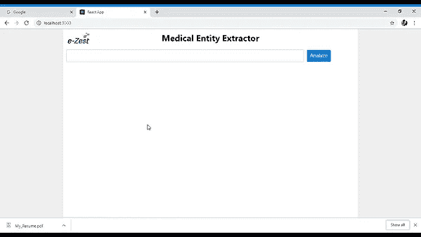
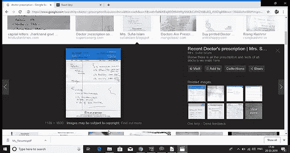
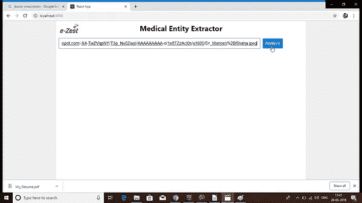
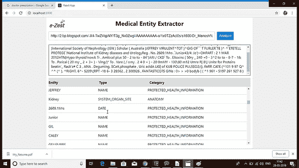

# 基于机器学习的病历数字化

> 原文：<https://medium.com/analytics-vidhya/patient-records-digitization-with-machine-learning-5f6e2e905221?source=collection_archive---------14----------------------->

比阿特丽斯·佩雷斯·莫亚在 [Unsplash](https://unsplash.com?utm_source=medium&utm_medium=referral) 上的照片

随着与基础架构相关的计算能力和技术的进步，用户可以处理更大容量、速度和种类的数据集，企业分析非结构化数据源变得更加可行。

在医疗保健行业工作时，许多相关信息(关于做出准确预测和建议)只能在自由文本临床笔记中获得。这些数据大多以非结构化的形式保存在自由文本文档中。为了做出决策，这些数据是必要的。

自然语言处理服务使得使用机器学习从非结构化文本中提取相关医疗信息变得容易。改善患者护理和加快临床分析的一个重要方法是分析自由格式医学文本中的关系，以及医院入院记录和患者的病历。

亚马逊网络服务(AWS)在识别医疗信息方面帮助理解医疗记录。与将医疗数据/文本视为通用的其他工具相比，AWS 理解医疗术语、患者信息、剂量、药品品牌、服务日期，并以 JSON 格式提供输出。这一独特的功能目前仅由 AWS intensive medical 提供。让我们看看我们处理这个问题的方式

这是我们的 Web 应用程序主屏幕。

选择任意文件，并在指定框中定义该文件的路径。在这里，出于演示的目的，我使用了谷歌图像。

导入图像路径后，点击分析

单击 Analyze 后，您将看到一个结构良好的表格，其中包含从医生处方文件中提取的所有相关医疗实体。

在案例研究中，我们使用了光学图像识别和文本分析，使用的是 AWS intensive medical。光学图像识别本身容易出错，如果处方中表示的信息不清楚或质量不好，可能会产生很多错误。由于这是非结构化数据，我们已经做了大量工作，为图像和文档带来正确的结构，以便机器学习算法可以更好地学习。我们在识别医疗信息时遇到了问题，例如，提取的特定实体是否是“药品”。后来，我们使用了强化学习方法，即使模型第一次犯了错误，它也会从错误中学习，当反馈良好时，它最终会开始获得正确的结果。

如今，这是通过使用简单的文本分析软件编写和维护一组定制的规则来实现的，这种软件构建复杂、维护耗时且脆弱。机器学习可以通过模型改变这一切，这些模型将可靠地感知非结构化文本中的医疗数据，建立有目的的关系，并随着时间的推移进行改进。

通过使用 Amazon understand Medical 和 Azure 计算机视觉服务，我们构建了一个解决方案，可以从图像中检测和提取打印或手写文本，并从医生笔记、临床试验报告和患者健康记录等各种来源中准确收集信息，如医疗状况、药物、剂量、强度和频率。

运用强化方法，使系统更准确地理解医学术语。我们在 OCR 技术和文本分析之间进行了完美的合作，以提取与患者相关的信息，这些信息可以排序，这样我们就可以创建每个人一生的病历。这些信息在当前的行业中非常有价值，如制药、法律、保险等，在这些行业中，正确的信息唾手可得，意义重大。

使用的技术堆栈–AWS 理解医疗 API、Azure 计算机视觉 API。