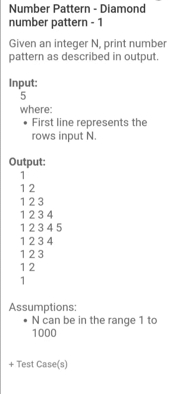
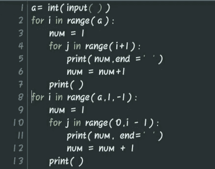
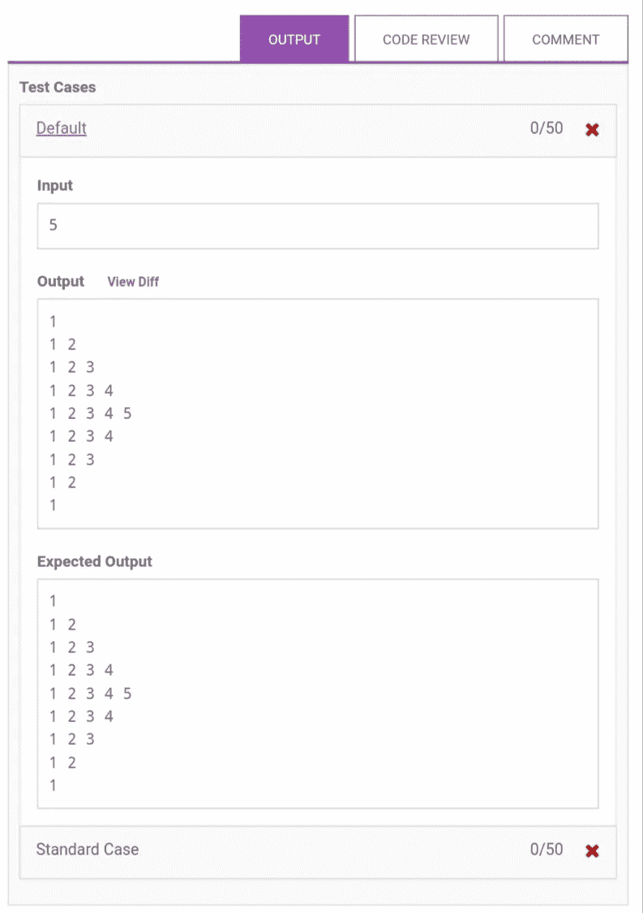
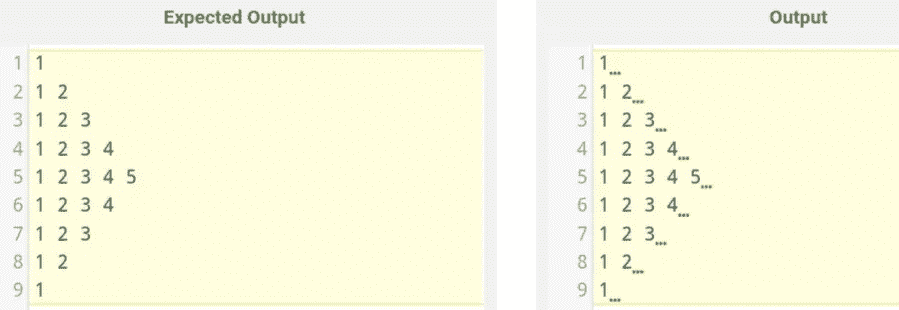
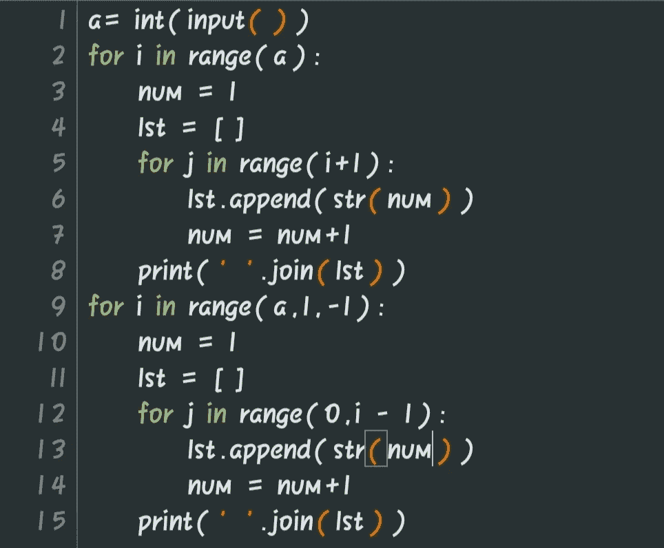

# 🐍一个扭转的模式编码挑战🐍

> 原文：<https://medium.com/analytics-vidhya/pattern-coding-challenge-with-one-twist-34ce94e92341?source=collection_archive---------18----------------------->

过去几天以来，我一直在解决一些编码挑战，以提高我的编码技能。我遇到了一个问题，乍一看似乎很简单，但在我继续之前，请阅读下面的挑战

如果你很少使用逻辑，这是一个非常简单的挑战。我写了代码，得到了相同的输出，但是测试用例失败了。请参见下面的代码和输出:

你发现我的输出和预期输出有什么不同吗？

输出是相同的，但是为什么测试用例失败了？

让我们看看不同之处

哦…你看出区别了吗？一个多余的空格会导致测试用例失败。

现在的问题是哪一行代码导致了额外的空格。答案是肯定的，打印语句可能会导致额外的空间。print 的" end = ' ' "参数导致了额外的空格。

下面是我想出的解决这个问题的办法:

我用 list 解决了这个问题。我把每一行都列了一个清单，并用 join 函数打印出来。

' '.join(lst)将以空格分隔值的形式打印列表。

我希望你今天学到了新东西。

请跟随学习 python 并获得新的技巧

[https://instagram.com/learn_python_on_scroll](https://instagram.com/learn_python_on_scroll)