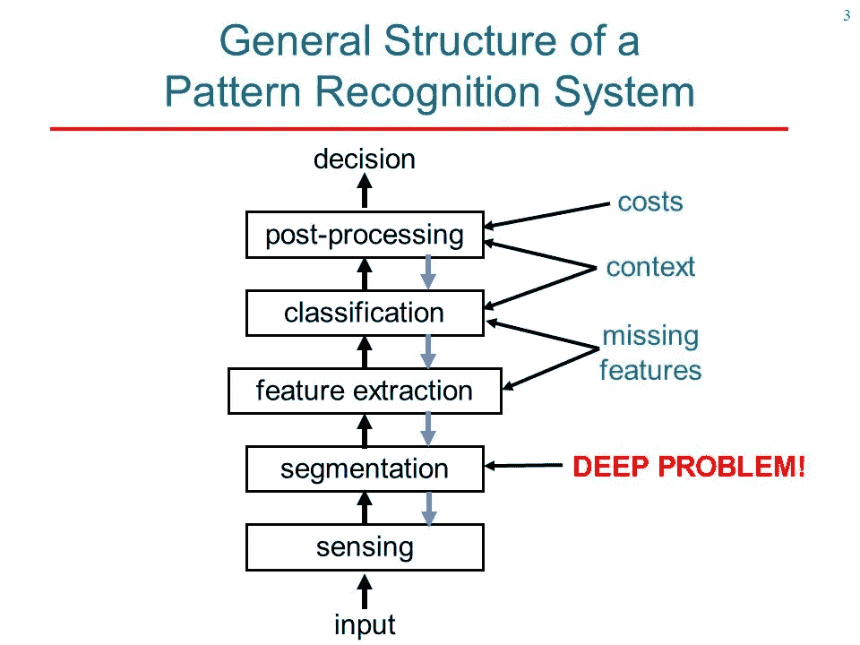

# 模式识别基础。

> 原文：<https://medium.com/analytics-vidhya/pattern-recognition-basics-1cd632138d39?source=collection_archive---------8----------------------->

一篇简短的文章，将帮助任何人在模式识别领域有一个良好的开端。

本文涵盖以下主题:-

1.  模式识别的定义。
2.  模式识别的应用。
3.  解释模式的框图。
4.  机器学习范式。

**到底什么是模式识别？**

模式识别可以定义为基于获得的知识或基于从模式及其表示中提取的统计信息对数据进行分类。

说到 PR 的应用(从这里开始，我将模式识别称为 PR :p):-

a)生物医学图像处理。

b)光学字符识别。

c)多媒体文档识别。等等等等。

在外行看来，从你的网飞推荐到你最喜欢的购物网站，一切都以公关为核心概念。在我们了解了公共关系的一般理念后，我们会掌握所有这些东西。

**框图解释:-**

a)传感器将图像或声音或其他物理输入转换成信号数据。

b)分割是能够将感测的对象从背景噪声中分离出来的部分。

c)特征提取器测量对象属性并选择那些对分类重要的特征。

d)分类器使用这些特征将感测到的对象分配到一个类别。

e)最后，后处理器可以考虑其他因素，例如错误的成本，以决定适当的行动。

**机器学习范式** ( WTF 是一种范式..这是一个复杂的术语，指的是一个简单的模式或模型。)

在进入复杂的内容之前，让我们先熟悉一些与 ML 相关的基本术语。

学习:学习是指某种形式的算法，用于减少一组训练数据的误差。

a)监督学习:-在监督学习中，包含作为标签形式的输出的类别级别与每个训练模式的输入一起给出，并且寻求降低每次迭代的总误差成本。

b)无监督学习:-在这种学习中，对于输出没有标签，并且分类或聚类完全基于行为的相似性来完成。

c)强化学习:-在该学习中，为了训练分类器，呈现输入并计算标签的试验性类别。学习发生在一个批评家身上，他决定这个尝试性的范畴是对还是错。有教学反馈，一直持续到试探性的类别达到想要的类别。

让我们用一句激励我对这个领域感兴趣的话来结束这篇文章。引言是这样的*“当信息过载时，模式识别是确定真相的工具。”*