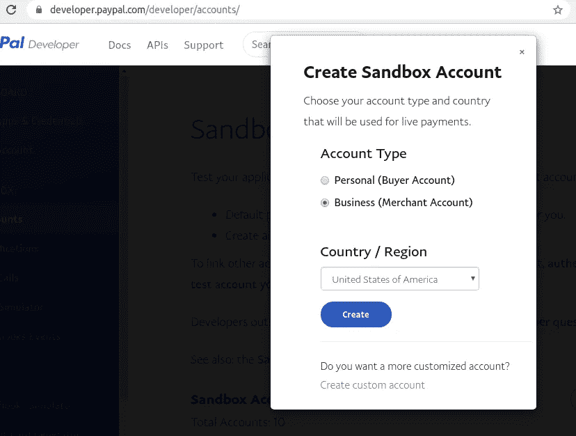

# React 中的 PayPal 订阅

> 原文：<https://medium.com/analytics-vidhya/paypal-subscription-in-react-1121c39b26be?source=collection_archive---------4----------------------->

集成贝宝订阅反应使用反应-贝宝-按钮-v2。


PayPal 标志

这篇文章主要讲述如何将 React 门户整合到 PayPal 支付中。这将是一个循序渐进的指南，以整合贝宝订阅反应。下面我用过 PayPal 的沙盒账户。为此，您可以使用您的 Live Business 帐户。我会建议使用 PayPal 沙盒帐户进行测试，然后将密钥升级到 PayPal 帐户密钥。沙盒账户是 PayPal 的免费账户，用于模拟现场交易。如果你不知道它，不要担心，我会告诉你如何创建它的一步一步的过程。


让我们开始吧…

# **创建沙盒帐户:**

**如果你已经有了，你可以跳过这一步。**

下面我将阐明你如何获得你的工作沙盒的公司和个人帐户。

第一步:登录 https://developer.paypal.com/

第二步:导航到沙盒->账户->创建账户([https://developer.paypal.com/developer/accounts/](https://developer.paypal.com/developer/accounts/))

您的工作沙盒的公司和个人帐户。第二步:导航到沙盒->帐户->创建帐户([https://developer.paypal.com/developer/accounts/](https://developer.paypal.com/developer/accounts/))


单击创建帐户创建沙盒帐户。

第三步:选择公司账户和国家/地区。



现在，您的企业帐户已创建。

第四步:创建帐户后，点击…-->查看/编辑帐户，查看/修改帐户密码并查看其他帐户详细信息。


按照相同的步骤创建一个可用于模拟交易的个人账户。

第五步:一旦创建了商业帐户，导航到我的应用和凭证([https://developer.paypal.com/developer/applications/](https://developer.paypal.com/developer/applications/))来生成应用，并获取其客户端 ID 和密钥。


第 6 步:给出应用程序的名称，并选择以前创建的商业帐户。保存其客户端 ID 和密钥以供将来参考

# **设置认购计划**

## **如果您已经拥有订阅产品的计划 id，您可以跳过此步骤。**

**第一步:创建产品:**

首先，我们必须从 PayPal 仪表板创建产品。使用上面创建的商业帐户凭证登录到[https://www.sandbox.paypal.com/](https://www.sandbox.paypal.com/)。

导航至**支付&获得支付- >订阅- >订阅计划- >创建计划。**


管理订阅登录页面

如果您有任何现有的产品，它会列在那里(例如银)。您可以单击“创建订阅产品”,然后按照步骤创建您想让用户订阅的产品。填写特定于产品的详细信息。


产品说明

您可以输入您的产品名称、产品描述、产品 ID、产品类型、行业类别。产品页面 URL 是您的客户在网站上找到您的订购产品的地方。接下来是产品图片网址。在这里，产品名称和产品类别仅是必需的。其余所有字段都是可选的。创建产品后，你必须选择产品并创建一个计划。


选择产品

选择您想要提供的产品，然后单击“下一步”创建计划。

**第二步:创建计划:**

创建产品后，您需要创建一个计划，该计划将指定交易发生的持续时间，该款项将自动从客户的 PayPal 帐户中扣除。


订阅计划类型

你必须选择你想提供什么样的方案(固定价格/数量价格)。固定定价是指您的价格是固定的，在下一个计费周期开始时，将从客户的帐户中扣除固定金额。数量定价是根据所购买产品的数量来计算价格。


计划描述

现在，您必须给出计划名称(每月、每季度、每年等等)。另外，给出计划描述。这将使客户了解一旦订阅，这笔钱将从他们的帐户中扣除的持续时间。


计划详情

接下来，指定产品的价格和计费周期。在这里，您可以配置扣除价格的持续时间、计税、错过的计费周期等。同样，这是一个总的商业决策，交易将如何发生。指定所有详细信息后，单击下一步。

**第三步:查看并保存**

现在，您的产品和计划创建完毕。下一步是启动您的计划并在代码中实现它。


计划审核页面

您可以查看您的产品和创建的计划。一旦一切正常，你就可以开始你的计划了。


设计按钮的样式

下一步是造型，你希望贝宝按钮出现在你的网站上。选择所需的按钮类型和颜色，并复制代码。复制的代码将如下所示:

```
<div id="paypal-button-container"></div>
<script src="[https://www.paypal.com/sdk/js?client-id=<client-id>&vault=true](https://www.paypal.com/sdk/js?client-id=AZcj9OpqA33vw9X8ojxvNlautgwQTFAp1-dro9XoGlySYebZu7brLVzWj861WPP6KGJQSLAY61MUm78x&vault=true)" data-sdk-integration-source="button-factory"></script>
<script>
  paypal.Buttons({
      style: {
          shape: 'rect',
          color: 'blue',
          layout: 'horizontal',
          label: 'subscribe',
          tagline: true
      },
      createSubscription: function(data, actions) {
        return actions.subscription.create({
          'plan_id': '<Plan-id>'
        });
      },
      onApprove: function(data, actions) {
        alert(data.subscriptionID);
      }
  }).render('#paypal-button-container');
</script>
```

这是一个. js 代码。你可以直接把它放在你的普通 JS 项目中并执行它。它会运行良好。但是，我将向您展示如何修改这段代码并将其集成到 react 项目中。获取计划 id 并保存以备后用。

**设置 React 代码库**

设置 react 项目。你可以拿 https://github.com/Richabhu/react-paypal-subscription 的代码给你参考。

我们开始吧...

安装所需的依赖项:

```
npx create-react-app subscription-paypal
cd subscription-paypal
npm install react-paypal-button-v2 --save
```

现在，一旦设置就绪，检查代码是否正在运行。

```
npm start
```

去浏览器查一下 [http://localhost:3000。](http://localhost:3000.)您应该会看到 react 应用程序正在运行。

现在，用下面的代码替换 src/App.js:

```
import React from 'react';
import logo from './logo.svg';
import './App.css';
import PayPalBtn from './components/PayPalBtn'const paypalSubscribe = (data, actions) => {
return actions.subscription.create({
'plan_id': "<plan-id>",
});
};const paypalOnError = (err) => {
console.log("Error")
}const paypalOnApprove = (data, detail) => {
// call the backend api to store transaction details
console.log("Payapl approved")
console.log(data.subscriptionID)
};function App() {
return (
<div className="App">
<PayPalBtn
amount = "<amount>"
currency = "USD"
createSubscription={paypalSubscribe}
onApprove={paypalOnApprove}
catchError={paypalOnError}
onError={paypalOnError}
onCancel={paypalOnError}
/>
</div>
);
}export default App;
```

将<plan-id>替换为实际计划 id，将<amount>替换为实际金额。</amount></plan-id>

**让我们试着理解这里发生了什么:**

在执行 react 应用程序时，src/App.js 的内容将显示在网站上。

```
<PayPalBtn
amount = "<amount>"
currency = "USD"
createSubscription={paypalSubscribe}
onApprove={paypalOnApprove}
catchError={paypalOnError}
onError={paypalOnError}
onCancel={paypalOnError}
/>
```

PayPalBtn 是我们将在后期放入的一个组件。该组件将在仪表板上显示按钮图标。订阅的实际创建将由 createSubscription 事件处理程序处理。卖方批准付款后，将调用 onApprove 事件处理程序。如果客户自己在交易中途取消订阅，将由 onCancel 事件处理程序处理。事务期间的错误由 catchError 和 onError 事件处理程序处理。

```
const paypalSubscribe = (data, actions) => {
return actions.subscription.create({
'plan_id': "<plan-id>",
});
};
```

paypalSubscribe 将向 PayPal 创建一个与客户对应的实际订阅请求。

```
const paypalOnApprove = (data, detail) => {
// call the backend api to store transaction details
console.log("Payapl approved")
console.log(data.subscriptionID)
};
```

卖方批准付款后，将调用 paypalOnApprove 函数。在这里，可以向后端 API 发出请求，将详细信息存储在数据库中。

现在，让我们创建 react 组件，它将在仪表板上实际显示 PayPal 按钮。创建 src/components/PayPalBtn.js。项目结构如下:


项目结构

现在，让我们创建实际的 PayPal 按钮来显示在仪表板上。

```
import { PayPalButton } from "react-paypal-button-v2";
import React from 'react';export function PayPalBtn(props) {
const { amount, currency, createSubscription, onApprove, catchError,onError, onCancel} = props;
const paypalKey = "<paypal-client-id>"return (
<PayPalButton
amount={amount}
currency={currency}
createSubscription={(data, details) => createSubscription(data, details)}
onApprove={(data, details) => onApprove(data, details)}
onError={(err) => onError(err)}
catchError={(err) => catchError(err)}
onCancel={(err) => onCancel(err)}
options={{
clientId: paypalKey,
vault:true
}}
style={{
shape: 'rect',
color: 'blue',
layout: 'horizontal',
label: 'subscribe',
}}
/>
);
}export default PayPalBtn;
```

在仪表板上输入<paypal-client-id>进入。您可以从仪表板复制的源代码中复制样式，并将其粘贴到这里以获得相同的按钮。</paypal-client-id>

完成设置后，运行以下命令来运行应用程序。

```
npm start
```

该应用程序将在 [http://localhost:3000/](http://localhost:3000/) 上运行


登录页面

点击 PayPal 订阅按钮，PayPal 登录页面打开。输入详细信息并订阅产品。付款将从你的账户中扣除。


点击按钮后的 PayPal 登录页面

注意:如果您使用它进行测试，请在沙箱中创建一个个人帐户，并从该帐户登录以查看交易。

要将其集成到您现有的代码库中，请创建一个单独的组件，并将 src /App.js 代码放在该组件中，并在您想要集成的位置调用该组件。