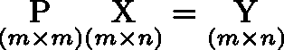
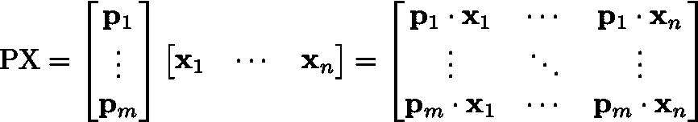
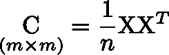
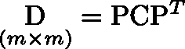
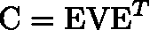
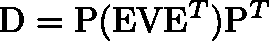
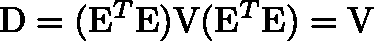

# 主成分分析:一种线性变换

> 原文：<https://medium.com/analytics-vidhya/pca-a-linear-transformation-f8aacd4eb007?source=collection_archive---------0----------------------->

**太空旋转**—[雅各布·诺瓦切克](https://www.pexels.com/@kubiceknov?utm_content=attributionCopyText&utm_medium=referral&utm_source=pexels)摄自[佩克斯](https://www.pexels.com/photo/time-lapse-photo-of-stars-on-night-924824/?utm_content=attributionCopyText&utm_medium=referral&utm_source=pexels)

# 介绍

最近我一直在努力加深我对主成分分析的了解。特别是，我想了解为什么**主成分是我们特征**的协方差矩阵的特征向量(你会在这里找到答案)。

此外，由于我真的喜欢将 PCA 视为线性变换，所以我寻找了一篇直奔主题的简短文章，但我没有找到。所以我最终读完了整篇论文。

不是每个人都有时间进行长篇阅读；因此，我决定用一篇简短的文章来分享我学到的东西。我的目的不是解释基本的线性代数概念(网上有很多好的资源)，而是提供一篇简洁的文章，提供你在其他文章中可能找不到的东西:我只是想填补一个小空白。

如果你的线性代数有点生疏，我建议在阅读这篇文章之前，先通读一下[线性代数的精髓](https://www.youtube.com/playlist?list=PLZHQObOWTQDPD3MizzM2xVFitgF8hE_ab)，这是一个**YouTube 上很棒的**系列。

# 什么是主成分分析？

主成分分析让我们降低数据的维度。但是怎么做呢？嗯，它让我们发现我们的特征变化最大的方向，以便我们可以使用它们来转换我们的数据集。换句话说，PCA 的目标是找到一种新的方式来表达数据，以便将**特征冗余最小化**，并且我们可以保留信号并过滤掉噪声。

PCA 假设**信号=方差**(即我们忽略数据变化最小的方向)，方差可以分解为**正交成分**(即我们的新特征将具有零协方差)。最后，PCA 使用**线性**变换来重新表达数据(即 PCA 与我们特征的非线性组合无关)。

# PCA 作为线性变换

让我们从我们的**贬低的**数据集 **X** 开始，一个 *m* 乘以 *n* 矩阵其中 *m* 是特征的数量， *n* 是实例的数量。

通过 PCA，我们将正交变换 **P** 应用于 **X** ，以获得数据的新表示。我们称这种表现为 **Y** 。要变换 **X** ，我们只需将其与 **P** 相乘，如下所示。

但是等等，什么是正交变换？**正交变换**是由**正交矩阵**表示的线性变换，其行和列是具有单位范数的正交向量。

好了，我们刚刚了解了 PCA 是一个线性变换，可以用一个特殊的矩阵来表示。但是，我们为什么要把 **P** 乘以 **X** ？

让我们看看上面的矩阵。 **P** 的行称为主成分。 **Y** 的每一列包含的元素是 **P** 的*第 j*行*和 **X** 的*列*之间的点积。这里的每个点积代表一个点从特征空间到主分量的投影(如果你不知道什么是投影，我建议你看“线性代数的本质”，这是我在上面赞助的)。*

因此， **Y** 包含原始特征在我们的主成分所跨越的空间上的投影，主成分是单位向量。换句话说，将 **P** 乘以 **X** 意味着将 **X** 投影到由 **P** 的行所跨越的空间上。

注意**一旦我们知道** **P，我们可以选择使用多少组件来跨越新的特征空间**。这决定了我们将保留多少转换后的特征(即，我们将在模型或可视化中使用多少行 **Y** )。**降维来了！**但是我们应该如何选择要保留的组件呢？根据我们的假设，信号是方差。因此，我们将保留差异较大的组件。

# 如何找到 P

请记住，我们转换的目标是**最大限度地减少冗余，以保留信号并滤除噪声。**

什么是冗余？嗯，如果我们可以将我们的特征集合 **A** 表示为其他特征集合 **B** 的线性组合，那么我们说属于集合 **A** 的特征是多余的。我们知道协方差衡量特征之间线性关系的大小。因此，为了最小化冗余，我们将最小化协方差(使我们的特征正交化确实会使协方差项为零)。

为了找到 **P** 我们需要从 **C** ，的平方对称协方差矩阵 **X** 开始，它的对角项是方差，非对角项是协方差。

X 的协方差矩阵

现在，为了最小化冗余，我们的正交矩阵 **P** 将不得不变换 **X** ，使得**D**,**Y、**的协方差矩阵变成对角线(没有协方差项)。但是什么是 **D** ？是一个 **C** 和**P**的函数(从 Y 的协方差开始——只是用 Y 代替上面公式中的 X——用铅笔推导)。

Y 的协方差矩阵

现在如何选择 **P** 到**对角化 **D** ？**

原来，任何对称矩阵都可以用其特征向量 **E** 的正交矩阵和用特征值填充的对角矩阵 **V** 来分解。这与矩阵的[特征分解](https://en.wikipedia.org/wiki/Eigendecomposition_of_a_matrix)的概念有关。

对称矩阵的特征分解

现在我们可以将 **C** 代入 **D** 的公式。

如果我们选择 **P** = **E** **转置**我们得到

记住正交矩阵的乘积是一个单位矩阵。

我们刚刚发现 **P** 的**主成分是 X** 的协方差矩阵的特征向量。

正如已经提到的，最重要的主要组件是那些我们的新特性变化最大的组件。如果我们想使用方差来排列我们的主成分，那么我们可以使用 **D** 。事实上， **D** 的对角线包含了沿着我们新的正交轴的新特征的变化(我们选择保留的主要成分)。我写了“新轴”:是的，这种线性变换意味着基础的改变。

就是这样！

万一你有兴趣，我看的论文是 [*主成分分析教程*](https://arxiv.org/abs/1404.1100) 作者黄邦贤·施伦斯。

如果你认为有什么可以改进的地方，请告诉我。

谢了。