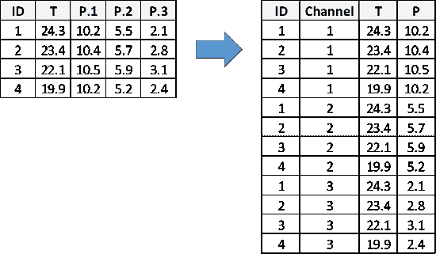
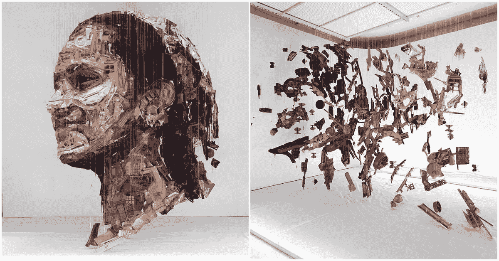
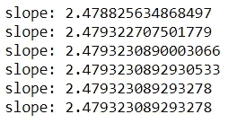
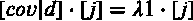
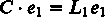
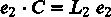
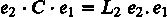
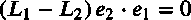
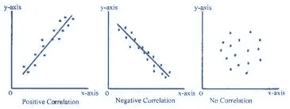

# PCA——去神秘化。

> 原文：<https://medium.com/analytics-vidhya/pca-demystified-3f38a9e78cd2?source=collection_archive---------17----------------------->

通常在机器学习中，数据集有许多用来进行预测的特征。**主成分分析(PCA)** 是一种用于降低维度的技术。它经常被误解为特征选择技术，但它是特征提取。在这篇文章中，我会给你一个主成分分析的概念，所涉及的数学，我们为什么以及什么时候使用主成分分析？

## 介绍

维数灾难是指数据的属性相对于观察值的数量更多的情况。机器学习模型享有大量的特征，但这导致了数据点的稀疏性。为了说明相关的问题，让我们考虑直线上 0 和 1 之间的距离，即 1。现在，如果我们添加另一个维度，点现在变成(0，0)和(1，1)，距离增加到 2 的平方根。在三维空间中，距离增加到 3 的平方根。如果它们比这个范围(0，1)中的点的数量多，则相似性或差异可以被放大，但是如果它们比点的数量少，则这些点变得稀疏和更远。潜在的陈述是“特征的质量比用于训练模型的特征的数量更重要”

根据经验，每个特征应该至少有 5 个观察值，这也取决于数据是否能捕捉到各种可能的组合。简单来说，**数据框不应该更宽，而应该更高。**如果数据维数很高，特征空间将会有空白，数据点将会分散。删除特征不是一个明智的想法，因为它可能包含重要的信息。

左边的表容易出现维数灾难，可以将其转换为右边的表来捕获不同的实例。( [Sourc](https://stackoverflow.com/questions/29844056/how-to-transform-data-frame-with-different-column-names-from-wide-to-long-with) e)

领域知识可以帮助将数据框架转换到较低的维度，如上例所示。大多数情况下不会出现这种情况，对此，五氯苯甲醚会出手相救。**PCA 的目标是捕捉与数据集相关的最大方差，但在更少的维度中。**

## 感性艺术类比

让我们看一个例子来理解 PCA 是如何工作的。考虑一个像下图这样的感知艺术，只有从一个特定的角度来看，艺术才会有一个已知的形式。在所有其他视图中，它看起来像是散布在空间各处的随机艺术作品(维度的诅咒)。最好的视图是将艺术转化为 2D 图像，并且所有的白色空间都被省略的视图。同样，主成分分析试图找到能够降低特征空间稀疏性的最佳方向。在整篇文章中，我将使用这个类比。因此，像“最佳视图”这样的短语表示数据集的理想特征。

[迈克尔·墨菲的感知艺术](https://awesomebyte.com/perceptual-art-of-michael-murphy/)

让我们深入研究与 PCA 相关的数学，并了解它如何找到最佳观察方向。下面是代码片段，其中创建了两个随机相关变量 x1 和 x2。从数据集中取一个随机数据点，并重复乘以(点积)协方差矩阵。点积的合成向量收敛于相同的斜率(尝试 x1 和 x2 的任意值)。实际上，协方差矩阵试图将数据点投影到一条线上。

投影到协方差矩阵上的向量的收敛斜率。

现在，如果向量(随机选择的数据点)具有相同的收敛斜率会怎样？由点积得到的矢量与初始矢量方向相同，但大小不同。假设‘e’是向量,[cov]是协方差矩阵，下面的等式代表标准。λ是一个标量值，它决定了幅度的变化。该方程是标准的特征向量方程。向量' e '称为特征向量，λ称为特征值。

线性变换后，本征向量的幅度变化而方向不变。([来源](https://thumbs.gfycat.com/FluffyMiniatureBackswimmer-max-1mb.gif))

这看起来不错，但是这对降维有什么帮助呢？为了回答，在这个二维数据中，如果我们将所有点投影到一条线(主轴)上，同时保留数据中的最大方差(组合)。可以实现降维。我们将让这条线捕捉数据点的最大可变性(分布),将 2D 数据转换为 1D 数据。从感性艺术的解读中，我们试图看到艺术的 2D 形象，这是一种低维度的艺术。

可能的最佳方向。([来源](https://www.kdnuggets.com/2020/05/dimensionality-reduction-principal-component-analysis.html))

## 为什么特征向量是最好的观点？

最佳向量的标准是它应该捕捉最大方差。设“d”代表数据点，“d1”是“d”在任意向量‘j’上的投影。最大化 d1 的方差将产生最佳‘j’。因为焦点在方向上，所以矢量 J 可以具有可变的幅度。标准化向量将限制“j”。拉格朗日乘数用于归一化。

将方差(d1)的导数等于零，我们得到一个表示 d1 的协方差矩阵的特征向量的方程。这意味着最佳视图实际上是特征向量。我保持数学简单，但为了更深入的理解，**你可以参考链接** [**【最大方差】**](https://www.cs.toronto.edu/~urtasun/courses/CSC411/tutorial8.pdf) **。**

## **特征向量的正交性**

特征向量的一个性质是，当矩阵对称时，对应的特征向量彼此正交。考虑 n 乘 n 的矩阵 C，其中 n 乘 1 的特征向量 e1、1 乘 n 的特征向量 e2 以及 l1 和 l2 是它们各自的特征值。

由于协方差矩阵 C 是对称的，我们可以有下面的等式

从上面两个等式，我们得到

如果 L1 和 L2 是唯一的，e2 和 e1 的点积必须为零。这表明特征向量是正交的。如果它们不正交，新的特征空间将具有不同于 90 度的坐标轴。因此，这些向量成为新的坐标系。

## 主成分分析的流程。

*   提取自变量。请注意，目标属性不应包含在 PCA 转换中。
*   将数据标准化，使数值以原点为中心。
*   从协方差矩阵中提取特征向量和特征值。
*   对特征值进行排序，选择顶部的特征向量(主轴),其捕获了期望的方差量(通常为 95%)。
*   将数据点投影到选定的特征向量上，创建新的维度。点积返回转换后的坐标。
*   在这些新的维度上构建模型。

形成的新维度将是每个旧属性的组成部分。新维度‘D’可以被视为原始维度的线性组合。β值表示特定特征对新提取特征的影响。像这样，直到 D(n)创建了“n”个新维度。在这之前，维度没有减少。在分析新特征捕获的差异后，不需要的尺寸将被删除。从而实现降维。

下面是一个 python 实现，来看看 PCA 是如何工作的。

 [## uknwho/machine learning _-DataSets _ solution

### permalink dissolve GitHub 是超过 5000 万开发人员的家园，他们一起工作来托管和审查代码，管理…

github.com](https://github.com/uknwho/MachineLearning_-DataSets_solution/blob/master/PCA_Example/PCA_Example.ipynb) 

在该示例中，转换后的 10 个 PCA 维度捕获了总方差的 96%。数据帧减少了 3 个特征。

## **什么时候使用 PCA？**

要记住的一点是，只有当大多数数据表现出良好的相关性时，PCA 才会有效。要理解这一点，请看下图。当存在强相关性时，可以获得最佳拟合线，这导致较少的稀疏性。第三张图中的最佳拟合线的数据点将远离该线。需要更多的维度来捕捉良好的方差。

相关数据(T2 来源)

提取的新维度没有任何意义。如果这不是一个要求，那么五氯苯甲醚将是一个很好的选择。在图像和视频中，PCA 技术将非常有效，因为特征的含义是不相关的。除了 PCA，探索 SVD 另一种广泛使用的降维技术。