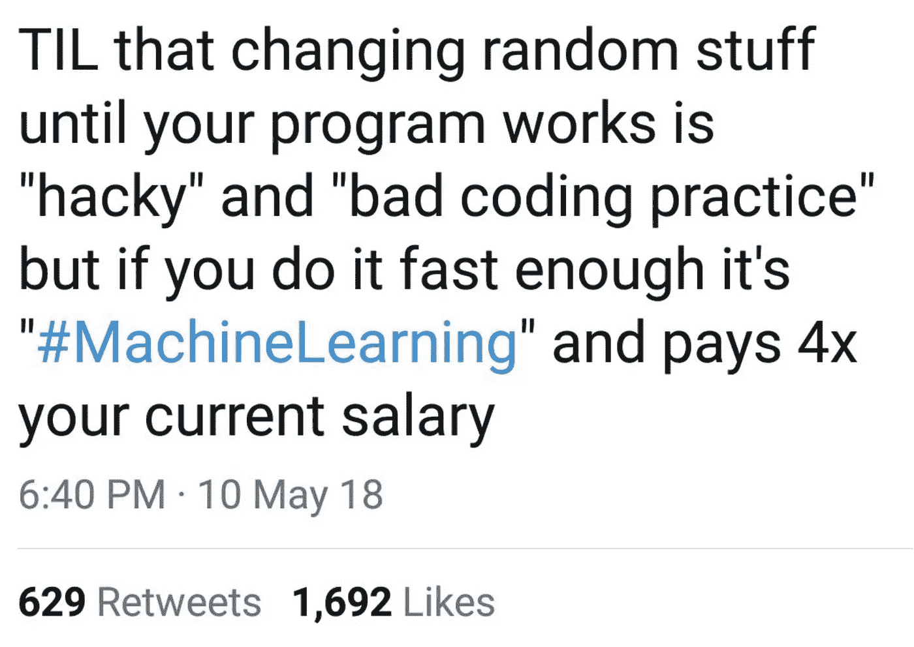
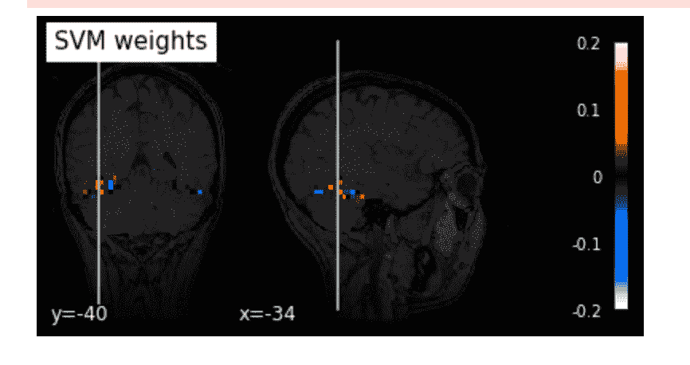
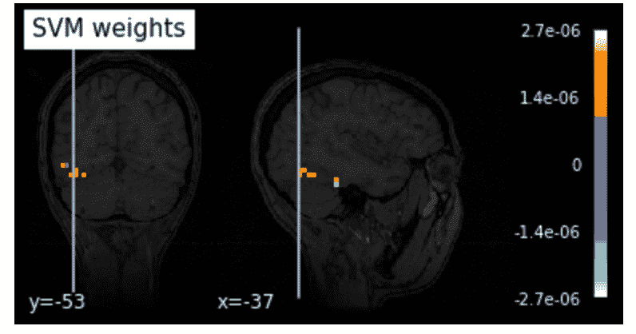

# 基于主成分分析的 fMRI 数据噪声过滤

> 原文：<https://medium.com/analytics-vidhya/pca-fmri-data-haxby-noise-filtration-fbc39259f472?source=collection_archive---------5----------------------->

# 介绍

FMRI 数据收集需要将受试者暴露于磁通量中，并监测暴露于某些刺激时信号的可变性。这种可变性就是我们所说的激活/信号。首要目标通常是将刺激映射到被诱导时被激活的大脑区域。这一切听起来简单明了，但问题在于细节。FMRI 的数据夹杂着噪音。噪音来自广泛的来源，从基本的头部运动，身体的背景活动，以执行基本的身体功能，如呼吸等，即使我们有一个死亡的受试者[(喊出死亡的鲑鱼实验——一个关于实验误解的警示故事)](https://blogs.scientificamerican.com/scicurious-brain/ignobel-prize-in-neuroscience-the-dead-salmon-study/)，噪音也可能来自外部干扰，最终扭曲信号。本文旨在指导您使用主成分分析来降低这种噪声。假设具备基本 Python 和 scikit-learn 用法的背景知识。

# 预处理

预处理的目的之一是解决噪声问题。一些方法包括切片定时校正、重新对准、平滑和对准以及归一化。可以使用不同的方法来执行这些步骤，包括信号的阈值设置和主成分分析(PCA)。本文将重点介绍 PCA 作为一种降噪工具。

# 主成分分析

主成分分析(PCA)是一种统计过程，它使用正交变换将一组可能相关的变量(每个变量取不同数值的实体)的观察值转换为一组称为主成分的线性不相关变量的值。这种变换的定义方式是，第一个主分量具有最大的可能方差(即，尽可能多地解释数据中的可变性)，而每个后续分量在与前面分量正交的约束下又具有最大的可能方差。得到的向量(每个向量是变量的线性组合，包含 n 个观察值)是不相关的正交基集。PCA 对原始变量的相对比例很敏感。

简而言之，我们将数据投射到一个不同的、更低的维度。正如低维投影所预期的那样，我们会丢失数据，但我们通常会保留大部分信息，因为分量的顺序是按方差排列的，其中第一个分量解释了最大的方差，随后的分量解释了较小的方差。这使得 PCA 在数据压缩和降维方面表现出色，从而真正加快了我们执行机器学习分析的过程。

# 用于降噪的 PCA

现在，我们如何将 PCA 应用于降噪呢？已经表明，使用主成分分析来降低数据的维数会导致信息损失。假定在其原始格式中，从 FMRI 扫描收集的大多数数据通常是噪声，简单地执行 PCA 存在我们将丢失真实信号的风险，特别是因为由信号解释的方差相对于噪声非常小。现在，我们该怎么办？我们已经做了一个关键陈述，即第一个主成分通常是最重要的，第二个更重要，以此类推。如果我们着眼于不太重要的部分，忽略解释大部分差异的大声说话的部分，会怎么样？

虽然粗糙，但这是 PCA 降噪背后的原理。根据您想要过滤的噪声比例，您可以根据它们解释的差异来组织组件，然后重建原始数据。大多数真实信号通常很弱，在噪声面前不会突出，因此通过去除原始数据的最重要部分，我们得到的是“更浓缩的汤”数据，真实信号更明显。

# 插图假设

为了说明这个应用，我们将展示 PCA 作为噪声清除工具的潜力。然而，应该注意的是，我们做出的一些假设在现实生活中不一定成立，而有些却成立。其中包括以下内容

1.  我们已经知道我们有多少噪音。在真实数据中，我们往往不知道噪声导致的确切方差。为了滤除噪声，我们倾向于依赖大量的实验，拟合多个参数并测试不同的阈值，直到达到我们满意的水平。对于 PCA，这可能需要包括各种数量的组件。
2.  我们假设我们的数据是高斯分布的。对于我们的演示，我们将从高斯分布中随机采样噪声。在真实数据中，噪声的分布也是可变的，但是通过去除其中的高斯成分，我们将数据清扫得相当干净，这使得假设成立。真实的信号表现为尖峰信号，这可能类似于我们的激活，尽管不是由刺激引起的。

# 方法

为了对此进行研究，我们将利用 [Haxby 数据集](http://www.pymvpa.org/datadb/haxby2001.html)。这是一个区块设计的 fMRI 数据集，来自于一项关于人类腹侧颞叶皮层的面孔和物体表征的研究。它由 6 名受试者组成，每名受试者跑 12 次。在每一轮实验中，受试者被动地观看八个物体类别的灰度图像，这些图像被分成由休息时间分隔的 24 秒块。每个图像显示 500 毫秒，然后是 1500 毫秒的刺激间隔。全脑 fMRI 数据以 2.5s 的体积重复时间记录，因此，刺激块被大约 9 个体积覆盖。

我们将获得数据的 SAP 导出版本。为了加载它，我们将按照下面的尼尔 SVM 解码教程来完成。你可以在这里找到教程

总之，上面的教程指导我们完成加载数据的过程，屏蔽数据以执行一些基本的预处理步骤，如平滑。不要用漂亮的面具去除噪声，因为我们想利用主成分分析。

然后，他们安装 SVM 来解码数据，给我们一个系数的 2D 矩阵，我们可以映射到大脑的解剖背景图像上，并可视化激活区域。所示的一些激活将是噪声数据。

最终结果是整个激活区域的图像，如下所示:

PCA 前过滤信号图。

**(这些数字在随附的笔记本中更清晰)**

我们的扩展需要使用 PCA 来获得解释大约 80%方差的分量，或者你认为噪声占的任何比例。完成此操作后，我们将降维后的数据逆变换回其原始形状，从而获得数据的估计值，就像“大部分是噪声”一样。

然后，我们找出重建数据和原始数据之间的差异。这种差异是我们最感兴趣的，理想情况下，大部分是激活信号。

打个比方，想象一下蒸发盐水混合物，通过失去大部分的水，我们会得到一个更咸的溶液，如果做得恰到好处，我们会得到纯净的盐，但是少量的水不会杀死任何人。假设我们的刺激都是视觉的，预期的结果仅由数据中的尖峰组成，具有视觉皮层内激活区域的更精确近似。

# 结果

我们发现在 PCA 过滤后，我们的信号变得更加集中在中心区域，并且几乎都是阳性的。这是我们所预期的，因为我们在未清理的数据中绘制的一些信号将是噪声。

请注意，我们绘制的实际上是信号差，因此是标度。背景信号被滤除，只留下刺激时预期的额外尖峰。结果令人惊讶，因为它们表明只有正尖峰与原始信号不同，这就是为什么在我们的图中，所有信号都在正光谱中，而不像原始信号，其中一些信号标绘为蓝色。激活的区域也更加集中，但整体位置保持不变，即皮层。

PCA 后过滤信号图。

# 结论

可以肯定地说，我们取得了预期的结果。主成分分析是 fMRI 图像降噪的优秀工具。如果我们预先知道所记录的信号的总比例将是噪声，这是特别正确的，在这种情况下，我们可以使用它来调整我们的 PCA 模型的超参数。人们可以将这一过程视为与独立成分分析类似的过程，独立成分分析已被证明在处理 fMRI 数据时会产生出色的结果，因为识别真实信号与识别与预期信号的近似值具有最高相关性的成分“一样简单”(Green，C. G .，Nandy，R. R .，& Cordes，D. (2002))。我们采用的 PCA 方法更像是一种全面的扫掠，因为我们可以通过过滤掉可能跨越多个分量的噪声所导致的记录数据的比例来成批消除噪声。

# 参考

nilearn:Python 中神经成像的机器学习——神经成像的机器学习。(未注明)。检索于 2019 年 10 月 28 日，来自[https://nilearn . github . io/auto _ examples/plot _ decoding _ tutorial . html](https://nilearn.github.io/auto_examples/plot_decoding_tutorial.html)

Haxby 等人(2001):腹侧颞叶皮层中的面孔和物体(fMRI)——PyMVPA 2 . 6 . 5 . de v1 文档。(未注明)。2019 年 10 月 28 日检索，发自 http://www.pymvpa.org/datadb/haxby2001.html

格林，C. G .，南迪，R. R .，&科德斯，D. (2002 年)。fMRI 数据的 PCA 预处理不利地影响 ICA 的结果。检索于 2019 年 10 月 28 日，来自[https://pdfs . semantic scholar . org/9142/59 e 34 b 6 f 3584 cbde 318 BF 48 db 0825 b 342870 . pdf](https://pdfs.semanticscholar.org/9142/59e34b6f3584cbde318bf48db0825b342870.pdf)

github Repo:[https://github . com/git wahome/PCA-fMRI-decoding-and-Noise-filtering](https://github.com/GitWahome/PCA-fMRI-decoding-and-Noise-Filtration)