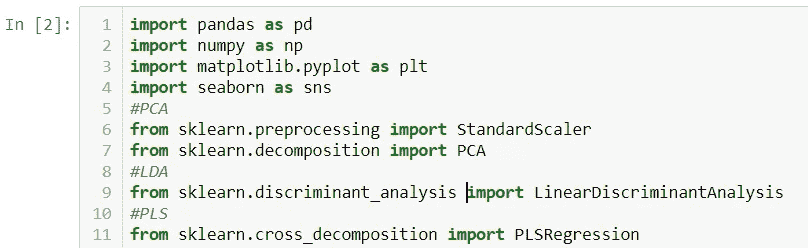

# 用 Python 公开 PCA、LDA 和 PLS

> 原文：<https://medium.com/analytics-vidhya/pca-lda-and-pls-exposed-part-2-linear-discriminant-analysis-349a3a191b17?source=collection_archive---------3----------------------->

## 第二部分:LDA 和 PLS

我们在[上一部分](/@andrea.castiglioni/pca-lda-and-pls-exposed-part-1-principal-component-analysis-c8f5b826caa6)中已经看到，PCA 有助于我们降低数据集的维度。它也很容易让我们分离类，所以它作为一个聚类算法或我们项目的无监督学习步骤。现在我们对另一个包感兴趣，LDA。

让我们导入该任务的标准库:

本节将使用的 python 库