# PCA vs LDA vs T-SNE——让我们来理解它们之间的区别！

> 原文：<https://medium.com/analytics-vidhya/pca-vs-lda-vs-t-sne-lets-understand-the-difference-between-them-22fa6b9be9d0?source=collection_archive---------0----------------------->

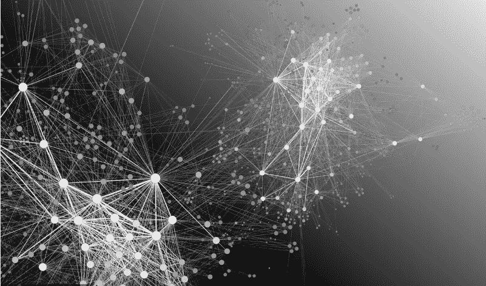

> 每当我们提到高维数据或者如何可视化具有数百个甚至更多属性的数据时，我们都会看到这些方法。
> 
> 我们经常采用的解决方案是降维技术，它可以帮助我们解决这个问题。但是，这里出现的主要问题是何时使用哪一个？它们之间的基本区别是什么，这些技术的直觉是什么？
> 
> 在本文中，我们将探讨上述问题的解决方案。

***我们开始吧！***

# **主成分分析**

PCA 是一种*无监督的机器学习方法*，用于降维。主成分分析(PCA)的主要思想是降低由许多彼此相关的变量组成的数据集的维度，这些变量或多或少，同时最大程度地保留数据集中存在的变化。

这是通过将变量转换成一组新的变量来实现的，该组新的变量是来自原始数据集的变量或属性的组合，其方式是保留最大变化。这种属性组合被称为***【PCs】***，具有最大捕获方差的成分被称为 ***主导主成分*** 。方差保留的顺序随着我们向下移动而降低，即 PC1 > PC2 > PC3 > …等等。

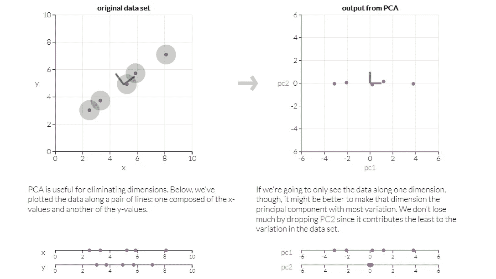

将 2D 数据转换为 1D 数据(PC1 包含最大方差)

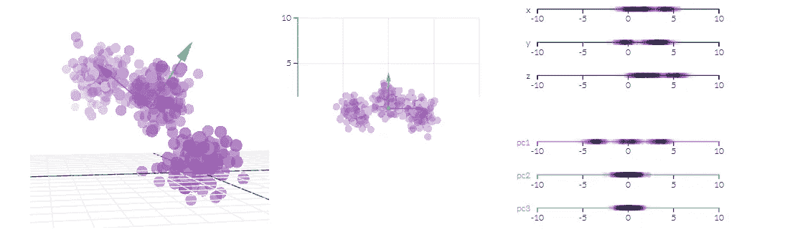

将 3D 数据转换到 2D/1D ( PC1 > PC2 > PC3)

一旦我们把数据转换成主成分，我们就可以选择去掉那些没有方差的变量。这提供了一种方法来减少维度，并专注于方差较大的维度。

**我们为什么要使用 PCA？**

实际上使用 PCA 有两个原因:

1.  ***降维:*** 分布在大量列上的信息被转换成主成分(PC)，使得前几个 PC 可以解释总信息(方差)的相当大的块。这些 PC 可以用作机器学习模型中的解释变量。
2.  ***可视化类:*** 对于 3 维以上的数据(特征)，可视化类(或聚类)的分离是很困难的。对于前两台电脑本身，通常可以看到明显的区别。

**PCA 是一种特征选择技术吗？**

它不是一种特征选择技术。相反，它是一种特征组合技术。因为每台 PC 都是原始数据集中所有列的加权相加组合。

# 主成分分析方法

**第一步:标准化每一列** 如果有不同数量级的值，则对它们进行缩放/标准化。将分类变量转换为虚拟数值变量，因为 PCA 只对数值数据起作用。

**第二步:计算协方差矩阵** 从分析特征的协方差矩阵开始。

***为什么是协方差矩阵？*** 协方差衡量的是两个变量之间的相互关系，即两个变量相对于彼此是否在同一个方向上运动。当协方差为正时，这意味着，如果一个变量增加，另一个也增加。当协方差为负时，情况正好相反。

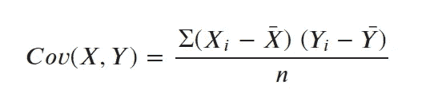

X 和 Y 的协方差

协方差矩阵计算所有可能的列组合的协方差。结果，它变成了一个行数和列数相同的正方形矩阵。

矩阵对一般向量的作用可以被认为是*拉伸和旋转的组合。*

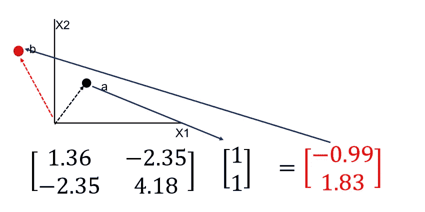

具有拉伸和旋转的协方差矩阵

**步骤 3:计算特征值和特征向量**

对于一个给定的矩阵，存在一个特殊的方向，沿着这个方向效应只是拉伸(没有旋转)，这些特殊的方向叫做 ***特征向量*** 或 ***特征方向*** 。

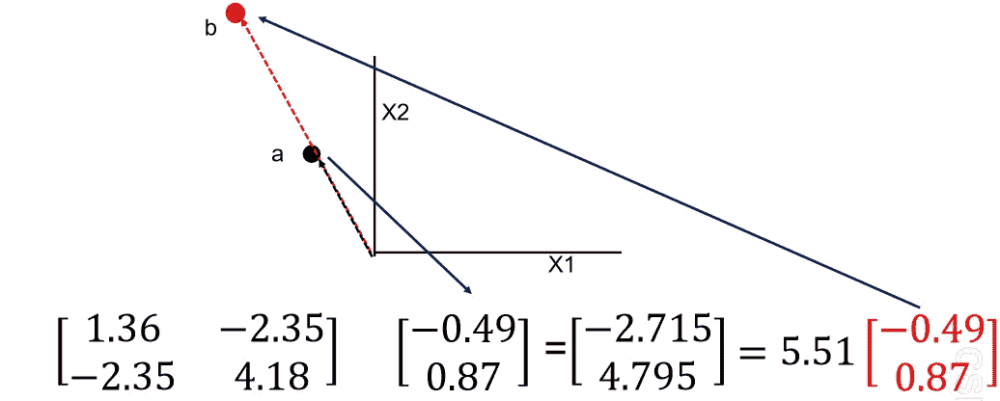

只有拉伸的协方差矩阵

矩阵 a 的特征向量和特征值被定义为非零的 x 和 **ⲗ** 值，

**AX = ⲗX (** A 只是拉伸 **)**

对于一个 n 维方阵，有‘n’个特征向量和‘n’个特征值。

特征向量是主分量方向，特征值是沿这些方向的方差的大小。

在上面的例子中，[-0.49，0.87]是主分量(特征向量)，5.51 是拉伸的幅度(特征值)

**步骤 4:导出主成分特征**

通过取特征向量和标准化列的点积，导出主成分特征。

# **线性判别分析**

LDA 是一种有监督的机器学习方法，用于区分两个组/类。线性判别分析(LDA)的主要思想是最大化两组之间的可分性，以便我们可以做出最佳决策来对它们进行分类。 ***LDA 类似于 PCA，有助于降维，但它侧重于通过创建新的线性轴并将数据点投影到该轴来最大化已知类别之间的可分性。***

LDA 并不致力于寻找主成分，它基本上观察哪种类型的点/特征/子空间提供更多的区分来分离数据。

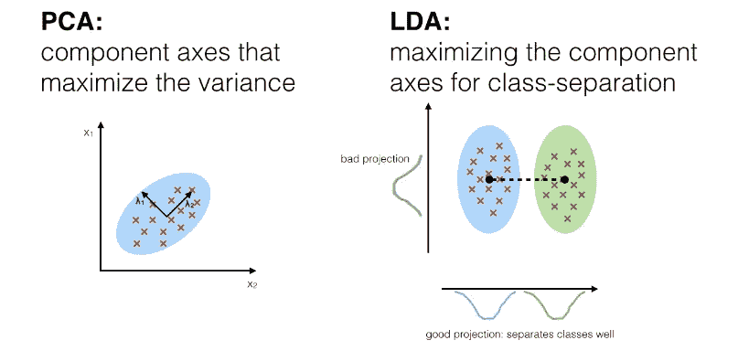

LDA 与 PCA

LDA 的目标是找到一条使类分离最大化的线。因此，要做到这一点，我们需要定义一个良好的分离措施。

**平均向量**

均值向量用于计算每类数据点的均值。

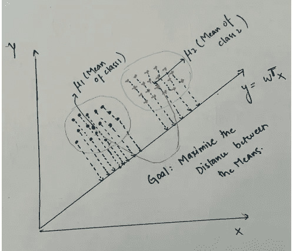

X 和 Y 特征空间中每个类的平均向量。

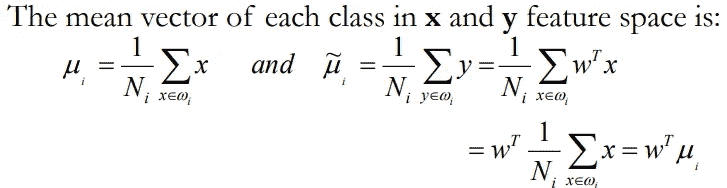

**分离的驱动力**

目标是找到给出最大间隔的最佳组 **w，**，即两个平均值之间的距离最大。

因此，目标函数将是

**L1 常态:**

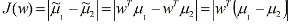

L1 范数目标函数

但是，投影平均值之间的距离不是一个很好的度量，因为它没有考虑类内的标准偏差。

# 如何定义哪个阶级更好？

类内不变性最小而其他类间可变性最大的数据被认为是好的。

由 **Fisher** 提出的解决方案是最大化一个代表均值之间差异的函数，通过对 ***类内(intra-class)*** 可变性或所谓的分散性的测量来标准化。

注意: ***散点=方差***

对于每一类，我们将离差定义为:(*投影样本与其类均值的平方差之和*)。

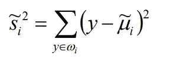

**Si** 在将类 ***ωi*** 投影到 Y 空间后测量类内的可变性。

***S1+S2****度量投影后手头两个类内的变异性，因此称为投影样本的 ***类内散度*** 。*

*因此，Fisher 线性判别式被定义为使标准函数最大化的线性函数:(由投影样本的类内分散标准化的投影平均值之间的距离。*

***目标是最大化 J(w) ( L2 范数):***

*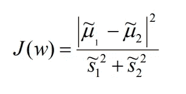*

*L2 范数目标函数*

***PCA 与 LDA 的相似之处:***

1.  *两者都按照重要性的顺序排列新坐标轴。*

*   *PC1(PCA 创建的第一个新轴)占数据变化的最大部分，PC2(第二个新轴)做的第二好，依此类推…*
*   *LD1(LDA 创建的第一个新轴)占数据中最大的变化，LD2(第二个新轴)做了第二好的工作，等等…*

*2.B *这两种算法都告诉我们哪个属性或特征在创建新轴的过程中贡献更大。**

*3.LDA 就像 PCA——两者都试图降低维数。*

*   *PCA 寻找方差最大的属性。*
*   *LDA 试图最大化已知类别的分离。*

# *T 分布随机邻居嵌入(T-SNE)*

*T-SNE 是一种 uns *监督机器学习方法*，用于在低维中可视化高维数据。T-SNE 用于设计/实现，并且可以将任意数量的特征空间降入二维特征空间。*

*PCA 和 LDA 都用于可视化和降维，但 ***T-SNE 仅专门用于可视化目的*** 。它非常适合于高维数据集的可视化。*

*与 PCA 和 LDA 不同，T-SNE 是一种*非线性数据可视化工具。*这意味着它不会形成一条直线来分隔类或计算方差，也不会使用任何范数或距离度量来计算点之间的距离。*

***T-SNE 工作概述:***

*   *该算法首先计算高维空间中的点的相似概率，然后计算对应的低维空间中的点的相似概率。点的相似性计算为条件概率，即如果在以 A 为中心的 ***【正态分布】*** 高斯分布下按比例挑选邻居，则 A 点会选择 B 点作为其邻居。它 ***使用 T 分布*** 中的 T 检验。*
*   *然后，它试图最小化高维空间和低维空间中这些条件概率(或相似性)之间的差异，以便在低维空间中完美地表示数据点。*
*   *为了测量条件概率差之和的最小化，t-SNE 使用梯度下降法最小化所有数据点的 [**库尔贝克-莱布勒散度**](https://en.wikipedia.org/wiki/Kullback%E2%80%93Leibler_divergence) 之和。*

***注:** Kullback-Leibler 散度或 KL 散度是一个概率分布如何偏离第二个预期概率分布的度量。*

*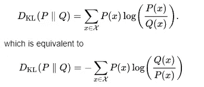*

*P II Q:表示 P 偏离 Q 的程度*

***与香农熵的关系***

*香农熵是从 N 个同等可能性中识别 X 所需的比特数，**减去**均匀分布与真实分布的 KL 散度。*

*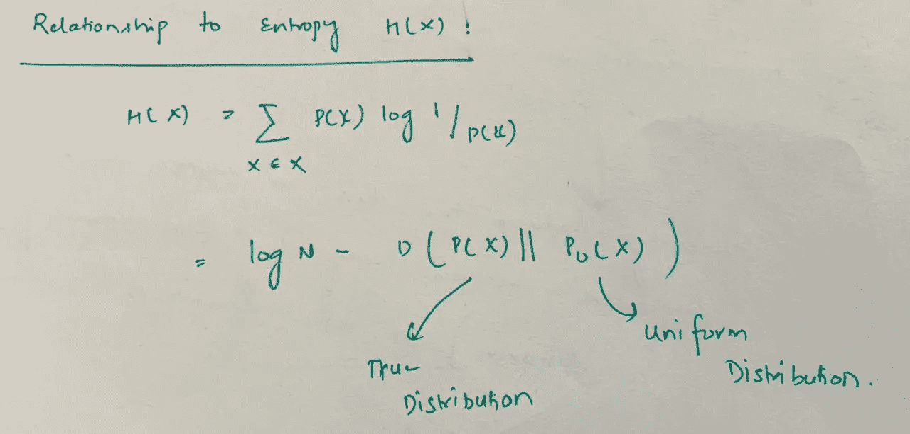*

*香农熵~ KL 散度关系*

*T-SNE 给人的印象是，它通过将数据带到二维空间来对数据进行分类，但实际上，它并没有降低维度。它是一个可视化工具，告诉你每个类是如何分布的，它们之间有没有重叠。*

*在超维空间中，欧几里德距离变得无用。高维度中的类之间的相似性对应于低维度中的类之间的短距离。(各班数据点变得很接近)。*

*T-SNE 使用*梯度下降*方法最小化所有数据点上的 KL 散度之和。*

*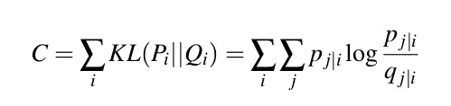*

*KL 散度目标函数*

> *在高维空间中:*

*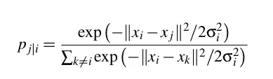*

*高维条件概率*

> *在低维空间中:*

*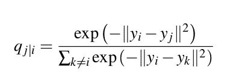*

*低维条件概率，此处方差为 1/2 (0.5) —固定值*

*T-SNE 将数据点从 **P j|i 映射到 Q j|i** *(将数据点从高维映射到低维)**

****这就是上面提到的三种技术的基本区别。****

****感谢阅读。如果你觉得这篇文章有用，请分享:)****

# **参考文献:**

*[https://www.youtube.com/watch?v=1cDSlY5Q-Sw](https://www.youtube.com/watch?v=1cDSlY5Q-Sw)*

*[https://www . dezyre . com/data-science-in-python-tutorial/principal-component-analysis-tutorial](https://www.dezyre.com/data-science-in-python-tutorial/principal-component-analysis-tutorial)*

*[https://www . machine learning plus . com/machine-learning/principal-components-analysis-PCA-better-explained/](https://www.machinelearningplus.com/machine-learning/principal-components-analysis-pca-better-explained/)*

*[http://setosa.io/ev/principal-component-analysis/](http://setosa.io/ev/principal-component-analysis/)*

*[https://www.youtube.com/watch?v=azXCzI57Yfc](https://www.youtube.com/watch?v=azXCzI57Yfc)*

* [## 线性判别分析

### 线性判别分析(LDA)是数据预处理中最常用的降维技术

sebastianraschka.com](https://sebastianraschka.com/Articles/2014_python_lda.html) 

[https://www . data camp . com/community/tutorials/introduction-t-SNE](https://www.datacamp.com/community/tutorials/introduction-t-sne)

[http://www . sci . Utah . edu/~ shire en/pdf/tutorials/El habian _ LDA 09 . pdf](http://www.sci.utah.edu/~shireen/pdfs/tutorials/Elhabian_LDA09.pdf)*