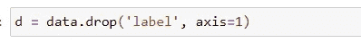

# 主成分分析与 t-SNE:你应该使用哪一个可视化

> 原文：<https://medium.com/analytics-vidhya/pca-vs-t-sne-17bcd882bf3d?source=collection_archive---------1----------------------->

维度是任何数据集中的主要因素。我们人类不能正确地可视化 3d 以上的东西，所以为了理解，我们必须减少维度的大小，这样我们才能正确地可视化。有许多方法可以降低可视化的维数，但这里我们将讨论主成分分析和 t-SNE。

我们使用 MNIST 数据集来了解更多关于主成分分析和 t-SNE。关于 MNIST 的一些数据:

*   mnist_train.csv 文件包含 60，000 个训练示例和标签。
*   mnist_test.csv 包含 10，000 个测试示例和标签。
*   每行包含 785 个值:第一个值是标签(从 0 到 9 的数字)，其余 784 个值是像素值(从 0 到 255 的数字)。


[https://i1.wp.com/varianceexplained.org/images/mnist.png?w=584](https://i1.wp.com/varianceexplained.org/images/mnist.png?w=584)

# PCA(主成分分析):

主成分分析是数据可视化中最重要的降维方法之一。PCA 是一种将 n 维数据转换为 k 维数据，同时保留原始数据集中尽可能多的信息的技术。假设你现在给了 100 维的数据，你需要把它转换成低维比如说 50 维。为此，我们可以使用主成分分析。PCA 中有几个步骤来降低维数。


[https://Blog . bio turing . com/WP-content/uploads/2018/11/Blog _ PCA _ 6b . png](https://blog.bioturing.com/wp-content/uploads/2018/11/Blog_pca_6b.png)

*   计算每列的平均值
*   通过减去列平均值，将每列中的值居中
*   计算中心矩阵的协方差矩阵
*   计算协方差的特征分解(特征向量表示方向的大小或减少子空间的分量)

如果所有特征值都有一个相似的值，那么我们知道现有的表示可能已经被压缩了。

# t-SNE(T-分布式随机邻居嵌入):

t-SNE 也是一种降维方法。PCA 和 t-SNE 之间最主要的区别之一是它只保留局部相似性，而 PA 保留大的成对距离最大化方差。


假设我们有这些点 x1，x2，x3。然后 SNE 霸王龙会试图保护当地的邻居。它会转化为两点，因为几乎

```
**d(x1,x2) - N((x2',x3')**
```

*   它获取高维数据中的一组点，并将其转换为低维数据。
*   这是一种非线性方法，适用于在不同区域执行不同转换的底层数据。
*   它非常灵活，经常能找到其他降维算法找不到的结构。

**代号:**

**加载数据集**


数据集中的一些预处理

*   将所有标签存储在 l 中


*   从数据中删除标签并用新变量 d 存储数据



*   检查数据的形状


**可视化数据:**


*   只取前 15000 个点以减少计算。


*   标准化数据


# 主成分分析

*   矩阵的协方差


*   寻找特征值和相应的向量。


*   通过向量-向量乘法将原始数据样本投影到由两个主特征向量形成的平面上。


*   将标签附加到 2d 投影数据
*   创建用于绘制标注点的新数据框


*   使用 seaborn 绘制 2d 数据点


*   初始化 pca


*   配置参数，组件数量= 2


*   为每个二维数据点添加标签，创建新的数据框架，帮助我们绘制结果数据


*   用于降维的 PCA(非可视化)


# t-SNE


[笔记本 T5**链接**](https://github.com/namratesh/Machine-Learning/blob/master/_28_DEC_PCA%20vs%20tsne.ipynb)

欢迎建议。

感谢阅读！！！

参考资料:

*   [https://colah.github.io/posts/2014-10-Visualizing-MNIST/](https://colah.github.io/posts/2014-10-Visualizing-MNIST/)
*   [https://distill.pub/2016/misread-tsne/](https://distill.pub/2016/misread-tsne/)