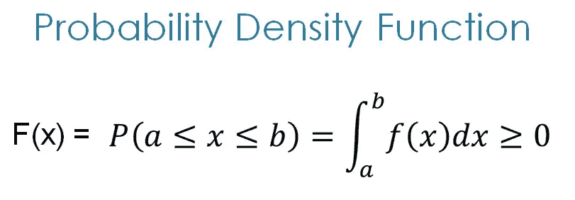
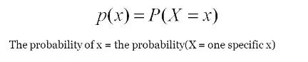
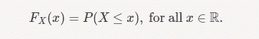
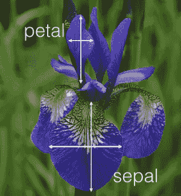
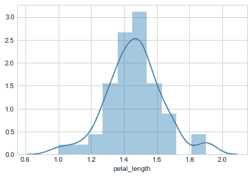
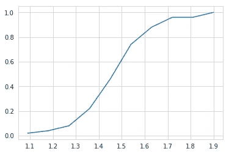
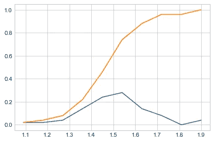

# 机器学习中的 PMF、PDF 和 CDF

> 原文：<https://medium.com/analytics-vidhya/pdf-pmf-and-cdf-in-machine-learning-225b41242abe?source=collection_archive---------0----------------------->

## 构成机器学习基础的随机变量和各种分布函数

**目录**

*   介绍
*   随机变量及其类型
*   概率密度函数
*   PMF(概率质量函数)
*   累积分布函数
*   例子
*   进一步阅读

# 介绍

**PDF** 和 **CDF** 是探索性数据分析中寻找变量间概率关系的常用技术。

在浏览本页内容之前，先浏览一下基本概念，如**随机变量**、 **pmf** 、 **pdf 和 cdf。**

# **随机变量**

随机变量的值对于函数来说是未知的，也就是说，这个值取决于实验的结果

例如，在掷骰子时，变量值取决于结果。

大多数情况下，随机变量用于回归分析，以确定彼此之间的统计关系。有两种类型的随机变量:

***1 —连续随机变量***

***2 —离散随机变量***

***连续型随机变量:-*** 取值在区间/区间之间并采取无限多种可能方式的变量称为连续型随机变量。或者其值是通过测量得到的变量称为连续随机变量。例如，100 人的平均身高，降雨量的测量

***离散随机变量:-*** 取可数个不同值的变量。或者其值是通过计数得到的变量称为离散随机变量。例如，课堂上的学生人数

# 概率密度函数

**PDF 的公式**

> PDF 是一个统计术语，描述**连续**随机变量的概率分布

PDF 通常遵循高斯分布。如果特征/随机变量是高斯分布，那么 PDF 也遵循高斯分布。在 PDF 图上，单一结果的概率总是零，这是因为单点代表的线没有覆盖曲线下的区域。

# PMF(概率质量函数):-

图:PMF 公式

> PMF 是一个统计术语，描述了**离散**随机变量的概率分布

人们经常混淆 PDF 和 PMF。PDF 适用于连续型随机变量，而 PMF 适用于离散型随机变量，例如掷骰子(只能选择 1 到 6 个数字(可数) )

# 累积分布函数

图:CDF 的公式

PMF 是一种描述分布的方法，但它只适用于离散型随机变量，而不适用于连续型随机变量。**累积分布函数**适用于描述随机变量的分布，无论是连续的还是离散的

**比如**，如果 X 是随机选取的一个人的身高那么 F(x)就是这个人比 X 矮的几率，如果 F(180 cm)=0.8，那么被随机选中的人有 80%的几率会低于 180 厘米(相当于有 20%的几率会高于 180 厘米)

# **Iris 数据集上 PDF 和 CDF 的 Python 示例:-**

[*虹膜数据集*](https://www.kaggle.com/uciml/iris) 包含以下数据

图:来自虹膜数据集的花图像

虹膜数据集的详细说明在[这里](https://www.ritchieng.com/machine-learning-iris-dataset/)

**虹膜上的 PDF:-**

花瓣长度上['物种']== 'setosa '的 PDF

**虹膜上的 CDF:-**

基于花瓣长度的鸢尾 CDf

**PDF 和 CDF 可视化:-**

Pdf 和 Cdf

*你会在*[***Github***](https://github.com/MurliJadhav/Pdf-Cdf/blob/master/EDA_Plotting_iris.ipynb)***[*这里*](https://github.com/MurliJadhav/Pdf-Cdf/blob/master/EDA_Plotting_iris.ipynb) *找到用 python 代码详细解释。****

# *参考资料:*

* [## 虹膜数据集

### 我是 Ritchie Ng，机器学习工程师，专攻深度学习和计算机视觉。查看我的代码…

www.ritchieng.com](https://www.ritchieng.com/machine-learning-iris-dataset/)  [## 概率密度函数

### 概率密度函数(PDF)是一个统计表达式，它定义了一个连续的概率分布…

www.investopedia.com](https://www.investopedia.com/terms/p/pdf.asp)  [## 累积分布函数

### PMF 是描述离散随机变量分布的一种方式。正如我们稍后会看到的，PMF 不可能…

www.probabilitycourse.com](https://www.probabilitycourse.com/chapter3/3_2_1_cdf.php)  [## 什么是 CDF -累积分布函数？

### 如果你有一个数量$X$随机取值，累积密度函数$F(x)$给出…

math.stackexchange.com](https://math.stackexchange.com/questions/52400/what-is-cdf-cumulative-distribution-function)*