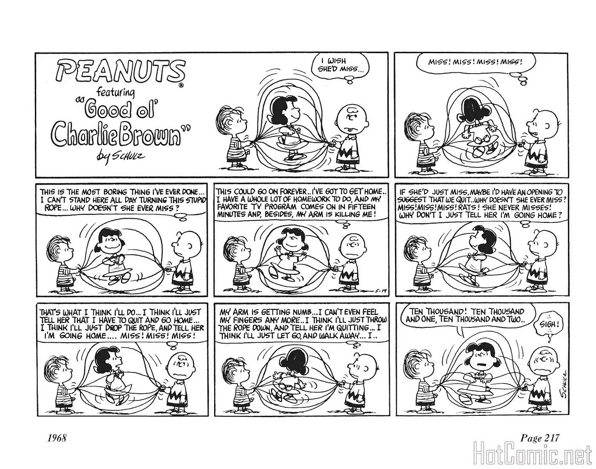
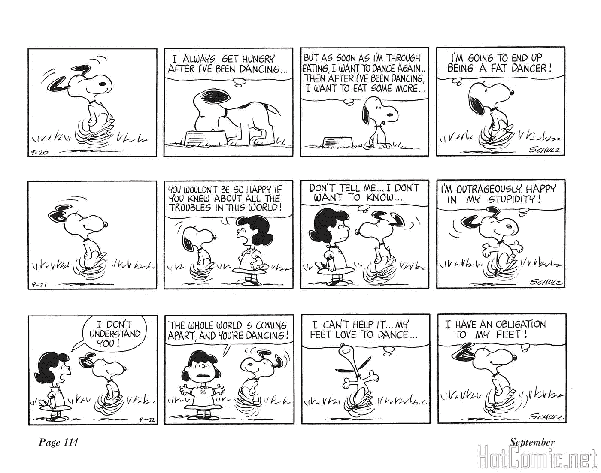
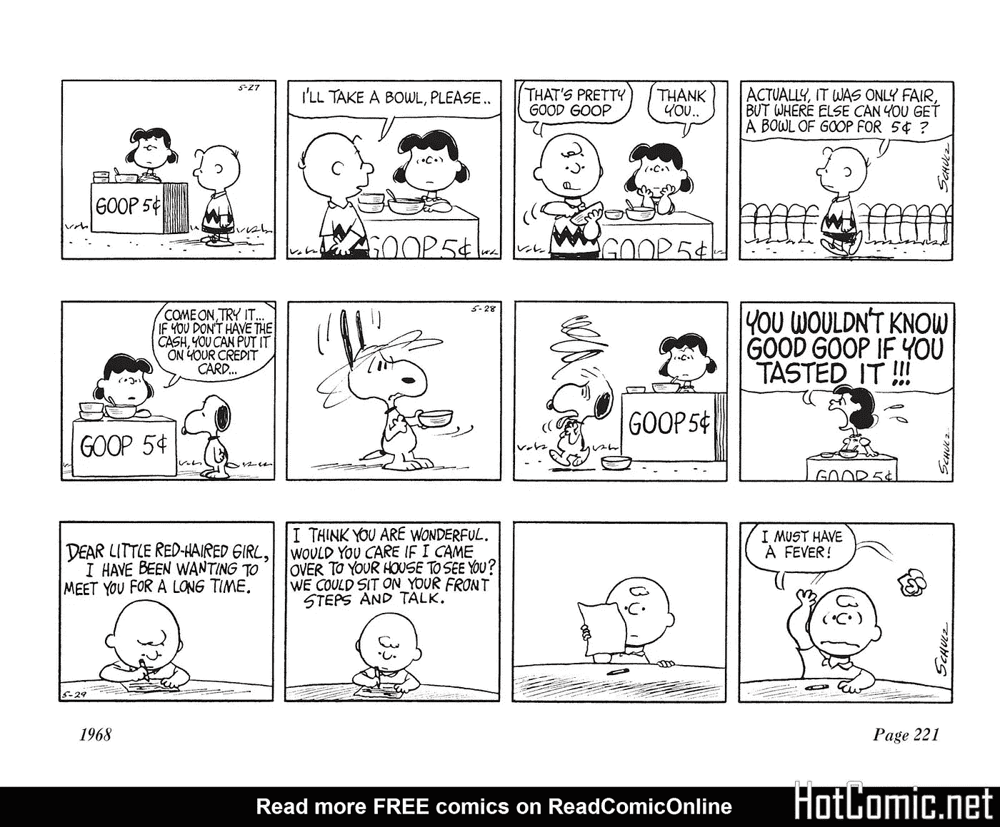
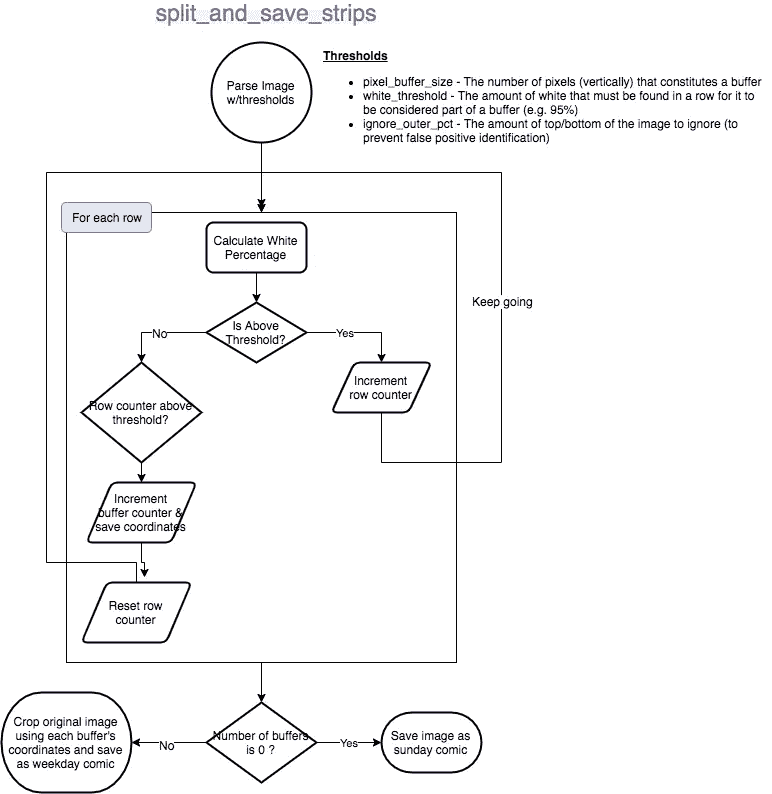
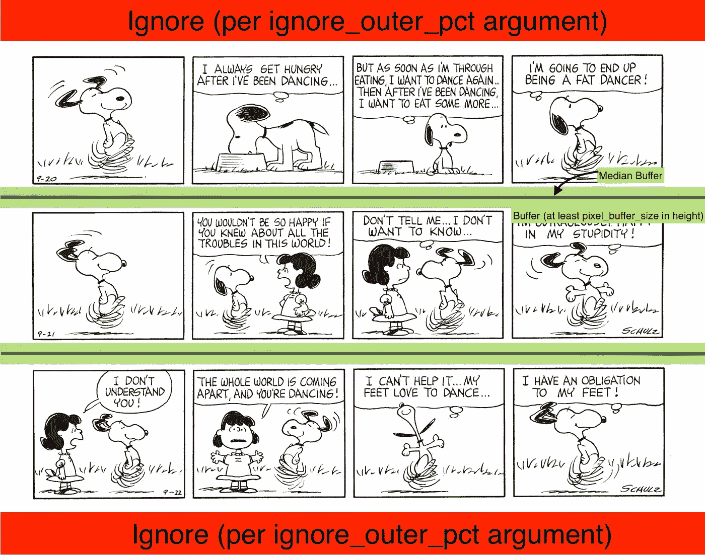

# peanuts.today |清理和预处理连环漫画数据集(第 2 部分)

> 原文：<https://medium.com/analytics-vidhya/peanuts-today-cleaning-and-pre-processing-comic-strip-data-set-part-2-3b1215e9ecbf?source=collection_archive---------18----------------------->

这是我关于探索/使用花生漫画全集系列的第二篇文章。对于介绍帖，[点击这里](/@craig.burdulis/peanuts-today-exploring-the-peanuts-in-the-cloud-with-machine-learning-part-1-ea89f0899f23)。

所有用来操作漫画图像的代码都可以在[这里](https://github.com/icj217/peanuts-comic-preprocessing)找到。

**注意**:我没有公布原始数据集，因为这是一个个人研究项目，我希望尊重可能适用于这些图像的任何版权/合理使用规则和条例。我制作了一些来自数据集的图片，1)在博客中展示我所面临的一些挑战，2)在 [peanuts.today](http://peanuts.today) 上，这些图片只能以可控的方式访问，以防止图片抓取。

说完了，让我们开始吧！

# 原始数据

鉴于我的目标是 1)提取图像本身的任何可用元数据，2)以适当的方式格式化图像以便在 web 上显示，处理图像带来了一些挑战。

为了给出图像可变性的一些背景，这里是来自数据集的 3 个不同的图像，它们说明了必须处理的差异。

**图 1** 是一个周日带的例子。不同于典型的 4 个水平的连环画，周日连环画是“整版”的，多排连环画组成一幅漫画。我的处理脚本将需要能够识别和维护整个图像作为一个单一的漫画。

**图像 1**

**图 2** 是我所说的工作日条带的一个例子，这意味着它们是典型的 4 面板行。我的处理脚本将需要认识到在这个图像中有 3 个单独的漫画/漫画，并适当地提取出来。

**图像 2**

**图 3** 也包含工作日条纹，但在图像底部也有一个粗黑的横幅。在尝试处理图像之前，我的处理脚本需要忽略/删除该条带。

**图片 3**

数据集中的所有图像还包括左下角/右下角的元数据。这包括页码(不太重要)以及出版的月份和年份(非常重要)

# 挑战

粗略看一下上面的数据，一些挑战变得很明显:

*   区分周日和周日的漫画
*   开发一种识别图像中单个条带的方法
*   从图像中提取元数据(例如页码、月份/年份)

# 解决方法

谢天谢地，我能够找到相对简单的方法来解决上面列出的所有问题。

## 漫画识别与提取

周日和周日漫画的主要区别是面板行之间的空白量。通过比较图 1 和图 2(见上图),你可以看到，周日漫画中的空白比平日漫画中的要少得多。

因此，我开发了一个[函数](https://github.com/icj217/peanuts-comic-preprocessing/blob/851b3194905f2bc9883accf845facb138c886d09/src/utils/split.py#L23) (`split_and_save_strips `)，它获取一个图像和一些调优参数，计算图像中找到的条带数，并为找到的每个条带创建一个新图像。

从图像中提取条带的功能

下面的流程图说明了该功能的工作原理:

为了更好地形象化，这是原始图像被函数“标记”后的样子:

## 元数据提取

从源图像中提取元数据被证明是相当简单的。由于文本是一致打印的，我认为某种 OCR 工具能够成功地解析文本，经过一些验证后，我可以将其加载到数据库表/CSV 中。

我发现使用开源的 [Tesseract](https://github.com/tesseract-ocr/tesseract) 项目正好满足了我的需求，而不是为任何基于云的 OCR 服务(例如 AWS Textract/Rekognition 或 GCP 的 Vision API)付费。对图像进行一些清理是必要的，即确保我传递给 Tesseract 的图像中只有一部分是有内容的。包含任何无关的数据(例如，部分连环漫画或水印)会使 Tesseract 困惑，并阻止它返回有效文本。处理元数据解析/验证的功能可以在找到[。](https://github.com/icj217/peanuts-comic-preprocessing/blob/851b3194905f2bc9883accf845facb138c886d09/src/utils/metadata.py#L35)

## 古怪的旁白

除了上面讨论的与图像修改/提取相关的用例特定的解决方案之外，我还必须弄清楚如何针对数千个文件高效地运行这些脚本。**虽然我的内部 AWS 架构师希望将这些脚本捆绑到一些 Lambda 函数中，并使用 S3 事件通知触发器和可能的步进函数状态机来构建图像处理管道，但我发现在我的笔记本电脑上本地运行脚本更容易**，因为 1)这是一个一次性的清理过程，2)图像的不一致性可能会导致 1–2%的错误率，这需要手动干预，如果文件/脚本不在本地运行，处理起来会更加困难。

最终，我能够使用 Python 的`threading`、`queue`和`concurrent.futures`模块开发一个高效的本地管道，您可以在`crop_images.py`脚本中查看这些模块。利用这一点，我能够利用多线程，并大大减少裁剪/分割图像的时间。没有一个剧本需要超过一两个小时才能完成。

# **总结&下一步**

在运行各种脚本从图像中裁剪、分割和提取元数据的最后，我现在有了一个干净的数据集，图像文件和漫画之间有一对一的关联。

使用这些数据的下一步是将它上传到某个存储库中，我可以用它来访问和搜索数据。这将在下一篇文章中讨论。感谢阅读！