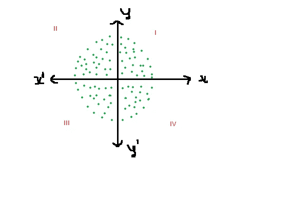
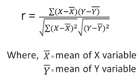
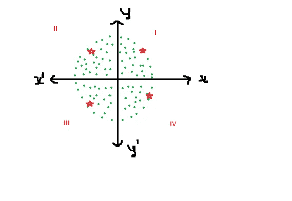
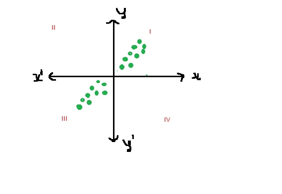
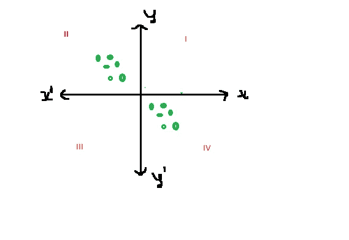

# 皮尔逊相关系数和散点图数据传播去神秘化

> 原文：<https://medium.com/analytics-vidhya/pearson-correlation-coefficient-and-scatter-plot-data-spread-demystified-b392b9e707f2?source=collection_archive---------16----------------------->

在之前的帖子 [PearsonCorrelation](https://tinyurl.com/y9k7fsxh) 中，我们已经讨论了理解相关系数的重要性以及如何计算 Pearson 相关系数。

皮尔逊系数给出了变量与目标变量的线性关系有多强的概念。一旦在每个因变量和目标变量之间确定了这些值，就可以决定在建立线性模型(无论是回归模型还是分类器模型)时要考虑的独立特征。

具有接近 1 的较高值的特征可被考虑用于构建模型，而丢弃低于该值的特征。上述基于相关性选择特征的步骤属于特征选择步骤。特征越好，构建的模型的输出/准确性就越好。

当 Pearson 系数(r) = 0(接近 0)时，变量之间的散点图将如下所示

让我们理解一下为什么上面格式的散点图的皮尔逊系数为 0 或接近 0。

变量 x & y 的皮尔逊系数公式= cov(x，y) / stdDev(x) * stdDev(y)

皮尔逊系数

让我们考虑每个象限中的 4 个点，如下所示

皮尔逊值为 0 的散点图

**象限 1**

让我们考虑 X 和 Y 值的平均值为 0，让我们考虑一个点(X，y) = (1，1)

因此，对于第一象限，考虑皮尔逊公式中的分子并用 0 替换平均值，那么它看起来像
(x-0)*(y-0)=(1–0)*(1–0)=+1

分母变成了 1

因此，在第一象限中，对于单个点(1，1 ),皮尔逊系数值= 1

**象限 3**

让我们考虑 X 和 Y 值的平均值为 0，让我们考虑一个点(X，y) = (-1，-1)

因此，对于第一象限，考虑皮尔逊公式中的分子，用 0 替换均值，则看起来像是
(x-0)*(y-0)=(-1–0)*(-1–0)=-1 *-1 = 1

分母变成了 1

所以在第三象限中对于单个点(-1，-1)，皮尔逊系数值= 1

**象限 2**

让我们考虑 X 和 Y 值的平均值为 0，并且让我们考虑一个点(X，y) = (-1，1)

因此，对于第一象限，考虑皮尔逊公式中的分子，用 0 替换平均值，那么它看起来像
(x-0)*(y-0)=(-1–0)*(1–0)=-1

分母变成了 1

所以在第二象限中对于单个点(-1，1)，皮尔逊系数值= -1

**象限 4**

让我们考虑 X 和 Y 值的平均值为 0，让我们考虑一个点(X，y) = (1，-1)

因此，对于第一象限，考虑皮尔逊公式中的分子并用 0 替换平均值，则看起来像是
(x-0)*(y-0)=(1–0)*(-1–0)=-1

分母变成了 1

所以在第四象限对于单个点(1，-1)，皮尔逊系数值= -1

因此，四个象限中每个点的值如下

象限 1 = 1

象限 2 = -1

象限 3 = 1

象限 4 = -1

上述所有象限值之和= 1+-1+1+-1 = 0

作为一个整体，皮尔逊系数是所有 4 个象限中所有点的计算值之和，这将非常类似于上述计算，最终值将接近于零，因此对于如下图所示分散的数据，皮尔逊值将为 0

值接近于 0 的皮尔逊系数

在下图中，数据点主要出现在第一和第三象限中，导致两者的值都为 1，根据上述计算，因此最终皮尔逊系数的值将为 1 或接近 1

在下图中，数据点主要出现在第二和第四象限，导致一个象限的值为 1，另一个象限的值为-1。根据上述计算，最终的皮尔逊系数将具有-1 或接近-1 的值

