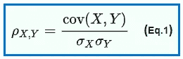

# 皮尔逊相关系数

> 原文：<https://medium.com/analytics-vidhya/pearson-correlation-coefficient-c78033127629?source=collection_archive---------22----------------------->

在我之前的博客中，我们学习了用**协方差**来衡量两个随机变量之间的**关系**。

 [## 协方差

### 在这篇博客中，我们将试图理解如何测量随机变量之间的关系。

medium.com](/analytics-vidhya/covariance-c618c0099fc) 

由于协方差在量化这种关系时有局限性，因此有另一个叫做**皮尔逊相关系数(PCC)** 的概念来克服这种局限性。它通常用希腊字母ρ来表示。所以两个随机变量 X 和 Y 之间的皮尔逊相关系数无非是协方差(X，Y)除以 X 的标准差和 Y 的标准差，这里是ρ的数学公式。

现在，你可能会问，为什么我们要定义一个新的指标？因为协方差没有考虑可变性，这里我们用分母中 x 和 y 的标准差。

x 的标准差到底是多少？它只不过是 x 的方差的平方根，而方差就是可变性。

当您测量协方差时，您不是在测量 x&y 内的可变性。而是对协方差做一个小的修改，即(将您的协方差除以 x 的标准偏差和 y 的标准偏差)将为您提供可变性和可解释性。

正如我们在上一篇关于协方差的博客中看到的，即当 x 增加时，如果 y 也增加，那么协方差将为正。但是积极程度有多大呢？可能非常非常积极也可能非常消极，对吧？类似地，我知道随着 x 增加，y 减少，我的协方差将为负。对吗？但我不知道负面影响有多大..

因此，PCC 是一个很好的量化关系的想法，下图给出了对 PCC 的更好理解。

*记住皮尔逊相关系数的界限在-1 和+1 之间。*

如果你看到上图中的图 1，它显示 x 增加，y 减少，所有的点都在一条直线上，SoPCC 是-1。类似地，图 4 与第一个正好相反，其中 PCC 为+1。

在图 5 中还有另一种情况，PCC 为 0，这意味着两个随机变量彼此无关。为了理解图 5 的情况，让我们以一个班级为例，如果我取 x 为学生的身高，y 为考试成绩。他们之间没有关系。我不能说高的学生会表现得更好或者矮的学生会表现得更好，这两个随机变量之间没有关系，对吗？在这种情况下，你会得到接近零的 PCC。

**皮尔逊相关系数的局限性:**

如果两个随机变量之间的关系是线性的，则皮尔逊相关系数非常适用。所以你的皮尔逊相关系数和协方差偏向线性关系。这意味着当随机变量 x 和 y 线性相关时，他们会给你一个很好的值，要么+1，要么-1。

让我们看一些 PCC 表现不佳的例子。

下面是几组( *x* ， *y* )点的示意图，每组的相关系数为 *x* 和 *y* 。

请注意，相关性反映了线性关系的强度和方向(顶行)，而不是关系的斜率，如上图第 2 行所示。

如果观察第 3 行，X 和 Y 之间存在非线性关系，所以 PCC 为 0。

为了克服 PCC 的局限性，我们将在下一篇博客中讨论另一个叫做 Spearman 秩相关系数的概念。

参考:[https://en . Wikipedia . org/wiki/Pearson _ correlation _ coefficient](https://en.wikipedia.org/wiki/Pearson_correlation_coefficient)