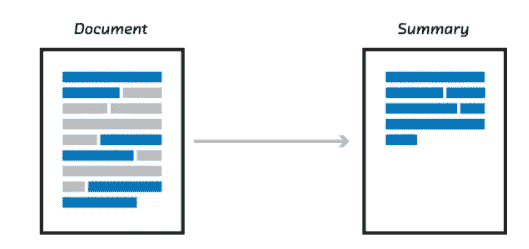

# PEGASUS:用提取的间隔句进行抽象摘要的预训练

> 原文：<https://medium.com/analytics-vidhya/pegasus-pre-training-with-extracted-gap-sentences-for-abstractive-summarization-acb238aa1096?source=collection_archive---------11----------------------->

## 了解当前的 SOTA 总结系统

[来源](https://miro.medium.com/max/529/0*ZF4ZOlUt8em024BE.png)

[文本摘要](https://towardsdatascience.com/a-quick-introduction-to-text-summarization-in-machine-learning-3d27ccf18a9f)是缩短给定文本但保留整个文档的基本要点的任务。概括通常被视为大致分为两类[提取](/sciforce/towards-automatic-text-summarization-extractive-methods-e8439cd54715)和[抽象](http://home.iitk.ac.in/~soumye/cs498a/report.pdf)。摘录总结可以是…