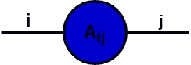
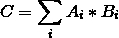
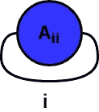

# 彭罗斯图形符号

> 原文：<https://medium.com/analytics-vidhya/penroses-graphical-notation-fe4c2f24cf3b?source=collection_archive---------5----------------------->

在[的上一篇教程](/@aamirsoni1551/tensor-networks-intro-5bfb2c770f85)中，我们快速复习了张量、矩阵和向量。在本教程中，我们将尝试使用彭罗斯的图形符号来表示张量。

让 M 代表下面的矩阵

我们看到索引(2，3)处的元素是 2.1。在这种情况下，我们所做的是沿着 Y 方向向下移动 2，沿着 X 方向向下移动 3。我们还可以看到，索引(0，2)处的元素是 4。在这种情况下，我们在 Y 方向移动了 0°，在 X 方向移动了 2°。我们看到矩阵中的任何元素都可以用两个数字给出，一个表示要向下移动多少行，另一个表示要跨越多少列。

因此，我们可以把所有的矩阵称为，

矩阵的彭罗斯符号

圆圈或节点表示给定索引(I，j)处的矩阵值。它的“指针”(通常称为轴)代表某个方向内的索引，目前被赋予“I”和“j”的任意值。在我们的例子中,“左手”,给定值“I ”,代表我们在 Y 方向上向下移动了多少。同样，右手，现在被指定为“j ”,代表我们在 X 方向上移动了多远。

因此，这实质上意味着下图表示值 99，因为它是矩阵 m 内部的索引项(1，2)

矩阵 M

在矩阵的位置(I，j)指定一个元素就像给“I”和“j”赋值一样简单

**注意** : *我们在 Y 方向能向下移动的最大值是 4，在 X 方向能移动的最大值是 3。这意味着可以分配给左手的最大值是 4，而对于右手是 3。一个轴可以取的值的数量通常称为它的度数。因此，在我们的例子中，左手的度数是 5，右手的度数是 4，因为右手可以取从 0 到 3 的所有值。*

这看起来很简单，但是很容易推广到不同维数的张量。让我们先来看看向量是什么样子的。

设 A 是一个向量，设为:

那么 A 的对应表示将是:

矢量的彭罗斯表示，

其中“I”的范围从 0 到 3，因此轴的度数为 4。

在这种情况下，我们只看到一只“手”的原因是，为了指定向量中的某个元素，我们只需要指定沿着某个特定方向有多远。

例如，在我们的例子中，对于向量 A，我们看到索引 0 处的元素是-567。索引 3 处的元素是 1.2。在彭罗斯的表述中，这实质上意味着:

正如我们所看到的，在我们的 vector 中指定特定的元素仅仅意味着为我们的“I”组件分配索引值。

因此，一般来说，任何向量 A 都可以用 Penrose 图形符号表示为:

彭罗斯图形符号中的一般矢量表示

任何矩阵 A 都可以表示为:

彭罗斯图形符号中的一般矩阵表示

其中“I”循环遍历 A 的行,“j”循环遍历 A 的列。

这些想法在处理张量和张量收缩时会变得有用，我们将在后面看到。这些图表在物理、化学和工程中广泛使用。

最后，由于标量只是一个数字，它不需要进一步的索引，这意味着在图形符号中，它只是一个单独的节点:

标量的图形表示

因此，我们看到:

# 数积

我们现在将看到张量的这种表示有多么强大。

假设我们有两个向量，A 和 b。

在哪里，

那么，在彭罗斯的图形符号中，矢量 A 的适当表示是:

所以如果我=2，

B 的适当表示是:

所以如果 j = 3，B[j] = B[3] = -2

我们在[上一篇文章](/@aamirsoni1551/tensor-networks-intro-5bfb2c770f85)中讨论的点积给出了

在彭罗斯的图形符号中，点积可以简洁地表示为:

这两个节点结合在一起意味着我们正在成倍增加它们所代表的价值。“两只手”合在一起成为“一只手”，意味着给定的分量“I”，我们将索引到两个向量中，并将该值相乘。

比如说:

当两条边连接在一起时，该边消失并形成一个新节点，该节点被赋予连接两条边后所有乘积之和的值。因此，我们只剩下:

两个向量点积的结果。在这种情况下，C=47

由于 C 是 A 和 B 的元素在公共边上结合在一起后的所有乘积之和，因此 C 由下式给出:

请注意，我们没有留下自由边，这意味着我们只剩下一个标量，这正是点积给我们的！

需要记住的重要一点是，只有当两个轴的度数相等时，我们才能连接它们。由于两者的单轴度数相同，我们可以收缩(或连接)该边。

# 矩阵乘法

设 A 和 B 是下列矩阵:

同样，矩阵乘法也可以用图形符号来表示:

同样是矩阵乘法，就像点积一样，我们需要确保我们连接的轴有相同的度数。对于矩阵，这最终会转化为第一个矩阵中的列数必须与第二个矩阵中的行数相同。这是因为“j”通过第一个矩阵的列进行索引，但是当矩阵相乘时，它将通过第二个矩阵的行进行索引，这迫使我们确保两个轴具有相同的大小。

矩阵轴连接后，我们最终得到:

两个节点之间的边的结合(矩阵乘法)形成新的矩阵。

在这里，我们看到两个轴的连接形成了一个有自己两个轴的新节点，这代表了一个矩阵乘法。我们看到轴“j”已经消失，但轴“I”和“k”仍然存在。这是有意义的，因为将两个矩阵相乘会形成一个新的矩阵，其行数与第一个矩阵相同，列数与第二个矩阵相同，并且该信息在我们的图中非常清楚。

需要注意的重要一点是，轴“I”是指沿 Y 方向移动还是轴“j”是指沿 X 方向移动并不重要，只要我们记住当且仅当具有相同的度数时连接两条边**。**

矩阵的迹可以表示为:

这是因为，正如我们所知，迹被定义为所有元素(0，0)，(1，1)，(2，2) …。，(I，j)，其中 i=j

因此，当我们在矩阵的对角线上求和时，我们需要 I 分量和 j 分量相等。在彭罗斯的图形符号中，这是因为两个轴是连接在一起的。

一旦我们将轴连接在一起，轴现在必须消失。这意味着我们最终只剩下:

将矩阵的两条边连接在一起的结果

这是一个标量，因为它没有自由边，这正是矩阵的轨迹所返回的！！！

# 张量收缩

使用彭罗斯的图形符号，我们也可以很容易地表示张量收缩。

例如，考虑大小为(4x8x2x7)和(8x7x4)的张量 A 和 B

现在考虑下面的张量收缩:

本质上，这基本上意味着找到上面详述的张量收缩的结果，我们循环通过所有的“I”轴，然后通过“l”轴，然后通过“j”轴。

上面的公式看起来非常复杂。然而，在张量收缩中，它可以很容易地用图表符号表示为:

图形形式的张量 A

图形形式的张量 B

三个指数之间两个张量的收缩。

收缩后的最终结果

我们可以非常明显地看到，在 3 个指数之间发生的张量收缩的结果产生了一个矢量，因为只剩下一个自由边。在这个收缩中，“m”轴与“j”轴相连，“n”轴与“l”轴相连，最后，“o”轴与“I”轴相连。

同样，**需要注意的是:**

只有到那时，张量收缩才有可能。

此外，我们现在可以看到矩阵乘法本质上只是沿着一个特定轴的两个二阶张量之间的张量收缩。

沿着“I”和“j”轴的张量收缩只会产生三阶张量，而沿着 l 轴的张量收缩只会产生五阶张量。这个原因留给读者作为练习，使用图形符号对你有利。

最后，一个张量网络，本质上，基本上只是一串张量，其中一些张量可能与一条边相连，例如

张量网络

上图来自 [Math3ma](https://www.math3ma.com/blog/matrices-as-tensor-network-diagrams) 。关于张量网络的更多信息，请访问 [Math3ma](https://www.math3ma.com/blog/matrices-as-tensor-network-diagrams) 获取更多信息。

在下一个教程中，我们将查看一些用于以有效的方式计算张量网络的关键算法。