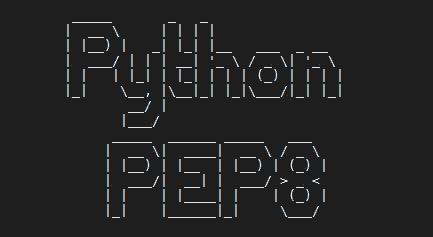
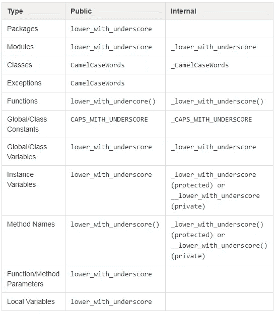

# PEP8 — Python 增强提案

> 原文：<https://medium.com/analytics-vidhya/pep8-python-enhancement-proposal-8031e682ccb8?source=collection_archive---------18----------------------->

PEP-8 或 Python 增强提案提供了一些要点，您可以使用这些要点使您的代码更有组织性和可读性。



**缩进**

最好总是给缩进留四个空格。

```
**if** True: print("If works")
```

当你写一个大的表达式时，最好保持表达式垂直对齐。当你这样做时，你将创建一个“悬挂缩进”

```
value **=** square_of_numbers(num1, num2, num3, num4)list_of_people **=** [ "Rama", "John", "Shiva"]
```

**制表符或空格**

空格是首选的缩进方法。

制表符应该只用于保持与已经用制表符缩进的代码一致。

用制表符和空格混合缩进的 Python 2 代码应该转换为只使用空格。

Python 3 不允许混合制表符和空格来缩进。所以你要两者选一，坚持下去！

**最大线路长度**

将所有行限制在 79 个字符以内

```
with open('/path/to/some/file/you/want/to/read') as file_1, \ open('/path/to/some/file/being/written', 'w') as file_2: file_2.write(file_1.read())
```

对于结构限制较少的长文本块(文档字符串或注释)，行长度应限制在 72 个字符以内。

在使用任何操作符(+、-等)时，您可以更好地使用适当的换行符，这使您的代码更容易理解:

```
total **=** (A **+** B **+** C)
```

**跨多行断开字符串**

偏好使用斜线

```
my_string **=** 'This is a very long string, '\
            'so long that it will not fit into just one line ' \
            'so it must be split across multiple lines.'
```

**单引号或双引号**

Python 允许使用单引号或双引号。PEP8 说你可以使用其中任何一种，只要你始终如一

尽量坚持使用单引号，除非在使用双引号更具可读性的情况下。

```
print('This doesn\'t look so nice.')print("Doesn't this look nicer?")
```

**空白行**

*   顶级函数和类由两个空行分隔。
*   类中的方法定义应该用一个空行隔开。
*   额外的空行可以(有节制地)用于分隔相关函数组
*   在一堆相关的一行程序之间可以省略空行
*   在函数中尽量少用空行来表示逻辑部分。

```
**class** SwapTestSuite(unittest.TestCase): """ Swap Operation Test Case """ **def** setUp(self): self.a **=** 1 self.b **=** 2 **def** test_swap_operations(self): instance **=** Swap(self.a,self.b) value1, value2 **=**instance.get_swap_values() self.assertEqual(self.a, value2) self.assertEqual(self.b, value1)**class** OddOrEvenTestSuite(unittest.TestCase): """ This is the Odd or Even Test case Suite """ **def** setUp(self): self.value1 **=** 1 self.value2 **=** 2 **def** test_odd_even_operations(self): instance1 **=** OddOrEven(self.value1) instance2 **=** OddOrEven(self.value2) message1 **=** instance1.get_odd_or_even() message2 **=** instance2.get_odd_or_even() self.assertEqual(message1, 'Odd') self.assertEqual(message2, 'Even')
```

**导入报表**

您应该总是在脚本开始时导入库。

如果你需要从一个模块或包中取出许多名字，并且它们不能全部放在一行中(不要让这一行太长)，那么使用括号将名字分散在多行中

```
**from** Tkinter **import** ( Tk, Frame, Button, Entry, Canvas, Text, LEFT, DISABLED, NORMAL, RIDGE, END,)
```

**评论**

您可以使用块注释来解释更复杂或其他人不熟悉的代码。这些通常是较长形式的注释，它们适用于后面的部分或全部代码。块注释与代码在同一级别缩进。块注释的每一行都以标签`#`和一个空格开始。如果你需要使用一个以上的段落，它们应该由一行单独的`#`隔开

```
**if** Gram **is** None **or** Gram **is** False: Gram **=** None **if** copy_X: # force copy. setting the array to be fortran-ordered # speeds up the calculation of the (partial) Gram matrix # and allows to easily swap columns X **=** X.copy('F')
```

您应该谨慎使用行内注释，即使当您需要解释代码的某些部分时，它们可能会很有效。

```
counter **=** 0  # initialize the counter
```

您在公共模块、文件、类和方法的开头编写文档字符串。这些类型的注释以`"""`开始，以`"""`结束

```
""" This module is intended to provide functions for scientific
    computing"""
```

**模块级数据名称**

在 Python 中，模块级的下划线，或者带有两个前导下划线和两个尾随下划线的名字非常有效

Python 中的 Dunder 或 magic 方法是在方法名中有两个前缀和后缀下划线的方法。邓德在这里的意思是“双下(下划线)”。这些通常用于运算符重载。魔术方法的几个例子是:__init__ 、__add__ 、__len__ 、__repr__ 等等。

像(`__all__`、`__author__`、`__version__`)这样的模块级语句应该放在模块主文档串中，并且应该在所有`import`语句之前。您应该在任何其他代码之前定义`from __future__`导入，除了文档字符串。

```
""" Algos module consists of all the basic algorithms and their 
    implementation"""**from** __future__ **import** print__all__ **=** ['searching', 'sorting']__version__ **=** '0.0.1'__author__ **=** 'Chitrank Dixit'**import** os**import** sys
```

**%或格式**

这种字符串格式化方法是 Python 3 中的新标准，应该优先于新代码中的字符串格式化操作中描述的% formatting

```
x **=** 'name: {}; score: {}'.format(name, n)
```

**源编码**

核心 Python 发行版中的代码应该总是使用 UTF-8(或者 Python 2 中的 ASCII)。

使用 ASCII(在 Python 2 中)或 UTF-8(在 Python 3 中)的文件不应该有编码声明。

```
x **=** 'name: {}; score: {}'.format(name, n)
```

**命名约定**

*   不要使用“l”、“O”或“I”作为单个变量名:这些字符在某些字体中看起来类似于零(`0`)和(`1`)
*   一般来说，如果可能的话，最好使用短名字。在某些情况下，您可以使用下划线来提高可读性。
*   “内部”是指模块的内部，或者是类中受保护的或私有的。
*   在前面加一个下划线(`_`)可以保护模块变量和函数(不包括在`import * from`中)。
*   在实例变量或方法前加上双下划线(`__`)可以有效地使变量或方法成为其类的私有变量或方法(使用名称混淆)



命名约定的规则

```
**from** package_name **import** module_name**class** ClassName: """ A purely illustrative class """ __property **=** None **def** __init__(self, function_parameter_name): self.__property **=** function_parameter_name **def** method_name(self): """ A simple getter for "property" """ **try**: print global_var_name **return** self.__property **except** SomeExceptionError, e: print GLOBAL_ERRORCONSTANT **return** self.__property @classmethod **def** default(cls): instance_var_name**=** ClassName("default value") **return** instance_var_name
```

**表达式/语句中的空格**

避免圆括号、方括号或大括号内的空白

```
spam(ham[1], {eggs: 2}) # Valid
spam( ham[ 1 ], { eggs: 2 } ) # Avoid this
```

在结尾逗号和后面的右括号之间

```
foo = (0,) # Valid
bar = (0, ) # Avoid this
```

紧接在逗号、分号或冒号之前

```
if x == 4: print x, y; x, y = y, x # Valid
if x == 4 : print x , y ; x , y = y , x # Avoid this
```

紧接在开始函数调用的参数列表的左括号之前

```
spam(1) # Valid
spam (1) # Avoid this
```

紧接在开始索引或切片的左括号之前

```
Yes: dct['key'] = lst[index] # Valid
No:  dct ['key'] = lst [index] # Avoid this
```

赋值(或其他)运算符周围的多个空格，用于与其他运算符对齐

有效:

```
x = 1
y = 2
long_variable = 3
```

避免这种情况:

```
x             = 1
y             = 2
long_variable = 3
```