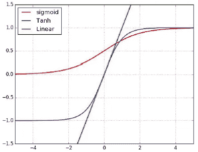
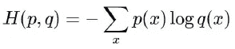

# 感知器与人工神经网络之旅

> 原文：<https://medium.com/analytics-vidhya/perceptron-and-journey-towards-artificial-neural-networks-ann-1af2f7349278?source=collection_archive---------17----------------------->

亲爱的读者你好…我们现在要讨论神经网络！

在我们真正进入神经网络之前，我们应该知道神经网络是如何开始它的旅程的，以及它是从哪里开始的。我们开始吧！

感知器的想法是受我们大脑中通过电脉冲传递信息的生物神经元的启发。我们记得的所有甜蜜的小事和痛苦的经历，都是因为相互连接的神经元。

所以， ***“感知器是神经网络的一个构建模块。”***

生物神经元及其突触连接。

一个成年人的大脑由 1000 亿个神经元和 1000 万亿个突触连接组成。

科学家说，在研究了许多动物、鸟类和其他哺乳动物后，我们人类的神经元数量超过了我们的需求。

不幸的是，与其他生物相比，我们没有最大限度地利用它们，因为与我们相比，它们的神经元与身体的比例更低。

人工神经元->感知器(受生物神经元启发)

观察左边的图像:我们有输入、权重、传递函数、激活函数和损失函数(将在下面详细讨论)。

这些是根据生物神经元的灵感制定的，并创造了术语 ***感知器*** 。

**简单来说:** ***无论何时我们执行任何任务，在执行之前或执行过程中，我们都会回忆或试图理解执行任务的程序(或)指令集，每个指令都会被赋予优先级/重要性，我们会尽量避免过度执行任务(或)以达到我们预期的结果。***

***神经元和感知器之间的关联:***

1.  指令=输入
2.  优先级/重要性=权重
3.  执行指令=应用传递函数
4.  避免过度和执行不足=阈值(激活功能的作用)。

很简单，不是吗？现在，从为输入分配权重到激活功能的最后一步，每一级都有大量的计算和变化。

还有…我们可以使用简单的感知器模型，轻松地对以下问题进行分类，而不是应用机器学习算法和进行如此多的计算:

简单分类问题

**感知器为什么会失败？**

答案非常直观:当任务的复杂性增加时，感知器就会失效。

在下面的问题中:

非线性分类问题

对于非线性空间，简单的感知器模型不能正确分类。

但是如果我们能在连接这些感知机的基础上建立一个网络呢？我们能更好地分类吗？答案是肯定的，我们将能够更好地分类！

这种想法导致了人工神经网络(ann)的诞生，它是完全连接的前馈网络。还有其他神经网络，如 CNN 和 RNNs，这将在后面讨论，而不是在这里的这一个。

**单层/多层感知器模型:全连接前馈网络。**

**全连接**表示每个输入都连接到下一层的每个神经元。

**前馈**表示连接是正向的。

ANN 模型是单层和多层感知器模型。任何超过 2 层的网络都是深度神经网络。多达 2 层的网络是浅层网络。

如上面所承诺的，下面我们来谈谈:

输入、权重、传递函数、激活函数和损失函数。

让我们来考虑这个等式:**O =ψ(wx+θ)**

**输入(x):** 输入是我们的数据集中的变量/列，我们用它们来训练我们的预测模型。

**权重/特征/过滤器(w):** 用于训练模型的权重可以在所有输入中相等地给出，或者可以被选择为更少或更多地给出给输入。

给定权重后会发生什么？

计算输入和权重的点积，并将其传递给传递函数。

**传递函数:**这里，我们的传递函数是每个输入及其权重的点积之和。该函数将该点的结果与偏差**θ**相加

**偏差**就像线性方程中加的截距。它是神经网络中的一个附加参数，用于调整输出以及神经元输入的加权和。此外，偏差值允许您将激活功能向左或向右移动。

**ψ:ψ**可以通过理解**挤压/激活/阈值函数**和**损失函数来解释。**

阈值/激活/挤压功能

根据上图，**ψ****可以用上述任意一个函数代替。**

****Sigmoid 函数:**我们在处理二元分类问题时使用该函数，即针对两个类别。**

****Softmax 函数:**我们在处理多类分类问题时使用该函数，即针对两个以上的类。**

****线性函数:**该函数可用于回归问题。**

****Tanh 函数:**该函数有助于更好地学习，在处理多层感知器模型时可以使用。**

****损失函数:****

****平方损失、绝对损失、休伯损失、指数损失、对数损失、铰链损失、交叉熵损失、多类铰链损失。****

****但最重要的是，如何选择合适的损失函数？****

**理想的损失函数应该是:**

****健壮:**应该对异常值健壮，从而不会爆炸。**

****明确:**多个系数值不应产生相同的误差。**

****稀疏:**应该尽量少用数据量。**

****

**损失函数**

****指数损失函数:****

****

****二元分类:指数损失****

****物流损失函数:****

****

****二元分类:物流损失****

****铰链损耗功能:****

****

****二元分类:铰链损耗****

****多级铰链损耗:****

****

**多级铰链损耗**

****soft max 分类器的交叉熵损失:****

**真实分布和预测分布之间的交叉熵定义为:**

****

**在交叉熵中，预测分数通过归一化转换为概率，正确类别的真实概率为 1。因此，交叉熵损失写为:**

********

****问题和功能参考表****

****优化器和误差反向传播:****

**优化器用于减少损失。**

****优化器**和**误差反向传播**将被分开讨论，因为它们数量很多。**

**其中有梯度下降，阿达格拉德，阿达德尔塔，亚当，RAdam，批量梯度下降，迷你批量梯度下降:)**

****误差反向传播**是指必须更新权重，直到误差最小。**

****单层感知器模型:****

****

****多层感知器模型:****

****

**多层感知器模型图**

****隐藏层的几何金字塔规则:****

**当**输入**有 **m 个节点**而**输出**有 **n 个节点**时，**隐藏层**应该有**的平方根 m×n**个节点。**

****网络拓扑:****

**在给定时间，网络中权值的**个数为:H * (I + O) + H + O** ，其中 H =隐网络的单元数，I =输入特征数，O =输出节点数。**

****举例:**隐网络中 6 个输入，10 个单元，2 个输出节点在网络中的权重将为 6 * (10 + 2) +6 + 2 = 80。**

**感谢您阅读这篇文章到目前为止…下一集再见！**