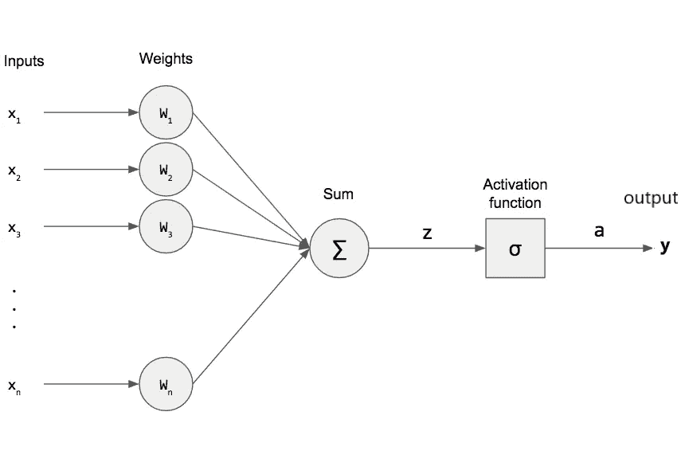
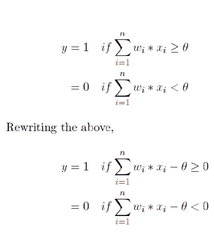
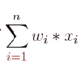
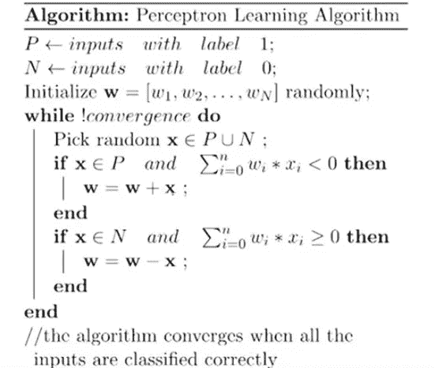

# 感知机学习算法

> 原文：<https://medium.com/analytics-vidhya/perceptron-learning-algorithm-7ae7c4b90eb2?source=collection_archive---------16----------------------->

在上一篇文章中，我们讨论了 M-P 神经元，让我们向前迈进一步。

如果你没有检查这是正确的时间来学习 M-P 神经元之前，你学习感知器。

[](/@siddharthshah2601/mcculloch-pitts-neuron-a-computational-model-of-biological-neuron-ce57239a951e) [## 生物神经元的计算模型——麦卡洛克-皮茨神经元

### 麦卡洛克(神经科学家)和皮茨(逻辑学家)提出了一个高度简化的神经元计算模型。

medium.com](/@siddharthshah2601/mcculloch-pitts-neuron-a-computational-model-of-biological-neuron-ce57239a951e) 

我们知道科学家每天都在发现新的东西。现在让我们来看看

## 感知器是什么鬼:

我们知道 M-P 神经元有局限性，所以为了克服 M-P 神经元的局限性，美国心理学家 Frank **Rosenblatt** 在 1958 年提出了经典的**感知器**模型，强大的*人工神经元*。

它是比麦卡洛克-皮茨神经元更一般化的计算模型，其中权重和阈值可以随着时间的推移而学习。



感知器模型

现在我们有个问题权重到底是什么，激活函数？


**是 Ruko·捷瑞·萨巴·卡罗！！LOL**

稍后我们回到这个定义。

现在我们知道这比 **M-P 神经元**更好，我们可以在模型图像中看到权重被乘以特征，激活函数被添加。因此输入不再是布尔值。

现在让我们看看感知器模型方程:



阅读标题:感知器学习算法

现在你又多了一个疑问，学习算法意味着什么。


让我们来做班多巴斯特:😁😁😂😂

让我们举一个故事，如果你是大学生，那么这种事情每次都发生在你身上，如果不是大学生，那么就拿灵感来说😜😜

假设你在标准 12 年级。董事会。压力很大。日程很紧。

假设你有月考。在第一个月，你学习很好，虽然你得到了不理想的结果。那你现在做什么？😐😐你改变了你的学习计划。但是怎么做呢？？

如果你的数学分数低，那么你可以增加数学的学习时间，更加专注于这个科目。所以基本上这意味着你更加重视数学。**所以在深度学习单词中，我们可以说你给了这个输入更多的权重。**

下个月你又要考试了，但是这次你在物理科目上得到了不理想的结果，所以你再次改变了你的学习计划。你这样做了多少次？直到你得到想要的输出。对！！！

所以这叫学习算法。

我用简单的故事告诉你，让我们来看看定义:

## 学习算法:它是一种自适应方法，通过改变超参数(权重、偏差等)来自安排网络..)以获得期望/要求的输出。校正步骤的迭代被连续执行，直到网络产生所需/期望的输出。

让我们进入印度 Bhau 模因的意思是定义部分:😂😂

在此之前，你会明白权重在任何深度学习网络中的重要性。

## 那么让我们来看看什么是权重:

因为简单的术语权重什么都不是，但是给出更多的功率输入以获得所需的/期望的输出。

在我的上一篇文章中，我举了一个我是否看板球比赛的例子。我们收集了很多信息，比如:

*   ***x1***可能是 *isWorldCup*
*   ***x_2*** 可能是 *isItADoOrDieGame*
*   ***x_3*** 可能是*is indiadisplayingor not***等等…**

**所以对于不同的人，产出对他们来说会不一样。意味着世界上的每个人对每个输入都不给予同等的重视。**

**让我们看一个例子:**我到底该不该看世界杯比赛？****

**对于一个 10 年板球迷男孩来说，世界杯是他成熟以来第一次理解什么是板球，板球的规则是什么等等..因为这是他第一次参加世界杯，所以他很好奇，他想看世界杯的每一场比赛。所以在这里一个 10 岁的男孩给了世界杯比赛更多的权重。所以他肯定看过世界杯比赛。**

**和他的祖父相反。他一生中看了许多场世界杯比赛。所以他不像他孙子那样好奇。所以他不太重视世界杯比赛。所以他更有可能看不到世界杯比赛。**

**根据这个例子，我们可以看到，在深度学习中，权重对于决定输出是非常有用和重要的。**

## **现在时间理解偏差:**

**偏差允许分类器从原始位置向右、向左、向上或向下移动决策边界。**

**偏差允许更高的质量和更快的模型训练。**

## **加权求和:**

**加权和只不过是对应于权重值的每个特征或输入值的乘积之和。**

****

## **激活功能:**

**激活函数用于创建非线性神经网络。有许多激活功能，如****Tanh、Relu、LeakyRelu*** 等..这些函数可以将神经网络的值改为 0 或 1。***

***所以我想你现在对每个术语都很熟悉了。让我们看看***

## ***感知器学习算法；***

***我们在下图中描述了这种算法:***

******

***这里有两个类 ***P*** 和 ***N*** ，其中 ***P*** 是所有输入都标记为 ***1*** 和 ***N*** 的类。***

***我们必须对输入进行分类，不管它是来自 ***P*** 类还是 ***N*** 类。***

***所以我们的目标是找到 ***w_1，w_2，w_3，…，w_n*** 表示向量 ***w*** 能够完美地将输入分类到 ***P*** 或 ***N*** 类。***

***所以我们先随机初始化 ***w*** 。然后我们迭代例子，直到我们得到完美的矢量 ***w*** 。所以我们随机选取一个输入 x，做 ***x_i*** 和对应的 ***w_i*** 的点积，检查:***

***如果 ***x*** 来自正类并且点积为负，那么我们通过 ***w = w +x*** 来更新向量***【w】***并且***

***如果 ***x*** 来自负类并且点积为正，那么我们通过 ***w = w -x*** 来更新矢量 ***w*** 。除了这种情况，我们什么都不做，因为我们得到了想要的输出。***

## ***让我们编码这个感知器模型:***

***这里我提到了我的 github 链接，在那里我用 python 从头开始编写了 basic perceptron:***

***[](https://github.com/Sid2601/perceptron-learning/blob/master/perceptron.py) [## sid 2601/感知器学习

### 我用 python-sid 2601/perceptron-learning 编写了基本的感知器学习程序

github.com](https://github.com/Sid2601/perceptron-learning/blob/master/perceptron.py) 

这是 test.py 文件，我们在这里测试数据。

[](https://github.com/Sid2601/perceptron-learning/blob/master/test.py) [## sid 2601/感知器学习

### 我用 python-sid 2601/perceptron-learning 编写了基本的感知器学习程序

github.com](https://github.com/Sid2601/perceptron-learning/blob/master/test.py) 

从这两个文件中，我写出了关于阈值和学习率对权重和偏差影响的结论:

[](https://github.com/Sid2601/perceptron-learning/blob/master/output.txt) [## sid 2601/感知器学习

### 我用 python-sid 2601/perceptron-learning 编写了基本的感知器学习程序

github.com](https://github.com/Sid2601/perceptron-learning/blob/master/output.txt) 

您可以在任何地方获得这些代码，因此，让我们使用 Keras 在真实数据集上进行尝试:


我使用了这个数据集:

[](https://www.kaggle.com/uciml/pima-indians-diabetes-database) [## 皮马印第安人糖尿病数据库

### 基于诊断方法预测糖尿病的发病

www.kaggle.com](https://www.kaggle.com/uciml/pima-indians-diabetes-database) 

首先，我们加载依赖项或库:

```
**from** **keras.models** **import** Sequential
**from** **keras.layers** **import** Dense
**from** **keras.activations** **import** sigmoid
**import** **numpy** **as** **np**
```

这里我们从 keras 导入 sigmoid 激活函数。这里我们使用 numpy 来读取 csv 文件。

然后我们加载数据集:

```
*# Load data*
dataset = np.loadtxt('./pima_dataset.csv', delimiter=',')
```

现在我们分离数据集来训练和测试数据:

```
*# Separate train and test data*
X = dataset[:, 0:8]
Y = dataset[:, 8]
```

现在我们制作顺序模型:

```
*# Create the Perceptron*
model = Sequential()
model.add(Dense(1, input_shape=(8,), activation=sigmoid, kernel_initializer='random_normal'))
```

这里我们制作单层模型。在该模型中，我们给出输入形状(8)的数据，在该模型中，我们使用 sigmoid 激活，并且我们使用 random_normal 初始化器来初始化内核。

现在我们编译模型:

```
#compile the model
model.compile(loss='binary_crossentropy', optimizer='adam', metrics=['accuracy'])
```

我们使用 Adam 优化器和二元交叉熵损失函数来编译模型。

现在我们训练我们的感知机模型:

```
*# Train the Perceptron*
model.fit(X, Y, epochs=225, batch_size=25, verbose=1, validation_split=0.2)
```

我们在 225 个时期上训练我们的模型，这里时期意味着迭代。

我们使用 batch_size=25，因此我们的模型训练速度更快，精度更高。

**Keras** 可以将你的一部分训练数据分离成一个**验证**数据集，并在每个时期在那个**验证**数据集上评估你的模型的性能。所以这里我们用 validation_split =0.2。

这里我提到了过去 5 个时期的产量:

```
Epoch 220/225
614/614 [==============================] - 0s 49us/step - loss: 0.5598 - accuracy: 0.7231 - val_loss: 0.5863 - val_accuracy: 0.6623
Epoch 221/225
614/614 [==============================] - 0s 50us/step - loss: 0.5627 - accuracy: 0.7410 - val_loss: 0.5600 - val_accuracy: 0.7143
Epoch 222/225
614/614 [==============================] - 0s 54us/step - loss: 0.5606 - accuracy: 0.7362 - val_loss: 0.5792 - val_accuracy: 0.6688
Epoch 223/225
614/614 [==============================] - 0s 49us/step - loss: 0.5776 - accuracy: 0.7264 - val_loss: 0.6302 - val_accuracy: 0.6558
Epoch 224/225
614/614 [==============================] - 0s 49us/step - loss: 0.5620 - accuracy: 0.7378 - val_loss: 0.5858 - val_accuracy: 0.6753
Epoch 225/225
614/614 [==============================] - 0s 47us/step - loss: 0.5576 - accuracy: 0.7280 - val_loss: 0.5618 - val_accuracy: 0.7143
```

让我们看看完整的代码:

```
#Load Libraries**from** **keras.models** **import** Sequential
**from** **keras.layers** **import** Dense
**from** **keras.activations** **import** sigmoid
**import** **numpy** **as** **np**
**import** **pandas** **as** **pd**

*# Load data*
dataset = np.loadtxt('./pima_dataset.csv', delimiter=',')

*# Separate train and test data*
X = dataset[:, 0:8]
Y = dataset[:, 8]

*# Create the Perceptron*
model = Sequential()
model.add(Dense(1, input_shape=(8,), activation=sigmoid, kernel_initializer='random_normal'))
model.compile(loss='binary_crossentropy', optimizer='adam', metrics=['accuracy'])

*# Train the Perceptron*
model.fit(X, Y, epochs=225, batch_size=25, verbose=1, validation_split=0.2)
```

现在轮到您在机器上运行这段代码，更改一些变量并检查输出。

这里我简单解释一下感知器学习算法。

如果你喜欢它，请分享并鼓掌。

如果您想联系我，您可以通过以下方式联系我:

Github:

[](https://github.com/Sid2601) [## Sid2601 -概述

### 在 GitHub 上注册你自己的个人资料，这是托管代码、管理项目和构建软件的最佳地方…

github.com](https://github.com/Sid2601) 

推特:

[https://twitter.com/Siddhar05782569](https://twitter.com/Siddhar05782569)

LinkedIn:

[](https://www.linkedin.com/in/siddharth-shah-622aa2182/) [## 印度古吉拉特邦艾哈迈达巴德工程学院西达尔特·沙阿博士| LinkedIn

### 在世界上最大的职业社区 LinkedIn 上查看西达尔特·沙阿的个人资料。西达尔特有一份工作列在…

www.linkedin.com](https://www.linkedin.com/in/siddharth-shah-622aa2182/)***