# @感知器模型——人工神经网络简介

> 原文：<https://medium.com/analytics-vidhya/perceptron-model-a-brief-insight-into-artificial-neural-networks-9a6a668381d3?source=collection_archive---------31----------------------->

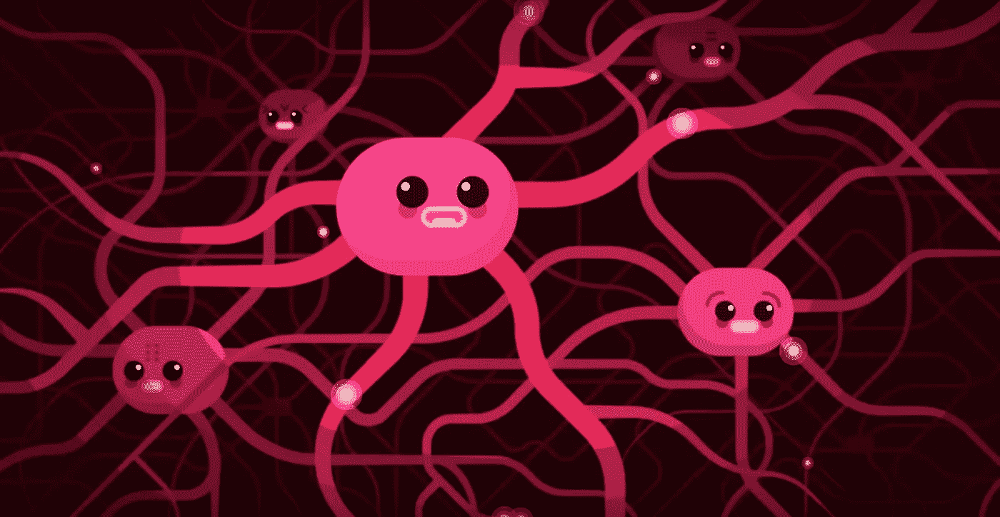

艾伦·图灵曾经说过 ***“只有机器才能打败机器”*** 大概是他在建造世界上第一台图灵机(顺便说一下是计算机)来解密纳粹之谜的时候想到的，从那一天起我们都知道发生了什么计算机进化了，进化到我们现在拥有的样子。但现在出现的问题是，计算机能在我们天生擅长的方面打败人类吗？例如，当我们看到一个人或一个物体时，我们可以立即认出它，或者在阅读一本书或听别人说话时，我们可以立即意识到它的上下文，如果有人问我们，我们可以总结它。这个问题的答案是否定的，在我们擅长的某些任务上，计算机无法超越人类，但在我们擅长的事情上，它们几乎无法与我们匹敌。要让他们做到这一点，一种方法是我们需要了解我们的大脑是如何工作的，并试图在某种程度上将其模拟到计算机中。

**生物神经元:**

图片来源:[Kurzgesagt-一言以蔽之](https://www.youtube.com/channel/UCsXVk37bltHxD1rDPwtNM8Q)

人脑是由神经细胞组成的，也称为神经元。每个神经元基本上可以分为三个主要部分:树突，细胞体和轴突。最初，由于神经元中的某些电化学反应，在某一点产生电信号，然后该电脉冲在轴突处被接收，并通过使用细胞体被转发到树突。树突被突触覆盖，突触是与其他神经元的接触点，因此它们将信号转发给其他神经元。我们的大脑有数十亿个这样的神经元，它们可以完成大量的任务

(注:我不是神经科学家，所以这个解释可能不全面，也有点模糊，但对于人工神经网络的建模来说应该足够了)

**感知器模型:**

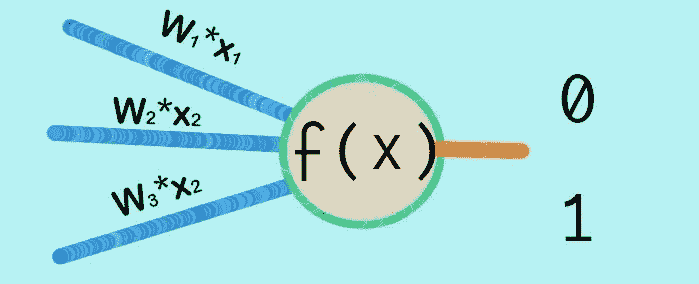

感知器模型

基于人类大脑的工作，我们可以尝试建立一个人工神经网络的数学模型，因此感知器模型应运而生，这是第一个模仿人类神经元的数学模型。

它的工作原理是，首先获取一些输入，将它们乘以称为权重的因子，然后计算所有输入的总和。现在，如果总和大于某个阈值，则总和输出 1，否则总和输出 0

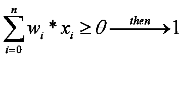

感知器函数案例 I

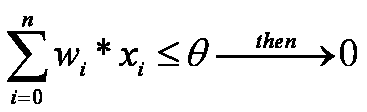

感知器功能案例二

*相反，它可以进一步简化为:*

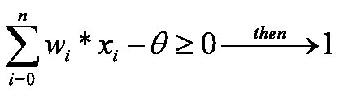

好了，现在我们将试着用 python 建模:

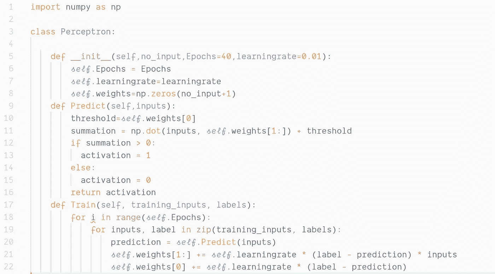

一个简单的感知机模型

你可能对代码中的某些部分感到困惑，比如什么是学习率？或者说什么是纪元？我之前没提到。但是别担心，我稍后会解释的。在上面的代码中，我们创建了一个名为感知器的类，它的初始化函数包含三个参数，其中两个参数已经有了预设值，一个参数是我们想要给模型的输入数。虽然学习率表示在每次迭代后应该调整权重的值，但是现在具有高的学习率值可以让我们的模型学习得更快，而具有小的学习率值可以使我们的模型更慢，但是大大增加了模型的准确性，为了更好地理解这一点，以桶和测量管为例， 现在你想装满水桶，所以一开始你会迅速增加水倒入水桶的速度，当水几乎满到边缘时，你会以同样的速度关闭水龙头，这在我们的例子中称为过程调整或更快的学习速度，现在如果你想装满化学实验室实验的测量管，你慢慢打开水龙头，慢慢精确地控制水流，直到 你可以在误差最小的情况下得到你想要的精确水量，这在我们的例子中称为微调或较慢的学习速度。 在桶的情况下，100 毫升左右的误差幅度对我们来说无关紧要，但在第二种情况下，即使是 1 毫升的误差幅度也非常重要。我们代码中的 Epochs 是我们应该循环和更新权重的次数。

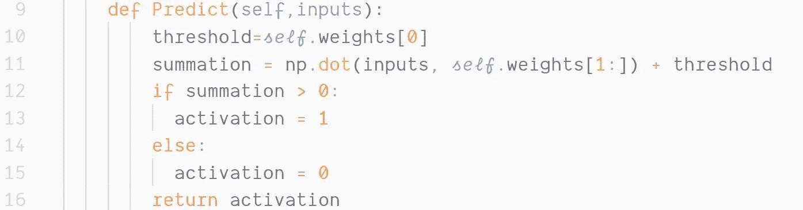

感知器函数

预测功能是我们的感知器模型实际完成权重和输入乘积求和的工作，然后通过与阈值比较返回最终输出，即 1 或 0，在这种情况下，阈值是权重矩阵中的第一个值

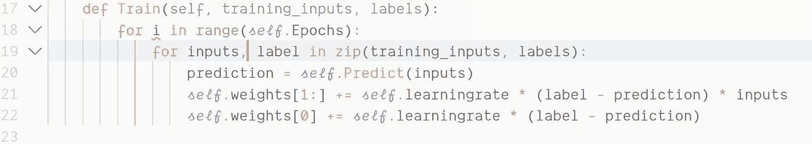

创建训练函数用于在每次迭代后更新权重，我们计算预测值和实际值之间的误差，并将其乘以学习率和输入，并将其添加到先前的权重。相应地，我们类似地更新偏差/阈值。

我们在上述案例中所做的基本上是:

**W-重量**

**L-学习率**

**y 标签/实际值**

**x 输入**

**f(x)-预测值**

**W=W + L(y-f(x))x**

**θ = W+ L(y-f(x))**

现在，让我们使用一些随机数据来训练模型:

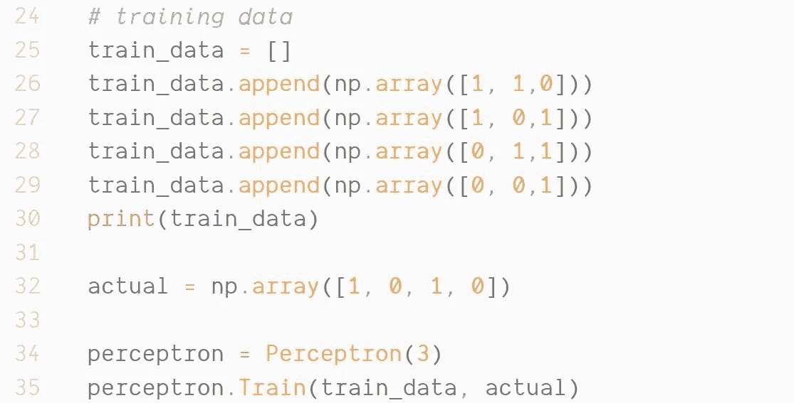

培训用数据

首先，我们创建了一个虚拟数据来训练我们的模型

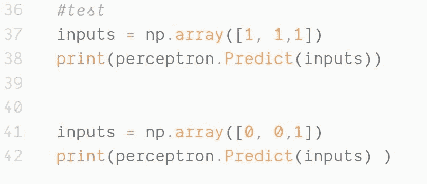

测试数据

然后，我们创建随机测试数据来测试我们的模型并预测输出

**输出:**

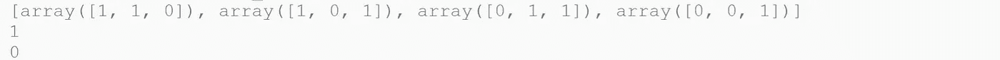

输出

最后我们得到了输入数组**【1，1，1】**和**【0，0，1】**的输出

现在，我们终于成功地模拟了单个数学神经元，但就像我们的大脑一样，它有数十亿个神经元来完成各种任务。神经元的现代数学模型已经发展到具有不同架构的多层网络(CNN、、、GAN 等)，以完成各种任务(如 NLP、图像识别、生成模型、预测)，并且还使用了各种其他激活函数，以及用于更新权重的不同优化技术。上述架构及其背后的数学原理不在本文的讨论范围内，我将在后续文章中讨论它们。这篇文章主要是为那些冒险进入深度学习领域并希望了解它是如何成为现在这样的人准备的。