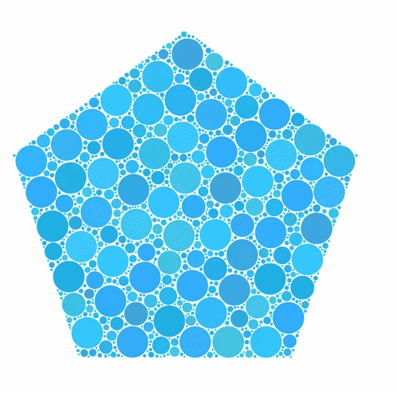
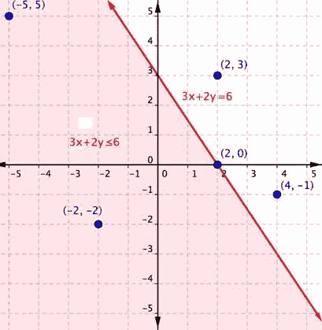
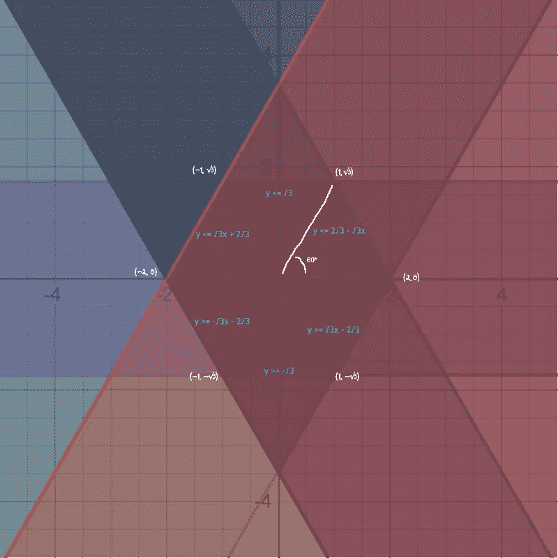
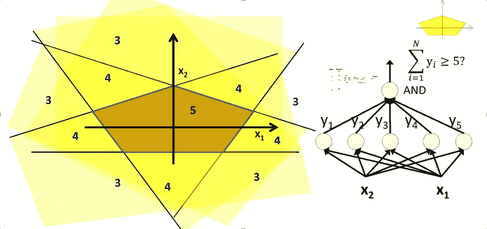
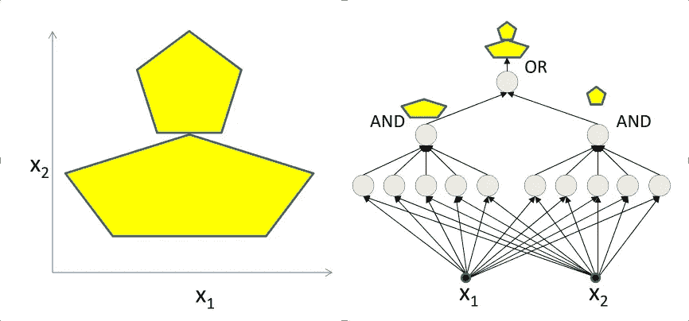
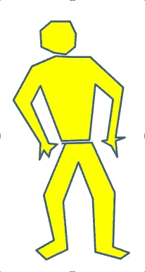

# 感知机感知

> 原文：<https://medium.com/analytics-vidhya/perceptron-perceiving-acdaed353c48?source=collection_archive---------10----------------------->

[来源](https://cdn3.vectorstock.com/i/1000x1000/69/82/filled-pentagon-mosaic-icon-circles-vector-27716982.jpg)

> 有无限条边的多边形是圆。任何多边形区域都可以表示为许多不同半径的圆的集合。确实是开始。

冬天！凉风伴暖毯，热饮伴乡村美乐，还有。假期！为了改变，我决定今年回美国度假。每个人都出去了，我有很多时间和自己在一起。的确是我喜欢的假期。但是在这两个圣诞假期里，我有了自己的全部时间。我是一个待办事项检查者，在长达一周的假期里，我有很多想做的事情。写作，音乐练习，学习，副业，书籍，烹饪，板球，健身等等。我制定了一个详细的计划，从 23 号开始检查这些项目。按照我的计划，头两天过得很好，但是圣诞节让我的假期更加愉快。我没有完成任何工作，经常被留下来思考我和两个高中生的互动，我是在洛杉矶我阿姨家遇到的。

核桃坚果奶酪蛋糕！我喜欢那句话里的每一个字。当我完全专注于在我阿姨家抢走所有蛋糕时，“哦，面向对象编程考试问题的解决方案是结合 3 个感知系统，并从它们的每个输出执行逻辑或”，高中埃莉向她的同学道格和我的表弟帕拉克解释说。当听到高中生谈论感知机时，我的眼睛亮了起来，下巴也掉了下来。是的，我每天都呼吸着科技行业对人工智能的大肆宣传，但我没有想到它已经达到了如此的深度——触及到了年轻的高中生。我高中的计算机作业只涉及基本的 C 程序，要么执行算术运算，要么显示花哨的星号图案。但那是 12 年前的事了。我意识到我当时所受的教育已经变得多么过时，并感谢每一个将我推上不断学习的道路以追求高等教育的人。我把蛋糕拿到孩子们的桌子前，和他们谈论假期的作业。我立刻得到了帕拉克的“你太老了，太无聊了”的表情，但我选择了过去的时刻。"艾莉，你在感知机实验中造了什么？"，我开始了。
在接下来的一个小时里，年轻的埃莉让我意识到，不仅仅是我学到的东西过时了，更重要的是，从现代的角度来看，我周围的学校所使用的过程和协议太过怪异和反直觉了。几乎无关紧要。可悲的事实是，十多年过去了，我在印度的表兄弟们仍在他们的 101 编程作业中构建帕斯卡的星号三角形。

感知器是神经元的数学表示。当输入信号的强度高于特定阈值时，它会触发。一种更简单的想象方式是——感知器就像一个代表一条线的函数。线右边的表示越过阈值，左边的表示弱输入信号不足以越过阈值。这条线充当分隔符。因为任何线都可以用斜率和截距来表示，所以感知器也可以用斜率和截距来表示。“对于任何给定的输入坐标，感知器功能会告诉我们坐标是在线的左边还是右边，也就是说，就神经元而言，它是否越过了阈值”，孩子们说道。

[来源](http://www.montereyinstitute.org/courses/DevelopmentalMath/COURSE_TEXT2_RESOURCE/U13_L2_T4_text_final.html)XY 平面上所有点的一条线作为分隔符的图示。可以使用线的斜率和截距来配置线的方向，因此任何线性分隔符都可以表示为一条线。

当然，这主要是教科书上的知识，你们大多数人可能已经知道了。但最突出的是，学生们被要求如何应用高中早期学习的坐标几何概念，编写一系列可插入的函数作为他们当前编程课程的一部分，以构建物理系统的数学表示，并最终理解未来概念的基本原理——分类器。

Ellie 继续向我展示她的感知系统如何扩展到 XY 平面上的任何区域。创建多个感知器函数(线)，每个都有不同的斜率和截距，我们可以创建封闭的凸多边形。从程序上讲，对于任何输入(x，y ),如果该点位于每个创建的感知器线的某一边，我们可以确定该点是在多边形内部还是外部。我只是对他们的理解和应用水平感到敬畏。

帕拉克的计算——六边形由它的 6 条边界线标识。对于每一条线，方程都是用交点推导出来的。每条线都被建模为一个分隔符来表示六边形内部的区域。这些条件以绿色和蓝色显示。

> “给定一个大小为 *i* 和形状为 n 的正多边形，实现一个感知器系统来*将一个给定点(x，y)分类为‘在多边形内’或‘在多边形外’”，这是他们的问题。*

他们获得了一个代码库，带有一个用于 line 的*接口*，带有一个*激活*功能，根据输入点(另一个类)相对于 Line 实例的方向来确定该点是正的还是负的。他们将*的界面线*化名为*感知器*。接口*抽象了*另一个名为*输出*的函数，该函数应该基于 activate()的输出返回 0/1。用抽象 *addPerceptron* 创建了一个更高级别的类系统，以将线对象添加到系统中，并且*评估*以返回分类的结果。类系统被别名为*模型*。这个框架是助教写的，分发给学生。Palak、Dough 和 Ellie 必须实现几个类和主函数。

作为提交一，他们被要求在一个 *MyPerceptron* 类中实现接口 Perceptron。他们添加了构造函数来设置斜率和截距。通过计算点和线的几何方向，对激活功能的逻辑进行编程。该类还支持动态初始化 activate 函数(作为参数的函数)作为 activate 函数。

> *符号(权重*点. x +偏差—点. y)*

提交前，导师让他们别名斜率为*权重*，截距为*偏差。*

提交二要求完成模型课程。他们使用一系列的接口线来保存组成感知器。他们实现了模型类中的*构造函数*、 *add_perceptron* 和 *evaluate* 函数，方法是聚合所有组成感知器的输出，并返回“中的*或“*出*”。*

他们被要求在 2 个单位长的正六边形上测试他们的模型。在主函数中，他们使用*构造函数*和适当的*权重*和*偏差，努力创建了感知机类的 6 个实例。*对于六个感知器中的每一个，它们将各自的*输出*功能初始化为*激活*的功能。他们实例化了一个模型类，并将六个感知器添加到他们的模型中，该模型现在可以用任何给定的 *(x，y)* 进行测试。随机生成的六边形内部、六边形上和六边形外部的坐标被扔向模型进行评估。

最终的提交要求他们编写一个实用函数来自动创建模型，这是他们之前在 *main 中编写的，即*用于任何给定的大小和形状。Ellie、Dough 和 Palak 有条不紊地将多边形的大小和形状转换成角度和距离，并以高中几何为基础。他们运用他们的三角学技能，然后推导出多边形的端点。从那里，很容易推断出每条线的斜率和截距。将几何和三角学转换成通用代码需要他们付出努力，但是他们的编程基础(之前学过的)足以支持他们。完成了效用函数，从 main 调用它以获得基于*“我”*和*“n”*的模型，并测试其准确性。毫不奇怪，他们得了满分。

[来源](http://deeplearning.cs.cmu.edu/document/slides/lec1.intro.pdf)从每条线导出的所有条件的逻辑与是五边形内部的区域。

我问他们如何根据一个点在三个不相连的六边形中的存在，将它归类为“在”或“在外”，就像考试题中一样。最初，他们将六边形的 18 条线中的每一条线都表示为感知器并聚合结果，但很快意识到所有感知器输出的逻辑与将包含不正确的区域，或者可能根本没有区域。他们发现这个问题可以针对每个六边形分别解决，然后使用一个独立的组合器实现三个输出的逻辑或来获得最终结果。为了进一步测试他们，我问他们如何扩展他们的赋值代码，以整合一个类似考试中的系统。虽然花了一些时间和精力，但是他们达成了一个相当不错的解决方案，创建了一个更高层次的类，封装了他们早期模型实例的有序集合，将一个模型实例的输出链接到下一个模型实例，从而产生最终的输出。我简直惊呆了。

[来源](http://deeplearning.cs.cmu.edu/document/slides/lec1.intro.pdf)对于两个封闭的凸多边形，我们像之前一样将它们建模为两个独立的问题，即各条线中所有条件的 AND。我们增加了一个逻辑“或”的条件来表示两个多边形中的任何一个。

更进一步说，这也是一种可能性

[来源](http://deeplearning.cs.cmu.edu/document/slides/lec1.intro.pdf)概念的外推

上面这种作业有很多外卖。

*   它更多的是自上而下，而不是自下而上。我做过的编程作业会让你实现一些基本的实现，比如字符串比较、模式绘制、奇特的数学技巧等等。但是重点应该是开发增量开发的技能，也就是说，考虑到正在构建的博客，你能扩展它，完成它们并连接它们来解决问题吗？他们不仅会更加欣赏这个框架(将来他们可能不得不自己构建)，而且通过亲眼看到它被应用，他们也会更好地理解它。作为一种介绍，自上而下的方法提供了一个更广阔的领域，并在学生中播种了更强的学习动机。
*   这项任务的第二个关键收获是联系主义。利用已知的概念(几何、三角学、编程)去学习新的东西(哎呀)，去构建我将来要学习的东西(分类器)有讲故事的内涵。它给我所学的东西增加了一种目标感，并且被更加认真地对待。当事物联系在一起时，人类有一种获得满足感的倾向，这个任务是对这一点的大胆证明。
*   任务的最后一个收获是我称之为隐喻——脚手架。通过将复杂的概念表现为作为隐喻的较简单的物理对象集合之间的相互作用来解释复杂概念的行为。从技术上向那个年龄的孩子解释“训练分类器”可能不那么容易，但将它转换为维数减少的坐标几何中的配置问题是一个坚实的隐喻。

我不仅对他们的适应能力印象深刻，而且觉得去他们的学校只是为了享受学习。如果这么直观地教，学习怎么会变得枯燥？永远不会。用你已经学过的知识为你将要学的东西播下种子的想法应该是教育系统的基础。这不仅巩固了更好的理解，还通过联系主义产生了创造力，这是未来十年最关键的技能。使用对有形的物理世界的类比/隐喻的脚手架，复杂的抽象概念应该被分解。正如罗伯特·格林指出的那样，

> “未来属于那些学习更多技能并以创造性的方式将这些技能与 T2 结合起来的人。”

在他们的系统中非常明显。我一直告诉自己，如果我被这样教导，我的兴趣可能会有所不同。学生的成长在很大程度上取决于老师和教学模式。一个好老师可以让你爱上一些相当无聊的东西，而一个坏老师甚至可以毁掉最有趣的概念。当然，这里有主观性的成分，但是学习要做对的需要体现了一种内在的客观真理。

> 学习是一门艺术，掌握这门艺术就能体现出最好的品质。