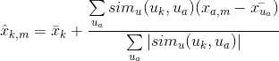
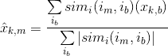

# 通过高级统计和代数计算完善推荐渠道

> 原文：<https://medium.com/analytics-vidhya/perfecting-recommendation-pipeline-with-advanced-statistical-and-algebraic-computations-8341a5398988?source=collection_archive---------9----------------------->

这篇文章是我上一篇[博客](/analytics-vidhya/start-recommending-anything-with-the-most-lucid-recommendation-pipeline-4d7f55b5fdc2)的延伸，我的上一篇博客通过最流行的 [MovieLens](http://files.grouplens.org/datasets/movielens/ml-100k-README.txt) 数据集的有前途的演示，描述了通用推荐系统的最清晰的管道。然而，它存在一些固有的谬误，因为它只考虑了相似性方面，而排除了在实际项目与推荐项目之间建立更准确的相关性时可能发挥重要作用的其他相关因素。不言而喻，下文的表述非常通用，可以毫不含糊地用来推荐电影、音乐、书籍、约会(约会应用程序)、医疗保健和其他值得推荐的产品或服务。商业上使用的推荐系统无疑非常擅长挖掘数据语料库能够提供的所有潜在特征，并且这些特征过于优化。

怀着破译和辨别这种复杂而准确的推荐系统背后的技术症结的雄心，我努力提出一个更好的 pipeline 版本，它包含了影响结果的高级功能。

# **标准方法**

推荐系统通常依赖于更大的数据集，特别是需要在酷的东西出现之前以特定的方式组织起来。我已经确保捕捉到了使用 Python 和相同的电影镜头数据集创建推荐系统的完整过程。两种最常见的推荐系统是**基于内容的**和**协同过滤(CF)** 。

*   ***协同过滤*** 基于用户对项目态度的知识产生推荐，即利用*群体智慧*来推荐项目。
*   ***基于内容的推荐系统*** 系统关注项目的属性，根据它们之间的相似性给我们推荐。

# 协同过滤

一般来说，协同过滤(CF)比基于内容的系统更常用，因为它通常提供更好的结果，并且相对容易理解(从整体实现的角度来看)。该算法具有自行进行特征学习的能力，这意味着它可以开始自行学习使用什么特征。

CF 可以进一步分为**基于内存的协同过滤**和**基于模型的协同过滤**。

在本教程中，我们将通过使用奇异值分解(SVD)实现基于模型的 CF，并通过计算余弦相似度实现基于内存的 CF。

# 数据

我们将使用著名的 [MovieLens](http://files.grouplens.org/datasets/movielens/ml-100k.zip) 数据集，这是实现和测试推荐引擎时最常用的数据集之一。它包含来自 943 个用户的 100k 电影评级和 1682 部电影的精选。

我们可以在这里下载数据集[或者只是简单地使用已经包含在我的](http://files.grouplens.org/datasets/movielens/ml-100k.zip) [github](https://github.com/Shashank545/Recommendation-System-ML-) 源代码中的 *u.data 文件*。

# 我们开始吧

1.  导入标准库和数据概述。

2.合并两个数据帧。

3.列车测试分离。

# 基于记忆的协同过滤

基于记忆的协同过滤方法可以分为两个主要部分:**用户-项目过滤**和**项目-项目过滤**。

一个*用户项目过滤*将采用一个特定的用户，基于评级的相似性找到与该用户相似的用户，并推荐那些相似用户喜欢的项目。

相比之下， *item-item filtering* 会取一个项目，找到喜欢那个项目的用户，并找到那些用户或类似用户也喜欢的其他项目。它接受项目并输出其他项目作为推荐。

*   *单品协同过滤*:“喜欢这个单品的用户也喜欢……”
*   *用户-项目协同过滤*:“和你相似的用户也喜欢……”

在这两种情况下，我们都创建了一个从整个数据集构建的用户-项目矩阵。由于我们已经将数据分为测试和训练，我们将需要创建两个`[943 x 1682]`矩阵(所有电影的所有用户)。培训矩阵包含 75%的评级，测试矩阵包含 25%的评级。在我们建立了用户-项目矩阵之后，我们计算相似性并创建相似性矩阵。

在*项目-项目协同过滤*中，项目之间的相似度值是通过观察对两个项目都进行了评价的所有用户来测量的。

对于*用户-项目协同过滤*来说，用户之间的相似性值是通过观察由两个用户评价的所有项目来测量的。

推荐系统中通常使用的距离度量是*余弦相似度*，其中评级被视为`n`维空间中的向量，相似度是基于这些向量之间的角度计算的。用户的余弦相似性 *a*和*m* 可以使用下面的公式计算。

为了计算项目 *m*和*b* 之间的相似性，我们使用以下公式:

## 代数计算

我们的第一步将是创建用户-项目矩阵。因为我们有测试和训练数据，我们需要创建两个矩阵。

## 预言

下一步是做预测。我们已经创建了相似性矩阵:`user_similarity`和`item_similarity`，因此我们可以通过应用以下基于用户的 CF 公式来进行预测:

我们可以将用户 *k*和*a* 之间的相似性视为乘以相似用户 *a* 的评级的权重(针对该用户的平均评级进行了校正)。我们需要对其进行标准化，使评分保持在 1 到 5 之间，最后一步，对我们试图预测的用户的平均评分进行求和。

这里的想法是，一些用户可能总是倾向于给所有电影或高或低的评级。这些用户给出的评分的相对差异比绝对值更重要。举个例子:假设，用户 *k*给自己喜欢的电影打 4 星，给所有其他好电影打 3 星。假设现在另一个用户*t* 给他/她喜欢的电影打了 5 颗星，他/她睡着看的电影打了 3 颗星。这两个用户可能有非常相似的品味，但是对待分级系统的方式不同。

当对基于项目的 CF 进行预测时，我们不需要校正用户的平均评级，因为查询用户本身用于进行预测。

## 估价

有许多评估指标，但用于评估预测评级准确性的最常用指标之一是*均方根误差(RMSE)* 。

我们可以使用来自`sklearn`的 [mean_square_error](http://scikit-learn.org/stable/modules/generated/sklearn.metrics.mean_squared_error.html) (MSE)函数，其中 RMSE 就是 MSE 的平方根。要了解更多关于不同评估指标的信息，我们可以看一下[这篇文章](http://research.microsoft.com/pubs/115396/EvaluationMetrics.TR.pdf)。

因为我们只想考虑测试数据集中的预测评级，所以我们用`prediction[ground_truth.nonzero()]`过滤掉预测矩阵中的所有其他元素。

基于记忆的算法易于实现并产生合理的预测质量。基于内存的 CF 的缺点是，它不能扩展到现实世界的场景，也不能解决众所周知的冷启动问题，即当新用户或新项目进入系统时。基于模型的 CF 方法是可扩展的，并且可以处理比基于记忆的模型更高的稀疏水平，但是当没有任何评级的新用户或项目进入系统时也会受到影响。我要感谢 Ethan Rosenthal 关于基于记忆的协同过滤的[帖子](http://blog.ethanrosenthal.com/2015/11/02/intro-to-collaborative-filtering/)。

# 基于模型的协同过滤

基于模型的协同过滤是基于**矩阵分解(MF)** 的，它已经得到了较大的曝光，主要作为一种无监督的学习方法进行潜变量分解和降维。矩阵分解被广泛用于推荐系统，它比基于记忆的 CF 更好地处理可伸缩性和稀疏性。MF 的目标是从已知的评级中学习用户的潜在偏好和项目的潜在属性(学习描述评级特征的特征),然后通过用户和项目的潜在特征的点积来预测未知的评级。当我们有一个非常稀疏的矩阵，有许多维度时，通过进行矩阵分解，我们可以将用户项矩阵重构为低秩结构，并且我们可以通过两个低秩矩阵的乘法来表示该矩阵，其中行包含潜在向量。我们通过将低秩矩阵相乘来使该矩阵尽可能接近我们的原始矩阵，这填充了原始矩阵中缺失的条目。

让我们计算 MovieLens 数据集的稀疏度:

为了给出用户和项目的学习到的潜在偏好的例子:假设对于 MovieLens 数据集，我们有以下信息:*(用户 id、年龄、位置、性别、电影 id、导演、演员、语言、年份、评级)*。通过应用矩阵分解，模型了解到重要的用户特征是*年龄组(10 岁以下、10-18 岁、18-30 岁、30-90 岁)*、*位置*和*性别*，并且对于电影特征，它了解到*年代*、*导演*和*演员*最重要。现在，如果我们查看我们存储的信息，没有像*十年*这样的特征，但模型可以自行学习。重要的方面是 CF 模型只使用数据(user_id，movie_id，rating)来学习潜在特征。如果几乎没有数据可用，基于模型的 CF 模型将预测不佳，因为学习潜在特征将更加困难。

同时使用评级和内容特征的模型被称为混合推荐系统，其中结合了协同过滤和基于内容的模型。混合推荐系统通常比协同过滤或基于内容的模型本身显示出更高的准确性:它们能够更好地解决冷启动问题，因为如果我们没有用户或项目的任何评级，我们可以使用来自用户或项目的元数据来进行预测。

## 德拉贡诺夫狙击步枪（Snayperskaya Vinyovka Dragunov 的缩写）

一个众所周知的矩阵分解方法是**奇异值分解**。协同过滤可以通过使用奇异值分解来近似矩阵`X`来公式化。Netflix 奖竞赛的获胜团队使用 SVD 矩阵分解模型来产生产品推荐，有关更多信息，我推荐阅读文章:[网飞推荐:超越 5 颗星](http://techblog.netflix.com/2012/04/netflix-recommendations-beyond-5-stars.html)和 [Netflix 奖和 SVD](http://buzzard.ups.edu/courses/2014spring/420projects/math420-UPS-spring-2014-gower-netflix-SVD.pdf) 。通用等式可以表示如下:

给定`m x n`矩阵`X`:

*   `*U*`是一个`*(m x r)*`正交矩阵
*   `*S*`是对角线上有非负实数的`*(r x r)*`对角矩阵
*   *V^T* 是一个`*(r x n)*`正交矩阵

`S`中对角线上的元素称为 `*X*`的*奇异值。*

矩阵`*X*`可以分解为`*U*`、`*S*`和`*V*`。`*U*`矩阵表示隐藏特征空间中用户对应的特征向量，`*V*`矩阵表示隐藏特征空间中项目对应的特征向量。

现在我们可以通过取`*U*`、`*S*`和`*V^T*`的点积进行预测。

仅仅粗心地处理相对较少的已知条目很容易过度拟合。SVD 可能非常慢并且计算量很大。最近的工作通过应用交替最小二乘或随机梯度下降来最小化平方误差，并使用正则化项来防止过拟合。CF 的交替最小二乘法和随机梯度下降法将在以后的教程中介绍。

# 回顾

*   我们已经介绍了如何实现简单的**协同过滤**方法，包括基于内存的 CF 和基于模型的 CF。
*   **基于记忆的模型**基于项目或用户之间的相似性，这里我们使用余弦相似度。
*   **基于模型的 CF** 基于矩阵分解，我们使用奇异值分解来分解矩阵。
*   构建在冷启动场景(新用户和项目的可用数据很少)中表现良好的推荐系统仍然是一个挑战。标准的协同过滤方法在这样的设置下表现不佳。

# 想要更多吗？

如果你想处理你自己的推荐系统分析，看看这些数据集。

注意:在大多数情况下，文件都很大，不是所有的链接都可以保存数据，但是大多数链接仍然可以工作。或者谷歌一下你自己的数据集！

**电影推荐:**

电影推荐数据集[http://www.grouplens.org/node/73](http://www.grouplens.org/node/73)

雅虎！—电影、音乐和图像分级数据集[http://webscope.sandbox.yahoo.com/catalog.php?datatype=r](http://webscope.sandbox.yahoo.com/catalog.php?datatype=r)

Jester —电影收视率数据集(协同过滤数据集)[http://www.ieor.berkeley.edu/~goldberg/jester-data/](http://www.ieor.berkeley.edu/~goldberg/jester-data/)

康乃尔大学——用于情感分析实验的电影评论数据[http://www.cs.cornell.edu/people/pabo/movie-review-data/](http://www.cs.cornell.edu/people/pabo/movie-review-data/)

**音乐推荐:**

Last.fm —音乐推荐数据集[http://www . dtic . UPF . edu/~ ocelma/MusicRecommendationDataset/index . html](http://www.dtic.upf.edu/~ocelma/MusicRecommendationDataset/index.html)

雅虎！—电影、音乐和图像分级数据集[http://webscope.sandbox.yahoo.com/catalog.php?datatype=r](http://webscope.sandbox.yahoo.com/catalog.php?datatype=r)

Audioscrobbler —音乐推荐数据集[http://www-etud . iro . umontreal . ca/~ bergstrj/audioscrobbler _ Data . html](http://www-etud.iro.umontreal.ca/~bergstrj/audioscrobbler_data.html)

亚马逊—音频 CD 推荐【http://131.193.40.52/data/ 

**书籍推荐:**

弗赖堡大学信息研究所—图书评级数据集[http://www.informatik.uni-freiburg.de/~cziegler/BX/](http://www.informatik.uni-freiburg.de/~cziegler/BX/)

**美食推荐:**

芝加哥主菜—食物评级数据集[http://archive . ics . UCI . edu/ml/datasets/Entree+芝加哥+推荐+数据](http://archive.ics.uci.edu/ml/datasets/Entree+Chicago+Recommendation+Data)

**医疗保健推荐:**

疗养院-提供者评级数据集[http://Data . medicare . gov/dataset/疗养院-比较-提供者-评级/mufm-vy8d](http://data.medicare.gov/dataset/Nursing-Home-Compare-Provider-Ratings/mufm-vy8d)

医院评级-患者医院体验调查[http://data . medicare . gov/dataset/Survey-of-Patients-Hospital-Experiences-HCA HPS-/rj76-22dk](http://data.medicare.gov/dataset/Survey-of-Patients-Hospital-Experiences-HCAHPS-/rj76-22dk)

**约会推荐:**

[www.libimseti.cz](http://www.libimseti.cz/) —交友网站推荐(协同过滤)[http://www.occamslab.com/petricek/data/](http://www.occamslab.com/petricek/data/)

**学术论文推荐:**

新加坡国立大学—学术论文推荐[http://www.comp.nus.edu.sg/~sugiyama/SchPaperRecData.html](http://www.comp.nus.edu.sg/~sugiyama/SchPaperRecData.html)

# 结论

这是统计学和代数的综合表达，通常是大规模完善推荐系统的基础。我真诚地希望，狂热的爱好者和从业者会发现它足够有趣，以警告来回报这些指示。在模拟项目时，不要忘记在评论区分享你有趣的观察或经验结果。这真的有助于扩大每个人的知识视野。