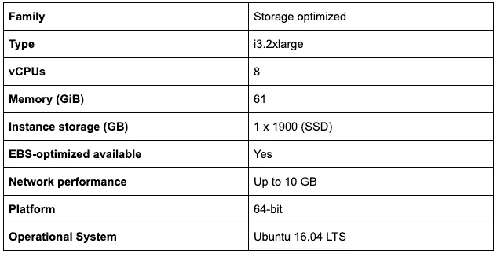
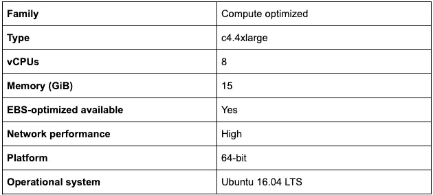
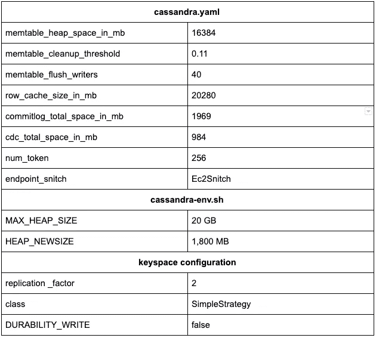
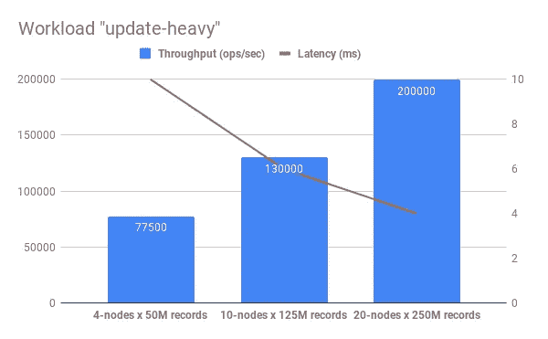
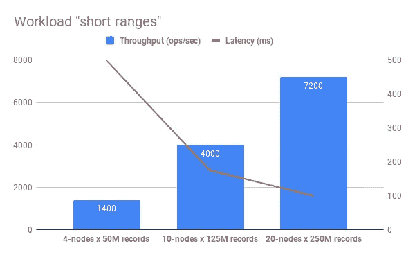

# DataStax Enterprise v6 的性能基准(Cassandra)

> 原文：<https://medium.com/analytics-vidhya/performance-benchmark-of-datastax-enterprise-v6-cassandra-f77439c7e922?source=collection_archive---------9----------------------->

## 该报告旨在从延迟和吞吐量两个方面衡量[DataStax Enterprise V6(Cassandra)](https://www.datastax.com/)在两种工作负载下的性能。

## 介绍

该报告的目标是测量[DataStax Enterprise V6(Cassandra)](https://www.datastax.com/)在延迟和吞吐量方面的性能。Cassandra 由三种类型的集群配置部署。有 4 个、10 个和 20 个节点。使用两种工作负载类型进行评估。

第一个工作量是“*更新繁重的*工作量。该工作负载通过使用 [Zipfian](https://en.wikipedia.org/wiki/Zipf%27s_law) 作为请求分布来评估 50%的读取请求和 50%的写入请求。

第二个工作负载是“*短程*”。这种工作负载的想法是调用 95%的扫描和 5%的更新。请求分布是相同的— [Zipfian](https://en.wikipedia.org/wiki/Zipf%27s_law) 。

作为处理基准性能的工具，Yahoo！云服务基准测试(YCSB) 。YCSB 是一个评估数据库在不同工作负载下的基准性能的框架。

数据大小是 1 KB 记录(10 个字段，每个字段 100 字节，加上关键字)。记录的数量是根据聚类的大小选择的。4 节点群集上 5，000 万条，10 节点群集上 1 亿条，20 节点群集上 2.5 亿条记录。

## 环境

AWS 上以下类型的 EC2 实例被选择用于部署 Cassandra 集群:

YCSB 客户端由 AWS 部署在计算优化的实例上:

## 集群配置

DataStax Enterprise (Cassandra)是一个宽列商店 NoSQL 数据库管理系统，旨在处理许多商用服务器上的大量数据，提供无单点故障的高可用性。

下表显示了应用于 Cassandra 配置的更改:

## 工作量“更新-繁重”

此工作负载包括 50%的读取操作和 50%的更新操作。作为一个请求分配使用 Zipfian。此工作负载的查询如下所示:

> *从 id = $1 LIMIT 1* 的表格中选择*

在基准评估之前，Cassandra 集群的缓存已经预热。命中率接近 65%。预热集群是性能基准测试的一个好方法，这样可以使集群更接近真实的生产行为。

工作量“更新-繁重”

Cassandra 为 4 节点群集处理了约 77，500 次操作/秒，10 节点群集达到约 130，000 次操作/秒，20 节点群集达到 200，000 次操作/秒。延迟看起来真的很好。对于 4 节点群集— 10 毫秒，10 节点群集— 6 毫秒，20 节点群集— 4 毫秒

## 工作负荷"*短程*

此工作负载包括 95%的读取操作和 5%的更新操作。作为一个请求分配使用 Zipfian。此工作负载的查询如下所示:

> *从令牌(id) ≥令牌(1 美元)限额的表格中选择 id&2*

YCSB 中的这个工作负载是通过使用令牌操作来实现的。使用 Murmur3Partitioner 作为划分器的类型。然而，Murmur3Partitioner 会计算一个密钥哈希，这可能会导致扫描操作的意外结果。不幸的是，Cassandra 不支持这种类型的分区键排序。

“短程”工作负荷

Cassandra 上的扫描操作工作负载显示了以下性能结果:4 节点集群上 500 毫秒的 1，400 操作/秒，10 节点集群上 175 毫秒的 4，000 操作/秒，20 节点集群上 100 毫秒的 7，200 操作/秒。

## 摘要

Cassandra 对所选的工作负载表现出了良好的性能。所有集群的性能几乎都实现了线性增长。这表明该行为在当前工作负载下是稳定的和可预期的。应该注意的是，Cassandra 没有达到 700 个客户端线程的最大吞吐量，但是吞吐量在不断增长，延迟保持相对较低。