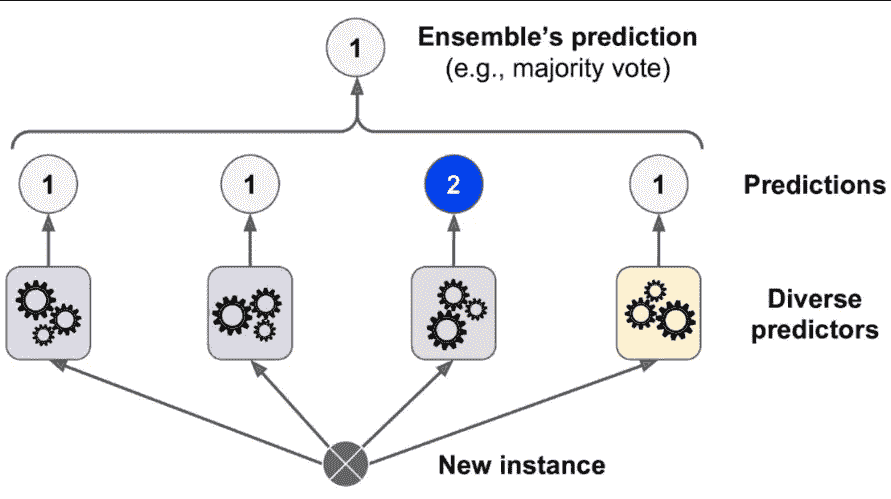
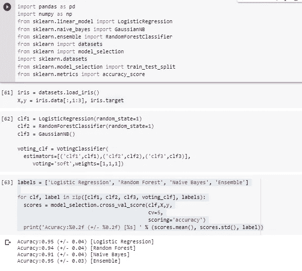

# 使用投票分类器提升模型性能

> 原文：<https://medium.com/analytics-vidhya/performance-boosting-with-voting-classifier-ea69313a367c?source=collection_archive---------15----------------------->

## 一种提高模式性能的简单集成方法。

[来源](https://stats.stackexchange.com/questions/349540/hard-voting-soft-voting-in-ensemble-based-methods)

# 背景:

集成方法通常用于通过组合多个机器学习模型的预测来提高预测准确性。传统的方法是将所谓的“弱”学习者结合起来。然而，最新的方法是创建一个精选的强大而多样的模型集合。

# 投票分类器:

投票是聚合/组合来自不同机器学习算法的预测的最简单方式。投票分类器不是实际的分类器，但它使用多数投票(硬投票)或平均预测概率(软投票)来预测类别标签。这种分类器可以用于一组同样良好执行模型，以便平衡它们各自的弱点。投票分类器的完整细节可在[这里](https://scikit-learn.org/stable/modules/ensemble.html#voting-classifier)获得。

在投票分类器中，我们可以使用两种投票选项。

## 硬投票(多数/大众投票):

在硬投票中，我们从所有模型中获取预测类别标签，获得最高票数的类别将被选为预测类别。这是多数表决的一个最简单的例子。

让我们以 3 个二元分类器为例来预测类别 0 或 1。

分类器 1-预测类别 1

分类器 2-预测类别 0

分类器 3-预测类别 0

预测类(Y^)= **模式** {1，0，0}=0

由于三个分类器中的两个预测为‘0’，类**‘0’**将是最终的集成决策。

## 软投票:

在软投票中，我们基于每个分类器的预测概率 p 来预测类别标签。让我们假设来自先前分类器的概率如下。

分类器 1- [0.9，0.1]

分类器 2- [0.8，0.2]

分类器 3- [0.4，0.6]

我们计算每一类的平均概率。

p(0)=(0.9+0.8+0.4)/3=0.7

p(1)=(0.1+0.2+0.6)/3=0.3

因为类 0 的概率是最高的，为 0.7，所以基于软投票，我们的最终类将是“0”。软投票给出了更好的准确性，因为它考虑了来自模型输出的每个类别的实际概率。

下面的示例代码展示了如何通过使用 VotingClassifier 来提高分类精度。你可以在 G [ithub repo 中找到代码。](https://github.com/Msanjayds/MachcineLearning/blob/master/Voting_Classifier.ipynb)

# 结论:

从上面我们可以看到，使用投票分类器，我们可以获得最好的准确性。实际上，软投票的输出精度更高，因为它是所有估计器组合的平均概率。

感谢您阅读这篇快速帖子，如果您有任何建议/反馈，请发表评论。