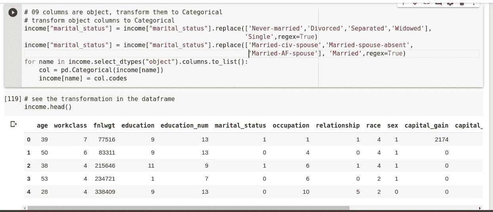
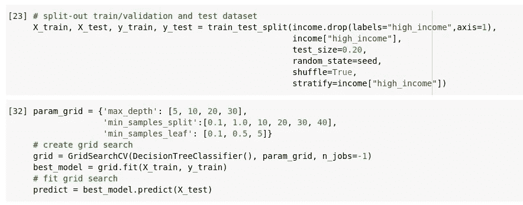
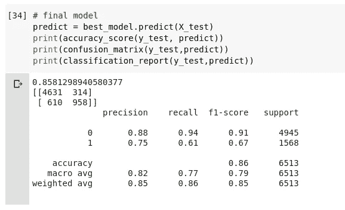

# 通过管道提高模型的性能

> 原文：<https://medium.com/analytics-vidhya/performance-improvement-of-a-model-through-pipelines-eb4b0560104?source=collection_archive---------23----------------------->

图 1

# 问题动机

我解决的问题动机是与[成人收入普查数据集](http://archive.ics.uci.edu/ml/datasets/Adult)相关的收入预测问题。目标是准确预测某人的年收入是高于还是低于 50，000 美元。我的目标是在添加一些步骤以获得更好的性能之前，改进我已经完成的机器学习工作流，同时保持决策树模型的使用。

# 管道描述

首先，我们用熊猫加载数据集。由于数据集没有丢失值，这是我们不必担心的一件事。首先要做的一件重要事情是 EDA(探索性数据分析)，这样我们可以更好地理解数据集，并查看哪些特征与目标变量具有最大的相关性。

之后，我们必须清理、准备和操作数据。我选择了开始做*特色工程*。键入` *dataset.info()* `，我们可以看到有 *int64* 和 *object* 列。我对待这个物体特征的方式是:

1.  检查这些特征中的哪些可以变成二进制列(如只能变成 *Single* 或*已婚*的“婚姻状况”)，因为仅仅通过为列的每个变量分配不同的值来将这种分类特征转换成 *int* 会使分类变得不可靠，因为分类器认为类别具有自然的顺序；
2.  做 pd。Categorical()将一些对象特性转换为 int，包括二进制对象特性(在本例中，以一种更好的方式，只转换为 0 和 1)。

图 2

此时，我们必须进行建模，换句话说，将数据分为训练/验证和测试。如果我们的目标不是用同一个模型(决策树)得到更好的结果，我们也可以做交叉验证来选择最佳模型。现在，我们使用网格搜索根据模型选择最佳超参数，最后，完成模型，对其进行预测并查看结果。

# 模型定制和超参数

因为我只想使用决策树模型，所以我用决策树模型中的一些超参数创建了一个字典。该字典曾被用作网格搜索参数的 *param_grid* 。根据网格搜索的结果，我可以发现最佳的超参数是:'*最大深度* ': 10，'*最小样本叶* ': 5 和'*最小样本分割* ': 40 *。*

图 3

# 结果

达到的精度正好是 0.8581298940580377，比之前好一点，也就是小于 0.82。

图 4

# 结论

在这之前提到的变化，我用的是 pd。分类()到*所有的*非整型特征，所以我把分类特征转换成*整型*，只是通过给每个变量分配不同的值，这并不好(除了生成二进制特征，一次热编码是一个好的解决方案)。因此，特征工程是一个很难的步骤，选择好做什么是至关重要的。除此之外，进行模型定制和测试最佳的超参数确实可以改进模型。结论是，尽管仍有几个改进模型的可能性，例如*特征选择*，但添加上述步骤非常重要，确实提高了模型的效率。

**结束。**