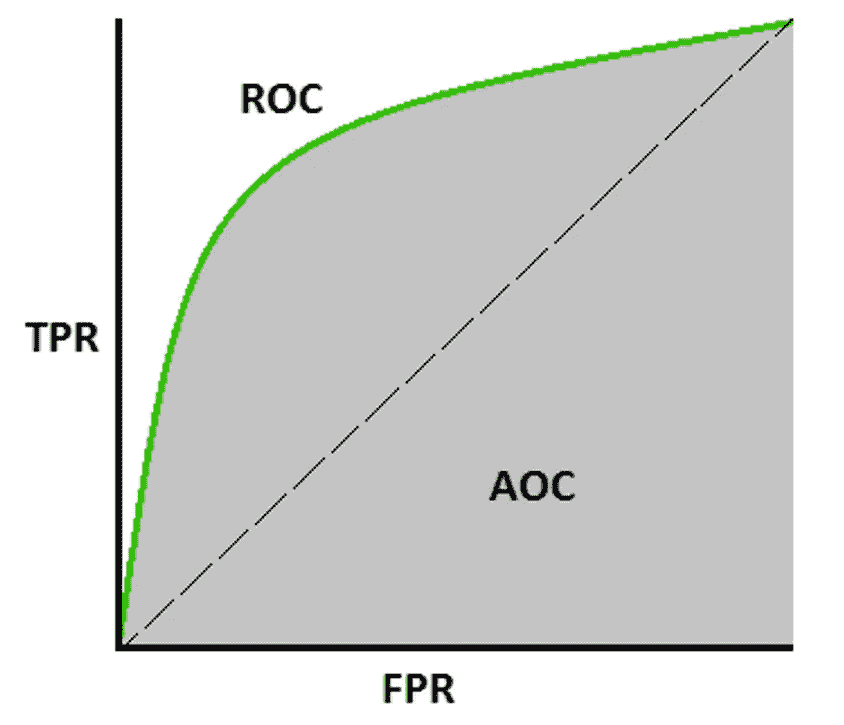

# 性能度量:分类模型

> 原文：<https://medium.com/analytics-vidhya/performance-metrics-classification-model-69a5546b118c?source=collection_archive---------3----------------------->

—机器学习中分类模型的 5 个广泛使用的评估指标。

来源:谷歌图片

T 今天我们将讨论分类模型中最广泛使用的 5 个评估指标，但在深入讨论细节之前，让我们先回答几个问题:

## **我们为什么需要评估指标？**

作为人类，我们想知道我们遇到的任何机器或软件的效率或性能，例如，如果我们考虑一辆汽车，我们想知道里程，或者如果我们有某种算法，我们想知道时间和空间的复杂性，类似地，我们也必须有某种方法来衡量我们的机器学习模型的效率或性能。

也就是说，让我们看看我们的分类模型的一些指标，回归和分类模型有单独的指标，因为回归为我们提供连续值作为输出，而分类为我们提供离散值作为输出，我们将重点关注分类指标。

## 让我们深入研究一下:

# **1。准确度:**

对于任何模型来说，最常用和最广泛使用的度量标准是准确性，它基本上做到了它所说的，计算出我们的模型的预测准确性。配方如下所示:

正如我们所见，它基本上告诉我们，在所有的点中，有多少是正确预测的。

## 优势:

> 1.易于使用的公制。
> 
> 2.易于理解和联系。
> 
> 3.如果数据点是平衡的，则给出模型的适当有效性。
> 
> 4.可用于比较两个模型，因为它给出了一个度量值。

## 缺点:

> 1.不建议用于不平衡的数据，因为结果可能会误导，让我给你一个例子，假设我们有 100 个数据点，其中 95 个点是负的，5 个点是正的，如果我有一个哑模型，它只预测负的结果，那么在训练结束时，我将有一个模型，它只预测负的，但根据上述公式仍然有 95%的准确性。因此不建议用于不平衡数据。
> 
> 2.我们不明白我们的模型哪里出错了。
> 
> 3.不会考虑错误的预测。
> 
> 4.不考虑概率得分。
> 
> 5.不像混淆矩阵那样容易理解。

# **2。混乱矩阵:**

顾名思义，这是一个 2x2 矩阵，实际和预测分别为行和列。

它决定了正确和不正确预测的数量，我们在准确性方法中没有考虑不正确的预测，我们只考虑正确的预测，所以混淆矩阵有助于我们理解这两个方面。

让我们看一下图表，以便更好地理解它:

**这些符号是什么意思？**

假设我有一个二元分类问题，将类分为正和负两个标签，现在，如果我的实际点是正的，而我的模型预测点也是正的，那么我会得到一个真的正，这里“真”意味着分类正确，“正”是模型预测的类，类似地，如果我的实际类是负的，而我预测的是正的，即预测不正确，那么我会得到假的正，“假”意味着预测不正确，“正”是模型预测的类。

我们总是希望对角线元素具有高值。因为它们是正确的预测，即 TP & TN。

## 优势:

> 1.它指定了一个混淆了哪些类标签的模型。
> 
> 2.你会得到模型产生的错误类型，尤其是第一类或第二类
> 
> 3.比准确性更好，因为它也显示了不正确的预测，您可以深入了解模型产生的错误，并纠正不正确的地方。

## 缺点:

> 1.不太适合多类。
> 
> 2.没有给出类别概率。
> 
> 3.检查模特的服装或内衣是很困难的，因为我们没有单一的值。
> 
> 4.不能用来比较两个模型，因为它没有给出一个单一的指标。

# **3。精度，召回:**

**精度**是表示在所有预测的正类中，有多少实际上是正的度量，公式如下:

**回忆**是表示在所有正类中有多少实际上被正确预测的度量，公式如下:

我们经常追求高精度和高召回率。如果两者都很高，意味着我们的模型是合理的。在这里，我们也考虑了不正确的点，因此我们知道我们的模型在哪里出错，少数民族也考虑在内。

## **优点:**

> 1.它告诉我们这个模型的效率
> 
> 2.也向我们展示了有多少 or 数据偏向一个类。
> 
> 3.帮助我们了解我们的模型在非平衡数据集中对于少数类是否表现良好。

## 缺点:

> 1.召回处理真阳性和假阴性，精确处理真阳性和假阳性。它不处理混淆矩阵的所有单元。真正的负面永远不会被考虑。
> 
> 2.因此，精确度和召回率应该只用于否定类别的正确识别不起作用的情况。
> 
> 3.只关注正面的阶级。
> 
> 4.最适合二进制分类。

5.模型不能在两个分数的基础上进行比较，因为它不是一个指标。

# **4。F1 —分数:**

F1 得分是精确度和召回率的调和平均值，其中 F1 得分在 1 时达到其最佳值(完美的精确度和召回率)。F1 分数也称为索伦森-骰子系数或骰子相似系数(DSC)。

它利用了精确和召回的优点。理想模型的精度和召回率为 1，因此 F1 值也为 1。

**优点:**

> 1.可用于比较模型，因为这是一个单一指标。
> 
> 2.调和平均值往往更接近较低的值，因此，如果模型具有任何较低的精度或召回值，最终 F1 将因此而降低。

**缺点**:

> 1.它与精确度和召回率是一样的。

# **5。AU-ROC :**

AU-ROC 是受试者工作曲线下的面积，是显示模型性能的图表，所有值都被视为阈值。

由于 AUROC 是一个图，它有自己的 X 轴和 Y 轴，而 X 轴是 FPR，Y 轴是 TPR

TPR =真阳性/(真阳性+假阴性)

FPR =假阳性/(假阳性+真阴性)

ROC 曲线基本上是在不同分类阈值下计算的 TPR 对 FPR。降低分类阈值将更多的项目分类为阳性，从而增加假阳性和真阳性，即基本正确的预测。

所有的值都被排序并绘制在图表中，roc 曲线下的面积是模型在不同阈值下的实际性能。

来源:谷歌图片

## 优势:

> 1.测试诊断准确性的简单图形表示:曲线的顶点越靠近左上角，测试的区分能力越强。
> 
> 2.此外，允许更复杂(和更准确)的测试准确性的措施，这是 AUC。
> 
> 3.AUC 反过来可以用作诊断测试准确性的简单数字评级，这简化了诊断测试之间的比较。

## 缺点:

> 1.实际的决策阈值通常不会显示在图中。
> 
> 2.随着样本量的减少，图变得更加参差不齐。
> 
> 3.从商业角度来看不容易解释。

**以上就是分类模型的一些广泛使用的性能指标。**

> **感谢阅读！**
> 
> 如果你想了解更多类似的话题或者看看我还能提供什么，一定要访问我的网站:[所有关于东西](https://digital.allaboutstuffs.com/)
> 
> 准备好让你的学习更上一层楼了吗？查看我提供的课程:[课程](https://digital.allaboutstuffs.com/courses/)
> 
> 生活工作压力大？花一点时间来放松和放松我的舒缓和放松的视频！现在就去我的频道，用"[灵魂镇定剂](https://www.youtube.com/c/TheSoulTranquilizer)"开始你的内心平和与宁静之旅