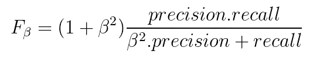

# 分类问题的性能度量。

> 原文：<https://medium.com/analytics-vidhya/performance-metrics-for-classification-problem-74935775cdca?source=collection_archive---------16----------------------->

性能度量是了解模型在测试数据或验证数据上表现如何的方法。

有几种度量标准，但并不是每一种都可以在任何地方使用。因此，即使我们已经创建了一个非常好的模型，但是如果我们没有使用合适的度量标准，这将完全是一种浪费。

分类问题陈述可以通过两种方式解决

**情况 1)-使用类别标签**:这里属于任何类别的阈值固定为 0.5，在这种情况下使用的度量是**准确度、精确度、召回率、F-beta**

**案例 2)-使用概率**:这里我们明确地必须找到属于任何类别的阈值，然后我们将预测类别标签。在这种情况下使用的指标是 **ROC -AUC 曲线、PR 曲线**。

首先，我们将浏览**案例 1** 中涉及的指标。

假设我们有二进制分类问题，涉及 1000 个记录，两个类别的比例(几乎)相等，比如 50:50 的比例，60:40 的比例。这种平衡数据集中使用的度量类型是准确性。

如果我们采用 80:20 的比例或 90:10 的比例，一些机器学习算法会偏向于主导类。在这里，我们不应该使用准确性，而是应该使用精确度、召回率和 F -beta 指标。

## **混淆矩阵**

混淆矩阵

***真阳性(TP):*** 分类器正确标记的阳性元组。

***真阴性(TN):*** 是指被正确分类的阴性元组。

***假阳性(FP):I*** t 指被错误分类的阴性元组。

***假阴性(FN):*** 是指被错误分类的阳性元组。

## 准确(性)

它是正确分类的元组的百分比。

> 我们的主要目标应该是减少假阳性和假阴性。

每当我们的数据集不平衡时，我们应该使用召回率、精确度和 F-beta。

## 回忆

它指的是*在所有实际正值中，我们正确分类了多少*。它也被称为*灵敏度或 TPR。*

> 每当我们想强调假阴性时，我们应该使用回忆。

## 精确

它是指*在所有预测的阳性元组总数中，有多少实际上是阳性的。*

> 每当我们想要重视假阳性，我们应该使用精度。

> 准确度、精确度和召回率的满分是 1 分。

## f-β

当*假阳性和假阴性都重要*时，这时候我们就要考虑 F-beta。

f-β

当假阳性和假阴性同等重要时，我们使用β= 1，那么 F-β称为 **F-1 分数**。

当假阳性比假阴性更重要时，我们将β降低到 0 到 1 之间。

当假阴性比假阳性更重要时，我们将β值增加到大于 1。

## **案例二**中涉及的指标

**ROC -AUC 曲线**

这条曲线主要用于二元分类问题。这是在不同阈值下的性能测量。它告诉我们模型在多大程度上能够区分不同的类别。

ROC 代表接收机工作曲线

AUC 代表曲线下面积

这条曲线绘制在 TPR 和 FPR 之间，其中 TPR 在 y 轴上，FPR 在 x 轴上。

> ROC 曲线下面积越高，模型越好

ROC 曲线

一个好的模型的面积应该总是大于红线给出的面积。它不应该小于 0.5。当我们远离这条红线时，模型就越好。

## 精确回忆曲线

它很像 ROC-AUC 曲线，而不是使用 TPR 和 FPR，它分别在 y 轴和 x 轴上使用精度和召回率。

关键区别是 ROC-AUC 曲线用于平衡数据集，PR 曲线用于不平衡数据集。

阈值为 0.1 和 0.9 时的 P-R 曲线

如果你觉得这篇文章内容丰富且直观，别忘了鼓掌。

快乐学习。