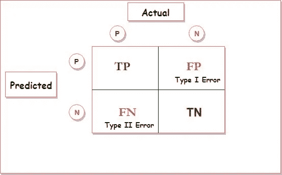
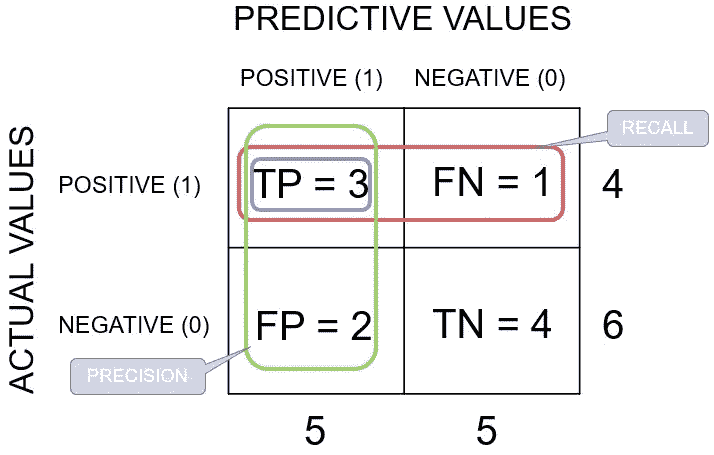
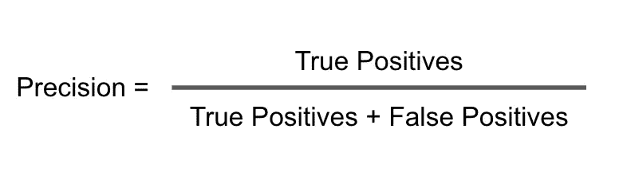
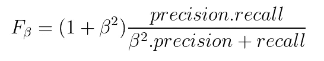
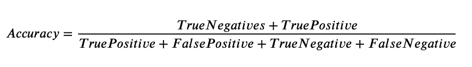

# 最大似然法中分类问题的性能度量

> 原文：<https://medium.com/analytics-vidhya/performance-metrics-for-classification-problems-in-ml-a49748dedaa2?source=collection_archive---------34----------------------->

> **大家好，**

在这篇博客中，我们将讨论机器学习中分类问题的性能指标，顾名思义，性能指标是衡量机器学习模型性能的一些指标&这些指标也对我们改进模型有很大帮助。

**我们将讨论的一些性能指标有:**

1.  混淆矩阵

*   FPR(第一类错误)
*   第二类误差

2.召回(不平衡数据集的首选)

3.精度(不平衡数据集的首选)

4.fβ(不平衡数据集的首选)

5.精确度(平衡数据集的首选)

***那么，我们走吧***

1.  **混淆矩阵**

混淆矩阵将我们的分类机器学习模型的结果区分为 4 个类别，这 4 个类别为我们提供了模型表现如何的大量信息，并告诉我们需要改进的领域。

混淆矩阵图 1

**如图 1 所示，混淆矩阵由 4 个部分组成:**

*   **TP(真正值):**实际为正值且被正确预测为正值的值
*   **FP(假阳性):**实际为阴性但被错误预测为阳性的数值；也称为 I 型错误
*   **FN(假阴性):**实际为阳性但被错误预测为阴性的数值；也称为第二类错误
*   **TN(真负值):**实际上为负值且被正确预测为负值的值

2.**召回(适用于不平衡数据集)**

回忆告诉我们，在总的实际阳性值中，我们正确预测了多少阳性值，这是 ***当 FN(假阴性)*** ***即第二类错误是主要关注点时，回忆是首选的性能指标*** 例如，当正在进行癌症测试时，假阴性会导致错误，因为如果患者是癌症阳性，但它被错误地预测为阴性，则患者不会接受治疗，这将使他面临风险

回忆也称为 TPR(真阳性率)或敏感度

回忆公式

3.**精度(不平衡数据集的首选)**

Precision 告诉我们，在所有预测的阳性结果中，有多少实际上是阳性的，这就是为什么当 FP(假阳性)即 I 类错误是主要关注点时，precision 是首选的性能指标 ，例如，在垃圾邮件分类器中，如果一封重要邮件被错误地预测为阳性，那么该邮件将保持未读状态，并且该人可能不会收到一些重要信息。

精确公式

4. **F Beta (F1 的分数就是由此得来的)**

当我们希望跟踪精确度和召回率时，β是首选的性能指标&只需改变β的值，我们就可以根据需要改变分数，一些例子是:

*   **如果精确度和召回率都很重要，β= 1**
*   **如果精度比召回更重要，β= 0.5**
*   **如果召回比精确度更重要，β= 2**

5.**准确性(平衡数据集的首选)**

准确度是机器学习中最常用的性能度量， 但是，对于目标变量的两个类别的计数数量没有太大差异的平衡数据集，精确度是优选的。例如，对于变量 X，如果两个类别的计数都是 500 & 500 或者 400 & 600 或者甚至 300 & 700，也可以认为是平衡数据集，但是如果我们的计数是 100 & 900，那么数据集肯定是不平衡的，在这种情况下，我们的模型可能会有偏差，对不平衡的数据集使用精确度将是一个坏主意，因为即使在性能不佳后，精确度也会很高。

精确度公式