# 机器学习模型的性能度量

> 原文：<https://medium.com/analytics-vidhya/performance-metrics-for-machine-learning-models-48990018ebd6?source=collection_archive---------10----------------------->

图片:世界可持续发展工商理事会

众所周知，当我们创建机器学习模型来预测任何连续值(如房价、身高、体重等)时。)，或分类(基本上是两个或多个类是/否，1/0)或我们通过各种聚类算法找到相似性，我们还确定特定模型的性能，以确认它与训练数据或看不见的数据有多好。

有各种性能指标需要验证。我们将在这里讨论分类用例 w.r.t .二进制类的各种性能指标。

1.  混淆矩阵

2.准确(性)

3.精确

4.回忆也称为真阳性率(TPR)

5.假阳性率(FPR)

6.假阴性率

7.真实负利率(TNR)

8.f1-分数

9.AUC-ROC 曲线

10.对数损失或交叉熵

## **混淆矩阵:**

混淆矩阵用于检验分类模型的准确性。根据目标变量的类别数，它会给出 2*2(二进制类别)或 3*3(三个类别)的指标，诸如此类。

让我们在这里看到二进制类混淆矩阵。一些术语

**TP = >真阳性:**实际为阳性/是，预测为阳性/是时。

**TN** = >

**FN= >假阴性**:实际为阳性/是，预测为阴性/否

**FP= >假阳性**:实际为阴性/否，但预测为阳性/是

**假设检验:**

**零假设(Ho)** :市场要崩盘了。

**备选假设(Ha)** :市场不会崩盘。

**假阳性(FP)也称为 1 型错误=** 当假设为真时拒绝零假设。

**假阴性(FN)也称为 2 型错误=** 当假设为假时，不要拒绝零假设。

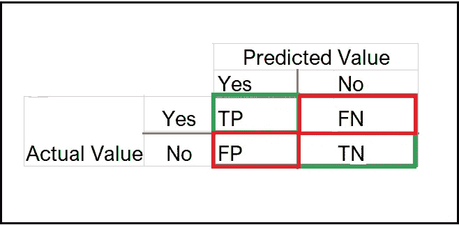

让我们用一个例子来理解。

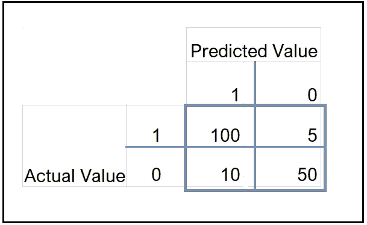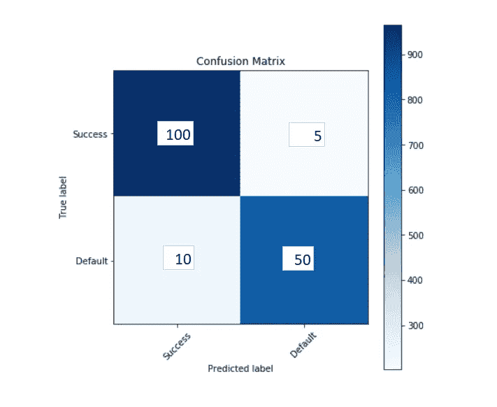

示例:混淆矩阵

# 精确度:

模型的准确性由所有正确分类的阳性和阴性记录除以记录总数来确定。

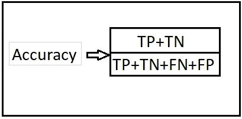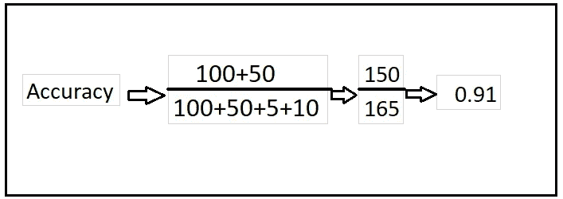

除了准确性，还有各种其他性能指标。看看下面。

# **精度:**

分类模型只返回相关实例的能力。所以基本上当它预测‘真’的时候，它实际上正确的频率是多少。

或者

在模型预测的总“真实”值中，实际“真实”结果的百分比是多少。

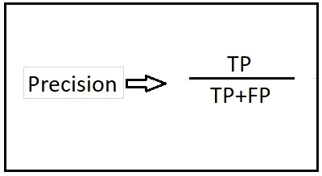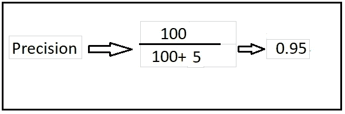

不产生假阳性(FP)的分类模型的精度为 1

# **回忆:**

分类模型识别所有相关实例的能力。所以当它实际上是‘真’的时候，有多少次被预测为‘真’。它也被称为**灵敏度或真阳性率(TPR)**

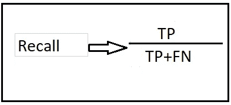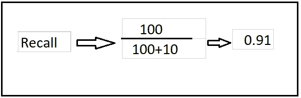

不产生假阴性(FN)的分类模型具有召回 as1。

## **假阳性率(FPR)** :

当它实际上是“否”时，它被预测为“是”的频率是多少

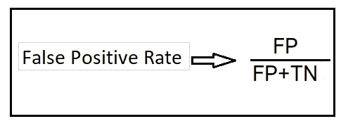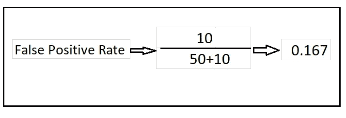

## **假阴性率**

假阴性率也叫“漏检率”。它显示了被错误分类为“假”的“真”结果的比例

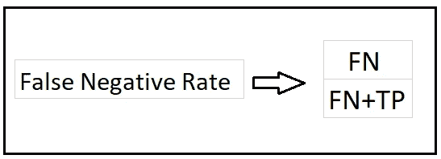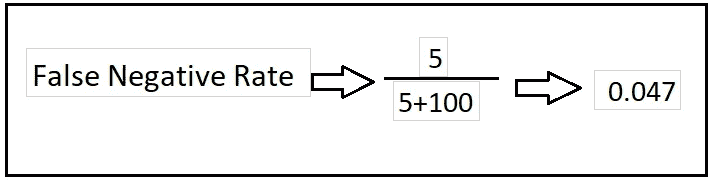

## 真实负利率(TNR):

当它实际上是“不”的时候，它多久预测一次“不”。它也被称为“特异性”

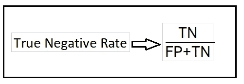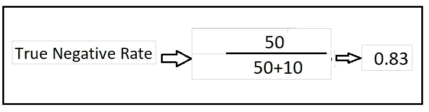

## **F1-得分:**

它是精确度和召回率的加权平均值，也称为精确度和召回率的调和平均值。

这是一个单一的分数，它在一个数字中平衡了对精确度和召回率的关注，并为检查机器学习模型的准确性提供了很好的度量标准。

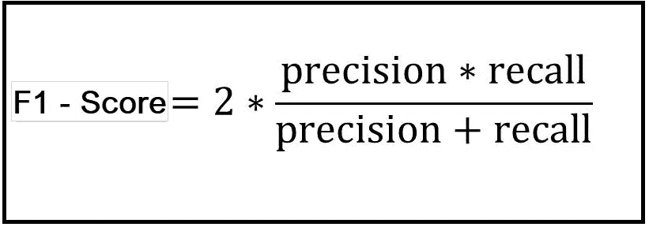

## **AUC-ROC 曲线:**

ROC 称为受试者工作特性曲线。它绘制了真阳性率与假阳性率的关系图，作为对阳性进行分类的模型阈值的函数。

> ROC 是概率曲线，AUC 代表可分性的程度或度量。**它告诉我们模型在多大程度上能够区分不同的类别**。AUC 越高，模型预测 0 为 0 和 1 为 1 的能力越强

AUC 称为曲线下面积。它是根据 ROC 曲线下的面积来计算分类模型的整体性能的指标。

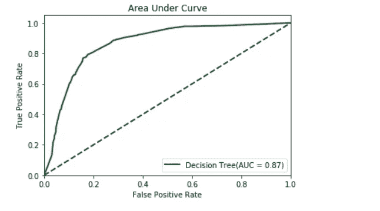

## **对数损失或交叉熵:**

对数损失，或简称为对数损失，是一种[损失函数](https://en.wikipedia.org/wiki/Loss_functions_for_classification)，常用作逻辑回归中分类问题的评估指标。

Log Loss 通过惩罚错误/错误分类来量化分类器模型的准确性。最小化日志损失基本上相当于最大化分类器的准确度。

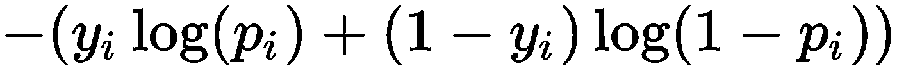

图片:Packt 订阅

这里

**易**:因变量(目标变量)，可以是 0，也可以是 1

**pi** :应用逻辑回归方程预测的概率结果。

# 多类分类的混淆矩阵

让我们为一个多类分类问题绘制一个混淆矩阵，我们必须预测一个人是喜欢脸书、Instagram 还是 LinkedIn。混淆矩阵是一个 3 x 3 的矩阵，如下所示:

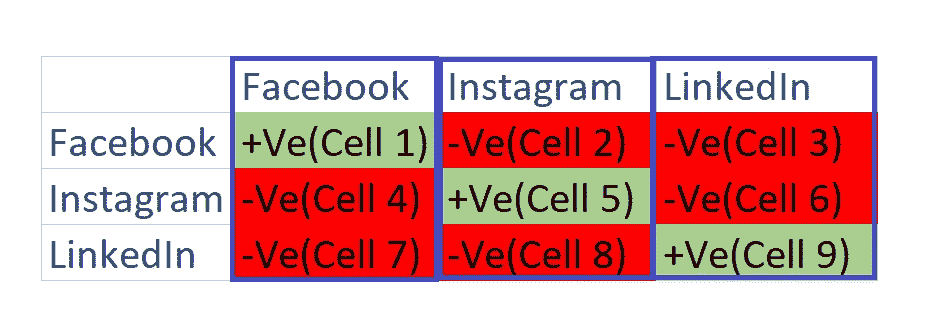

每个类别的真阳性(TP)、真阴性(TN)、假阳性(FP)和假阴性(FN)将通过添加像元值来计算，如下所示:

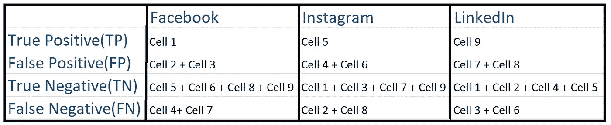

**结论**:这些是用于分类用例的一些度量。希望你喜欢我的文章。请鼓掌👏(多达 50 次)来激励我继续写下去。

想要连接:

联系方式:[https://www.linkedin.com/in/anjani-kumar-9b969a39/](https://www.linkedin.com/in/anjani-kumar-9b969a39/)

如果你喜欢我在 Medium 上的帖子，并希望我继续做这项工作，请考虑在 [**patreon**](https://www.patreon.com/anjanikumar) 上支持我