# 带有几何解释的分类度量

> 原文：<https://medium.com/analytics-vidhya/performance-metrics-in-classification-models-with-geometrical-explanation-619341dea62f?source=collection_archive---------18----------------------->

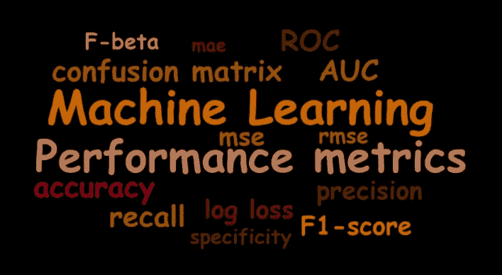

评估机器学习算法的指标是找出模型对给定数据集的有效性。我们有各种各样的指标可以用来评估机器学习算法的性能。我们必须仔细选择评估机器学习性能的指标，因为

1.  衡量和比较机器学习算法的性能将完全取决于您选择的衡量标准。
2.  结果中各种特征的重要性将完全受到您选择的度量标准的影响。

让我们深入了解各个指标，并理解一些几何图形。

# **混乱矩阵**

混淆矩阵是一个表格，通常用于描述一个分类模型(或“分类器”)对一组真实值已知的测试数据的性能。混淆矩阵本身相对容易理解，但相关术语可能会令人混淆。

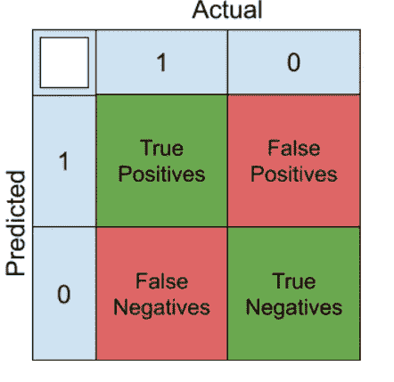

**真阳性(TP)** :这些是我们预测是的病例(他们有疾病)，他们确实有疾病。

*例如:一个人实际上患有癌症(1 ),而将他的病例归类为癌症(1)的模型为真阳性。*

**真阴性(TN)** :我们预测没有，他们没有这个病。

*例:一个人没有患癌症，而模型将他的病例归类为非癌症，这种情况属于真正的阴性。*

**假阳性(FP)** :我们预测是的，但他们实际上并没有患病。(也称为“第一类错误”)

*例:一个人没有患癌症，而模型将他的病例归类为癌症，这属于假阳性。*

**假阴性(FN)** :我们预测没有，但他们确实有疾病。(也称为“第二类错误”)

例:一个人得了癌症，而将他的病例归类为非癌症的模型却出现了假阴性。

**总是尽量减少假阳性&假阴性**。也叫 1 型&2 型错误(假设检验)。它表示预测输出与实际值完全相反。假阳性&假阴性的减少完全依赖于域。

例如:在公共区域(购物中心或市中心)的盗窃识别系统中，即使我们有更多关于小偷的假警报(假阴性)，最好检查这个人，这样准确的小偷就无法逃脱。

# **精度**

准确性可以定义为正确分类的实例与总体收集数据点的百分比。

如果数据几乎是平衡的，准确性表现得更好。

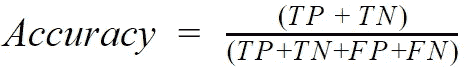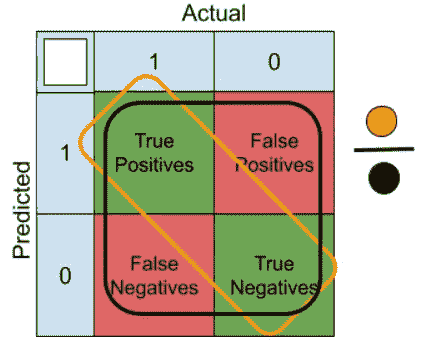

# **精度**

精度被定义为所有检索实例中相关实例的分数。完美的分类器的精度等于 1。

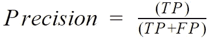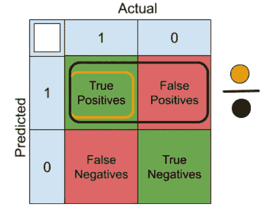

# **回忆**

回忆有时被称为“敏感度”，是在所有相关实例中检索到的实例的分数。完美的分类器的召回率等于 1。

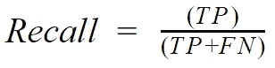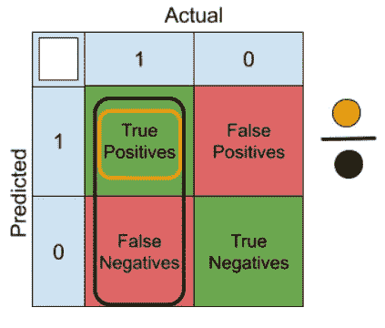

# **F1 比分**

F1 分数是根据测试数据的精确度和召回率计算的，其中精确度是正确识别的阳性结果的数量除以所有阳性结果的数量，包括那些没有正确识别的，召回率是正确识别的阳性结果的数量除以本应被识别为阳性的所有样本的数量。

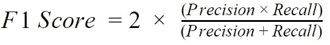

# **ROC(受试者工作特性曲线)**

**R**e**O**operating**C**特征曲线，或 ROC 曲线，是一个图解图，说明了二元分类器系统在其区分阈值变化时的诊断能力。这种方法是由一些电子工程师为军用雷达接收机的操作员开发的，这也是它如此命名的原因。

下面是 ROC 空间的一个示例。

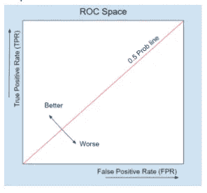

让我们考虑一个二元分类数据集的示例。模型基于被视为模型预测值的给定特征来预测概率得分。

**特征(x)** 是自变量。

**目标变量(y 实际)**是因变量

**目标变量(y 预测)**是一个模型预测变量(任何分类模型)

**第一步:**将预测值按顺序排序

在我们的例子中，预测值已经排序&我们可以直接进行下一步。

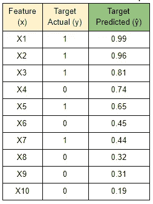

**步骤 2:** 阈值处理

将每个预测值视为一个阈值，并将其与整体预测得分进行比较，请参考下表。

让我们把 0.99 作为一个阈值&与其他预测进行比较。所以它提供了一个二元结果(1，0，0，0，0，0，0，0)，帮助我们得到目标变量。

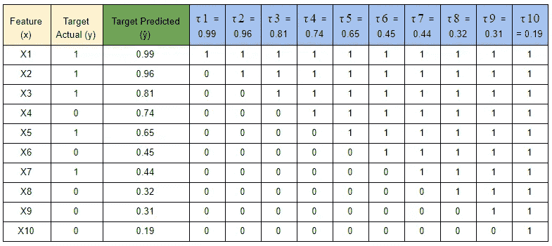

**第三步:**计算 FPR & TPR。

让我们看看 FPR & TPR 代表什么。

**假阳性率(FPR)** :假阳性率是根据归类为阳性的阴性点的比率(FP) &实际阴性点总数(FP+TN)计算的。

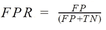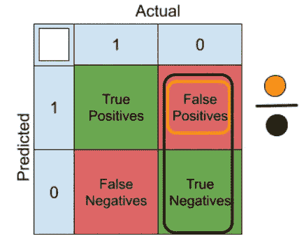

**真阳性率(TPR):** 真阳性率是根据归类为阳性的阳性点数(TP)的比率计算的&实际阳性点数的总数(TP+TN)。

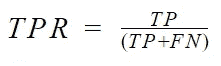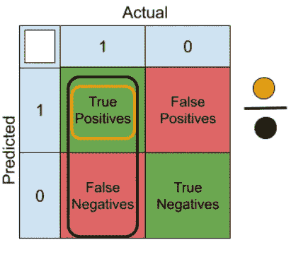

每个阈值将有一个单独的假阳性率&真阳性率。基于计算出的阈值，我们可以绘制 FPR 对 TPR 的曲线。下面是数据点的曲线图。

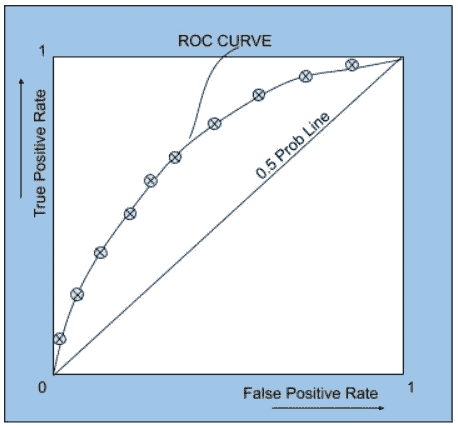

# **AUC(曲线下面积)**

AUC 主要用作用不同参数预测模型的排序术语。以下是 AUC 的简单表示。

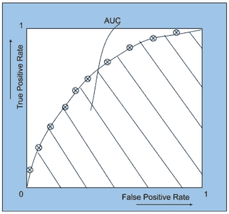

# **日志丢失:**

对数损失或交叉熵损失衡量分类模型的性能，其输出是介于 0 和 1 之间的概率值。除非所有其他模型的对数损失使用来自 ML 模型的精确预测点(0.98，0.6，0.42，0.16..等等)。

基于模型预测值和实际值，损失函数将被导出。快速参考的公式。

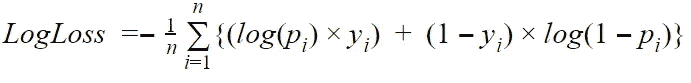

感谢阅读。

**看看我在**上的其他博客

*   [逻辑回归数学&几何直观举例](/@Shashi.Kiran.AI/logistic-regression-math-geometrical-intuition-with-example-8a0cb8860f8a)
*   [线性回归数学&几何直观](/analytics-vidhya/linear-regression-math-geometrical-intuition-bad9a73cdcaa)

您可以通过以下方式联系到我:

*   领英:[https://www.linkedin.com/in/shashikiranc/](https://www.linkedin.com/in/shashikiranc/)