# 监督学习的性能度量

> 原文：<https://medium.com/analytics-vidhya/performance-metrics-precision-recall-f1-score-efb51ac111bd?source=collection_archive---------1----------------------->

我热烈欢迎所有的读者。这是我第一个关于机器学习相关主题的博客。先说一般的事情。当你听到“机器学习”时，你会想到什么？不要用技术术语来定义什么是机器学习；概括来说，机器学习无非就是用一定的数据训练一台机器，让机器去学习和分析未来看不见的数据。

回到我们博客的主题“性能指标”。我们使用许多性能指标来检查模型的性能。假设我们参加了一个烹饪比赛，我们做的食物被评为 x 分，这里 x 表示我们可以根据它来分析我们做得有多好。

同样，在机器学习中，我们有性能指标来检查我们的模型表现如何。我们有各种性能指标，如混淆矩阵、精确度、召回率、F1 分数、精确度、AUC-ROC、对数损失等。

在这篇博客中，我将讨论

1.  **精度**
2.  **召回/灵敏度**
3.  **F1-得分**
4.  **AUC-ROC 曲线**
5.  **日志丢失**

在讨论什么是精确度、召回率和 F1 分数之前，我们首先需要理解一个混淆矩阵。不深入混乱矩阵，我将给出一个混乱矩阵是什么的小理解。

# 混淆矩阵:

混淆矩阵是 N*N 维矩阵，其中一个轴代表“实际”标签，而另一个轴代表“预测”标签。

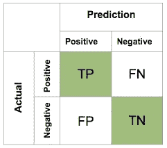

**来源链接:** [**谷歌图片**](https://www.google.com/search?q=confusion+matrix&rlz=1C1RLNS_enIN844IN844&source=lnms&tbm=isch&sa=X&ved=0ahUKEwja6bqN3Z_jAhXBuo8KHZ9PBsYQ_AUIECgB&biw=1366&bih=625#imgrc=qaM5X9E7c28zqM:)

从上图来看——混淆矩阵是 2*2 维的。x 轴代表“预测”标签，Y 轴代表“实际”标签。

为了更好地理解什么是 TP、FP、TN 和 FN，我们将考虑一个例子-**‘如果收到的邮件是垃圾邮件或火腿’**

**肯定** —收到的邮件是火腿

否定的 —收到的邮件是垃圾邮件

**真阳性(TP):** 表示预测标签为阳性，实际标签也为阳性——预测正确。我们预测收到的邮件是“ham”(阳性)，实际收到的邮件也是“ham”(阳性)。

**真阴性(TN):** 表示预测标签为阴性，实际标签也为阴性——预测正确。我们预测收到的邮件是“垃圾邮件”(负面)，实际收到的邮件也是“垃圾邮件”(负面)。

**假阴性(FN):** 表示预测标签为阴性，而实际标签为阳性——预测错误。我们预测收到的邮件是“垃圾邮件”(负面)，但实际收到的邮件是“垃圾邮件”(正面)。

**假阳性(FP):** 表示预测标签为阳性，实际标签为阴性——预测错误。我们预测收到的邮件是“垃圾邮件”(正面)，但实际收到的邮件是“垃圾邮件”(负面)。

混淆矩阵是最直观和最基本的度量，从中我们可以获得各种其他度量，如精确度、召回率、准确度、F1 分数、AUC-ROC。

***现在让我们深入探讨一下精确度、召回率和 F1 得分指标。***

# 1.精度:

**一般定义:**精度衡量预测阳性标签实际为阳性的比例。

为了解释 precision 及其用例，我们将考虑' ***机器学习课程推荐*** '示例，即我们必须推荐学生选择 xyz 机器学习课程。

**积极—** 推荐给学生的课程

**否定** —不推荐给学生的课程

真阳性和假阳性的精确度:

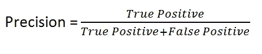

**来源链接:** [**谷歌图片**](https://www.google.com/url?sa=i&source=images&cd=&ved=2ahUKEwiz9tLX8J_jAhUIRo8KHT2OA0EQjRx6BAgBEAU&url=https%3A%2F%2Ftowardsdatascience.com%2Faccuracy-precision-recall-or-f1-331fb37c5cb9&psig=AOvVaw0wnXdzL2uEjpYHniqNImaG&ust=1562488302609499)

从图像中的上述公式，我们可以分析出，随着“假阳性”的减少，我们的精度增加，反之亦然。让我们看看' ***机器学习课程推荐*** '例子中的'真阳性'、'假阳性'、'假阴性'是什么。

**真阳性(TP):** 预测为推荐给学生的课程，实际上也是推荐给学生的课程。

**假阳性(FP):** 预测为推荐给学生的课程，但实际上并未推荐给学生。

**假阴性(FN):** 预测为未推荐给学生的课程，但实际上是推荐给学生的课程。

## 何时使用 Precision？

当我们希望主要关注假阳性时，即减少假阳性值从而增加精度值时，使用精度。可能会出现一个问题，为什么我们主要关注假阳性而不是假阴性。要回答这个问题，让我们考虑' ***机器学习课程推荐*** '的例子。

**假阳性(FP):** 表示我们预测的标签为阳性，而实际标签为阴性——错误预测。在我们的例子中应用假阳性-这意味着我们已经预测到该课程已经被推荐给学生，但是实际上该课程并没有被推荐给学生。如果我们的假阳性值很高，这显然意味着我们应该错过一些或大多数学生来推荐这门课程。这将是学院的一个损失，因为学院没有几个或大多数学生推荐这门课程。因此，我们主要关注误报值，并试图将其减少到尽可能小的值。

**假阴性(FN):** 表示我们预测的标签为阴性，而实际标签为阳性——预测错误。在我们的例子中应用假阴性-这意味着我们已经预测到该课程没有被推荐给学生，但实际上该课程被推荐给了学生。如果我们的假阴性值很高，这显然意味着我们必须向已经被推荐的学生推荐一门课程。如果我们向已经被推荐的学生推荐这门课程，这根本不是问题。所以，我们不太关注假负值。

**结论:**考虑到以上两个原因，我们主要关注假阳性值，并试图将其降低到尽可能小的值，从而提高精度值。

# 2.回忆/敏感度

**一般定义:**召回衡量实际阳性标签被正确预测为阳性的比例。

为了解释召回及其使用案例，我们将考虑 ***【癌症诊断】*** 示例，即我们必须预测患者是否被诊断为癌症。

**阳性**——诊断为癌症的患者。

**阴性** —患者未被诊断为癌症。

根据真阳性和假阴性回忆:

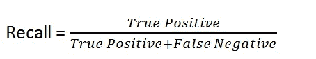

**来源链接:** [**谷歌图片**](https://www.google.com/url?sa=i&source=images&cd=&ved=2ahUKEwiz9tLX8J_jAhUIRo8KHT2OA0EQjRx6BAgBEAU&url=https%3A%2F%2Ftowardsdatascience.com%2Faccuracy-precision-recall-or-f1-331fb37c5cb9&psig=AOvVaw0wnXdzL2uEjpYHniqNImaG&ust=1562488302609499)

从图像中的上述公式，我们可以分析出，随着“假阴性”的减少，我们的回忆增加，反之亦然。让我们看看 ***【癌症诊断】*** 例子中的‘真阳性’、‘假阳性’、‘假阴性’是什么。

**真阳性(TP):** 预测为诊断为癌症的患者，实际上也是诊断为癌症的患者。

**假阳性(FP):** 预测为诊断为癌症的患者，但实际为未诊断为癌症的患者。

**假阴性(FN):** 预测为未诊断为癌症的患者，实际诊断为癌症的患者。

## 何时使用召回？

当我们希望主要关注假阴性时，即减少假阴性值从而增加召回值时，使用召回。可能会出现一个问题，为什么我们主要关注假阴性而不是假阳性。为了回答这个问题，让我们考虑一下 ***【癌症诊断】*** *的例子。*

**假阴性(FN):** 表示我们预测的标签为阴性，而实际标签为阳性——预测错误。在我们的例子中应用假阴性——这意味着我们预测患者没有被诊断为癌症，但是实际的患者被诊断为癌症。如果是这种情况，根据预测，患者可能无法获得治愈癌症的治疗。但事实是病人被诊断患有癌症。我们错误的负面预测会导致病人死亡。因此，我们主要关注假负值，并试图将其减少到尽可能小的值。

**假阳性(FP):** 表示我们预测的标签为阳性，而实际标签为阴性——错误预测。在我们的例子中应用假阳性-这意味着我们已经预测到患者被诊断患有癌症，但是实际的患者没有被诊断患有癌症。如果是这种情况，根据预测，患者将接受癌症诊断检查。令他高兴的是，他将会知道他没有被诊断出患有癌症。万岁！他现在没有癌症了。所以，我们不太关注假阳性值。

**结论:**考虑到以上两个原因，我们主要关注假阴性值，并试图将其降低到尽可能小的值，从而提高召回值。

# F1 分数:

F1-score 是另一个很好的性能指标，它同时利用了精确度和召回率指标。F1 分数可以通过简单地取精确度和召回率的“调和平均值”来获得。与主要关注假阳性的精度和主要关注假阴性的召回不同，F1-score 同时关注假阳性和假阴性。

为了解释 F1 分数及其用例，我们将考虑***‘玫瑰&茉莉花***’的例子，即我们必须预测花是玫瑰还是茉莉花。

**阳性—** 归类为玫瑰的花。

**阴性—** 花归类为茉莉花。

f1-精确度和召回率得分:

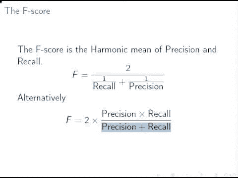

**来源链接:** [**谷歌图片**](https://www.google.com/url?sa=i&source=images&cd=&cad=rja&uact=8&ved=2ahUKEwjJ5cKljqDjAhXPXSsKHTePCxoQjRx6BAgBEAU&url=%2Furl%3Fsa%3Di%26source%3Dimages%26cd%3D%26ved%3D%26url%3D%252Furl%253Fsa%253Di%2526source%253Dimages%2526cd%253D%2526ved%253D%2526url%253Dhttps%25253A%25252F%25252Fdeepai.org%25252Fmachine-learning-glossary-and-terms%25252Ff-score%2526psig%253DAOvVaw10OJ-_diqDWdlv09dlPAkP%2526ust%253D1562496208540558%26psig%3DAOvVaw10OJ-_diqDWdlv09dlPAkP%26ust%3D1562496208540558&psig=AOvVaw10OJ-_diqDWdlv09dlPAkP&ust=1562496208540558)

让我们看看***‘玫瑰&茉莉花’***例子中的‘假阳性’和‘假阴性’是什么。

**假阳性(FP):** 预测花是玫瑰，但实际花是茉莉。

**假阴性(FN):** 预测花为茉莉，但实际花为玫瑰。

## 何时使用 F1 得分:

如上所述，F1 分数关注假阳性和假阴性，无论如何我们不希望玫瑰被归类为茉莉，而茉莉被归类为玫瑰。在这种情况下，我们关注假阳性和假阴性，并试图减少假阳性和假阴性，从而增加 F1 分数。

**结论:**牢记上述原因，我们可以说我们的重点应该是假阳性和假阴性，并试图减少假阳性和假阴性，从而增加 F1 分数。

# 4.AUC-ROC 曲线

AUC-ROC 是用于检查模型性能的最重要的性能度量之一。AUC-ROC 用于二元和多类分类，但主要用于二元分类问题。在这个博客中，我们将考虑一个二元类分类。

AUC 展开为曲线 下的 ***面积，ROC 展开为 ***受试者工作特性*** 。也称为 AUROC，在接收机工作特性下扩展为 ***区域。******

AUC-ROC 是模型性能的图形表示。ROC 是概率曲线，AUC 是可分离性的度量。根据阈值集，我们可以分析我们的模型在分离两个类别方面的表现。AUC 越高，我们分离两个类别的模型越好。

**AUC-ROC 的图示:**

**来源链接:** [**谷歌图片**](https://www.google.com/url?sa=i&source=images&cd=&ved=2ahUKEwj8qMXSl6fjAhUTU30KHdiWDWEQjRx6BAgBEAU&url=https%3A%2F%2Ftowardsdatascience.com%2Funderstanding-auc-roc-curve-68b2303cc9c5&psig=AOvVaw2WaAqBNnvHYLVy5H2-gFYZ&ust=1562738759613951)

参考上图，我们可以看到 AUC-ROC 曲线是用 FPR 对 TPR 绘制的，其中 FPR(假阳性率)在 X 轴上，而 TPR(真阳性率)在 Y 轴上。绿色曲线代表 ROC 曲线，而 ROC 曲线下的面积/区域(绿色曲线)代表 AUC。穿过原点的连续黑线不过是‘门槛’。

我们先来了解一下什么是 TPR 和 FPR:

**真阳性率(TPR):**

TPR 无非就是回忆/敏感。TPR 的公式如下

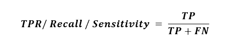

真实阳性率

**假阳性率(FPR):**

TPR 的公式如下

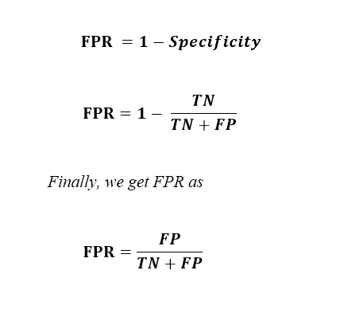

**假阳性率**

**AUC-ROC 曲线的解释:**

现在让我们看看基于 AUC 分数和 ROC 曲线的二元分类的分析。为此，我们将以上面的例子 ***【癌症诊断】*** 为例，即我们必须预测患者是否被诊断为癌症。

**红色曲线:****阳性——确诊为癌症患者。**

****绿色曲线:**阴性—未确诊为癌症的患者。**

****示例— 1:****

**阈值设置为 0.5。两条曲线(绿色和红色)之间没有重叠。这是最好的模型，AUC 值为 1.0。这表明模型区分正负类的概率是 1.0。换句话说，我们可以说，有 100%的机会模型可以把积极的和消极的阶级分开。**

**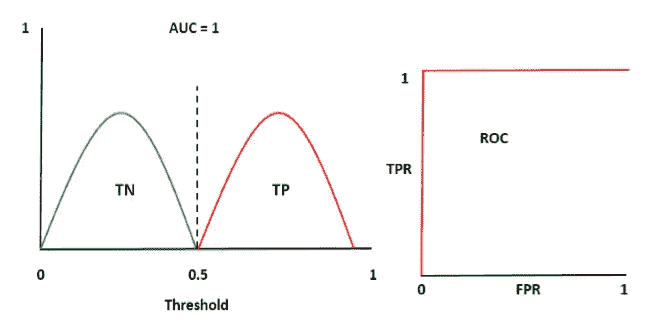**

****AUC 值为 1.0 的 ROC 曲线****

****示例— 2:****

**阈值设置为 0.5。两条曲线(绿色和红色)之间有一点重叠。这是一个很好的模型，AUC 值为 0.8。这表明模型分离正类和负类的概率是 0.8。换句话说，我们可以说有 80%的机会模型可以把积极和消极的阶层分开。**

**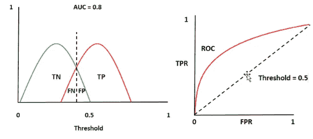**

****AUC 值为 0.8 的 ROC 曲线****

****示例— 3:****

**阈值设置为 0.5。我们可以看到两条曲线(绿色和红色)完全重叠。这是一个糟糕的模型，AUC 值为 0.5。这表明模型区分正负类的概率是 0.5。换句话说，我们可以说有 50%的机会模型可以把积极和消极的阶层分开。**

**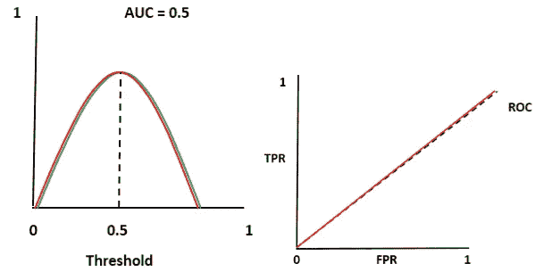**

****AUC 值为 0.5 的 ROC 曲线****

****例— 4:****

**阈值设置为 0.5。我们可以看到两条曲线(绿色和红色)之间的重叠，曲线也是往复运动的。这是最差的模型，AUC 值为 0.2。这表明模型区分正负类的概率是 0.2。换句话说，我们可以说有 20%的机会模型可以把积极和消极的阶层分开。**

**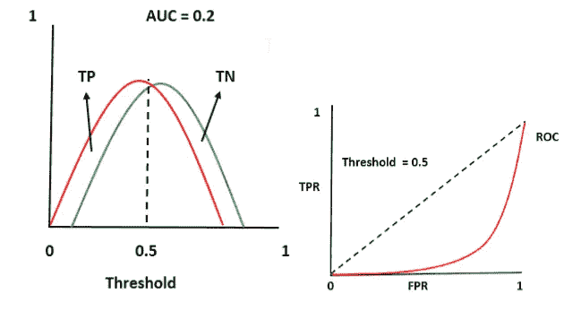**

****AUC 值为 0.2 的 ROC 曲线****

**AUC-ROC 曲线与其他指标的不同之处在于，在 AUC-ROC 曲线中，我们可以设置阈值。阈值的设置取决于业务需求和重要性。例如:在医疗领域，阈值设置为 0.95。所以高于 0.95 的 AUC 分数被认为是最好的，否则是最差的。**

## **何时使用 AUC-ROC 曲线:**

**嗯，这有时很令人困惑，因为存在矛盾的说法，例如当数据平衡时我们可以使用 AUC-ROC，另一方面，当数据不平衡时我们也可以使用。**

1.  ****平衡数据:**有一个清晰的图像，当数据几乎平衡时，可以使用 AUC-ROC，例如正负类的比例约为 60:40 或 70:30。它很好地解释了真阳性率(TPR)和假阳性率(FPR)。**
2.  ****不平衡数据:**另一方面，AUC — ROC 也可以在数据不平衡时使用，可以根据数据和业务需求灵活设置阈值。**

****注:**参考上述第二点，补充说明，在数据不平衡的情况下，很少使用 AUC — ROC。相反，使用精确-召回曲线，因为它比 AUC-ROC 曲线更有意义。在不平衡数据的情况下，有时很难选择指标，它仅仅取决于数据和业务需求。AUC — ROC 的主要优势之一是，我们可以根据业务需求设置阈值。**

# **5.对数损失**

**对数损失(对数损失)是用于检查模型性能的良好度量之一。对数损失通过考虑分类的概率来惩罚错误的分类。**

**与其他度量不同，对数损失使用概率得分。它既用于二元类分类，也用于多类分类。随着对数损失的增加，预测概率偏离实际标签。对数损失越低，模型越好。因此，我们的目标是尽可能减少日志损失。对数损失为 0 的模型被称为最佳模型。**

****对数损失公式如下:****

**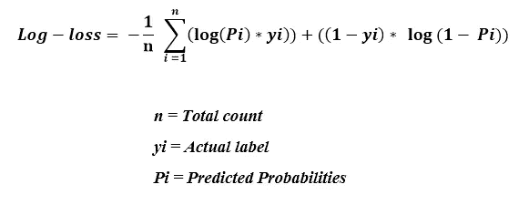**

****测井—损失公式****

****测井曲线损失的图示:****

**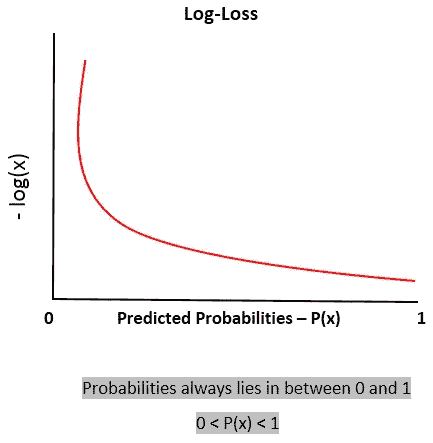**

****原木损失的图形表示****

## **什么时候对我们日志丢失？**

1.  **当模型输出是二进制类{0，1}的概率时，使用对数损失。对数损失的主要优点是，它惩罚了错误分类或错误预测。**
2.  **对数丢失可用于平衡和不平衡数据。由于测井曲线丢失会受到不平衡数据的影响，因此最好使用过采样、欠采样等技术来平衡数据。**

# **总结:**

1.  ****精度:**精度衡量预测阳性标记实际为阳性的比例。我们主要关注假阳性值，并试图将其降低到最小可能值，从而提高精度值。**
2.  ****召回:**召回衡量实际阳性标签被正确预测为阳性的比例。我们主要关注假阴性值，并试图将其降低到尽可能小的值，从而提高召回值。**
3.  ****F1 得分:** F1 得分是精确度和召回率的“调和平均值”。我们关注假阳性和假阴性，并试图减少假阳性和假阴性，从而提高 F1 分数。**
4.  ****AUC — ROC 曲线:**是 ROC 曲线和曲线下区域/面积的图形表示，即 AUC。它主要用于二元类分类。它解释了正类和负类可分性的概率或百分比。AUC-ROC 越高，我们的模型在区分阳性和阴性类别方面就越好。**
5.  ****对数损失:**对数损失也称对数损失，用于二元和多类分类。与其他指标不同，它基于概率得分。我们的模型是对数损失越低越好。**

## **来源:**

1.  **[https://www . applied ai course . com/lecture/11/applied-machine-learning-online-course/2982/log-loss/3/module-3-foundations of-natural-language-processing-and-machine-learning](https://www.appliedaicourse.com/lecture/11/applied-machine-learning-online-course/2982/log-loss/3/module-3-foundations-of-natural-language-processing-and-machine-learning)**
2.  **[https://www . applied ai course . com/lecture/11/applied-machine-learning-online-course/2981/receiver-operating-character istic-curve-roc-curve-and-AUC/3/module-3-foundations-of-natural-language-processing-and-machine-learning](https://www.appliedaicourse.com/lecture/11/applied-machine-learning-online-course/2981/receiver-operating-characteristic-curve-roc-curve-and-auc/3/module-3-foundations-of-natural-language-processing-and-machine-learning)**
3.  **[https://www . applied ai course . com/lecture/11/applied-machine-learning-online-course/2980/precision-and-recall-f1-score/3/module-3-foundations of-natural-language-processing-and-machine-learning](https://www.appliedaicourse.com/lecture/11/applied-machine-learning-online-course/2980/precision-and-recall-f1-score/3/module-3-foundations-of-natural-language-processing-and-machine-learning)**
4.  **https://developers . Google . com/machine-learning/crash-course/classification/precision-and-recall**
5.  **[https://medium . com/thal us-ai/performance-metrics-for-class ification-problems-in-machine-learning-part-I-b085d 432082 b](/thalus-ai/performance-metrics-for-classification-problems-in-machine-learning-part-i-b085d432082b)**
6.  **【http://wiki.fast.ai/index.php/Log_Loss **
7.  **[https://medium . com/datadriveninvestor/understanding-the-log-loss-function-of-xgboost-8842 e 99d 975d](/datadriveninvestor/understanding-the-log-loss-function-of-xgboost-8842e99d975d)**
8.  **[https://towards data science . com/understanding-AUC-roc-curve-68b 2303 cc9 C5](https://towardsdatascience.com/understanding-auc-roc-curve-68b2303cc9c5)**
9.  **[https://classe val . WordPress . com/simulation-analysis/roc-and-precision-recall-with-unbalanced-datasets/](https://classeval.wordpress.com/simulation-analysis/roc-and-precision-recall-with-imbalanced-datasets/)**
10.  **[https://stats . stack exchange . com/questions/180116/when-log-loss-metric-just-for-evaluation-of-a-a-performance-of-a-classifier](https://stats.stackexchange.com/questions/180116/when-is-log-loss-metric-appropriate-for-evaluating-performance-of-a-classifier)**