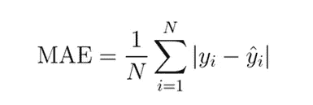

# 绩效指标:回归模型

> 原文：<https://medium.com/analytics-vidhya/performance-metrics-regression-model-69f68a18504f?source=collection_archive---------10----------------------->

—机器学习中回归模型的 5 个广泛使用的评估指标。

来源:谷歌

今天我们将讨论性能指标，这次是回归指标。在我之前的 [*博客*](/@bishalbose294/performance-metrics-classification-model-69a5546b118c) 中，我们已经讨论过分类指标，这次是回归。

我们将讨论 5 个最广泛使用的回归指标:

让我们先了解一件事，那就是分类和回归指标之间的区别，为什么我们需要两种不同的指标来度量我们的模型。

第一个关键区别是，顾名思义，分类将类作为输出，这可以理解为我们只有很少的数据类别，比如类 1-10，那么我们的输出值将是 1-10 之间的任何数字。因此，如果模型输出与我的实际输出匹配，那么结果通过，否则失败，没有其他条件，你可以是正确的或不正确的。虽然这不是回归的情况，但在回归中，我的模型输出一个连续的数字，没有离散值，它是连续的，例如我们的模型试图预测人的身高，我们知道我们不能将身高变量分类为 160 厘米、170 厘米等。它是连续的，因此在这种情况下，我们考虑我们的模型与实际值有多接近，“有多接近”的概念产生了损失项。 用适当的科学或统计符号来表示，我们的模型在预测一个数据点的价值时会产生什么样的损失。 比方说，对于某个数据点，预计身高为 167 厘米，而实际数据点的实际值为 163 厘米，那么我们的模型就出现了+5 厘米的误差。在这种情况下，现在我只针对 1 个数据点，想象一下如何测量整个数据集？

让我们记住一件事，什么是错误？

与实际值的任何偏差都是误差，

**误差** = Y(实际)— Y(预测)

记住这一点，我们已经了解了指标的要求，让我们深入研究一下我们可以用来了解模型性能的方法。

## **1。均方误差**

让我们试着分解这个名字，它表示平均值，平方，误差。从上面的解释中我们知道什么是误差，我们知道什么是平方，所以我们平方误差，然后我们知道什么是平均值，所以我们取所有被平方和相加的误差的平均值。

第一个问题是为什么我们要做一个正方形？为什么我们不能直接接受错误？

让我们再举一个身高的例子，我的模型预测的是 167 厘米，而我的实际值是 163 厘米，所以偏差是+5 厘米，现在让我们再举一个例子，我的预测身高是 158 厘米，而我的实际身高是 163 厘米，现在我的模型出现了-5 厘米的误差。

现在让我们找出 2 个点的平均误差，因此计算状态为[+5 + (-5)]/2 = 0

这说明我的模型有 0 误差，但是真的是这样吗？没有对吗？因此，为了避免这种问题，我们必须采取平方，以消除错误的迹象。

让我们来看看这个指标的公式:

> 在哪里，
> 
> n =数据点总数
> 
> Yi =实际值
> 
> ŷi =预测值

## **2。均方根误差(RMSE)**

现在，我们都知道 MSE 是什么，很明显，方程的根将给出 RMSE，让我们先看看公式。

> 在哪里，
> 
> n =数据点总数
> 
> Yi =实际值
> 
> ŷi =预测值

现在的问题是，如果我们已经有了 MSE，为什么我们还需要 RMSE？

让我们试着用例子来理解它，以上面 2 个数据点的例子为例，计算它们的 MSE 和 RMSE，

MSE = [(5)2 + (-5)2]/2 = 50/2 = 25

RMSE = Sqrt(MSE) = (25)^0.5 = 5

现在，你告诉这些值中，哪一个更准确，与模型的实际误差更相关？

RMSE 说得对，所以实际上平方这些值会成倍地增加，而不求根可能会影响我们的理解，我的模型哪里出错了。

## **3。平均绝对误差**

现在，我肯定你可能会想，为什么要平方？为什么不直接取它们的绝对值呢，这里我们有它，一切保持不变，只有差异，我们取误差的绝对值，这也解决了我们之前的符号问题，让我们看看这个公式:

> 在哪里，
> 
> N =数据点总数
> 
> Yi =实际值
> 
> ŷi =预测值

梅伊和 RMSE 之间的区别是什么，因为他们都将上述 RMSE 例子的误差定为 5。

让我们明白，MAE 和 RMSE 可以一起用于诊断一组预测中的误差变化。RMSE 将永远大于或等于 MAE 它们之间的差异越大，样本中单个误差的方差就越大。如果 RMSE=MAE，那么所有的误差都是相同的量级。

错误[2，-3，5，120，-116，197]

RMSE = 115.5

MAE = 88.6

如果我们看到差异，RMSE 有一个比 MAE 更高的值，这表明 RMSE 更重视由于平方值而产生的更高的误差。

## **4。平均绝对百分比误差(MAPE)**

这有点类似于 MAE，唯一的区别是我们采用百分比误差，而不是绝对值，让我们看看公式:

> 在哪里，
> 
> N =数据点总数
> 
> Yi =实际值
> 
> ŷi =预测值

MAPE 用百分比表示误差，因此它与数据本身的大小无关，而上面提到的任何其他度量都是相关的。

## **5。r 或决定系数**

它是目标变量的 MSE(预测误差)和基线方差的比率，这里基线是我们的 Y 值与平均值的偏差。

该指标帮助我们将当前模型与恒定的基线值(即平均值)进行比较，并告诉我们我们的模型好多少，R2 总是小于 1，无论误差有多大或多小，R2 总是小于 1。

让我们看看公式:

现在你有了一些广泛使用的回归模型的性能指标。

> **感谢阅读！**
> 
> 如果你想了解更多类似的话题或者看看我还能提供什么，一定要访问我的网站:[所有关于东西](https://digital.allaboutstuffs.com/)
> 
> 准备好让你的学习更上一层楼了吗？查看我提供的课程:[课程](https://digital.allaboutstuffs.com/courses/)
> 
> 生活工作压力大？花一点时间来放松和放松我的舒缓和放松的视频！现在就去我的频道，开始你的内心平和与宁静之旅吧