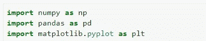

# 对气象数据进行分析

> 原文：<https://medium.com/analytics-vidhya/performing-analysis-of-meteorological-data-b63f3b125be8?source=collection_archive---------5----------------------->

> 通过数据分析，芬兰的天气是否会因全球变暖而发生变化？

全球变暖对天气的影响。

在这篇博客中，我们将讨论基于以下[数据集](https://www.kaggle.com/muthuj7/weather-dataset)的[数据分析](https://www.kaggle.com/anmolarora013/performinganalysisofmeteorologicaldata)。

***“有跨 10 年逐月比较的表观温度和湿度数据表明由于全球变暖而增加”*** 下面是进行分析的假设。

这一假设意味着我们需要发现从 2006 年到 2016 年的一个月中的一个月的平均表观温度和同期的平均湿度是否增加了。这种月度分析必须在 10 年期间的所有 12 个月进行。因此，你基本上是从每小时到每月对数据进行重新采样，然后在 10 年期间比较同一个月。使用 [matplotlib](http://matplotlib.org) 和/或 seaborn 库，通过适当的可视化来支持您的分析。

> **步骤 1:导入库和数据集。**

**所需库**

**导入数据集**

> **第二步:查看数据集。**

**数据集详情**

> **步骤 3:清洗数据集**

在这一步中，我们将为绘图准备数据，我们将首先删除不需要的列(除了温度和湿度)。

**删除不需要的列**

然后，我们将时区转换为+00:00 UTC。

将时区转换为+00:00 UTC

> **第四步:绘制数据**

在最后一步，我们将绘制数据进行分析，

**>** 首先，我们将绘制所有月份的整个数据集。

**所有月份的图表**

**>** 现在我们将绘制特定月份(四月)**的图形。**

**四月份的图表**

> **结论**

正如我们所分析的，过去 10 年(2006 年至 2010 年)四月的湿度没有任何变化。因为，温度在 2009 年急剧上升，在 2015 年下降，其余年份的温度没有任何急剧变化。

**注:**本结论声明仅针对 4 月份，所有月份请参考[模型](https://www.kaggle.com/anmolarora013/performinganalysisofmeteorologicaldata)。