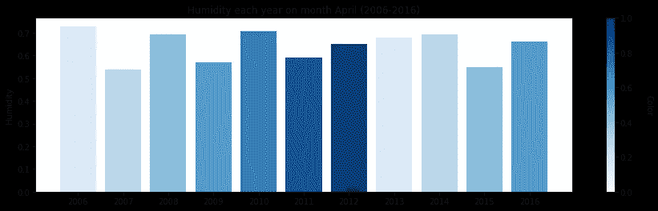

# 对气象数据进行分析

> 原文：<https://medium.com/analytics-vidhya/performing-analysis-of-meteorological-data-c375234644df?source=collection_archive---------20----------------------->

在这篇博客中，我们将分析天气数据。这个博客对数据科学初学者很有帮助。我们将使用 Python 的 NumPy、pandas 和 matplotlib 库。你可以从这个谷歌驱动链接下载数据集:([https://drive.google.com/open?)id = 1 SCF _ 1a-bk h1 QE 8 rn 78 uk6 _ 5 qwud 9 bu](https://drive.google.com/open?id=1ScF_1a-bkHi1qe8Rn78uxK6_5QwUD9Bu))。

所以让我们开始吧，

我们需要找出从 2006 年到 2016 年开始的一个月中的一个月的平均表观温度说是 4 月，而同期的平均湿度是否增加了。这种月度分析必须在 10 年期间的所有 12 个月进行。因此，你基本上是从每小时到每月对数据进行重新采样，然后在 10 年期间比较同一个月。使用 matplotlib 库通过适当的可视化来支持您的分析。

首先，我们导入所有必要的 Python 库。

# 读取文件

我们可以使用 **read_csv()** 来读取文件。

**熊猫**库中的 df = PD . read _ CSV(**weather history . CSV**)
有很多函数，比如 **info()** ， **describe()** 。函数的作用是:打印一个数据帧的摘要。该方法打印关于数据帧的信息，包括**索引**数据类型和列数据类型、非空值和**内存**使用情况。是否打印完整摘要。默认情况下，熊猫中的设置。**描述** () **函数**计算与 DataFrame 列相关的统计汇总。这个**函数**给出平均值、标准差和 IQR 值。并且，**函数**排除了字符列，给出了数字列的汇总。

使用 **pd.to_datetime()** 将“格式化日期”转换为日期时间

检查空值为 **df.isnull()。sum()**

**isnull()** 函数检测给定系列对象中缺失的值。它返回一个 boolean 大小相同的对象，指示值是否为 NA。缺失值映射为真，非缺失值**映射为假。这里不需要数据清理，但我们只需要**表观温度**和**平均湿度**，这样我们就可以对数据进行重新采样。我们还需要每月重新取样。*重采样是一种方便的频率转换方法*。对象*必须有一个类似索引的日期时间，所以设置索引。***

**df=df.set_index('格式化日期')
x=df[['表观温度'，'湿度']]。重新取样(“毫秒”)。平均值()**

# 绘制一年中表观温度和平均湿度的变化。

plt.figure(figsize=(8，4))
plt.plot(x['表观温度']，color='orange '，label= '表观温度'，线宽=2，alpha=0.75)
plt.plot(x['湿度']，color= '蓝色'，label= '湿度'，line style = '-'，alpha = 0.75)
PLT . tight _ layout()
PLT . title('全年的表观温度和平均湿度(2006–2006

使用`**plt.savefig()**`功能可将 Matplotlib 图保存为图像文件。

图一

现在我们需要找出从 2006 年到 2016 年开始的一个月中的一个月的平均表观温度说是 4 月，而同期的平均湿度有没有增加。

april=x[x.index.month==4]
让情节，

# 绘制历年四月表观温度和平均湿度的变化图

data_color = [0.1，0.2，0.3，0.4，0.5，0.6，0.7]

data _ color =[x/max(data _ color)for x in data _ color]
fig，ax = plt.subplots(figsize=(15，4))

my _ cmap = PLT . cm . get _ cmap(' Blues ')
colors = my _ cmap(data _ color)
rects = ax . bar(April . index . year，april['湿度']，color=colors)

sm = scalar maptable(cmap = my _ cmap，norm=plt。Normalize(0，max(data _ color))
sm . set _ array([])

cbar = PLT . Color bar(sm)
cbar . set _ label(' Color '，rotation=270，label pad = 25)
PLT . x ticks(April . index . year)
PLT . y label('湿度')
plt.title('每年 4 月(2006–2016 年)的湿度')

plt.show()

图 2

对于表观温度，我们可以通过改变 y 值来使用相同的代码。

图 3

# 湿度和温度，并把它们画在一起

fig = plt.figure(figsize=(15，8))
ax = fig . add _ subplot()
ax . plot(April['表观温度']，' o-'，label= '温度')
ax2 = ax . twinx()
ax . plot(April['湿度']，' o-'，label = '湿度')
ax.set_xlabel("年份")
ax.set_ylabel('温度'，size=10) 【T22

图 4

**结论**:在图 1 的曲线图中，我们看到**湿度**几乎保持不变。在图 4 中。**平均湿度**无重大变化。但是我们可以看到 2009 年**平均表观温度**上升，2010 年再次下降，2011 年略有上升，2015 年下降，2016 年再次上升。