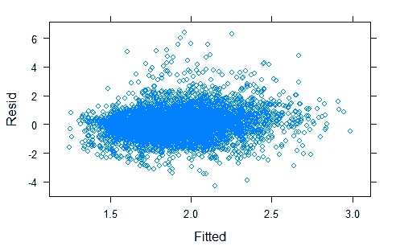
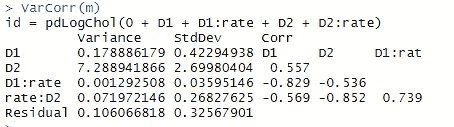

# 执行多元混合建模

> 原文：<https://medium.com/analytics-vidhya/performing-multivariate-mixed-modeling-7c925f015f39?source=collection_archive---------1----------------------->

在继续之前，你应该有一个线性混合模型(LMM)的先验知识，你可以在我的 [*以前的博客*](/@vyawaharesushrut1/introduction-to-mixed-models-208f012aa865) 中找到。

无论如何，让我们快速介绍一下混合模型。线性混合效应模型在生物数据分析中越来越常见。它提供了一个灵活的方法来模拟广泛的数据类型，生态数据往往是复杂的，需要复杂的模型结构。它包括固定效应和随机效应的组合作为预测变量。

这些模型功能强大。软件的进步使得非专业人士也可以使用这些工具，并且变得相对简单，适合广泛使用的统计软件包，如 r。

要在 R 中执行多元 LMMs，还没有任何特定的软件包。所以，我们来看看是怎么做的。我为这项研究创建了一个样本数据。

> ***注:-*** *本博客的目的是展示如何使用各种数据分析命令。它并没有涵盖研究者应该做的研究过程的所有方面。特别是，它不包括数据清理和检查、假设验证、模型诊断和潜在的后续分析。*

让我们加载数据，看看数据的概要和结构

数据汇总

这里我把**率**作为我的因变量，其他变量都是独立的。我们将使用从**利率**预测的变量 **ln 和 exp** ，它们都嵌套在 **id** 中。你可以看到我的数据是宽格式的。

数据结构

我将使用 **reshape2** 包以日志格式重塑我的数据。结果是一个新的数据集，称为**数据 1** 。

我们已经融合了数据

现在，让我们看看我们的数据融化后是什么样子。

新数据的结构

现在，我们的下一步在执行多元分析中起着重要的作用。要执行多元 LMM，我们需要为分类变量创建虚拟变量；那就是我们数据中的**变量**。

为“ln”和“exp”创建虚拟变量

在该代码中 **D1** 和 **D2** 是 **ln** 和 **exp 的虚拟变量。**

虚拟变量

对于，**ln****D1**的值为 **1** 否则 **0** 。类似地，对于**exp**，D2 的值为 1，否则为 0。 **D1** 和 **D2** 是 0/1 虚拟变量，编码结果是变量 **ln** 还是 **exp，**id 现在重复多次，**速率**重复两次，每个结果变量一次。

为了使模型符合我们的数据，我将使用 **nlme** 包来构建 **LMM** 。在我之前的博客中，我使用了 **lme4** 包来构建 **LMM** 。有一个新的软件包适合于许多类型的随机系数模型， **lme4** ，但是它不处理特殊的残差协方差结构。

> **注意:-** 两个包在编写公式时的语法略有不同。

让我们使用 **nlme** 软件包来拟合模型。

模型

> 注意:-我们指定了特殊的控制参数，因为模型没有在默认的迭代次数中收敛，所以它们被增加了。

我们来看一些诊断图。首先，我们将查看拟合值的残差。我们将整体观察它们，并使用**点阵**包按结果变量进行分解。

残差与拟合值

为了更好地理解，我们将绘制由变量分隔的 QQ-plot。

由变量分隔的 QQ 图

我将在这个 QQ 图中添加简单的线条。

从残差的 QQ 图来看，很明显它们不是正态分布的，我们可能会担心这个假设。然而，为了演示起见，我们将继续。接下来，让我们看看残差对拟合值的作图，以检查诸如异方差之类的东西。

整体情节

整体情节

让我们看看这两个变量的分布。

对于这两个变量

通过变量分离后，看起来好一点了，尽管离理想状态还很远。我们可以看到，这两个变量的预测值的分布非常不同。令人惊讶的是，它们不在同一尺度上。在这种规模下，很难看出 **ln** 的真实价差。我们可以只检查这个变量**在**中的曲线。

它看起来扩散得不太严重。我们的地块看起来都很好，我们不需要做任何修改。让我们检查一下我们模型的概要。

模型摘要

它包含了大量的信息。如果我们看一下我们模型的总结，我们会发现它同时具有固定效应和随机效应。剩余标准差是剩余方差的平方根，用于变量 **ln** 。为了得到 **exp** 变量的值，用 **6.74** 乘以余数。

这些类型模型会变得复杂，有时会遇到收敛问题。很容易误用随机效应和协方差结构。

**nlme** 包有一个名为 **getVarCov()** 的函数，它给出一个方差协方差矩阵。方差协变看起来像这样:

方差协方差

一个**方差** - **协方差矩阵**是一个方阵**矩阵**，它包含了与几个变量相关的**方差**和**协方差**。矩阵**的对角线元素**包含变量的**方差**，非对角线元素包含所有可能变量对之间的**协方差**。方差测量数据相对于平均值的分散程度。

方差协方差矩阵

在线性混合效应模型中，我们可以得到随机效应项之间的估计方差、标准差和相关性。

这可能会遇到收敛问题，并且会变得很慢。这不是一个很常见的技术，所以你可能找不到很多文献。

**结论:-** 这些模型相当复杂。它允许我们以一种总体的方式来看待变量之间的关系，并量化变量之间的关系。在这篇博客中，我已经建立了双变量混合模型，同样我们也可以建立多变量混合模型。现在我们能够使用多个变量来预测可能的结果。

> 在混合模式中，你有很多东西可以探索。要了解更多混合模型的神奇之处，请继续关注我的混合模型系列博客。