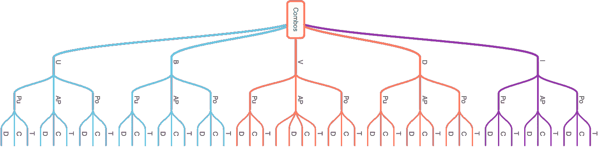

# 排列——顺序很重要！

> 原文：<https://medium.com/analytics-vidhya/permutation-order-matter-ae18bd212b5?source=collection_archive---------9----------------------->

> 这篇文章将帮助你以一种你将永远记得的方式理解排列的概念

为了理解排列(序列)，了解计数是很重要的

让我们通过例子来了解不同的计数方法

让我们从一个非常简单的问题开始:-

1.  1 到 35 之间有多少个数字？

显然是 35(1 到 35 之间有 35 个可能的数字)。

所以第一条规则是

> 1 和 n 之间的数是 n。
> 
> (没错，就是这么简单:)

**2** 。**31 和 397 之间有多少个数字？**

31, 32, 33, …, …, …, 395, 396, 397

因为我们只知道从 1 数到 n，而不知道从 k 数到 n(在我们的例子中，k = 31，n = 397，这里 k 表示起始数)

因此，我们目标是将 k 转换成 1，为了做到这一点，我们将从序列中的每个数字中减去 30

31–30, 32–30, 33–30, …, …, …, 395–30, 396–30, 397–30

= 1, 2,3, …, …, …, 365, 366, 367

根据第一原理，我们知道从 1 数到 n

因此我们可以说，

31 和 397 之间的数字是 367

第二条规则来了

> k 和 n 之间的数的个数是(n-k+1)

**乘法原理:-**

想象一下这样一个场景:你在一所大学里，附近有一家酒店供应 **5 种**南印度菜 (Indli( **I** )、Dosa( **D** )、Vada( **V** )、Biryani( **B** )和 Uttapams( **U** )、 **3 种** **北印度菜如果你点一份南印度菜、一份北印度菜和一份饮料，它会给你一个折扣(**套餐优惠**)。你有兴趣知道，我可以在一个月的每一天有不同的组合吗，或者总共有多少组合？**

让我们通过一个树形结构来理解它

在这里，你可以看到有南印度食物，这是第一顺序，然后在每个南印度食物下面有北印度食物，在每个北印度食物下面有饮料。一些可能的组合是:-

U Pu D，U Pu C，U Pu T，…，I Po D，I Po C，I Po T

但是我们感兴趣的是，总共有多少种可能的组合？…很难数清所有可能的组合。所以，营救中的乘法原理来了

> 根据乘法原理，如果一个事件以 m 种方式发生，第二个事件以 n 种方式发生，即每一步的选择数是独立的，那么这两个事件可以以 m*n 种方式发生。

以我们的食物为例，我们可以用 5 种方式选择 1 种南印度食物，用 3 种方式选择 1 种北印度食物，用 3 种方式选择 1 种饮料。这里我们可以应用乘法原理，但是等等这些事件是相互独立的吗？比方说，我选择了 Idli 作为我的南印度食物，那么我可以以任何方式选择北印度食物，没有任何限制。所以，是的，他们彼此独立。

因此根据乘法原理，可能的组合总数= 5*3*3 = 45

**#1 特例:乘法原理(有重复的序列)**

*想象一个场景，你决定健身，计划并选择了 10 项运动(散步、跑步、roomba 等。).*

*如果你能不止一次重复同样的锻炼，比如第二天，你能制定多少个每周锻炼计划？基本上，这里是要求从给定的 10 个项目中产生 7 个项目的序列。*

因为这里允许重复，也就是说，我们可以不止一次地重复同一个练习，这意味着我们可以在所有 7 天内步行，或者在第一天步行，在第二天跑步，就像这样，有许多可能的序列

让我们先从周一开始，因为有 10 个练习，所以我们可以从 10 个可能的练习中选择练习，在周一，现在周二的练习独立于周一的练习，所以在周二，我们也可以从 10 个可能的给定练习中选择任何练习。类似地，在其他工作日，我们可以从给定的 10 个练习中选择练习。

它的手段

如果我们能不止一次地重复同样的锻炼，我们可以制定 10000000 英镑的每周锻炼计划。

原则说:-

> 由给定的 **n 个对象**组成的 **k 对象**的序列数，当序列中的任何对象可以重复任意次时，为 **n^k**

**练习 1:-使用英语字母，你能组成多少个 4 个字母的单词，有无意义？**

**#2 特例:乘法原理(无重复序列)**

使用英语字母表，你能组成多少个 5 个字母的单词，使得没有一个字母重复出现，不管有没有意义？

但是等等..

每一步的选择是独立的吗？不

每一步的选择数量是独立的吗？是

应用乘法原理，这里不允许重复，如果我们从 26 个字母中选择任何一个字母，那么选择第二个字母，我们只有 25 个选择，并且它会随着减少。

因此，我们可以从 26*25*24*23*22 的英文字母表中形成 5 个字母的单词

*继续上一个问题……*

这些单词中有多少是以辅音结尾的？

通过看问题，我们可以说，好！没关系，因为英语字母表中有 21 个辅音，根据问题，不允许重复，所以第一名可以用 26 个选项填充，第二名可以用 25 个，第三名可以用 24 个，第四名可以用 25 个，因为我们必须确保我们的单词以辅音结尾，所以最后一个字母可以用 21 种方式填充..

所以总共有 26*25*24*23*21 个字可以做出来..但是等等，这是正确的方法吗？不，让我们明白这一点

因为，数字的重复是不允许的，我们必须确保我们的单词以辅音结尾，在这里，歧义的情况出现了(为了填充最后一个字母)，让我们用一些例子来理解，假设我用字母 b 作为第一个字母，c 作为第二个，d 作为第三个，f 作为第四个，现在我们有多少选择来填充最后一个字母？给定，我们的单词应该以辅音结尾，不允许重复，因此，给定约束，我们只剩下 17(21-4)个字母作为最后一个字母，即 26*25*24*23*17。

现在，假设我用字母 a 作为第一个字母，b 作为第二个字母，g 作为第三个字母，e 作为第四个字母，现在我们有多少种选择来填写最后一个字母？给定约束条件，我们只剩下 19(21–2)个字母作为最后一个字母，即 26*25*24*23*19。等等..

那么会有多少选择呢？

如果我们采用另一种方法呢，现在不采用向前的方法，而是采用向后的方法，让我们先解决给定的限制

我们必须找出有多少单词是以辅音结尾的？那么有多少种可能的方式呢？由于英语字母表中有 21 个辅音，所以有 21 种方法来填充最后一个字母，假设我们已经在最后一个位置填充了 1 个字母，那么我们可以在第四个位置填充多少个字母？25，第三名 24，第二名 23，第一名有 22 种可能的方式。因为我们已经首先处理了给定的约束，所以没有歧义。所以，机会总数是:- 21 * 25 * 24 * 23 * 22 = 6375600 个选择。

另一个乘法原理指出:-

> 如果问题指定了一个约束或限制，那么总是从解决限制开始

顺序就是次序的重要性！

**提问:-给定一个班级的学生，你有多少种方法可以组成一个由主席、副主席、司库和秘书组成的委员会？**

我们是在创造一个序列(排列)吗？

为了让你相信顺序的重要性，让我给你举个例子，假设有四个成员，我选择了杰克作为主席，吉尔作为风投，约翰尼作为司库，玛丽作为秘书，现在假设我改变了他们的职位，我让杰克作为秘书，玛丽作为主席，那么这是一个不同的委员会，因为杰克在一个委员会中担任主席，而玛丽在另一个委员会中担任主席。所以如果它们的行改变了，那么提交就不同了，因为它们的功能会不同。

现在这里发生的是，我把人放入这些位置的顺序，它们不是编号的位置(1，2，3，4..)这些被命名为槽，但是我把人放入这些槽的顺序很重要，这些类似于序列。事实上，我们可以认为总裁是第一位，副总裁是第二位，入侵者是第三位，秘书是第四位。在这种情况下，这个问题就变成类似于形成一个‘数字序列’或者‘字符序列’。

一旦我们确信这个问题是有序的，那么我们可以使用与前面相同的原则，“我想从 15 个可用元素中选择 4 个元素来创建一个序列”，我可以用 15*14*13*12 种方式来完成。

这导致我们一个原则:—

> 使用 n 个对象的集合来填充 k 个命名或编号的槽的方式的数量与创建 k 个元素的序列的方式的数量相同，使得序列中没有对象可以重复:n(n-1)*(n-2)*…*(n-k+1)

**#3 特例:乘法原理(由给定的 n 个对象生成 n 个对象的序列)**

假设你有 9 个花盆，在你家门口排成一行？你可以用多少种不同的方法排列这些罐子？

这个问题的答案和从给定的 n 个元素中创建一个 k 元素是一样的，只是当我们代入公式时，n=k

n=k=9

n(n-1)(n-2)……(n-k+1)

9*8*7*6*5*4*3*2*1 = 9!(9 阶乘)

这告诉我们，9 个锅在它们之间排列的方式有 9 种！

这给我们带来了我们的另一个原则:

> 用 n 个对象组成的长度为 n 的序列的个数是 n！

或者

> n 个对象在 n 中相互排列的方式的数量！

或者

> n 中 n 个对象的排列数！

所以我们有一个公式，从给定的 n 个元素创建 k 个元素的序列的数量是

n*(n-1)*(n-2)*…*(n-k+1)

现在稍微修改一下公式，让分子和分母分别乘以(n-k)*(n-k-1)*(n-k-2)*…*3*2*1。所以，

如果我们仔细看分子，它是 n！，和分母(n-k)！

所以，现在我们有了之前公式的替代，这更容易写，当我们做计算的时候更容易做。

**练习:-你可以用多少种方法排列花盆，使两个红色的花盆不相邻？**

我们之前已经知道，如果问题有一些限制，总是先解决限制。

如果我们做不到呢？

*为了理解这一点，我们来解决一个问题*

你能组成多少个 3 个字母的单词，其中至少包含一个元音，并且没有字母重复？

让我们试着用正常的方式，我们有 26 个选择的第一个字符，选择了第一个字符，因为没有什么可以重复，我们有 25 个选择的第二个字符，现在为第三个填充第三个字符，我们有问题。现在，如果第一个 to 字符是 b 和 c，那么最后一个字符必须是元音，这意味着我们还有 5 个选择来选择最后一个字符。但是，如果我已经选择了前两个字符 a 和 c，那么我就不必担心最后一个字符，因为我们已经满足了至少一个元音的条件，在这种情况下，我们有 24 个选择。

所以，再一次，如果我应用乘法原理，它应该是 26*25*5 还是 26*25*24？

同样，我们也有同样的问题，我们学会了怎么做！让我们先解决这个限制。这个问题中的限制是什么？限制是你应该至少有一个元音。所以我将开始将最后一个字母固定为元音，所以我现在有 5 个选择来填充最后一个字符，假设我在最后一个位置填充了 a，那么现在我们有 25 个选择来填充倒数第二个字符，24 个选择来填充第一个字符，即 5*25*24。

但问题是我做决定的方式是最后一个字母必须是元音。这只给我一个序列，它至少有一个元音字母(是的，满足条件)，但最后一个字符必须有元音字母。所以它不会给我们序列，例如 **bat，**这是满足给定条件的单词，但是使用我们创建序列的方式，我们不能在序列中有 bat 这样的单词。我们所做的比问题中所问的更具限制性，因此我们最终创建了比可能创建的序列更小的序列集。特别是像蝙蝠，猫，垫子这样的序列不会包含在我们的答案中。

现在你会说好吧！不要修改最后一个字母，让我先修改 2 个字母，现在我们再次陷入同样的问题，我们不会保存像 act 这样的序列。

这里发生的是，我们不能重新安排我们的决定，我们满足我们在问题中被问到的原始条件，或者确切地说，满足它(而不是过度做它)

那么**减法原理来了:-**

在给定至少 k 个限制条件时，我们通常使用减法原理。

它指出:-

> 满足某个条件的对象数等于集合中对象的总数减去不满足条件的对象数

让我们直观地理解:-

a 是一个通用集合。b 是包含有“至少”限制的序列的集合。c 是 B 的补数。如果我们知道所有元素的数量，也知道所有月亮的数量，那么我们可以简单地找到集合 B，即星星的数量

*计数(B) =计数(A)-计数(C)*

这就是这个原则所说的一切。

让我们看看如何在我们的案例中应用这个原则

在我们的例子中，

A =所有 3 个字母单词的集合，没有重复的字母

B =所有 3 个字母单词的集合，没有重复的字母和至少一个元音

C =所有 3 个字母单词的集合，没有重复的字母和元音

计数(A) = 26*25*24

计数(C) = 21*20*19

计数(B)=(26 * 25 * 24)–(21 * 20 * 19)

练习:-你能组成多少个 5 个字母的单词，其中至少包含两个相同的连续字母？

这都是关于序列的，如果你有任何疑问，请在下面的评论中告诉我，任何建议/反馈都将受到欢迎。

感谢阅读。

干杯:)