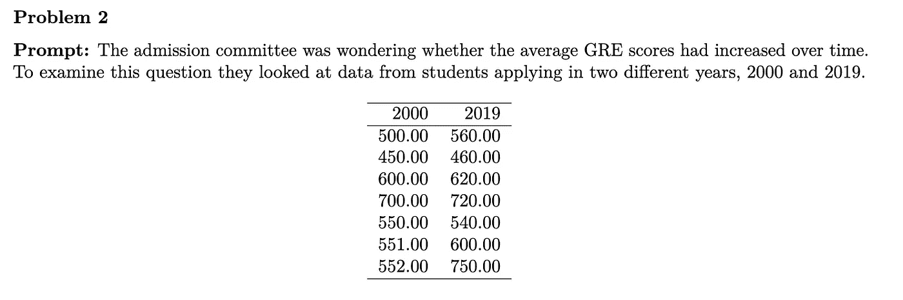
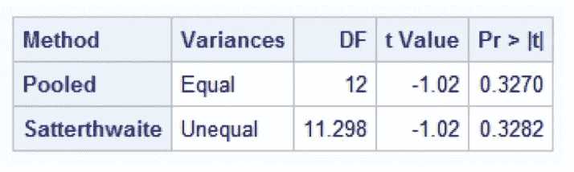

# 置换检验作为使用 R 的双样本 t 检验的替代

> 原文：<https://medium.com/analytics-vidhya/permutation-test-as-an-alternative-to-two-sample-t-test-using-r-9f5da921bc95?source=collection_archive---------5----------------------->

坦率地说，这更证明了我对排列测试的着迷，以及它们相对于传统 t 测试的表现。*这不是对排列测试的全面介绍，但是我将回顾我使用 r 执行的每个步骤。*

通常，当给定两个独立的样本进行比较时，统计学家可能会考虑使用双样本 t 检验，该检验依赖于这样一个假设，即我们从中取样的基本人群遵循正态分布。但是假设我们不知道样本总体的基本分布来证明排列测试。

上面的问题是我作为助教工作的一门课程的家庭作业问题样本，学生们进行了混合方差双样本 t 检验，以比较 2000 年和 2019 年的 GRE 均值。在我对上述相同样本进行排列测试之后，我将在文章的结尾重新讨论 t-test 的解决方案。

上面的 R 代码将 2000 年和 2019 年的数据保存为两个独立的向量。2019 年的平均值是 607.1429，而 2000 年的平均值是 557.5714。相差 49.57143。

现在，让我们使用以下步骤执行双边置换测试:

1.  让我们将两个数据集合并成一个数据集。
2.  我们将每个数据点随机分配到 2000 年或 2019 年，尽管我们需要保持每年的原始样本量(n=7)。
3.  随机化后，我们通过取 2000 年和 2019 年的差异(2019 年 GRE 均值减去 2000 年 GRE 均值)来计算相关统计量。
4.  重复上述步骤，直到我们有 10000 个统计数据。

上面的 R 代码执行步骤 1-4。

5.将等于或大于 49.57143 的统计数字与等于或小于-49.57143 的统计数字相加。*注:49.57143 是我们之前计算的差额。*

6.通过将步骤 5 的总和除以 10000(执行随机化的次数)来计算排列测试的 p 值。

在我揭示两个 GRE 样本的排列 p 值之前，让我揭示一下我用 SAS 为我指定的类编写的参数解。

根据我写的解，双样本 t 检验的 p 值是 0.3270。

**我们的置换 p 值公平与 t 检验 p 值相比如何？**使用我们上面提到的用于排列测试的 R 代码，p 值估计为 0.31888。这个 p 值非常接近双样本 t 检验的 p 值 0.3270。这就是我对排列测试的着迷之处:我们执行的这个“奇怪”的随机化方案非常接近参数 t 检验的结果。这个使用排列测试的发现让我更加欣赏统计学。