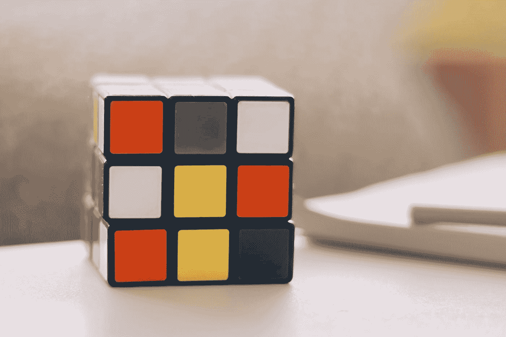
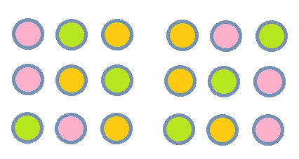
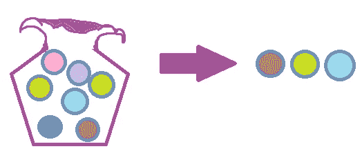
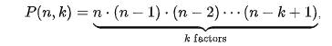
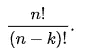
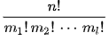
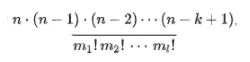

# 排列和阶乘

> 原文：<https://medium.com/analytics-vidhya/permutations-and-factorials-beccb4407dd2?source=collection_archive---------19----------------------->

学习使用数据科学的排列公式集。



让-路易·波林在 [Unsplash](https://unsplash.com?utm_source=medium&utm_medium=referral) 上拍摄的照片

> 上面的魔方表面上的彩色方块可以有多少种不同的排列？

在数据科学中，为特定的实体计算出数据集中可能的排列是很重要的。在本文结束时，您将学会如何计算:

*   阶乘
*   置换和子集置换
*   置换和置换
*   重复排列

你也将能够回答上面关于魔方的问题。

> 在数学中，一个集合的排列，不严格地说，是将其成员排列成一个序列或线性顺序，或者如果集合已经是有序的，则是其元素的重新排列。— [维基百科页面](https://en.wikipedia.org/wiki/Permutation#k-permutations_of_n)

# 排列

排列问题的一般框架是:

> 这里有 n 个对象，我们想知道有多少种可能的排列。对于排列来说，对象的顺序或次序很重要。

一个简单的例子:

三个装在布袋里的粉红色、绿色和橙色的弹珠将被一个接一个地挑选出来。一旦拿出来，它们就不会放回袋子里，记住排列顺序**弹珠的顺序** **很重要。**

这三个弹珠序列的所有可能排列如下:



三个彩色弹珠的排列

有 6 种可能的排列。

我们可以用阶乘来达到同样的结果。最初有 3 个弹珠，所以你有 3 个选择，然后是 2 个..然后 1…

```
3*2*1 = **3!** = 6 
```

**3！**是 3 的阶乘，也就是 3 乘以 2 再乘以 1。

> 通常:n 个不同的对象的排列数是 n 的阶乘。

# 子集的置换

也许我们需要从一个更大的对象池(n)中挑选 K 个对象。那么我们如何计算出所有可能的排列呢？

继续我们的弹珠例子，假设现在袋子里有 7 个不同颜色的弹珠，但我们只需要挑选 3 个，和以前一样，顺序很重要。



插图:藏在布袋中的 7 颗弹珠被取出，形成一个三颗弹珠的序列。

> 有多少种方法可以从 n 个对象的池中选择 k 个元素？

现在有更大的样本量可供选择。但是数学原理是一样的。最初有 7 个弹珠，我们必须从 7 个中选择，然后有 6 个..然后 5…

```
**7*6*5 = 210**
```

从我们的包里拿出来的这些弹珠有 210 种可能的排列。

求解 n 个对象的 k 个元素的排列的一般公式为:



n 公式的 k-置换。[来源](https://en.wikipedia.org/wiki/Permutation#k-permutations_of_n)

> n 个对象的 k 个元素的排列等于 n 乘以 n-1，n-2…到..n-k+1

这适用于我们上面的计算，因为我们从 7 个对象开始，我们的 k 子集是 3:

```
n * n-1...n-k+1 = 7*6*5 = 210 
```

下面是另一个更容易理解的公式，因为它具有视觉吸引力:



n 的 k 置换的另一个公式[来源](https://en.wikipedia.org/wiki/Permutation#k-permutations_of_n)

> n 的阶乘除以 n-k 的阶乘

使用这一点，我们可以为上面的 7 个弹球示例获得相同的结果:

```
7! / (7-3)! = 5040/24 = 210
```

# 置换置换

现在，我们从 7 个弹珠袋中抽出弹珠，记下每个弹珠的颜色，然后放回袋中:

> n 个不同对象的置换数等于 n 的第 j 次幂，其中 j 是“抽取”的次数。

我们还有 7 个物体，我们从袋子里抽取 3 次。因此，替换的可能排列将是:

```
7³ or 7*7*7 = 343
```

# 重复排列

在最后一个例子中，这袋弹珠包含了复制品。如果我们使用任何其他方法来计算排列，我们将计数序列两次。因此，我们需要一种方法来消除可能产生重复结果的排列。


重复排列的图解

使用下面的公式，我们可以计算重复排列来画出所有 7 个弹珠。



用多项式系数计算有重复的多重集的排列。[来源](https://en.wikipedia.org/wiki/Permutation#k-permutations_of_n)

> 一组 n 个对象的重复排列数等于 n 的阶乘除以重复元素的多重性*的阶乘。
> 
> *多样性是元素的重复数

在我们的 7 颗弹珠中，有 3 颗绿色、2 颗青色、1 颗蓝绿色和 1 颗粉红色。因此，元素的多重性对于绿色大理石是 3，对于青色是 2:

```
n!/(m1!*m2!) = 7!/(3!*2!) = 5040/(6*2) = 420
```

因此，如果我们把所有的 7 种排列都画出来，我们上面的弹珠袋中可能的排列是 420。

但是如果我们只抽取一个子集，只从袋子里抽取 3 颗弹珠呢？


重复 k-置换的图解

我们将使用 k 置换公式作为分子，同时使用重复置换公式中的分母:



重复 k 置换的组合公式

k-置换分子:

```
n*n-1 ...to n-k+1 = **7*6*5**
```

带重复分母的排列:

```
n1!*n2*...nj = 3!*2! = 6*2 = 12
```

因此我们的回答是:

```
7*6*5/12 = 17.5
```

# 轮到你了

回到本文的第一个问题。


> 上面的魔方表面上的彩色方块可以有多少种不同的排列？

# 参考

[排列](https://en.wikipedia.org/wiki/Permutation#k-permutations_of_n) —维基百科页面在本文中被大量引用。