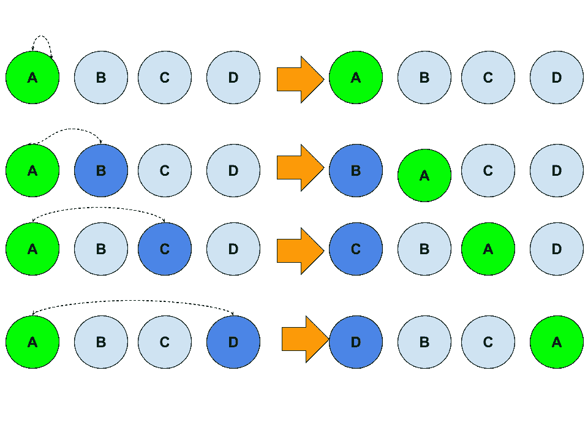
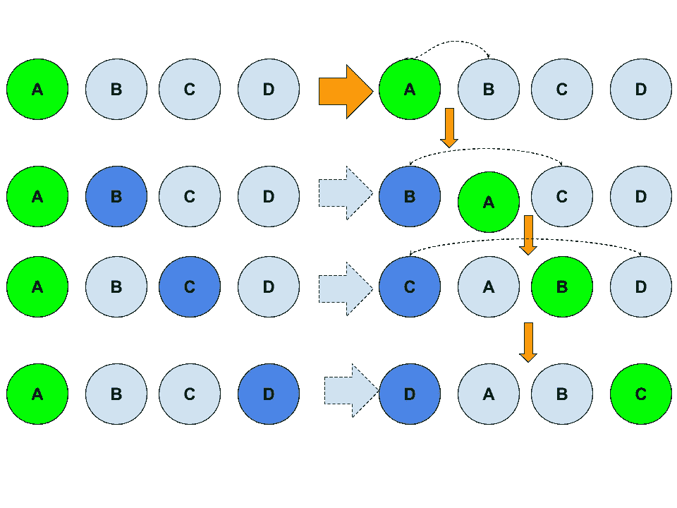
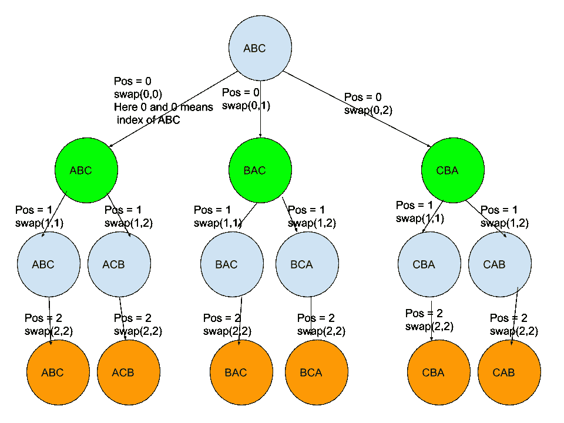

# 排列

> 原文：<https://medium.com/analytics-vidhya/permutations-b7f6054f67f9?source=collection_archive---------9----------------------->

Leetcode 46 问题。

这是一个非常好的问题，因为它触及了算法中最重要的主题，如递归、回溯。这或许可以解释为什么这个问题是一个热门的面试问题。

# 46.排列

[](https://leetcode.com/problems/permutations/) [## 排列- LeetCode

### 提高你的编码技能，迅速找到工作。这是扩展你的知识和做好准备的最好地方…

leetcode.com](https://leetcode.com/problems/permutations/) 

# C++解决方案

## 递归

基本理念:

对于长度为 n 的 num。

我们从 0 到 N-1 中选取 num，然后从剩余的 N-1 个元素中递归生成排列。做完这个，把结果结合在一起。python 递归代码将更清楚地演示这一过程。

我们可以有一个幼稚的方法来接 num[0]到 num[N-1]，它是 swap(0，I)，i in [0，1，2 …N-1]。下图显示了这一过程:



天真地交换。这里我给出 4 个元素来演示

简单交换的问题是在交换之后，剩余的值不是原来的顺序。为了解决这个问题，我们可以使用更智能的交换，如下图所示:



基于以前的互换结果的更聪明的互换可以很好地维持原有的顺序。

下面是基于 smarter swap 的代码。

运行时间

```
/*
jimmy shen
02/20/2020
A code to implement the naive o(n^n) permutation algorithm.
runtime 12 ms 
time complexity O(n!)
space complexity O(n) as we have temp
*/class Solution {
public:
    vector<vector<int>> permute(vector<int>& nums) {
        vector<vector<int>> res;
        recursive_permute(nums, res, 0);
        return res;
    }   
    void recursive_permute(vector<int>&nums, vector<vector<int>> &res, int pos){
        // if we reach the size of nums, we are done.
        vector<int> temp = nums;
        if(pos == temp.size()-1){
            res.push_back(temp);
            return;
        }
        else{
            for(int i=pos; i<temp.size(); i++){
                swap(temp[pos], temp[i]);
                recursive_permute(temp, res, pos+1);
            }
        }
    }
};
```

## 追踪

流程简介:

1.  对于第一层，我们在[0，1，2]中交换(0，i) i。我在交换函数中使用 index 来解释这个想法。在代码中它是 swap(nums[0]，nums[i])
2.  对于第二层，我们从第二个位置开始，重复前面的步骤。
3.  当我们到达叶节点或底部的情况下，我们回溯到前一个节点，并继续遍历。
4.  就是 DFS +回溯。如果你不熟悉 DFS 和回溯。试着谷歌一下，先理解这些概念。



排列过程演示。我使用 ABC，而不是[1，2，3]。想法是一样的。

运行时间

```
Runtime: 8 ms, faster than 98.91% of C++ online submissions for Permutations.Memory Usage: 9.2 MB, less than 95.52% of C++ online submissions for Permutations./*
jimmy shen
02/20/2020
A code to implement the naive o(n^n) permutation algorithm.
runtime 12 ms 
time complexity O(n!)
space complexity O(1)
*/class Solution {
public:
    vector<vector<int>> permute(vector<int>& nums) {
        vector<vector<int>> res;
        dfs(nums, res, 0);
        return res;
    }   
    void dfs(vector<int>&nums, vector<vector<int>> &res, int pos){
        // if we reach the size of nums, we are done.
        if(pos >= nums.size()){
            res.push_back(nums);
            return;
        }
        else{
            for(int i=pos; i<nums.size(); i++){
                swap(nums[pos], nums[i]);
                dfs(nums, res, pos+1);
                //recover the nums to do backtracking
                swap(nums[pos], nums[i]);
            }
        }
    }
};
```

实际上，我们可以发现当 pos 等于 nums.size-1 时，我们就完成了，就好像我们只剩下一个元素，我们不需要交换。所以下面的代码也是有效的。

```
class Solution {
public:
    vector<vector<int>> permute(vector<int>& nums) {
        vector<vector<int>> res;
        dfs(nums, res, 0);
        return res;
    }   
    void dfs(vector<int>&nums, vector<vector<int>> &res, int pos){
        // if we reach the size of nums, we are done.
        if(pos == nums.size()-1){
            res.push_back(nums);
            return;
        }
        else{
            for(int i=pos; i<nums.size(); i++){
                swap(nums[pos], nums[i]);
                dfs(nums, res, pos+1);
                //recover the nums to do backtracking
                swap(nums[pos], nums[i]);
            }
        }
    }
};
```

## 递归和回溯的区别。

本质上，他们有很多相似之处。这是因为递归使用了一种 DFS 方式来解决问题。主要的区别在于回溯，在 DFS 之后，我们交换回来以确保当我们回到父节点时，其他分支的进一步探索将从正确的起点开始。这就是为什么当我们到达 DFS 搜索的底部时，我们需要另一个交换。

对于递归，我们不需要交换回来。然而，我们将原始的 num 复制到 temp，并在此基础上继续进行递归操作。

它们看起来非常相似，但是实现方式略有不同，递归的内存复杂度是 O(n ),其中 n 是 nums 的大小。回溯的是 O(1)。

# Python 解决方案

## 追踪

运行时间

```
Runtime: 36 ms, faster than 83.58% of Python3 online submissions for Permutations.Memory Usage: 13 MB, less than 96.43% of Python3 online submissions for Permutations.class Solution:
    def permute(self, nums: List[int]) -> List[List[int]]:
        res = []
        def dfs(pos):
            if pos==len(nums)-1:
                # using deep copy here to harvest the result
                res.append(nums[:])
            for i in range(pos, len(nums)):
                #swap
                nums[pos], nums[i] = nums[i], nums[pos]
                dfs(pos+1)
                nums[pos], nums[i] = nums[i], nums[pos]
        dfs(0)
        return res
```

## 递归:

运行时间

```
Runtime: 40 ms, faster than 58.63% of Python3 online submissions for Permutations.Memory Usage: 12.9 MB, less than 100.00% of Python3 online submissions for Permutations.class Solution:
    def permute(self, nums: List[int]) -> List[List[int]]:
        if len(nums) <=1:return [nums]
        return [[n]+p
                for i, n in enumerate(nums)
                for p in self.permute(nums[:i]+nums[i+1:]) ]
```

## Python 作弊

Python 有 itertlools.permutations，我们可以直接用。在面试中，如果你被问到如何实现排列，这是不可接受的。然而，当你被问到一个更难的问题时，它将是有用的，其中排列只是那个更难的问题的一个子问题。

```
class Solution:
    def permute(self, nums: List[int]) -> List[List[int]]:
        return [list(perm) for perm in itertools.permutations(nums)]
```

## [47。排列二](https://leetcode.com/problems/permutations-ii)

## 天真的回溯(800 多毫秒)

```
class Solution {
public:
    void backtrack(vector<int>& nums, set<vector<int>>& ret, vector<int> curr, vector<int>& seen) {
        if (curr.size() == nums.size()) {
            ret.insert(curr);
            return;
        }
        for (int j = 0; j< nums.size(); ++j) {
            if (!seen[j]) {
                seen[j] = 1;
                curr.push_back(nums[j]);
                backtrack(nums, ret, curr, seen);
                seen[j] = 0;
                curr.pop_back();
            }
        }
    }
    vector<vector<int>> permuteUnique(vector<int>& nums) {
        vector<int> curr,  seen(nums.size(), 0);
        set<vector<int>> ret;
        backtrack(nums, ret, curr, seen);
        vector<vector<int>> fin_ret(ret.begin(), ret.end());
        return fin_ret;

    }
};
```

更好的(12 毫秒)

```
class Solution {
public:
    vector<vector<int>> permuteUnique(vector<int>& nums) {
        sort(nums.begin(), nums.end());
        vector<vector<int>> perms;
        permute(nums, 0, perms);
        return perms;
    }
private:
    void permute(vector<int> nums, int start, vector<vector<int>>& perms) {
        int n = nums.size();
        if (start == n - 1) {
            perms.push_back(nums);
        } else {
            for (int i = start; i < n; i++) {
                if ((i == start) || (nums[i] != nums[start])) {
                    swap(nums[i], nums[start]);
                    permute(nums, start + 1, perms);
                }
            }
        }
    }
};
```

感谢阅读。任何意见，让我知道。