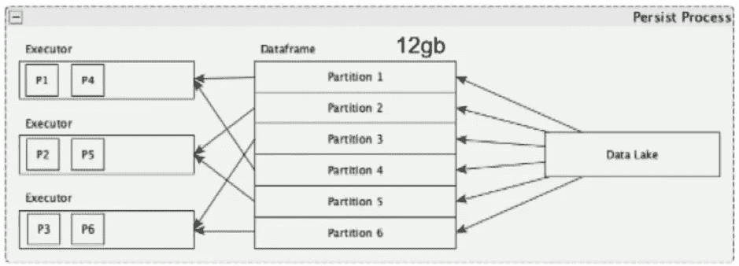
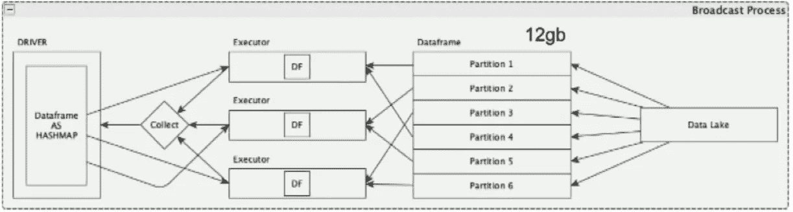

# 持久性与广播

> 原文：<https://medium.com/analytics-vidhya/persistence-vs-broadcast-625265320bf9?source=collection_archive---------2----------------------->

大多数人并不清楚保存数据帧和广播数据帧之间的区别。让我为你简化一下。

**持续进程**

持续流程

让我们考虑一下，您有一个大小为 12 GB 的数据帧，6 个分区和 3 个执行器。每个分区将有 2 GB 的数据在内存中，每个执行器将读取 2 个分区，因此每个执行器将有 4 GB 的数据在内存中。

> 这里需要注意的一个关键点是，每个执行器中的持久化数据将被存储在存储内存*中。*

**持久化—序列化**

**播出流程**

广播过程

让我们考虑一下，我们有相同的设置—大小为 12 GB 的数据，6 个分区和 3 个执行器。Spark 从每个分区读取数据的方式与它在 Persist 期间读取数据的方式相同。但是它将把执行器中的数据存储在工作内存*中*，并且将占用相同的空间量(每个执行器 4 GB)。

> 每个执行器将有 2 个分区，总共 12 GB

现在，数据从工作存储器通过*收集*过程被拉至*驱动器。*驱动程序将数据帧转换为可广播对象( *Hashmap)。*

> 这个 Hashmap 对象的大小为 12 GB。

最后，这个对象将被发送到每个执行者。

> 每个执行器上的 12 GB 对象

广播期间在执行器上使用的总空间将是数据的实际大小和每个执行器中广播对象的大小，结果是 x + n(x)。其中 x 是数据的大小，n 是执行器的数量。

在这种情况下，用于广播的总空间将是 12 + 3(12) = 48 GB。

> 需要注意的一点是，所有这些空间都将从工作内存中被利用。

在垃圾收集器运行并清除存储在执行器中的数据分区之前，情况一直如此。一旦垃圾收集器清除了数据，您将最终得到 36gb——这是每个执行器上广播对象的总大小。

如果需要了解执行器中的工作记忆和存储记忆，请参考文章—[https://medium . com/@ thar un 026/spark-Memory-management-583 a16 c 1253 f](/@tharun026/spark-memory-management-583a16c1253f)

本文是来自 Databricks spark summit 的 Daniel Tomes 视频的抄本。