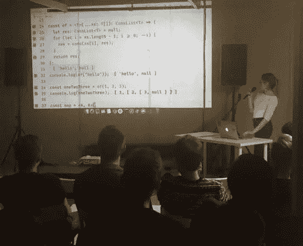
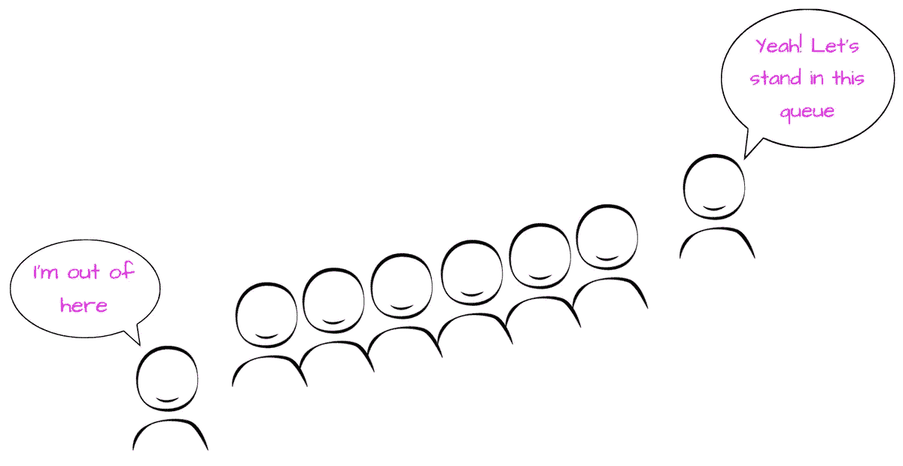
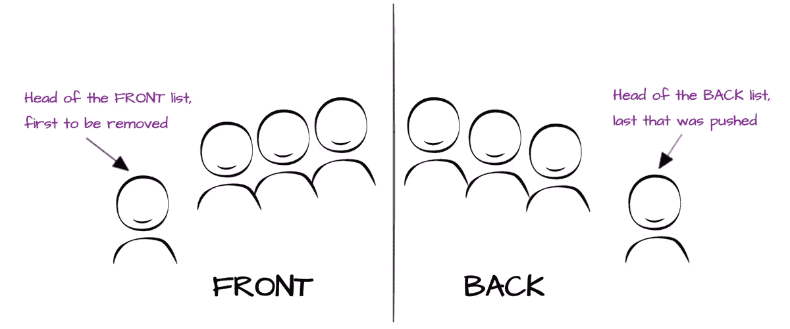
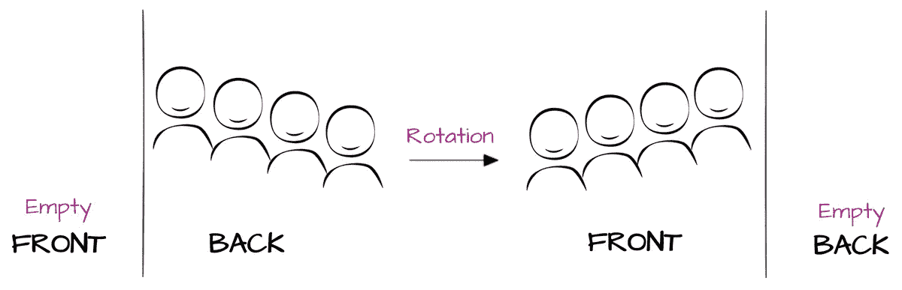

# 得益于递归类型别名的持久数据结构

> 原文：<https://medium.com/analytics-vidhya/persistent-data-structures-thanks-to-recursive-type-aliases-cf576643380f?source=collection_archive---------14----------------------->

*也发表于*[](https://www.aleksandra.codes/type-inference)*。*

**

*众所周知，易变性是邪恶的，而且常常是麻烦的。但是，在某些情况下，可变数据结构实现起来更简单，性能也更好，这也是事实。有时候，你可以顺其自然，完全没问题，但其他时候不变性是必需的。现在让我们把重点放在数组上。如果你想以一种不可变的方式将一个项目追加或前置到列表中，你会怎么做？浅抄？深度复制(天理不容)？这些操作是昂贵的。它们有更大的渐近时间复杂度——O(n)，而我们想要的是 O(1)。在本文中，我将展示一个简单的数据结构来实现这一点。*

*我现在引起你的注意了吗？所以，我们开始吧！*

# *持久与不可变的数据结构🔎*

*首先，我需要坦白。在相当长的一段时间里，我认为持久结构就是不可变的结构。相当蹩脚。然后我了解到，当数据结构被修改时，如果它保留了以前的版本，那么它就是持久的。好像它永远不会忘记自己是谁。事实上，它们实际上是不可变的，但是反过来就不行了。不可变的数据结构不一定是持久的。*

*你可以在这里阅读更多相关信息[。](https://en.wikipedia.org/wiki/Persistent_data_structure)*

# *满足缺点列表*

*这就是了。演出的明星👏*

*首先，让我们关注一下*缺点*是什么意思。所以…这是一个函数。更重要的是，这是许多编程语言的基本功能。尤其是在 Lisp 方言中。它接受两个对象或指向对象 x 和 y 的指针，以及保存 x 和 y 的内存中的 cons 对象。你可能以前见过这个:*

*   ***1::[2]** : ML，Scala，F#和 Elm*
*   ***1:[2]** :哈斯克尔*
*   ***(cons 1 2)** : Lisp 及其方言*

*以上是列表数据结构的 **cons** tructors。*弊单*也叫*链表*，我猜这是一个更容易辨认的名字。*

*我们可以用下面的方式将*缺点列表*可视化:*

```
*┌────────────┐     ┌────────────┐     ┌────────────┐
│  1  | tail │   ┌─│  2  | tail │   ┌─│  3  | null │
└────────│───┘   │ └────────│───┘   │ └────────────┘
         └───────┘          └───────┘
a linked list of (1, 2, 3)*
```

# *是如何坚持下来的？*

*有几个词是关于持久数据结构的，所以你可能想知道 cons list 是否是持久的。是的，它是！让我们看看怎么做。*

*假设我们有一个 cons 列表— **xs** ，我们想在其中加入一个元素。它产生了一个全新的列表 **ys** ，你可以注意到来自 **xs** 的物品现在在 **xs** 和 **ys** 之间共享。因此列表 **xs** 没有被修改，它是新列表 **ys** 的一部分。*

```
*xs                           ys
┌──│──┐                      ┌──│──┐
│  3  │                      │  4  │
└──│──┘                      └──│──┘
┌──│──┐                     xs  │
│  2  │    cons 4 xs →       └─┌┘
└──│──┘                     ┌──│──┐
┌──│──┐                     │  3  │
│  1  │                     └──│──┘
└─────┘                     ┌──│──┐
                            │  2  │
                            └──│──┘
                            ┌──│──┐
                            │  1  │
                            └─────┘*
```

# *它在 TypeScript 3.7 中的样子*

*我可以用下面的方式编写 cons 列表的类型，由于 TypeScript 3.7 中引入的递归类型别名，它可以完美地工作。*

```
*export type ConsList<T> = null | readonly [T, ConsList<T>];*
```

*在 3.7 之前，我会得到以下错误:*

> **类型别名“ConsList”循环引用自身。ts(2456**

*长话短说，类型别名需要被急切地构建，所以你不能在右边有和左边一样的东西，因为编译器会试图用后者替换前者，然后用前者替换后者，等等…你可以在 [TypeScript 3.7 公告](https://devblogs.microsoft.com/typescript/announcing-typescript-3-7-rc/#more-recursive-type-aliases)上读到更多关于它的内容。*

# *在 ConsList 上操作的函数*

*好了，我们已经对什么是*缺点列表*有了一些了解。现在是时候看看我们能用它做什么以及如何让它变得有用了。缺点列表可能会成为数组不可变的替代品。这意味着我们可以期待它的一些功能。再补充一些吧！*

*   *将元素添加到列表中*

```
*function cons<T>(h: T, t: ConsList<T>): ConsList<T> {
  return [h, t];
}*
```

*   *从列表中提取头尾*

```
*function head<T>(xs: ConsList<T>): T {
  if (!xs) {
    throw new Error("can't take head of empty ConsList");
  }
  return xs[0];
}function tail<T>(xs: ConsList<T>): ConsList<T> {
  if (!xs) {
    throw new Error("can't take tail of empty ConsList");
  }
  return xs[1];
}*
```

*   *在上面画地图。*

> **注:*弊单*带*图*不再持久。这是不可改变的。为了使它持久，我们需要记住以前的版本。我现在跳过它。**

```
*function map<A, B>(xs: ConsList<A>, f: (a: A) => B): ConsList<B> {
  let res: ConsList<B> = null;
  while (xs) {
    const [head, tail] = xs;
    res = [f(head), res];
    xs = tail;
  }
  return reverse(res);
}*
```

*   *减少它*

```
*function reduce<T, R = T>(
  xs: ConsList<T>,
  reducer: (acc: R, val: T) => R,
  initialValue: R
): R {
  while (xs) {
    const [head, tail] = xs;
    initialValue = reducer(initialValue, head);
    xs = tail;
  }
  return initialValue;
}*
```

*   *从数组构造一个新的*缺点列表*，反之亦然*

```
*const of = <T>(...xs: T[]): ConsList<T> => {
  let res: ConsList<T> = null;
  for (let i = xs.length - 1; i >= 0; --i) {
    res = cons(xs[i], res);
  }
  return res;
};function toArray<T>(xs: ConsList<T>) {
  return reduce<T, T[]>(
    xs,
    (a, v) => {
      a.push(v);
      return a;
    },
    []
  );
}*
```

*   *逆转它*

```
*function reverse<T>(xs: ConsList<T>): ConsList<T> {
  return reduce(xs, (acc, v) => cons(v, acc), null as ConsList<T>);
}*
```

*   *串联两个*缺点列表**

```
*function concat<T>(xs: ConsList<T>, ys: ConsList<T>): ConsList<T> {
  return xs ? cons(head(xs), concat(tail(xs), ys)) : ys;
}*
```

*到目前为止，一切顺利。我现在停下来。它已经很强大了💪*

# *🛠的真实使用案例*

*你可能已经注意到了，*缺点列表*让我们可以快速访问列表的第一个元素。这意味着我们可以预先考虑列表，并以极快的速度从列表中取出第一个元素。事实上，堆栈(或*后进先出队列*)就是基于这两种操作的数据结构。压入栈只是在做*弊列表*上的*弊*，pop 是提取头。在常见的堆栈命名法中，应该是这样的:*

```
*const push = cons;
const pop = tail;
const peek = head;*
```

*太好了！我们毫不费力地完成了堆叠。没有任何修改也没有任何新代码。这个很简单，现在是做更复杂的事情的时候了。先进先出队列。当我们从前面获取元素并推到最后时的结构。因此，我们需要快速访问列表的第一个和最后一个元素。突变和指针非常简单。我们只需要为第一项和最后一项维护两个指针。但是我们没有突变。取而代之的是我们的*缺点清单*！*

**

*有一个聪明的家伙叫 Chris Okasaki，他想出了一个聪明的方法来实现一个有效的、不可变的 FIFO quque，使用一对两个*缺点列表* **(前，后)**。他们分别代表队列的前面和后面。但是**后面的**是反过来的，所以这个链表的头是队列的最后一个元素。*

```
*type Queue<T> = {
  front: ConsList<T>;
  back: ConsList<T>;
};*
```

*该结构的要点:*

*   *当我们想要将一个项目推入队列时，我们需要将它前置到**后面***
*   *当我们想要弹出一个项目时，我们需要从**前端**提取头部*

**

*当我们不断地将元素放入队列时，它们都将进入后面的列表。假设我们从 1 到 5 按下了一个又一个数字。这意味着我们的结构看起来会像这样:*

```
*{ front: null, back: [5, [4, [3, [2, [1, null]]]]]}*
```

*前面的列表是空的。那么，我们如何从中提取一个元素呢？那是最好的部分。我们轮流值班。这意味着我们将**返回**列表，反转它，将其附加为新的前端，并使**返回**为空。*

**

*下面是整个实现:*

```
*const empty = <T>(): Queue<T> => ({
  front: null,
  back: null,
});const isEmpty = (queue: Queue<unknown>) => (queue.front || queue.back) === null;const enqueue = <T>(x: T, { front, back }: Queue<T>) => ({
  front,
  back: ConsList.cons(x, back),
});const dequeue = <T>(queue: Queue<T>): [T | null, Queue<T>] => {
  const { front, back } = queue;
  if (front) {
    const [value, newFront] = front;
    return [value, { back, front: newFront }];
  } if (back) {
    return dequeue({
      back: null,
      front: ConsList.reverse(back),
    });
  } return [null, queue];
};*
```

## *何时不使用缺点列表*

*   *它不是 Array 的替代品。*
*   *它不是一个随机访问列表(因此我甚至没有实现它)，所以如果你想快速随机访问，那么最好使用数组。*

# *⌛️基准*

*你可能想知道使用*缺点列表*是否有所回报。事实上，确实如此！我做了一些基准测试来比较 Array 和 *cons list* 上的操作，结果令人激动！下面是基准测试的要点。*

*基准测试非常简单，这里的数字来自于在固定大小的 10000 个数字的输入上运行它们。*

# *可变操作与缺点*

*a . un shift(50)*99953.939 ops/s**

*a .推(50) *70675.276 ops/s**

*cons(50，l) *5822999.798 ops/s**

# *不可变操作与缺点*

*12680.588 ops/s*

*[…a，50] *38113.025 ops/s**

*cons(50，l) *5485947.933 ops/s**

# *Array.prototype.map vs map*

*array.map(x => x * 2) 4389.837 操作/秒*

*map(列表，x => x * 2) 662.805 操作/秒*

*我希望上述基准能够说明问题。*

# *资源📚*

*[变更日志](https://devblogs.microsoft.com/typescript/announcing-typescript-3-7-rc/#more-recursive-type-aliases)*

*[持久数据结构](https://www.aleksandra.codes/(https://en.wikipedia.org/wiki/Persistent_data_structure))*

*[缺点](https://en.wikipedia.org/wiki/Cons)*