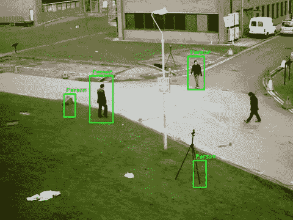

# 在 Python-Windows 和 macOS 中实时检测人/行人并录制视频

> 原文：<https://medium.com/analytics-vidhya/person-pedestrian-detection-in-real-time-and-recorded-videos-in-python-windows-and-macos-4c81142f5f59?source=collection_archive---------8----------------------->

视频来源于宝莱坞歌曲 *Birju* 的前 10 秒

人员检测是目前公司和组织广泛使用的功能之一。这项技术使用计算机视觉来检测人，通常是过马路的行人，或者识别房屋周围的任何运动。

在这个项目中，我们将通过简单的步骤用 python 创建一个人检测系统。

我们首先安装 OpenCV(开源计算机视觉)库，该库旨在帮助开发人员执行与计算机视觉相关的任务。我们需要为 OpenCV 库做一个 pip 安装。

```
install opencv-python
```

# 现在让我们用 Python 来构建这个系统

我们已经安装了所需的库。该技术的工作方式是，我们在要检测的对象(本例中为人)的各种图像参数上训练模型，用于识别我们目标中的对象。

可以把它想象成任何机器学习模型的训练和测试数据集。

在这种情况下:

**训练数据集:**。捕获目标对象图像细节的 xml 文件

**测试数据集:**直播流视频/录制视频

完整代码的链接可以在本文末尾找到。我将分步分块地解释代码，以帮助您理解它是如何工作的:

**第一步:**打开 Spyder

**第二步:**导入库

```
import cv2
```

**步骤 3:** 将输入引用到您的网络摄像头或保存在硬盘上的视频文件(mp4 格式)

```
**Webcam:** cap = cv2.VideoCapture(0)
**Video:** cap = cv2.VideoCapture(**<enter file path.mp4>**)
```

**第 4 步:**我们将使用一个预先训练好的。xml 文件，包含使用个人图像构建的人(全身)的数据。你可以在这里下载文件

```
pedestrian_cascade = cv2.CascadeClassifier(**<enter file path>**/haarcascade_fullbody.xml’)
```

**第五步:**视频分帧，代码一次读取一帧。在每一帧中，我们使用上面导入的 API 来检测人在帧中的位置。对于每一个被检测到的人，我们定位坐标并在它周围画一个矩形，然后将视频发布给观众。

完整的代码如下所示——代码下面有解释

```
while True:
    # reads frames from a video
    ret, frames = cap.read()
    # convert to gray scale of each frames
    #gray = cv2.cvtColor(frames, cv2.COLOR_BGR2GRAY)
    # Detects pedestrians of different sizes in the input image
    pedestrians = pedestrian_cascade.detectMultiScale( frames, 1.1, 
    1)
    # To draw a rectangle in each pedestrians
    for (x,y,w,h) in pedestrians:
        cv2.rectangle(frames,(x,y),(x+w,y+h),(0,255,0),2)
        font = cv2.FONT_HERSHEY_DUPLEX
        cv2.putText(frames, 'Person', (x + 6, y - 6), font, 0.5, (0, 
        255, 0), 1)
        # Display frames in a window
        cv2.imshow('Pedestrian detection', frames)
    # Wait for Enter key to stop
    if cv2.waitKey(33) == 13:
        break
```

**模块 1:**

```
# reads frames from a video
 ret, frames = cap.read()
 # convert to gray scale of each frames
 gray = cv2.cvtColor(frames, cv2.COLOR_BGR2GRAY)
```

视频是按单个帧读取的。接下来，帧被转换为灰度，这有助于快速检测人类。图像转换为灰度的原因是，训练数据集是以灰度构建的，以减小文件的大小。

第二区:

```
# Detects pedestrians of different sizes in the input image
    pedestrians = pedestrian_cascade.detectMultiScale( gray, 1.1, 1)# To draw a rectangle in each pedestrians
    for (x,y,w,h) in pedestrians:
        cv2.rectangle(frames,(x,y),(x+w,y+h),(0,255,0),2)
        font = cv2.FONT_HERSHEY_DUPLEX
        cv2.putText(frames, 'Person', (x + 6, y - 6), font, 0.5, (0, 
        255, 0), 1)
```

代码的第一部分检测帧中的人，并存储他们的坐标(x、y 轴，以及人的宽度和高度)。第二部分在检测到人的区域周围绘制一个矩形，并在矩形上方显示文本“person”。您可以更改文本的字体，代码(0，255，0)是 B-G-R 序列中矩形和文本的颜色代码。

**第三块:**

```
# Display frames in a window
        cv2.imshow('Pedestrian detection', frames)
# Wait for Enter key to stop
    if cv2.waitKey(33) == 13:
        break
```

结果图像(帧)被释放给查看者，并且循环继续运行，直到用户按下键盘上的回车键。

**第六步:**所有拍摄的视频必须发布。

```
cap.release()
cv2.destroyAllWindows()
```

# 在命令行中运行程序

下一步是[保存](/@venkatesh.chandra_75550/saving-output-of-object-recognition-in-macos-opencv-python-5914bb5d9ca8)文件。py 格式并在命令行/Anaconda 提示符下运行它。

我在 Anaconda 提示符下运行它，首先使用命令 cd 导航到该文件夹。

我在 Anaconda 提示符下运行它，首先使用命令 cd 导航到该文件夹。

```
cd <folder path>
```

运行 python 文件

```
python filename.py
```

您将看到一个弹出窗口，视频正在播放。视频可能会很慢，这是因为 OpenCV 中的帧数通常很大。但是，如果将视频保存在硬盘上，写入的视频速度并不慢，并且与输入视频的 fps(每秒帧数)相匹配。



在方框周围显示检测的置信度通常有助于减少错误分类

你可以在这里下载更多免费视频。

**哒哒！你现在可以很容易地发现窃贼和安全。将它与警报系统集成在一起以确保安全。**

**玩玩模仿人类行走方式的两足动物和机器人，并在下面的评论区告诉我进展如何。**

面对问题？发布您的查询。

# 用例

*   教师可以使用此功能来记录出勤情况
*   估计人群中的人数——避免骚乱等。

# 编码

[](https://github.com/chandravenky/Computer-Vision---Object-Detection-in-Python/tree/master) [## chandravenky/Python 中的计算机视觉对象检测

### 此时您不能执行该操作。您已使用另一个标签页或窗口登录。您已在另一个选项卡中注销，或者…

github.com](https://github.com/chandravenky/Computer-Vision---Object-Detection-in-Python/tree/master) 

# 相关链接

[**使用 OpenCV 的 Python 中的车辆检测— Windows 和 macOS**](/@venkatesh.chandra_75550/vehicle-car-detection-in-real-time-and-recorded-videos-in-python-windows-and-macos-c5548b243b18)

[**Python 中的实时人脸检测系统——Windows 和 macOS**](/@venkatesh.chandra_75550/real-time-webcam-face-detection-system-using-opencv-in-python-windows-and-macos-86c31fddd2bc)

[**Python 中录制视频的人脸检测— Windows 和 macOS**](/@venkatesh.chandra_75550/face-detection-on-recorded-videos-using-opencv-in-python-windows-and-macos-407635c699)

[**在 macOS 中保存物体识别输出**](/@venkatesh.chandra_75550/saving-output-of-object-recognition-in-macos-opencv-python-5914bb5d9ca8)

# 去哪里找我🤓

1.  在[LinkedIn](https://www.linkedin.com/in/venkateshchandra/)/[GitHub](https://github.com/chandravenky)/[我的网站](http://chatraja.com/)上与我联系
2.  感觉大方？在这里给我买杯咖啡☕️