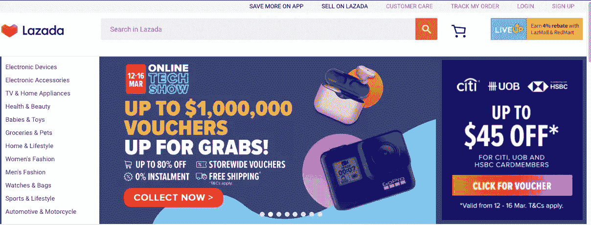
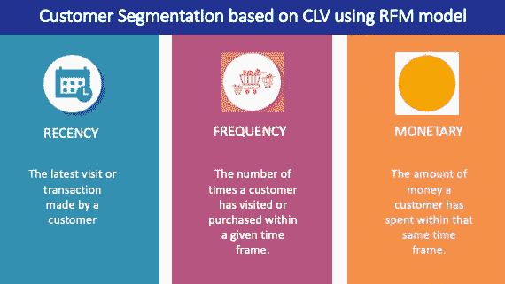
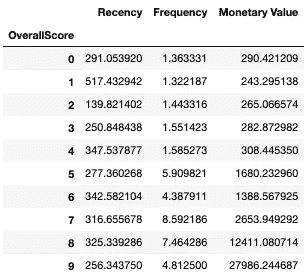
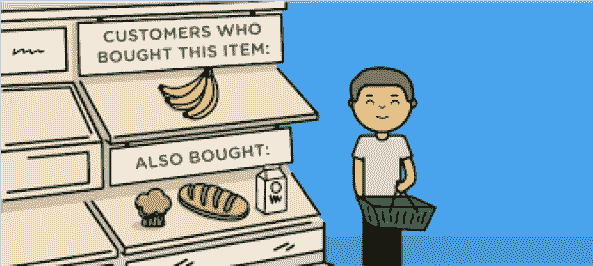
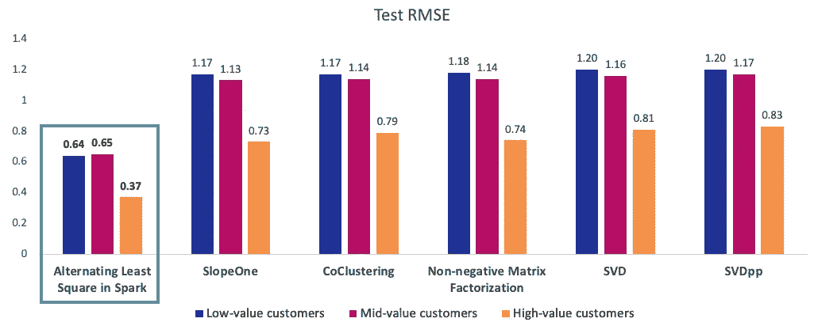
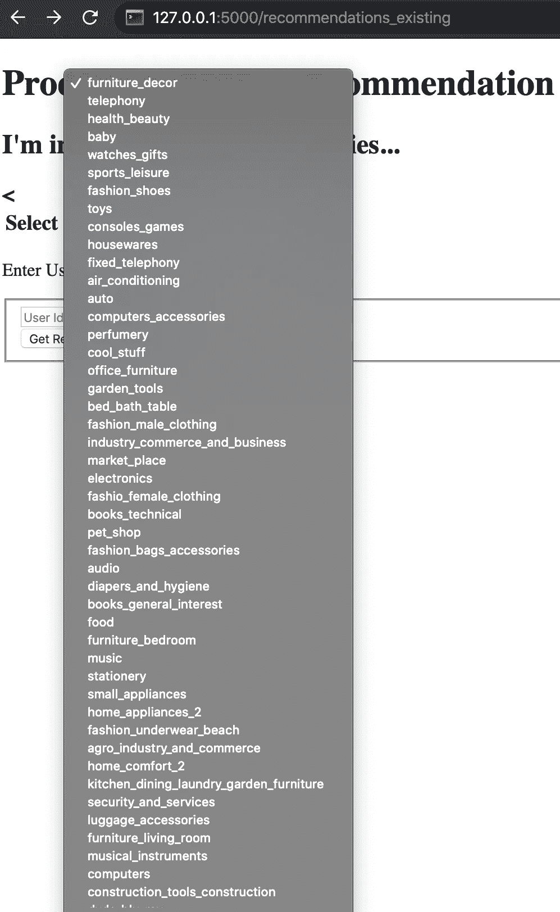
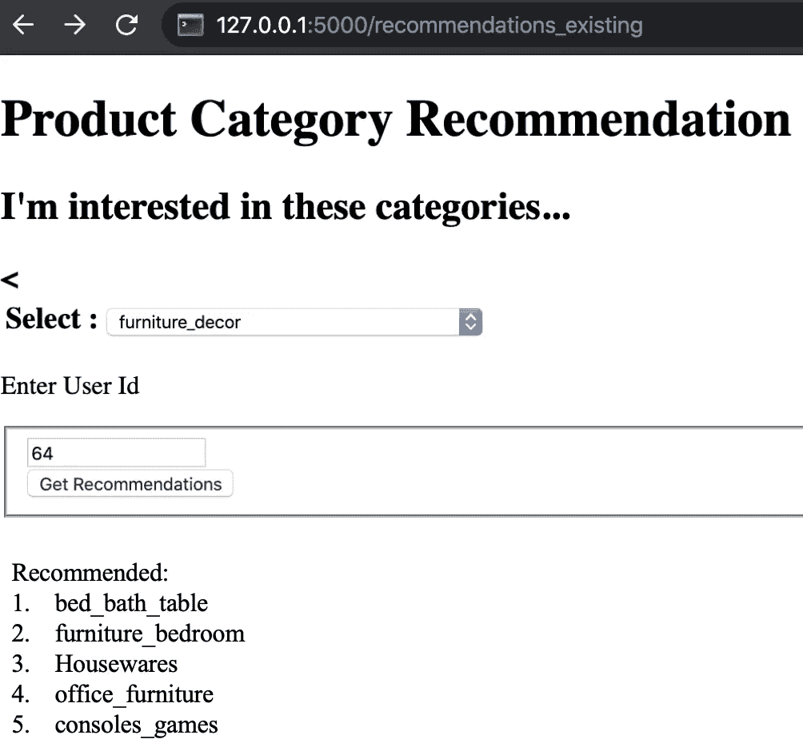

# 基于客户终身价值和电子商务产品评级的个性化产品推荐

> 原文：<https://medium.com/analytics-vidhya/personalised-recommendations-based-on-customer-segmentation-and-e-commerce-product-ratings-6465b8877815?source=collection_archive---------12----------------------->

# 背景

在线内容和服务的爆炸式增长为用户提供了无数的选择。例如，在电子商务网站或应用程序上，向用户提供的产品数量超过了用户可以消化的数量。想象一下，你必须在网站 A 上搜索多个页面来找到感兴趣的商品，但却一无所获。因此，你去网站 B，同样的项目显示给你一进入。你认为 A 平台失去的只是你的订单吗？不──它可能会损失十几倍，可能是你作为客户的终身价值加上推荐。平台 B 成功地获得了它，可能是因为它有一个合适的推荐引擎。因此，个性化推荐对于改善用户体验和确保留存是非常必要的。愉快和方便的用户体验的必然结果是增加企业利润。

在为不同的用户策划一套产品之前，有必要更好地了解他们。每位顾客都是独一无二的。因此，如果你以同样的方式对待他们，同样的内容，同样的渠道，同样的重要性，他们会找到另一个更了解他们的选择。你的一些用户可能每周购买少量商品，其他人可能一年购买一次大宗商品——还有介于两者之间的各种组合。你怎么可能预见到他们可能会购买什么，并相应地推荐给他们呢？

# 客户细分

顾客终身价值(CLV)揭开了了解当前和未来顾客行为的神秘面纱。CLV 会告诉你特定类型的顾客购买的频率，以及这些顾客何时会永远停止购买。量化 CLV 的一种方法是通过使用最近频率货币价值( **RFM** )模型。

*   新近性:最近购物的顾客比很长时间没有购物的顾客更有可能再次购物。
*   频率:经常购物的顾客比很少购物的顾客更有可能继续回来。
*   货币价值:购买量大的顾客比花费少的顾客更有可能回来

我应用 k-means 聚类来分配最近得分，并使用肘方法来确定最佳的聚类数。该框架用于得出频率得分和货币价值得分。基于这三个分数的总和计算总分数。

各种总体得分的近期、频率和货币值得分的平均值

上面的评分告诉我们，得分为 9 的客户是我们最好的客户，而得分为 0 的客户是最差的。为了简单起见，我们衍生了三类客户——低价值、中价值和高价值客户。

*   **低价值**:不太活跃的客户，不是经常购买的客户，收入很低(即得分从 0 到 3 的客户)。
*   **中值**:一切事物的中间。经常使用我们的平台(但不像我们的高价值产品那样多)，相当频繁，并产生中等收入(即得分从 4 到 5 的产品)。
*   **高值**:高收入、高频率、低不活跃(即 6 分及以上)。

# 推荐系统

然后为每个客户开发协同过滤模型。协同过滤(CF)是一种通过从许多其他用户收集品味或偏好信息来预测用户兴趣的技术。它假设如果用户 A 和 B 喜欢产品 1，A 更有可能对另一个产品有 B 的偏好(即基于用户的 CF)。基于项目的 CF 和矩阵分解是 CF 的其他方法。我使用矩阵分解是因为

1.  这是针对稀疏数据问题的最先进的解决方案，适用于大多数用户只对一个产品类别评价一次的数据集。
2.  它的工作原理是将用户-项目矩阵分解成用户和项目表示的乘积。
3.  它允许我们发现潜在的(隐藏的)用户和商品之间交互的特征(在这个例子中，我使用了产品类别，因为在产品 ID 级别没有相应的标签)。因此，不太知名的类别可以具有与流行类别一样多的丰富的潜在表示，这提高了推荐器推荐不太知名的类别的能力。
4.  它避免了必须知道关于项目内容的相关信息(例如项目名称)的问题，这在该数据集中是不可用的。

我选择 Spark 中实现的交替最小二乘(ALS)是因为它是一种针对大规模协同过滤问题设计的并行算法。这种方法在解决用户简档的可伸缩性和稀疏性方面做得很好，并且它很简单，可以很好地扩展到非常大的数据集。此外，与 SlopeOne、协同聚类、非负矩阵分解(NMF)和奇异值分解(SVD)等其他矩阵分解方法相比，它的性能更好，因为它具有更低的均方根误差(RMSE)。小于 1 的 RMSE 意味着预测和实际评级之间的平均误差项小于 1。

测试 RMSE 的各种矩阵分解方法

我还在 k 使用了 Precision 和 recall 来评估 ALS 模型。k 处的精度是前 k 个集合中相关的推荐项目的比例。所有三个客户在 10 时的精度始终接近 100%。这表明，如果向客户推荐了 10 种产品，几乎所有的产品都会被购买。另一方面，所有三个客户在 10 点时的召回率始终接近 88%。这意味着，如果客户购买了 10 件产品，我们的推荐会显示其中接近 9 件。

协同过滤方法适用于现有用户，因为我们对他们的 CLV 有先验知识。然而，我们不知道如何量化新用户的 CLV。因此，为新用户创建了推荐流行产品的基于流行度的模型。一个类别的受欢迎程度评级是其全球平均评级和收到的评级数量的函数。排名前五的类别是家具装饰、电话、健康美容、婴儿用品和手表。由于这个基于流行度的模型是基于现有客户的购买，我可以通过比较新用户是否确实购买了流行的商品类别来评估模型的性能。

# 构建 Flask 应用程序

作为一个最低可行的产品，我创建了一个 Flask 应用程序，现有用户可以输入他们的用户 ID，并根据他们的 CLV 实现不同的推荐系统。

主页

现有客户可以选择他们感兴趣的产品类别和他们的用户 ID

基于用户 64 对家具装饰的兴趣推荐的类别

# 未来的工作

1.  精确度和回忆分数似乎好得令人难以置信。我可以按时间顺序排列观察结果，并使用分块时间序列分割法，再次评估模型，而不是目前随机的 80–20 训练测试分割法。
2.  制定规则，使新用户从使用基于流行度的模型过渡到基于协作的系统。购买几次后，我可以推断他或她的 CLV，确定他或她是高价值、中价值还是低价值客户，并相应地使用适当的模型进行推荐。
3.  探索使用[自动编码器](https://towardsdatascience.com/deep-autoencoders-for-collaborative-filtering-6cf8d25bbf1d)或强化学习的基于协作的推荐系统是否可以导致更好的模型性能。我可以从一个简单的自动编码器开始，将用户-产品矩阵作为输入，看看这个模型能在多大程度上再现这个矩阵。之后，我可以尝试一个深度自动编码器，嵌入更多隐藏层，从数学上学习数据中更复杂的底层模式。这篇关于强化学习的[论文](http://www.personal.psu.edu/~gjz5038/paper/www2018_reinforceRec/www2018_reinforceRec.pdf)提出了一个基于深度 Q 学习的推荐框架，它可以显式地对未来的回报进行建模。
4.  为了最大限度地减少与基于流行度的推荐系统相关的用户冷启动问题，个性化不可用，因为它推荐的是当前流行的项目，我可以探索[多臂土匪算法](https://towardsdatascience.com/solving-cold-user-problem-for-recommendation-system-using-multi-armed-bandit-d36e42fe8d44)如何为新用户探索/利用最佳推荐。

非常感谢您的阅读:)如果您喜欢，请点击下面的掌声按钮，这对我意义重大，也有助于其他人了解这个故事。通过联系 [*Linkedin*](https://www.linkedin.com/in/valerie-lim-yan-hui/) *让我知道你的想法。*

> 请随意查看:
> 
> [*Github 知识库本帖*](https://github.com/valerielimyh/Customer_segmentation_and_personalised_recommendation)
> 
> [*我的其他中等帖子*](/@valerielimyh)