# 使用机器学习的个性化癌症诊断

> 原文：<https://medium.com/analytics-vidhya/personalized-cancer-diagnosis-3d6f09a6b8c9?source=collection_archive---------1----------------------->

## 探索性数据分析和不同的机器学习模型应用于诊断癌性肿瘤。

照片由[德鲁·海斯](https://unsplash.com/@drew_hays?utm_source=medium&utm_medium=referral)在 [Unsplash](https://unsplash.com?utm_source=medium&utm_medium=referral) 上拍摄

如果你对代码更感兴趣，你可以直接进入这个[库](https://github.com/tulasiram58827/Cancer-Diagnosis)

# 癌症基本上是什么？

我们的身体由数万亿个细胞组成，这些细胞不断死亡和再生。正常情况下，一个细胞分裂，并利用一种叫做 DNA 的遗传蓝图进行自我复制。偶尔，DNA 蓝图有时会被破坏，因此细胞不听身体信号，继续分裂形成肿瘤。

# 我们需要解决的业务问题是什么？

让我们简单讨论一下数据和业务问题，因为理解我们正在解决的业务问题是非常重要的。

当一名患者似乎患有癌症时，我们从患者身上提取肿瘤样本，并对 DNA 进行基因测序。一旦测序，一个肿瘤可以有数千种基因突变。简而言之,“突变”是导致癌症的基因的微小变化。更重要的一点是，对于每一个基因，都有与之相关的变异。现在在基因及其变异的帮助下，我们必须分类它属于哪一类(我们总共有 9 类)。只有部分类属于巨蟹座。

让我们更清楚地了解一下工作流程。

来源:[https://www . ka ggle . com/c/MSK-重新定义-癌症-治疗/讨论/35336#198462](https://www.kaggle.com/c/msk-redefining-cancer-treatment/discussion/35336#198462)

1.  分子病理学家选择他/她想要分析的感兴趣的遗传变异的列表。
2.  分子病理学家在医学文献中寻找与感兴趣的遗传变异有关的证据。
3.  最后，分子病理学家花费大量时间分析与每个变异相关的证据，以对它们进行分类。

在这里，通过步骤 1 和 2 可以很容易地完成，用更少的时间。但是第三步非常耗时。我们的目标是用机器学习模型取代第三步。

因此，问题陈述是基于来自基于文本的临床文献或研究论文的证据对遗传变异进行分类。

正如我们所说，我们必须对基因变异进行分类——这意味着这是一个分类问题。因为有 9 个类别，所以这是一个多类别分类问题。

了解问题的业务限制是最重要的。如果我们不知道业务约束，我们训练的模型就不能投入生产。

## **该问题的业务约束:**

1.  算法的可解释性是必须的，因为癌症专家应该理解为什么模型被赋予特定的类别，以便他可以向患者解释。
2.  没有低延迟要求，这意味着患者可以等待结果。由于没有低延迟要求，我们可以应用复杂的机器学习模型。
3.  错误是非常昂贵的。
4.  需要的是属于某个类别的概率，而不是它属于某个特定的类别。

**将现实世界/商业问题映射到机器学习问题:**

1.  正如我们已经提到的，有 9 个类别要分类。因此，这是一个多类分类问题。
2.  性能度量:-多类对数损失、混淆矩阵(选择对数损失是因为它实际上使用了概率，这是我们的业务约束)

**机器学习目标:**预测每个数据点属于 9 类中每一类的概率。

**机器学习约束:**这些与我之前提到的业务约束相同。

在读取数据后，我们对数据进行预处理，如去除停用词、转换为小写和去除标点符号等。预处理是一个非常重要的阶段。

**分割数据:**由于数据本质上不是时间性的，这意味着它不随时间而变化，我们可以随机分割数据用于训练、交叉验证和测试。然后，在分割数据之后，还发现训练和测试数据具有几乎相似的分布，并且从分布来看，很明显数据是不平衡的。

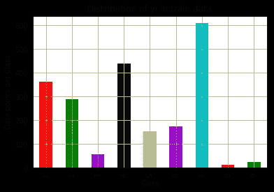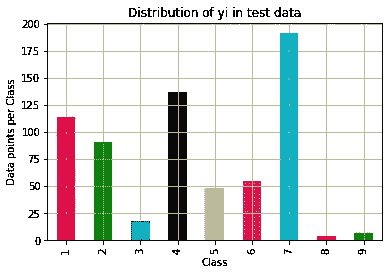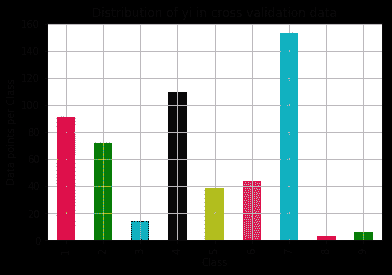

众所周知，对数损失的范围从 0 到无穷大。所以我们首先定义一个随机模型，如果我们的 ML 模型的对数损失小于我们的随机模型，那么我们可以认为我们的 ML 模型是好的。在给我们的随机模型提供数据后，它给出了大约 2.5 的对数损失。

我们甚至检查了精度和召回矩阵，其中对角元素(所有类别的精度和召回)由于随机模型而显得非常低。精度和召回矩阵附后。从上面的分布也可以清楚地看出，1、2、4、7 类是多数类。

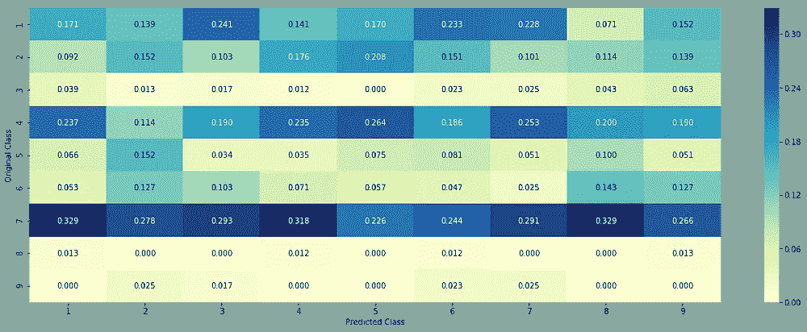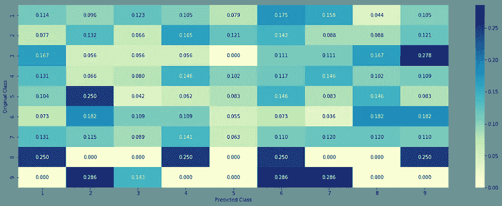

## **单变量分析:**

我们采用每个特征，并通过各种方式检查它是否对类别标签中的预测有用，以便我们可以使用该特征。如果它没有用，我们可以简单地删除该功能

1.  **基因特征**

我们知道，基因是一个分类特征。从中我们观察到有 235 种独特的基因，其中前 50 个最常见的基因几乎贡献了 75%的数据。

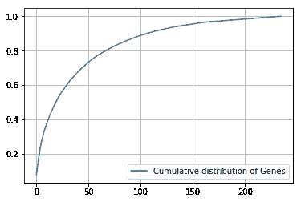

现在我们通过一次热编码和反应编码将基因导入载体。然后，我们建立了一个简单的逻辑回归模型与校准分类器，并适用于基因特征和类别标签。我们发现训练、CV、测试对数损失值大致相同，还发现对数损失值小于 2.5(随机分类器值)。因此，我们可以说基因是我们分类的一个重要特征。我们还可以得出结论，基因是稳定的特征，因为 CV 和测试误差大致等于训练误差。

**2。变化特征**

这里变异也是一个分类特征，我们观察到 2124 个变异中有 1927 个出现在训练数据中，这意味着大多数变异出现一次或两次。

变化的 CDF 看起来如下:

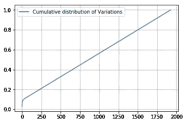

累积分布是直线，这意味着大多数变化在训练数据中出现一次或两次。我们通过一个热编码和响应编码来表征到向量的变化。正如我们之前对基因特征所做的那样，我们建立了一个简单的 LR 模型，并对其应用数据，发现 Train，CV，Test 的对数损失值小于随机模型。

但训练对数损失与 CV、测试对数损失的差异明显大于基因特征，这意味着变异特征是不稳定的。但是由于对数损失小于随机模型，我们仍然使用变化特征，但是要小心，因为它不稳定。

**3。文本特征**

在文本数据中，总共有 53，000 个独特的单词存在于训练数据中。我们还观察到，大多数单词出现的次数很少，这在文本数据中很常见。我们通过 BOW(一种热编码)和响应编码将文本数据转换成矢量。

正如我们在以前的案例中所做的那样，我们将其应用于简单模型 LR，并且发现 Train、CV、Test 的对数损失值小于随机模型。从变异系数、测试数据的分布来看，测试特征是一个稳定的特征。

现在通过两种方式组合所有的特征

1.  一次热编码:发现通过一次热编码，维数是 55，517，这是因为文本数据。
2.  反应编码:发现反应编码的维数为 27(每个特征对应 9 个维度)。

# 基线模型

**方法一:**

1.  **朴素贝叶斯:**

我们知道，对于文本数据，NB 模型是一个基线模型。现在，我们将训练数据应用于模型，并使用 CV 数据来寻找最佳超参数(alpha)

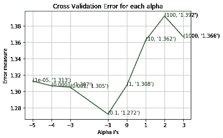

用最好的阿尔法我们符合模型。然后将测试数据应用于模型，我们发现对数损失值为 1.27，远小于随机模型。在这里，我们还发现错误分类的案例总数为 39.8%。我们还检查了每个数据的每个类别的概率，并解释了每个点。这是为了检查它为什么随机预测特定的类。我们得出结论，对于错误分类的点，该点属于预测类的概率非常低。从精度和召回率矩阵中发现，来自类别 2 的大多数点被预测为 7。类似地，来自类 1 的大多数点被预测为 4。

**方法 2:**

**2。k 个最近邻居:**

正如我们所知，k-NN 模型是不可解释的(这是我们的业务限制)，但我们仍然使用这个模型只是为了找出日志损失值。由于 k-NN 遭受维数灾难，我们使用响应编码代替一位热编码。将数据应用于模型后，我们获得了最佳超参数(k)

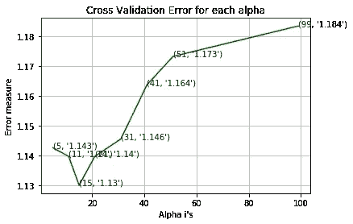

使用最佳 k 值，我们拟合该模型，并将测试数据应用于该模型。对数损失值为 1.002，小于 NB 模型。但是错误分类点的数量是 39.47%(几乎等于 NB 模型)。在 k-nn 模型中，发现来自类别 2 的大多数点预测为 7。类似地，来自类别 1 的大多数点预测为 4。

**方法三:**

**3。逻辑回归:**

正如我们已经看到的，LR 模型对单变量分析非常有效。因此，我们通过获取不平衡数据和平衡数据对 LR 进行了深入分析。

1.  **使用类平衡**:我们也知道 LR 可以很好地处理高维数据，并且它也是可解释的。因此，我们对较低类别的点进行过采样，并将训练数据应用于模型，并使用 CV 数据来寻找最佳超参数(λ)

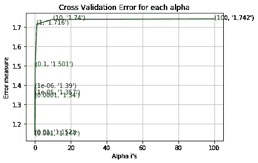

我们用最佳λ拟合模型，并将测试数据应用于模型。对数损失值为 1.048(接近 k-nn)。但是错误分类点的数量为 34.77%(小于 NB 和 K-nn)。因为 LR 是可解释的，并且误分类点比其他模型(k-NN 和 NB)少，所以它比 k-NN 和 NB 好。

如果没有类平衡，日志丢失和错误分类点会增加。因此，我们使用类平衡。

**方法 4:**

**4。SVM:**

我们使用线性 SVM(具有类平衡)，因为它是可解释的，并且对于高维数据非常有效。RBF 核 SVM 是不可解释的，所以我们不能使用它。现在，我们将训练数据应用于模型，并使用 CV 数据来寻找最佳超参数(C)

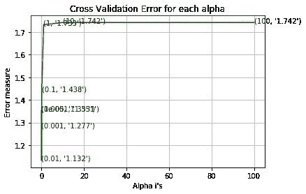

使用最佳 C 我们拟合模型，并将测试数据应用于模型。现在，对数损失值是 1.06(接近 LR)，比随机模型小得多。这里，错误分类案例的总数是 36.47%(超过 LR)。因为我们使用了类平衡，所以对于次要类，我们获得了很好的性能。

**接近 5:**

**5。随机森林:**

**5.1)一键编码:**通常情况下，决策树适用于低维数据。这也是可以解释的。通过改变随机森林分类器中基学习器的数量和最大深度，我们得到最佳基学习器=2000 和最大深度=10。然后，我们用最佳超参数拟合模型，并将测试数据应用于该模型。得到的对数损失值为 1.097(接近 LR)，错误分类点的总数为 36.84%(大于 LR)。

**5.2)响应编码:**通过改变随机森林分类器中基学习器的数量和最大深度，我们发现最佳基学习器=100，最大深度=5。然后，我们用最佳超参数拟合模型，发现训练对数损失为 0.052，CV 对数损失为 1.325，这表明即使使用最佳超参数，模型也是过度拟合的。这就是我们不使用 RF+响应编码的原因。

**方法 6:**

**6。堆积分类器:**

我们堆叠了三个分类器——LR、SVM、NB，并保留 LR 作为元分类器。现在，我们将训练数据应用于模型，并使用 CV 数据来寻找最佳超参数。使用最佳超参数，我们拟合模型，将测试数据应用于模型。对数损失值为 1.08，远小于随机模型。在这里，我们还发现错误分类的案例总数为 36.2%。在这里，即使我们使用复杂的模型，我们得到的结果几乎类似于 LR。此外，我们知道堆叠分类器是不可解释的。

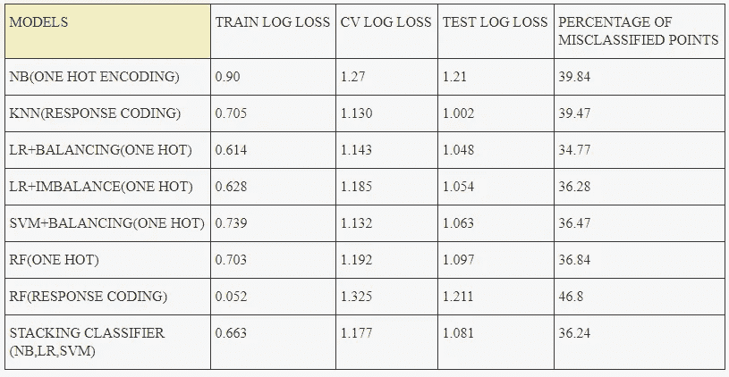

从上表中可以清楚地看出，RF(响应编码)在 train 和 CV 对数损失中有一个剧烈的变化(近 20 倍)。这意味着模型是过度拟合的，因此，我们移除该模型。在堆积分类器(集合)中，测井损失值几乎与 LR+平衡相同。从上表可以看出，LR+平衡适合我们的业务或现实世界的限制，如可解释性和比任何其他模型更好的测井损耗值。

**方法 7:**

在这之后，现在我还用 TF-IDF 矢量器(用于特性的一键编码)而不是 CountVectorizer 进行了检查，结果相当不错。

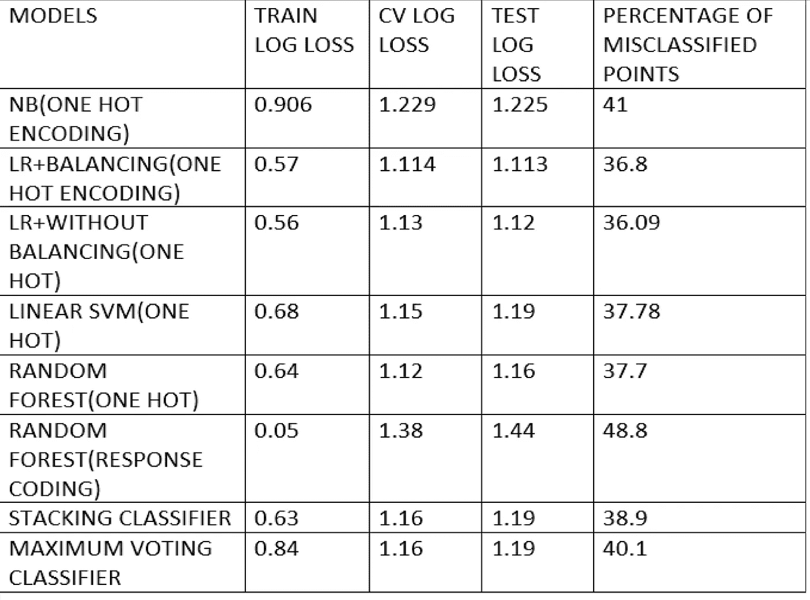

我们可以看到，与 CountVectorizer 相比，TF-IDF 矢量器的结果稍好一些。在这里，我们还可以看到，与其他算法相比，逻辑回归工作得很好，而带有响应编码的随机森林过拟合，因为在训练和 CV 损失方面存在巨大差异。

让我们再看一个有趣的分析:

**方法 8:**

我根据每个词的 TF-IDF 得分，从排除基因和变异的文本数据中选择了前 1000 个词。现在，我从文本数据中删除不在前 1000 个单词中的单词。有趣的是，与上面的分析结果相比，我得到了很好的结果。让我们看一次结果。

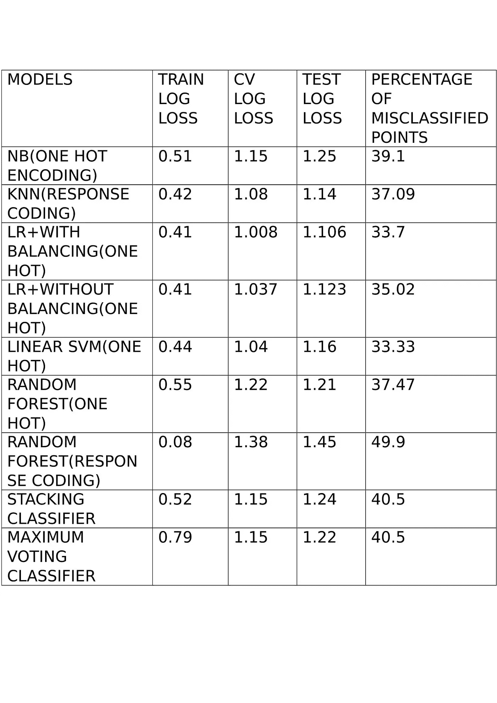

我们可以看到结果有了很大的改善。事实上，与其他算法相比，逻辑回归表现良好，而带有响应编码的随机森林像往常一样过度拟合。但是结果有所改善。

我们可以看到，在所有上述分析中，逻辑回归优于所有算法。因此，我试着对单词和双词应用逻辑回归，而不是只使用单词。然而，结果并不丰硕。

**接近 9:**

**逻辑回归(一元和二元模型)**

列车日志损失:0.83

CV 对数损失:1.17

测试日志损失:1.19

错误分类点的百分比:40.7

最后，在尝试了不同的方法后，原木损失值最终降低到小于 1。这是用 4 克进行的逻辑回归，从 1-4 克中提取出前 2000 个特征，然后用 class = balanced 进行逻辑回归。

**方法 10:**

逻辑回归(1-4 克)前 2000 名 TF-IDF 特征:

列车日志损失:0.439

CV 对数损失:0.957

测试日志损失:0.982。

我会继续用新分析更新这个博客。

有关详细的代码分析，请查看此[报告](https://github.com/tulasiram58827/Cancer-Diagnosis)。

如有任何疑问，请联系 tulasiram11729@gmail.com

感谢您的阅读。请在下面分享您的意见和反馈。