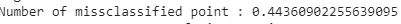
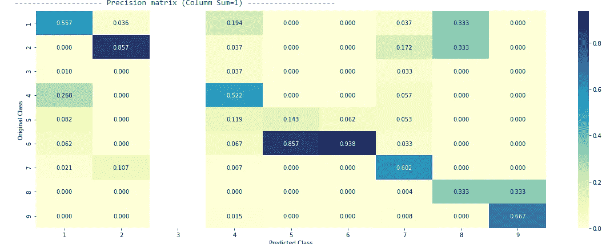
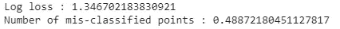

# 个性化癌症诊断

> 原文：<https://medium.com/analytics-vidhya/personalized-cancer-diagnosis-823aeb28aaff?source=collection_archive---------17----------------------->

“一旦被测序，一个癌症肿瘤可以有数千种基因突变。但挑战在于区分导致肿瘤生长的突变(驱动者)和中性突变(过客)。

*目前这种基因突变的解释是手工完成的。这是一项非常耗时的任务，临床病理学家必须根据基于文本的临床文献中的证据，对每一个基因突变进行人工审查和分类。我们需要你的帮助来开发一个机器学习算法，使用这个知识库作为基线，自动对基因变异进行分类。”*

~~Kaggle

【https://www.kaggle.com/c/msk-redefining-cancer-treatment/】来源:

*具体实施请点击链接:*[https://github . com/vedanshharma/Personalized-Cancer-Diagnosis](https://github.com/vedanshsharma/Personalized-Cancer-Diagnosis)

# 介绍

识别基因变异类型的任务通常分为三个步骤。我们的任务是使用一个模型来自动化第三步，这是分子病理学家最耗时的步骤。这包括分析与每个变化相关的证据，以便对它们进行分类。更正式的问题陈述是-

**根据基于文本的临床文献的证据，对给定的遗传变异/突变进行分类。**

**来源**:[https://www . ka ggle . com/c/MSK-重新定义-癌症-治疗/讨论/35336#198462](https://www.kaggle.com/c/msk-redefining-cancer-treatment/discussion/35336#198462)

## 业务目标和约束。

*   **无低延迟要求**。由于我们没有严格的延迟要求，我们可以训练复杂的模型，只要我们的模型花费合理的时间。
*   可解释性很重要。医生可能想要交叉检查结果，为此他可能需要算法来解释自己。为此，可解释性应该很高。
*   错误可能代价高昂。既然这是生死攸关的事情，我们需要一个精确度很高的模型。
*   **需要数据点属于每个类别的概率**。这将让医生最终决定变异属于哪一类。在等概率类的情况下，医生将能够通过执行测试来决定，而不是模型返回单个类。

# 机器学习问题公式

## 数据

*   我们有两个数据文件:一个包含关于基因突变的信息，另一个包含人类专家/病理学家用来分类基因突变的临床证据(文本)。
*   这两个数据文件都有一个名为 ID 的公共列
*   数据文件的信息:

1.  训练 _ 变体(ID，基因，变体，类别)
2.  培训 _ 文本(ID，文本)

## 将现实世界的问题映射到 ML 问题

遗传变异/突变可以分为九个不同的类别。这意味着我们的问题是一个多类分类问题。我们将使用的性能指标是-

*   多类对数损失，因为我们想要输出给定变量 x_i 属于 1-9 类的概率。
*   混淆矩阵

**来源**:[https://www . ka ggle . com/c/MSK-重新定义-癌症-治疗#评测](https://www.kaggle.com/c/msk-redefining-cancer-treatment#evaluation)

**所以我们的最终目标是-**

目的:预测每个数据点属于这九个类别的概率。

我们最后的限制是-

*   可解释性:像朴素贝叶斯、线性 svm 或 DTs 这样的模型可以训练，因为它们具有很高的可解释性。我们可能应该避免使用 RBF svm 这样的模型。
*   需要类别概率。
*   惩罚类概率中的错误= >度量是对数损失。
*   没有延迟限制。

## 训练、CV 和测试数据集

我们的数据在本质上不是时间性的，也就是说，它不会随时间而改变。因此，我们将我们的数据集随机分为训练 Cv 和测试集，大小分别为 64% (80 的 80 %)、16%(80 的 20%)和 20%。我们将以保持类别标签分布不变的方式分割数据。

# 探索性数据分析

## 文本预处理

我们将做一些基本的文本预处理，包括-

*   删除停用词。
*   用空格替换每个特殊字符。
*   用单个空格替换多个空格。
*   将所有字符转换成小写字母。

文本中很少有空值。

在这种情况下，我们将简单地用基因名称和各行的变异来替换它们，如下所示

## 分类标签的分布

*   数据不平衡。
*   训练、测试和 Cv 数据的分类标签分布大致相似。

## 训练随机模型

我们的关键性能指标“对数损失”是一个范围为*【0，* ∞) *的函数。*因此，我们需要一个随机模型来获得指标的上限。随机模型是这样一种模型，当给定 x_i 时，它将随机产生从 1 到 9 的任何标号，其中所有标号都是等概率的。

2.5 是我们随机模型的对数损失值。对于我们的问题来说,“体面”的模型将具有远小于 2.5 的对数损失值。

## 单变量分析

**基因-**

*   基因是一个分类变量
*   在训练集中有 232 个独特的基因。

*   基因的分布是高度倾斜的

*   前 50 个基因贡献了大约 75%的总数据。

为了对基因变量进行分类，我们将使用两种方法-

*   一个热编码
*   响应编码。[https://medium . com/@ thewingdwolf . winterfell/response-coding-for-categorical-data-7bb 8916 c6dc 1](/@thewingedwolf.winterfell/response-coding-for-categorical-data-7bb8916c6dc1)

我们将根据我们使用的 ML 模型选择适当的特征。对于具有类别特征的多类分类问题，一键编码更适合逻辑回归，而响应编码更适合随机森林。

我们需要做的下一件事是检查特征基因是否对分类有一定的重要性。为此，我们将在一个热编码上训练多类逻辑回归，看看我们是否能够获得比随机模型更好的对数损失。

特征基因能够极大地减少所有数据集上的日志损失。因此，它对分类具有重要意义。此外，基因特征也是一个稳定的特征，因为在训练、测试和 Cv 集的对数损失之间有很大的差异。

**变异**

*   变异也是一个分类变量。
*   在训练数据集中有 1926 个独特的变化
*   大多数变异只出现一次。

*   1500 个变异只占数据的 80%。

为了对基因变量进行分类，我们将使用两种方法-

*   一个热编码
*   响应编码

类似于我们对基因特征所做的，我们将在一个热编码上训练一个多类逻辑回归，看看我们是否能够得到比随机模型更好的对数损失。

看起来我们得到了一个更好的日志损失，原来特征变化是不稳定的。但是我们仍然保留这个特性，因为它能够极大地减少所有数据集的日志丢失

**对文本特征的单变量分析**

*   在训练文本中存在 53619 个唯一单词。
*   最频繁出现的单词出现了 404 次。

为了对基因变量进行分类，我们将使用两种方法-

*   一个热编码(在文本数据的情况下是一袋单词)
*   响应编码(文本数据的响应编码有点类似于朴素贝叶斯方法，其中对于给定的类 I，我们有 *y=P(class=i|text_j)* )

我们已经使用逻辑回归(像以前一样)来确定文本特征的重要性。

该功能似乎很稳定。现在我们可以断定**基因>文字>变异**在稳定性方面。

## 机器学习模型

**朴素贝叶斯**

首先，我们将训练一个带有超参数调整的基线朴素贝叶斯模型。朴素贝叶斯是一个相对简单的模型。我们将对朴素贝叶斯使用一次性编码特征化。

*   测试数据的对数损失为 1.28。
*   我们错过了 44.36%的分类数据点。

*   许多 4 级点被误归类为 1 级。许多 7 类点被归类为 2 类。

**K-NN**

我们的第二个模型是 KNN。由于 [**维度的诅咒**](https://towardsdatascience.com/k-nearest-neighbors-and-the-curse-of-dimensionality-e39d10a6105d) ，KNN 不能很好地处理高维数据**。因此，对于 KNN，我们将使用响应编码数据来训练我们的模型。KNN 的另一个重要方面是它是不可解释的。我们能做的最好的事情就是查看给定查询点的邻居。**

*   我们的测试数据的对数损失为 1.08，这是一个改进。
*   我们的失误分类误差降低了 8%(大约)。

*   1-4 级和 2-7 级的问题仍然存在。
*   尽管类别 9 在数据中所占的比例很小，但它被很好地分类了。

**逻辑回归(带类别平衡)**

逻辑回归在处理高维数据时效果相当好。首先，我们将训练一个具有类平衡的逻辑回归模型。类别平衡类似于过采样，过采样主要通过不平衡的数据集来完成，以便在训练数据中具有所有类别的**相等表示。**

*   测试数据的对数损失为 1.13。
*   未命中分类误差没有太大改善。

*   尽管八班是一个少数民族班级，但它被很好地分类了。
*   对角线值相对较大，这是一个健康的迹象。

**逻辑回归(无类别平衡)**

*   我们在测试数据上获得了 1.14 的对数损失。
*   没有类平衡的模型比有平衡的模型性能差。

**线性 SVM(带类别平衡)**

线性支持向量机类似于逻辑回归。因此，对于高维数据，它也能很好地工作。此外，它具有高度的可解释性。

*   根据测试数据，对数损失为 1.19。
*   未命中分类误差约为 37.69%。

*   结果类似于具有类别平衡的逻辑回归。

**随机森林(带一个热编码)**

随机森林最适合低维数据

*   测试数据的对数损失为 1.19。
*   未命中分类误差约为 40.97 %。

**随机森林(带响应编码)**

*   对数损失为 1.34。
*   即使在超参数调整后，该模型仍然过度拟合。这可能是因为响应编码是一种比热编码更弱的特征化形式。
*   未命中分类误差接近 50%，这是一个危险信号。这意味着每一秒钟都被遗漏了

我们还尝试了堆叠模型，但即使这样也没有提高性能。下一个选择是尝试使用其他功能。

## Tf-Idf

我们没有使用单词包，而是尝试了 tfidf 特性。

使用逻辑回归，我们能够将所有数据集的对数损失降低到 1.0 以下。即使我们的失误分类错误只有 33.27 %，这是非常令人印象深刻的。

## 二元模型和二元模型

这种特征化将导致维度激增。因此，我们只训练线性模型

对于这两个模型，测井曲线损失增加甚至超过 1.0。

## Tf-Idf，包含单字和双字

我们将尝试使用 unigrams 和 bigrams 的 if-idf，但我们将只取前 4000 个 idf 值。这将为我们提供文本数据的维度上限。

再次使用逻辑回归，我们的对数损失下降到 1.0 以下，但最大的优点是它的错过分类误差仅为 30.07 %。**这比我们使用简单的 tf idf 特性获得的结果少 3%。**

# 结论

对于此数据集，使用 tf-idf 和 unigram 和 bigram 进行逻辑回归，同时仅使用前 4000 个 idf 值的特征，是建模的最佳方法，因为它具有最小的未命中分类错误，同时所有对数损失都低于 1.0