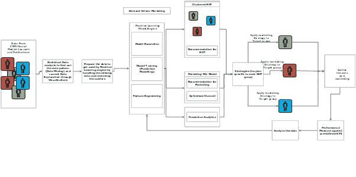
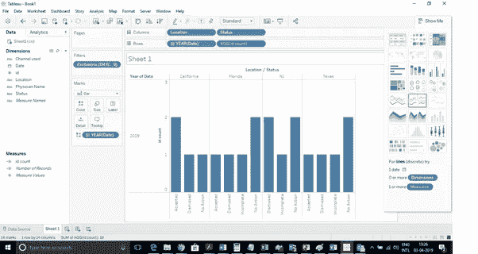
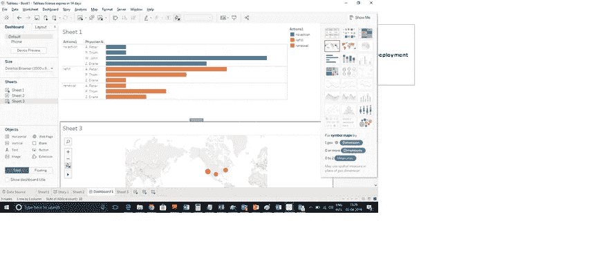
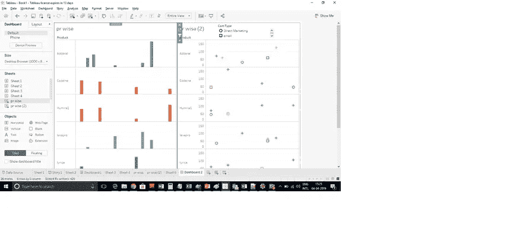
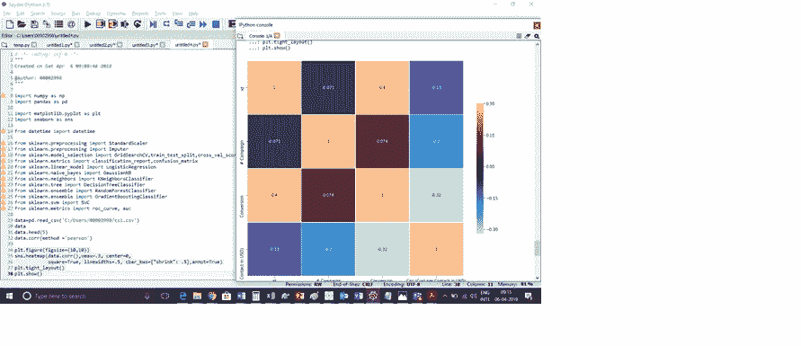
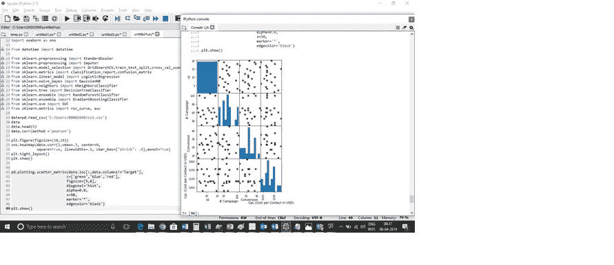
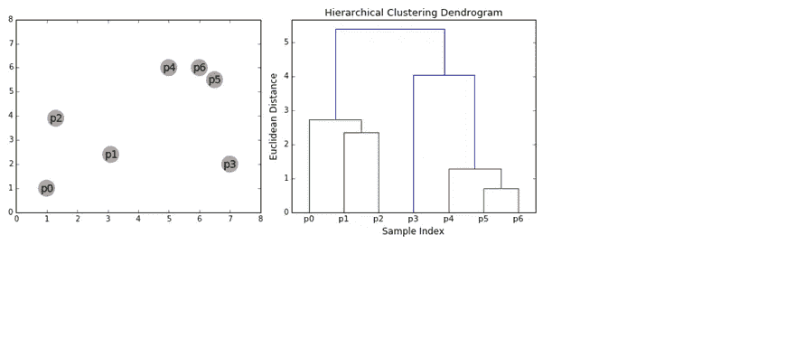
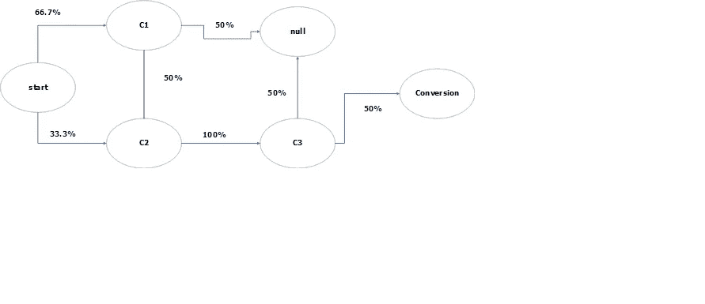
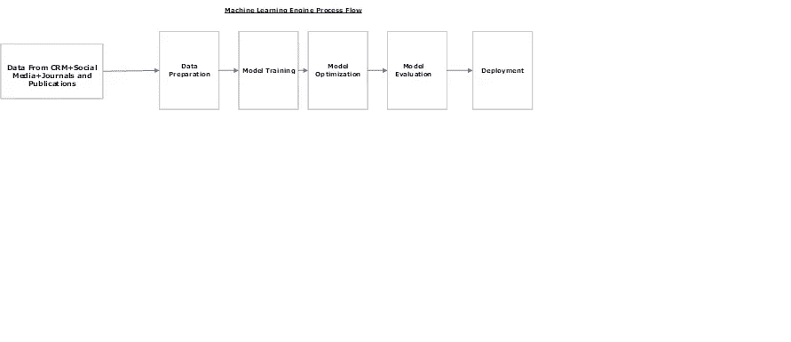

# 制药行业的个性化营销

> 原文：<https://medium.com/analytics-vidhya/personalized-marketing-in-pharma-industry-e3200907973c?source=collection_archive---------0----------------------->

# 个性化营销

1.1 问题陈述:制药行业的多渠道营销是一项多样化的业务，以具有成本效益的方式接触全部目标群体是一项挑战。从 MCM 中获得最大利益几乎没有挑战。因此，问题陈述分类如下:

a.了解 HCP 的需求，并将所需产品销售给合适的 HCP。如果能够克服这一点，那么营销成本也可以降低。

b.在几个不同的营销渠道上的巨大花费，包括向医生分发样品，以及产品的优先顺序和展示方式，提出了一个关键问题:哪些项目产生了更好的投资回报？换句话说，根据 ROI 计算的最终可比数字，我们是否优化了资源以最大限度地影响客户？这里的经典问题是，不同的渠道在不同的地理位置和不同的客户群体中有不同的作用。

1.2 建议的解决方案:为生命科学公司设计一个解决方案，从多渠道营销(MCM)计划中获取最大利益，解决上述问题。个性化营销是为制药公司设计的一种新的营销模式，它将由定制的营销计划驱动，该计划旨在满足预测的目标 HCP。从而降低营销和客户获取成本。该解决方案可以通过以下两个关键过程来实现:

第一:将 HCP 划分为几个集群，并准备一个满足单个集群需求的定制策略。

第二:准备个性化营销组合模型:收集用于估计 ROI 的重要因素，确定其在资源分配中可获得的最大 ROI 点，确定客户收到的消息中正确的记忆衰退过程，并建立正确的复杂组合模型。

个性化营销应是一个 IT 实现的产品，该产品应提供一个巨大的平台，以从 360 度角度分析当前的现有资源，并且应使用支持大数据的统计、概率和机器学习算法来设计提议的解决方案。

# 1.3 目标:

1.创造有价值的特定解决方案来满足未满足的需求。

2.在公司提供的所有品牌和其他服务中，最大限度地提高每位客户的价值。

3.通过对目标群体实施定制营销计划来获得更多收入。

# 1.4 功能/工艺流程

# 1.5 缩写和定义

**缩写**

**任期**

客户关系管理

客户关系管理

HCP

卫生保健专业人员

美国大学生数学建模竞赛

多渠道营销

机器语言(Machine Language)

机器学习

# 1.6 建议的解决方案

建议的解决方案:通过 5 个子流程实现上述目标:

a.收集分析不同主题领域所需的数据

b.将数据可视化，找出每个主题领域的见解。

c.分析数据以找出相关属性。

d.对数据采取适当的措施来改善结果。

e.通过预定义的 KPI 衡量所采取措施的绩效。

f.重复这个过程:建模、预测、评估、分析和计划

# 1.6.1 收集分析不同主题领域所需的数据

各种数据源:公司特定的 CRM 存储库、社交媒体评论、期刊和出版物

# 1.6.2 将数据可视化，找出各个学科领域的洞见。

我们可以在仪表板中使用以下小部件:

使用的工具:Tableau

1.  指标 1:基于各种状态的客户参与趋势分析:每个地理区域每月接受、拒绝、不完整、无行动。该指标将根据不同地理区域使用的营销渠道提供客户满意度。

2.指标 2:按产品对 TRx 和 NRx 的趋势分析:

TRx=总续杯次数+续杯次数，TRx =总续杯次数。

该指标将提供特定 HCP 在一段时间内为特定药物重新配药和更新处方的次数，这将要求营销代表找出不喜欢其他品牌药物的原因，而另一方面，制药公司可以通过仅向同类产品的最大处方者分发新药的免费样品来节省资金。销售代表还可以使用这些数据来验证他们的医生客户是否按照销售电话中的承诺开了药。这些信息会改变后续电话中的销售信息。

3.指标 3:HCP 的处方书写模式的趋势分析:该指标有助于找出处方书写模式，即 HCP 为产品书写处方的频率，产品促销花费的总成本，在每个营销渠道分配的一段时间内从产品收到的 ROI。

# 1.6.3 分析数据以发现属性的相关性

在业务概述之后，当我们试图找出某个结果的根本原因时，我们会进行数据分析。我使用 python 来找出数据集的每个变量和 SeaBorn 库的 heatmap 方法之间的相关性(Pandas 库的 corr())来可视化这种关系。热图是数据的图形表示，使用颜色编码系统来表示不同的值。热图用于各种形式的分析，但最常用于显示 HCP 在特定活动中的行为。还可以通过 Tableau 获取多渠道营销效果的详细视图，以及不同营销支出如何相互作用和关联。从这个过程中，我们可以考虑高度相关的属性，而忽略彼此不太相关的其他属性。

当我们试图在矩阵中看到:

# 1.7 使用案例:

以下用例的主要参与者是制药公司的营销主管和

# 1.7.1 需求驱动的客户细分:

将我们的数据点分成一些聚类，每个聚类的数据点具有相似的 HCP 行为模式。我们可以根据 HCP 需求和行为、首选营销渠道、人口统计变化、社会概况、客户终身价值、客户获取成本、情感分析、专业兴趣和目标以及评论意见，通过这一流程，利用有意义且可衡量的细分或微细分，实现一系列新的客户细分。

解决方案:这可以通过机器学习的无监督学习模型来实现，这是一种类型的[机器学习](https://www.mathworks.com/solutions/machine-learning.html)算法，用于从由没有标记响应的输入数据组成的数据集进行推断。它将数据分成不同的组，并预测新的数据点将属于哪个组。通常，我们在无监督学习模型中使用主成分分析(PCA)和聚类。

在数据科学中，主成分分析(PCA)是一种用于降维的统计过程，将数据集的维度减少到新创建的更少的维度。这有助于分析具有大量维度的数据集，其中一些维度可能对我们的分析没有用处。

在数据科学中，聚类是一种涉及数据点分组的机器学习技术。给定一组数据点，我们可以使用聚类算法将每个数据点分类到特定的组中。同一组中的数据点应该具有相似的属性和/或特征，而不同组中的数据点应该具有与另一组非常不同的属性和/或特征。

聚类有多种类型。但是对于我们的项目，我们将采用自下而上的层次聚类算法。

1.  在自下而上算法的帮助下，系统应在开始时将特定于每个 HCP(数据点)的观测/数据视为单个聚类，然后连续合并成对的聚类，直到所有聚类都已合并成包含所有数据点的单个聚类。这种聚类层次结构被表示为一棵树(或树状图)。树根是收集所有样本的唯一聚类，树叶是只有一个样本的聚类。下面是该算法步骤的示例图形表示

每个片段都可以被认为是一个**角色**。下面描述了示例角色的行为、角色和需求&难点。

**角色**

**痛点**

在她所在的领域成为公认的领导者，开出符合所需药物疗效的品牌产品，支付者的治疗覆盖范围，与此相关的具体指南，同时牢记患者的财务状况。

1.由于某一适应症有大量的品牌产品，很难坚持某一品牌。

2.由于缺乏电子病历的集成，很难评估和明确定义患者的问题。

通过向出版物投稿和参加指导委员会，成为其领域内公认的领导者。

作为新兴思想领袖参与指导委员会的机会很少。

与制药公司建立长期的研究合作。

没有准备和没有经验的监督者的非标准化和低效的临床试验过程是令人沮丧和费时的。

有助于治疗中的阶跃变化的发展。

对管理良好的阶梯疗法缺乏足够的了解。

通过使用上面的过程，我们可以将样本数据集分成 N 个角色。

# 1.7.2 营销组合模式:

为每个角色规划营销策略，根据每个细分市场和目标细分市场的利润潜力和公司为其提供服务的能力，确定每个细分市场和目标细分市场的收入潜力，在 DTV(直接面向供应商)和 HCP 聚焦营销方面的最佳投资金额，以及如何最大化您的投资回报率，以便通过对组织最具战略意义的任何市场细分，充分促进医生采购、NBRx(新品牌处方)、RRx(重新灌装处方)和 TRx(总处方)。如果我们预测了 HCP 的最佳营销渠道，那么我们就可以避免不必要的营销浪费，这些浪费对于 HCP 来说是不合适/不可取的。

A.**潜在客户转化的概率:**这个用例的目标是为市场部确定的每个潜在客户生成一个倾向得分。倾向得分可以是二进制、零或一。

一种方法是使用二进制标志，比如潜在客户是否浏览过我们的网站。

他/她回复过我们的邮件吗？

他/她有没有在推特上谈论过我们的业务或产品？

我们将使用的算法类别是回归以得出潜在客户分数，或者我们可以使用*朴素贝叶斯分类*来得出潜在客户转化的概率。

B.**找出从营销活动中删除一个营销渠道的影响:**在该渠道之前有多个最终推动客户转化的渠道。研究这种行为的基本概念被称为“多渠道归因建模”归因模型是一个或一组规则，它决定了如何将销售和转化的信用分配给转化路径中的接触点。基于马尔可夫链概念的归因模型

使用马尔可夫链允许我们从启发式模型转换到概率模型。我们可以将每个客户旅程(渠道/接触点序列)表示为有向马尔可夫图中的一个链，其中每个顶点是一个可能的状态(渠道/接触点),边表示状态之间转换的概率(包括转换)。)通过计算模型和估计转移概率，我们可以确定每个渠道/接触点的属性。

例如，客户旅程包含三个独特的频道 C1、C2 和 C3。此外，我们应该手动为每个图添加三个特殊状态:(开始)、(转换)和(空)。这些附加状态表示起点、购买或转换以及转换不成功。从相同频道的转换是可能的(例如 C1 -> C1)，但是由于不同的原因可以省略。

假设我们有三个客户旅程:

C1 -> C2 -> C3 ->采购

C1 ->转换不成功

C2 -> C3 ->不成功的转换

由于这种方法，我们将添加额外的状态(参见下表的第 2 列)并拆分成对(参见第 3 列):

**客户旅程**

**变身**

**成对拆分**

C1 -> C2 -> C3 ->采购

(开始)C1 -> C2 -> C3 ->(转换)

(开始)C1-> C1-> C2-> C2-> C3-> C3(转换)

C1 ->转换不成功

(开始)C1 ->空

(开始)C1 C1->空

C2 -> C3 ->不成功的转换

(开始)C2 -> C3 ->空

(开始)C2 的 C2 -> C3 的 C3 ->空

**去除效果**。移除效应的核心是从图中连续移除每个通道，并测量在没有该通道的情况下可以进行多少转换(或获得多少价值)。从图表中删除渠道/接触点意味着我们应该在渠道对中替换它。如果通道存在于从> >状态的< <中，我们将用 n a 替换它(然后省略这一对)，如果通道处于< <到> >状态，我们将用(null)替换它。换句话说，当通道处于 to 部分时，我们将没有来自通道的路径，并将从其他通道转换到(null)状态。因此，完整模型的转换概率为 33.3%(0.667 * 0.5 * 1 * 0.5+0.333 * 1 * 0.5。)去除 C1 通道后的转换概率为 16.7% (0.333 * 1 * 0.5。)因此，通道 C1 去除效应为 0.5 (0.167 / 0.333。)换句话说，如果我们在客户旅程中没有 C1 渠道，我们将失去 50%的转化率。

C.**推荐联系每一位潜在客户的最佳渠道:**有这么多不同的渠道可供选择，重要的是要以能够获得最多关注和最高投资回报的方式来锁定客户。我们会使用什么数据？我们还应该使用过去成功事件的数据，即我们在特定渠道接触特定潜在客户并转化的事件。这些数据让我们知道谁会转换到哪个频道。使用这些数据，我们将能够建立一个模型来预测每个潜在客户的渠道。然后，我们将使用该模型对潜在客户进行行动预测。我们会使用哪些算法？这是一个经典的分类问题，所以我们会用之前的任何算法进行实验，并检查它们的准确性。我们根据过去的数据建立一个模型，为每个潜在客户推荐一个联系媒体。我们将使用过去的数据建立一个分类模型，预测每个潜在客户的最佳联系渠道。这将有助于我们的营销团队设计有针对性的活动，帮助他们接触到这些特定渠道中的每个潜在客户。

# 1.7.3 对 HCP 的建议:

通过基于内容和协同过滤，系统可以找到有很多共同点的 hcp，这样系统就可以互相推荐他们的“喜好”。推荐引擎使用不同的算法过滤数据，并向新用户或该组的现有用户推荐最相关/最受欢迎的项目。例如:由同一组的其他 HCP 参加的任何网络研讨会、要加入的讨论论坛、关于产品(药物和设备等)的审查/反馈、如何有效地使用 EMR 系统以及分享关于当局在特定治疗领域的新法规的影响的审查/反馈等)。数据可以通过两种方式收集:显式和隐式。显式数据是有意提供的信息，即来自用户的输入，如在网上研讨会结束时提供反馈。隐含数据是无意提供的信息，而是从搜索历史、点击、评论历史等可用数据流中收集的信息。在基于内容的过滤中，系统分析客户过去的行为，并在此基础上建议 HCP 应该采取的行动。余弦相似性、欧几里德距离和皮尔逊相关是用于基于内容的过滤的几种方法。在余弦相似度中，包含关于 HCP 的简介信息(喜欢/不喜欢以及他给出的评级)的向量和包含关于项目的信息(文章的作者、主题行、相关信息以及特定文章、期刊、网上研讨会、会议等的新信息等)的向量之间的余弦角决定了推荐等级。余弦值的范围从-1 到 1，决定了推荐的尺度。皮尔逊相关告诉我们两个项目的相关程度。相关性越高，相似性就越大。欧几里德距离:如果在 n 维空间中绘制，相似的项目将彼此靠近。因此，我们可以计算商品之间的距离，并基于该距离向用户推荐商品。协同过滤的用户-用户协同过滤首先找到 hcp 之间的相似度得分。基于这个相似性分数，它挑选出最相似的 hcp，并推荐这些相似用户以前参加过或喜欢过的产品/网络研讨会/会议。

# 1.7.4 预测营销:

过去采取了某些行为的 HCP 人很可能与将来会采取同样行为的 HCP 人具有相同的特征。这一概念有助于通过遵循战略营销计划进行市场预测营销，该战略营销计划是基于 HCP 和他的公司的行为关系的经验而设计的，这将为营销活动提供更高的成功机会。

a.获取新客户:确定更有可能成为新客户的潜在客户，他们最有可能开公司品牌药物的处方。

b.预测最有价值的客户，并对他们采取适当的活动。

c.提高客户满意度。

d.如何接触顶级处方医生并增加他在公司的份额？

e.哪些潜在医生很可能会开竞争对手的产品。

f.哪些地理区域将会表现不佳，如何避免？

g.特定活动的最佳目标客户群是什么？

h.哪一系列的行动可能会让某个医生进入下一个级别的处方？

I .根据营销活动成本，预测一段时间内预期的投资回报率、营销活动的有效性以及任何地理区域的每个营销渠道的转换率。

# 1.7.5 A/B 测试:

系统应提供对战略营销计划进行 A/B 测试的选项，以便在采用目标 hcp 之前，结果可用于进一步分析/重新设计。

# 1.8 下一步:

实施和部署上述用例后，应重复以下流程:

a.对数据采取适当的措施来改善结果。

b.通过预定义的 KPI 衡量所采取措施的绩效。

c.重复这个过程:建模、预测、评估、分析和计划

# 1.9 机器学习引擎:

下面是一个支持大数据的数据科学项目的工艺流程:NoSQL、MongoDB、Hadoop、HBase、Hive 和 Pig、Python 和 r

1.定义数据源:定义所有数据源，包括公司特定的 CRM 数据库、社交媒体搜索引擎、期刊和出版物等..

2.数据准备:数据挖掘和准备用于机器学习算法的数据。典型的步骤包括:通过统计建模识别数据模式、处理缺失值、去除异常值、数据处理、维度减少和标准化。

3.模型训练:通过应用基于监督或非监督 ML 模型的所需机器学习算法来训练模型，并在测试数据上进行测试。

A.分类:用于因变量为分类结果的情况

a.线性回归，

b.k 最近邻

c.支持向量机

d.内核 SVM

e.朴素贝叶斯

f.决策图表

g.随机森林

B.回归:用于因变量是连续结果的情况

a.简单线性回归

b.多元线性回归

c.简单多项式回归

d.决策树回归

e.支持向量回归

C.聚类:在没有因变量的情况下使用

a.k 均值

b.等级体系的

D.深度学习:基于图像、声音和文本等的分类。

a.神经网络

b.卷积网络

c.梯度下降

d.反向传播。

E.文本分析:使用单词包通过稀疏矩阵的自然语言处理。

F.关联:关联规则学习是一种[基于规则的机器学习](https://en.wikipedia.org/wiki/Rule-based_machine_learning)方法，用于发现大型数据库中变量之间的有趣关系，用于从新的未分类数据中进行[特征提取](https://en.wikipedia.org/wiki/Feature_extraction)和[抽象关联](https://en.wikipedia.org/wiki/Abstraction)能力。

a.先验的

b.喝彩

4.模型优化:通过调整和优化参数和正则化来优化模型以提供更好的性能。

5.模型评估:通过 AUC(曲线下面积)ROC(受试者操作特征)曲线、准确度和精密度来衡量模型的性能。

6.部署:通过 Amazon Web Service(支持多租户的云架构)部署到支持大数据的环境中，通过弹性 Map Reduce 和红移来满足负载的可变需求:支持负载平衡)。