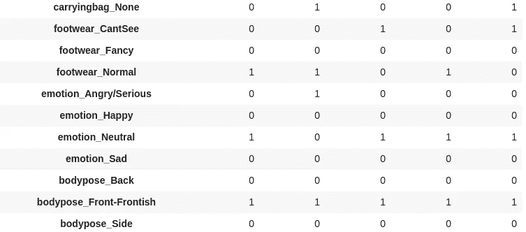

# 人物属性分类器——训练一个多任务神经网络来检测年龄、性别、情感等属性

> 原文：<https://medium.com/analytics-vidhya/personattributes-classifier-training-a-multi-task-neural-network-to-detect-attributes-like-age-a3b877d21d22?source=collection_archive---------12----------------------->

这项挑战的目标是从一张图像中检测一个人的`gender, age, weight, carryingbag, footwear, emotion, bodypose`和`imagequality`。任何神经网络架构都是允许的，但**训练必须从头开始，这意味着没有预先训练的权重，也没有迁移学习。为了成功地完成这一点，我们需要一个具有多个输出的卷积神经网络，每个输出服务于一个预测。
对于这个挑战，我最终使用了一个 [**Densenet121**](https://towardsdatascience.com/understanding-and-visualizing-densenets-7f688092391a) 架构，但是任何具有跳过连接的现代并行网络都应该提供良好的结果。**

使用 **Keras** 完成训练。我也在 tensorflow 中尝试了**单循环策略和循环 LR，但是发现 keras 解决方案简单有效。
在我们了解建议的网络架构之前，让我们先来看看我们正在处理的数据集。**

您可以从 [person-data-gdrive](https://drive.google.com/file/d/1Abe336Tzvi8BC6bVGTN3unlAtj1XdiTT/view) 下载数据集进行实验。
还要找到[person-classifier-github-link](https://github.com/baronrogers5/person-classifier)，里面有可以直接在 [google-colab](https://colab.research.google.com/) 上运行的笔记本。如果你在 colab 上运行笔记本，只需确保下载数据并将其作为`hvc_data.zip`放入你的谷歌硬盘的`My Drive`中。
下面显示的所有需要的文件都在`hvc_data.zip`文件中。

# 可视化数据

每个图像都根据下面给出的数据框架进行标记:

我们有一些图像的例子。

让我们看看每个类别所有可能的预测

# 查看网络的头部

正如所承诺的，让我们看看网络的头部(输出到达的地方)，这样我们可以更好地理解代码。为了张贴更清晰的图像，有些连接是不可见的。在这里找到完整的网络图片[。](https://github.com/baronrogers5/person-classifier/blob/master/images/model.png)

现在我们已经对手头的问题有了一个想法，让我们从从头开始训练一个令人敬畏的分类器所需的实际步骤开始。

*   **数据预处理** -
*   转换为一键编码。
*   使用平均值和标准差进行标准化。
*   数据扩充([删减](https://github.com/yu4u/cutout-random-erasing))
*   构建一个 keras 序列以馈入训练循环。
*   **设计建筑** -
*   选择骨干
*   建造这座塔。
*   为每一个班级构建标题[最终预测]。
*   **定义培训回访**
*   **实战训练。**

# 数据预处理

神经网络期望预测标签是一次性编码的。以便预测的概率[等于类的数量]可以直接与正确的标签匹配。

因此，我们需要将我们所有的预测标签转换为带有前缀的单热编码*，以便更容易识别它们。*

(13573, 9)

独热编码数据

# 使用平均值和标准差进行归一化

这些图像的原始大小是(200x200)，但是我们的数据集包含它们的调整后版本(224x224)。

因为，我们将使用一个 [densenet](https://towardsdatascience.com/review-densenet-image-classification-b6631a8ef803) 作为我们没有头部的架构，我们不需要额外的计算，因此我们将图像的大小调整为(200x200)。

这种调整是在 PersonDataGenerator 类中完成的。

让我们创建 keras 序列，当被`fit_generator`调用时，可以调用该序列来给出一系列批处理

# 将属性列名存储在变量中

在创建 one-hot 编码版本时，我们用属性名作为列的前缀，这样我们可以将具有特定属性名的列放在一起，这将有助于识别特定目标属于哪些列。

让我们构建一个 sequence 类，它将作为一个生成器给出一批数据，如果指定的话，将它混洗并应用数据扩充。

让我们快速调用 PersonDataGenerator 类来创建训练和测试生成器。为了实现剪切，我们使用 [get_random_generator](https://github.com/yu4u/cutout-random-erasing/blob/master/random_eraser.py) 函数。

# 设计架构

# 选择骨干

我们没有使用预先训练的重量和从零开始，因为这是这项练习的要求之一。我们带一个 **DenseNet121** 骨干，不带头。这比 **Resnet50** 要好得多，但也应该能提供可比较的结果。

因为这是多任务分类。我们想要的最终模型应该是这样的:

1.  选择一个架构作为主干(这里我们选择 densenet121，因为它在初始测试中比 resnet50 工作得更好)，不要包括头部，因为我们将构建自己的架构。
2.  为每个职业建造塔，塔的结构基本上保持不变。
3.  建立各自的标题，作为每个类的输出。
4.  构建整体模型，指定输入和输出。

主干的代码。

relu 后的最终形状是(6，6，1024)。

这通过 GlobalAveragePooling(进一步称为 GAP)传递，以对通道维度上的每个要素地图进行平均。这使得张量形状变得平坦(无，1024)。

我坚信，如果不仅仅使用 GAP，我们还使用 GlobalMaxPooling 并连接输出，这一点可以得到改善。这导致 2048 个秩 1 张量，其将具有平均值和最大值结果的优点。

我的意思是这样的:

# 建造这座塔

tower 在 GAP 之后添加了一个 batchnorm，以标准化 GAP 之后的结果，还添加了少量的 dropout，以提高弹性。
接下来是密集连接层，将节点减少到 128 个，每个头在其上构建。

# 构建头部

头部是产生输出的最后一层。
假设 **pose** (我们需要预测的属性之一)，它有 3 个可能的输出，即**(正面、背面和侧面)**，所以每个可能的输出都需要一个最终节点来代表它出现的概率。
`num_units`包含每个名称的映射和类别的数量。`build_head`根据`num_units`建立每个类别的头，分配适当的最终节点。

# 构建完整模型的代码

你可以在这里查看完整网络的样子[。](https://github.com/baronrogers5/person-classifier/blob/master/images/model.png)

# 定义培训回访

1.  `ReduceLROnPlateau` - >当模型值损失在一些`patience`时期内没有通过`min_delta`改善时，降低学习率
2.  `ModelCheckpoint` - >将模型权重保存在指定的目录下。
3.  `EarlyStopping` - >停止训练如果`val_loss`在`patience`周期内`min_delta`没有改善，停止后在训练期间恢复`best_weights`。

在开始实际训练之前，我们先编译一下模型。

模型编译步骤已经被实现为一个函数，因此它可以从任何单元和任何模型(主干或部分模型)上被调用。

# 让训练开始吧

培训按以下顺序进行:

1.  (100x100)所有图层均可训练的图像。
2.  (100x100)主干冻结的图像，以便可以微调最终图层。
3.  (100x100)图像，具有所有可训练层，但使用`lr = 1e-4`进行了积极的数据扩充。
4.  (200x200)包含所有可训练图层的图像。
5.  (200x200)主干冻结的图像。

所有的训练循环都启用了`EarlyStopping`,因此在每种情况下，历元的数量在 8-15 之间，在此之后，训练停止并运行下一步。

为了简洁起见，我不会在这里包括所有的训练步骤，但是你可以随时查看[实际的 colab 文件](https://github.com/baronrogers5/person-classifier/blob/master/Person_using_DenseNet.ipynb)，其中有所有的步骤和日志。

如果您希望继续训练，并希望使用我预先训练的重量，您可以在 [github 回购模型文件夹](https://github.com/baronrogers5/person-classifier/tree/master/models)中找到它们。

# 结果

# 进一步的实验/改进模型的方法

有很多方法可以提高我们在这里取得的成绩。我将继续更新实际的 github repo 中的一些建议。如果你喜欢这篇文章或者想要进一步的更新，请“观看”github repo 或者“开始”它。这将激励我写其他类似的文章。

所以事不宜迟，我列出了一些建议，排名不分先后。

1.更好的标准化和权重初始化。

2.每个单独类别的损失权重。

3.更好的图像增强，尤其是 [imgaug](https://github.com/aleju/imgaug) 。

4.尝试不同的架构示例，如概念 4、效率网、ResNext。

5.放松管制，比如退学。

6.尝试一个周期策略和周期学习率，特别是用 [fast.ai](https://www.fast.ai/) 实现。

7.不要只用 GAP，而要用‘concatenate(GAP，GMP)’,然后建造塔。

我希望实施其中的一些，看到损失减少，并获得更好的结果，如果你们中的任何人实施并看到一些有趣的结果，会很乐意听到更多关于它的信息。