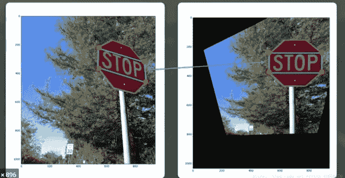

# Python 中的透视变换——现场视频

> 原文：<https://medium.com/analytics-vidhya/perspective-transformation-in-python-on-live-video-bca558876e8?source=collection_archive---------10----------------------->

使用 Python OpenCV 进行透视变换——在**透视变换中，**我们可以改变给定图像或视频的透视，以便更好地了解所需信息。



图片来自自驾 udacity 课程

在下面的代码中，我们使用 python 的 OpenCV 库对一个实时视频进行透视变换

```
**# Importing Libraries**import cv2
import numpy as np
from matplotlib import pyplot as plt**#Capturing video** 
cap = cv2.VideoCapture(0)
while True: 
    _,frame = cap.read()
     # **Plotting four circles on the video of the object you want to        see the transformation of.**
    cv2.circle(frame,(114,151),5,(0,0,255),-1)
    cv2.circle(frame, (605, 89), 5, (0, 0, 255), -1)
    cv2.circle(frame, (72, 420), 5, (0, 0, 255), -1)
    cv2.circle(frame, (637, 420), 5, (0, 0, 255), -1) **# selecting all the above four points in an array**    imgPts = np.float32([[114,151],[605, 89],[72, 420],[637, 420]])

    **# selecting four points in an array for the destination video( the one you want to see as your output)
**    objPoints = np.float32([[0,0],[420,0],[0,637],[420,637]]) **#Apply perspective transformation function of openCV2\. This function will return the matrix which you can feed into warpPerspective function to get the warped image.**
    matrix = cv2.getPerspectiveTransform(imgPts,objPoints)
    result = cv2.warpPerspective(frame,matrix,(400,600)) **#Now Plotting both the videos(original, warped video)using matplotlib**
    cv2.imshow('frame',frame)
    cv2.imshow('Perspective Transformation', result)
    key = cv2.waitKey(1)
    # plt.imshow(frame)
    plt.show()
    if key == 27:
        break

cap.release()
cv2.destroyAllWindows()
```

请让我知道这个代码是否有帮助。

在 Github 上关注我-【https://github.com/DeeptiAgl?tab=repositories 