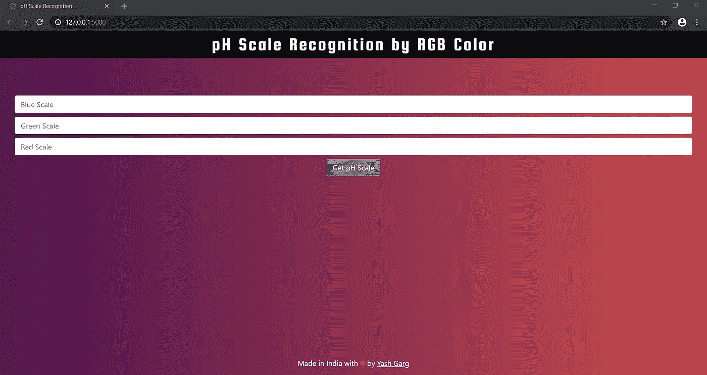
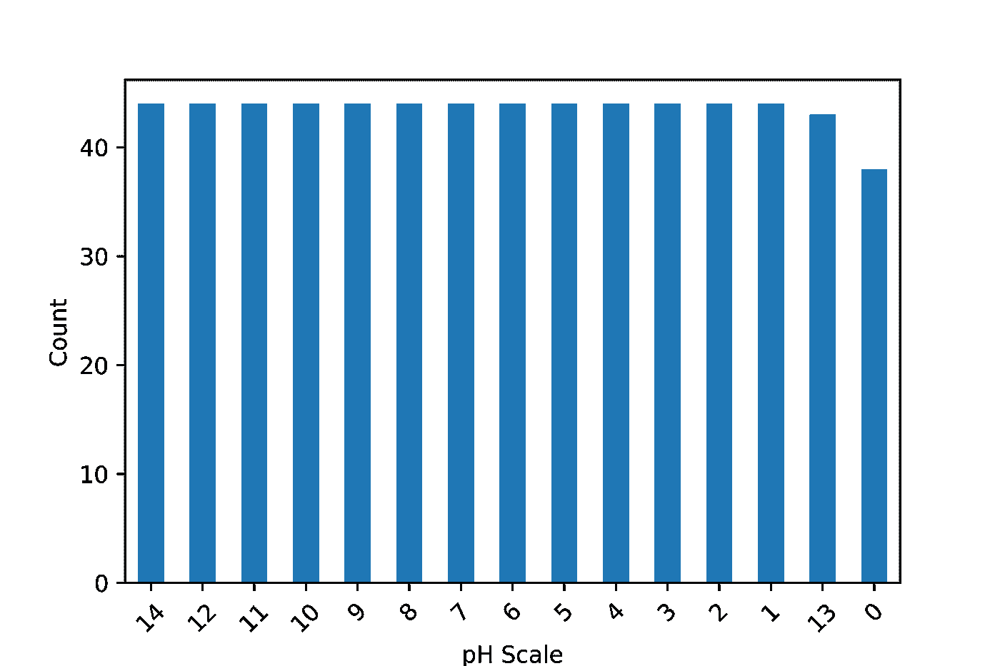
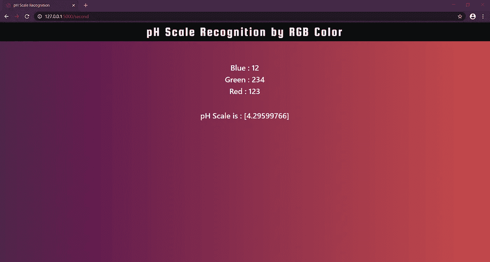

# 使用烧瓶通过 RGB 颜色识别 pH 标度。

> 原文：<https://medium.com/analytics-vidhya/ph-scale-recognition-by-rgb-color-using-flask-e4707b0b78f7?source=collection_archive---------5----------------------->

使用基于颜色模型 RGB(红、绿、蓝)的机器学习回归模型的 pH 标度识别和使用 Flask 的网络应用。



主页(图片由作者提供)

> **概述**

一个 flask web 应用程序，其中用户可以输入 RGB 颜色范围内的红色、绿色和蓝色，并获得 1 到 14 之间的 pH 值。它使用机器学习回归算法，最高 r2_score 为 **0.95(随机森林)**。

> **域背景**

该项目涉及使用机器学习的回归。使用的算法有多元线性回归、刚性回归、支持向量机(SVM)、决策树和随机森林回归。机器学习模型之后，flask web 应用被买进了网络空间。

> **数据集探索**

数据集由 4 列组成:

1.  蓝色
2.  格林（姓氏）；绿色的
3.  红色
4.  规模

红色、蓝色和绿色列由它们各自颜色的色标组成，色标由相对于 RBG 的 pH 值组成。

正如我们可以看到的,[数据集](https://www.kaggle.com/robjan/ph-recognition)是一致的，这就是我的模型如此精确的原因。采用不一致的数据集可能不会得到完美的结果。



数据集的一致性(图片由作者提供)

> **应用框架**

1.  数据集已导入。
2.  分为因变量和自变量。
3.  特征缩放。
4.  分为测试集和训练集。测试分割大小为 0.2。
5.  创建回归模型。
6.  预测测试集结果。
7.  计算 r2_score 为 0.95(随机森林)。
8.  创建 Flask Web 应用程序。

> **使用的工具**

下面描述了我在这个项目中使用的库和包及其相应的版本。Jupyter Notebook 曾经被使用过，我也推荐你使用它，因为它使编写代码变得更加容易和简单。使用 Python 语言实现了该模型。

1.  numpy == 1.18.1
2.  熊猫== 1.0.1
3.  matplotlib == 3.1.3
4.  scikit-learn == 0.22.1
5.  烧瓶= 1.1.0

> **回归模型**

用于预测 pH 值范围的机器学习算法是多元线性回归、刚性回归、SVM、决策树和随机森林回归。

随机森林回归显示最高的 r2 _ 得分。r2_score 是一个常数模型，它总是预测 y 的期望值，不管输入特征如何，都会得到 0.0 的 R 值。形状的参数 y _ true-like(n_samples，)或(n _ samples，n_outputs)地面真实(正确)目标值。

最初，特征缩放用于独立变量，以便获得更精确的测试集结果。在特征缩放之后，数据集被分成测试集和训练集，然后进行分类以预测测试集结果。

```
Multiple Linear Regression : 0.682162
Ridge Regression : 0.682794
SVM : 0.929199
Decision Tree : 0.946644
Random Forest : 0.953246
```

最好的 r2_score 是 1，正如我们所看到的，所有上述模型都显示出惊人的结果，随机森林具有最高的 r2_score。

> **使用 Flask 的 Web 应用程序**

我使用 flask 将上述代码集成到一个简单的 web 应用程序中，以执行 pH 值标度识别，为此，我将 Jupyter Python 文件“pH_scale.ipnyb”转换为 pickle 文件“model.pkl ”,并将其导入到我的应用程序中。下面显示的代码是 flask 应用程序的 python 代码。

为了在您的机器上运行 web 应用程序，必须遵循以下步骤:

1.  使用 git 或 GitHub desktop 克隆这个[库](https://github.com/ygarg704/ph-value-recognition-based-on-rgb-color)。
2.  打开 app.py，确保安装所有必需的软件包。
3.  在父目录终端中运行下面的代码，以便在您的系统上运行 web 应用程序。

```
python3 app.py
```

输入绿、蓝、红刻度后，点击主页上的提交按钮，显示预测结果。每种颜色的标度范围是 1-400。输入两者之间的任意数字以获得 pH 值范围。


主页(图片由作者提供)

结果将加载到下一个 html 文件中，如下所示:



pH 值标度结果(图片由作者提供)

> **结论**

所有回归算法都显示出良好的结果，并提供了最终的 R2 _ score**0.95。**数据集由 653 行和 4 列组成。测试的分割大小为 0.2。为了获得更高的精度，可以使用网格搜索和交叉验证来调整随机森林的超参数。此外，通过提供更大的数据集，可以提高回归精度。另一个改进是关于 UI 的。

这个项目可以在我的 GitHub 库中找到，并有详细的说明。

到此，本文就告一段落了。希望你喜欢阅读这篇文章！

请访问我的[作品集](https://ygarg704.github.io/)和 [Linkedin](https://www.linkedin.com/in/ygarg704/) :)

[](https://github.com/ygarg704/ph-value-recognition-based-on-rgb-color) [## ygarg 704/基于 rgb 颜色的 ph 值识别

github.com](https://github.com/ygarg704/ph-value-recognition-based-on-rgb-color)